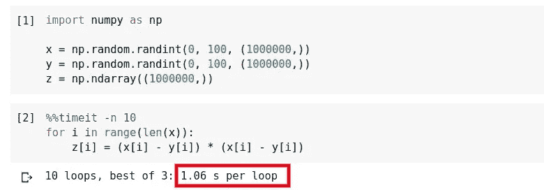
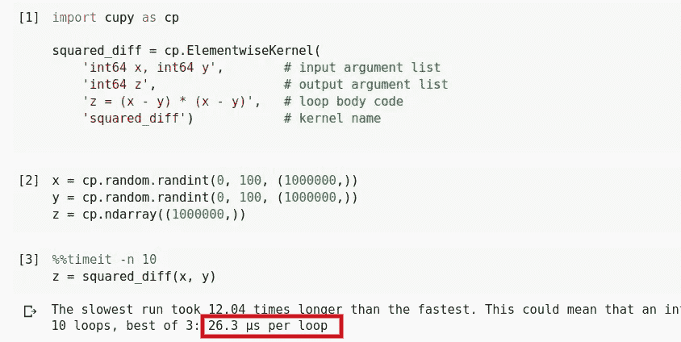
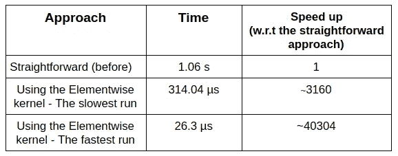
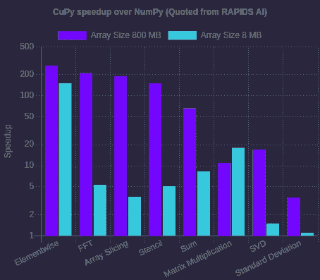
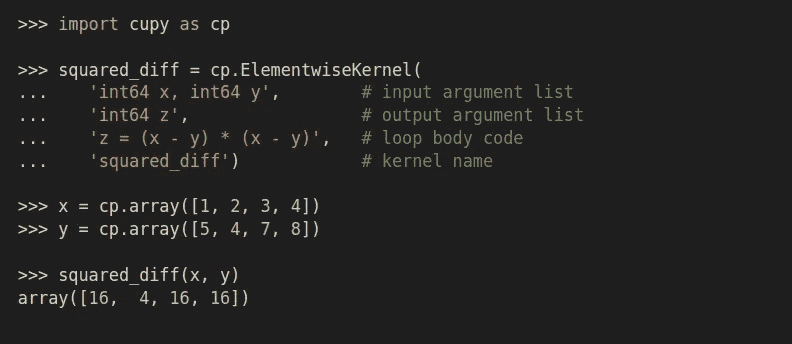
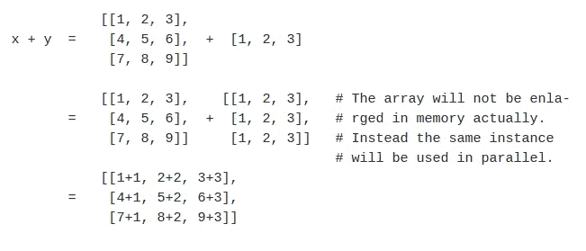
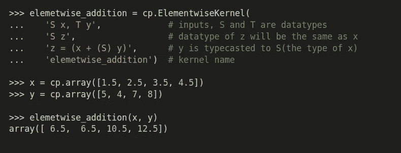
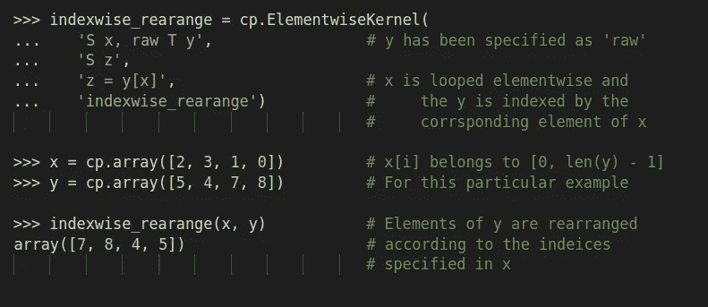
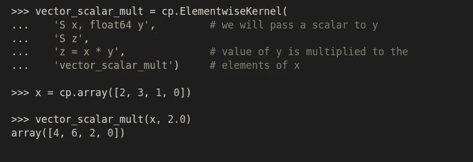
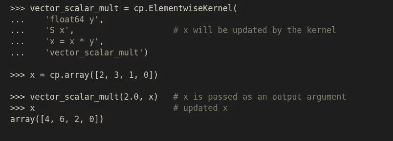

# 让您的 Python 函数速度提高 10 倍

> 原文：<https://towardsdatascience.com/make-your-python-functions-10x-faster-142ab40b31a7?source=collection_archive---------9----------------------->

## 学习使用`[ElementwiseKernel](https://docs-cupy.chainer.org/en/stable/tutorial/kernel.html)` API 在 GPU 上用 CUDA 加速你的 python 代码，加速你的 NumPy 代码！

照片由 [chuttersnap](https://unsplash.com/@chuttersnap?utm_source=medium&utm_medium=referral) 在 [Unsplash](https://unsplash.com?utm_source=medium&utm_medium=referral) 上拍摄

> 他的帖子对我来说非常特别，因为它包含了我在准备 2020 年谷歌代码之夏(未选)时学到的东西。

# 动机

CuPy 提供了一个名为`ElementwiseKernel`的 API 来并行化 GPU 上的操作。

下面是 ***之前和之后部分，*** 比较了相同任务(计算两个数组的元素态平方差)在不使用元素态内核和在相同大小的数组上使用元素态内核时的运行时间。在这里说不太通也没关系。我们继续下去的时候，我会详细解释的。

## 之前(不使用 elementwise 内核)

## 之后(使用元素式内核)

你看，两种情况下数组大小都是 100 万。下面是提速对比。

**~40304 倍快😳。**等等，标题上说只有 10x。实际上，这是一个非常简单的任务。在真实的场景中，操作不会这么简单。这将导致加速损失。因此，您可以预期它的运行速度比普通方法快 10 到 100 倍，唯一的条件是您的任务应该是可并行的。

# 关于 CuPy

照片:[https://cupy.chainer.org/](https://cupy.chainer.org/)

[CuPy](https://cupy.chainer.org/) 是由 CUDA 加速的 *NumPy 兼容矩阵库。这意味着你可以使用 CuPy 在 GPU 上运行几乎所有的 Numpy 函数。`numpy.array`会变成`cupy.array`，`numpy.arange`会变成`cupy.arange`。就这么简单。签名、参数、输出一切都与 Numpy 相同。唯一的关键区别是 python 列表的对象不能直接传递给任何 CuPy 函数。我们只能通过一个`cupy.ndarray`的对象。而且就像 NumPy 一样，我们可以用`cupy.array(arr)`创建一个`cupy.ndarray`的对象。下图表示 CuPy 在 NumPy 上的加速，紫色条表示 CuPy 调用(数组大小为 800 MB)，蓝色条表示 NumPy 调用(数组大小为 8 MB)。*

照片:[https://cupy.chainer.org/](https://cupy.chainer.org/)

您可以在[这个 colab 笔记本](https://colab.research.google.com/drive/1MHA3derUKsyHf3-zCDKOCF9P1Ub34Lg2?usp=sharing)中运行和测试加速(您可以简单地编辑最后两个单元格来运行和检查您选择的 NumPy 函数的加速)。

这是关于现有的 NumPy 函数。但是在现实生活中，有些情况下我们需要自己编写函数。这些函数在处理大型数据集时需要很长时间。以下是如何在 GPU 上并行化代码以元素方式运行的方法。这也是它快速运行的条件，你的代码应该是可并行的。例如，按元素添加两个数组是可并行化的，但对数组元素求和却不是。而对多维数组的特定维度求和可以并行化。

# 元素式内核

Elementwise 内核是 CUDA 和 CuPy 之间的桥梁。他们从 CuPy 获取有关操作和并行化的信息，并以“哪些操作将在 GPU 上并行执行以及如何执行”的形式通知 CUDA。我们将使用自顶向下的方法，而不是先浏览 Elementwise 内核的细节，然后再看一个例子，我们将通过几个例子来尝试理解 Elementwise 内核的内部工作。

*注意:我已经在代码注释中解释了大部分重要的东西，我建议阅读所有即将到来的代码片段的注释。*

elementwise 内核的定义由四部分组成:输入参数列表、输出参数列表、循环体代码(CUDA-C/C++)和内核名称。例如，按元素计算两个数组的平方差的内核 f(x，y)=(x y)定义和调用如下(`x`和`y`是两个数组):

很奇怪，不是吗？循环体不包含循环。原因是循环体代码运行在`x`和`y`的元素上，我们不需要迭代循环或显式索引它们。如果数组大小不同，较短的数组将被[广播](https://docs.scipy.org/doc/numpy/user/basics.broadcasting.html)成较大数组的形状。如下所述，

但是如果不可能广播它以使它们具有相同的大小，内核将会产生一个错误。你可以在这里了解更多关于广播[的规则。](https://docs.scipy.org/doc/numpy/user/basics.broadcasting.html#general-broadcasting-rules)

## 通用内核

编程中的术语 *Generic* 指的是被编写为具有*类型(稍后指定*)功能的编程算法。因此，通用内核是在定义内核时，我们不想指定输入输出参数的数据类型的内核。我们需要为每个唯一的数据类型使用一个字符，就像我们在 Java 中做的那样。参见下面的例子，

## 原始参数(内核内部的索引)

如果我们想索引其中一个参数，该怎么办？🤔原始论据就是答案。您指定为`raw`的参数将必须像我们在普通数组中一样进行索引。参见下面的例子，

## 标量参数

传递标量参数并在内核中使用这些标量几乎和我们在普通函数中做的一样简单。你只需要传递一个标量而不是一个数组，然后像我们通常做的那样使用它。举个例子，

您还可以将输出参数传递给内核。输出参数将通过引用自动传递。在这种情况下，不会返回输出。举个例子，

# 试一试

[这个 colab 笔记本](https://colab.research.google.com/drive/1gHF2U0tB37xTG_iPs0OFg26cMfO7Ami6?usp=sharing)包含了上面提到的所有例子。人们可以去那里尝试一些东西。您可能还想调整一些东西，看看输出的反映。

*注意:上面所有的例子都非常简单，因此只包含一行循环代码。在现实场景中，循环体可能包含更多的 CUDA-C/C++代码行。*

为了让你了解它在现实世界中是如何使用的，[下面是我给 CuPy](https://github.com/search?q=is%3Apr+author%3Arushabh-v+org%3Acupy) 的 pr 列表，其中我使用了`ElementwiseKernel`。

# 结论

还有很多东西需要挖掘。比如`ufuncs`、`reduction kernels`等东西。是 CuPy 最有用的功能之一。甚至 *Numba* 库的`gufunc`创建 API 也使得在 GPU 上运行复杂函数变得容易得多。但是我认为这对于这篇文章来说已经足够了。我将会相应地在将来发布其他的东西。