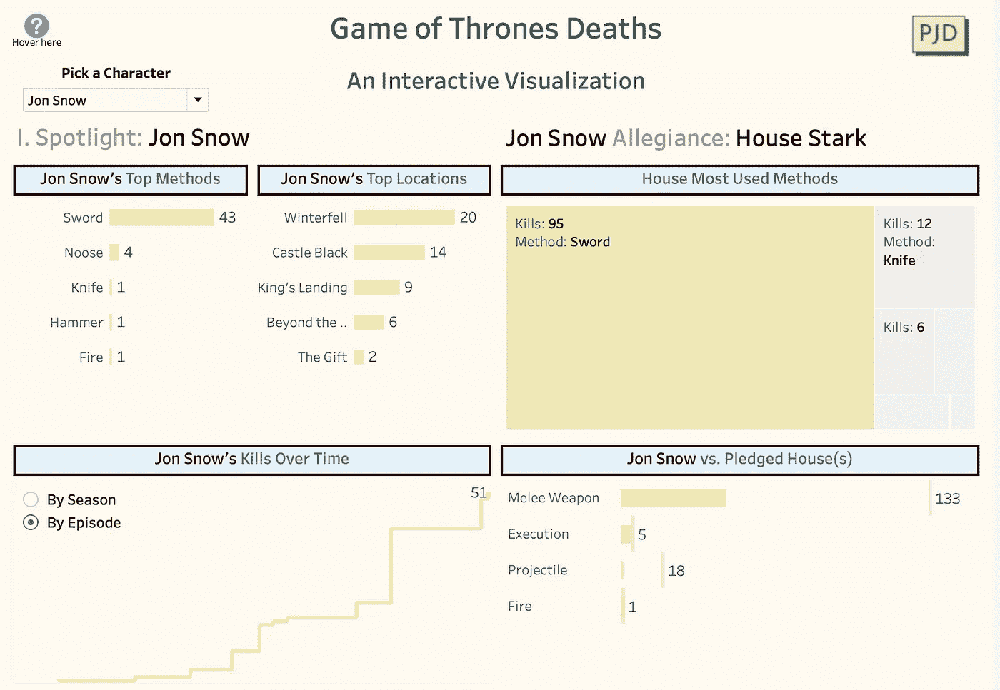
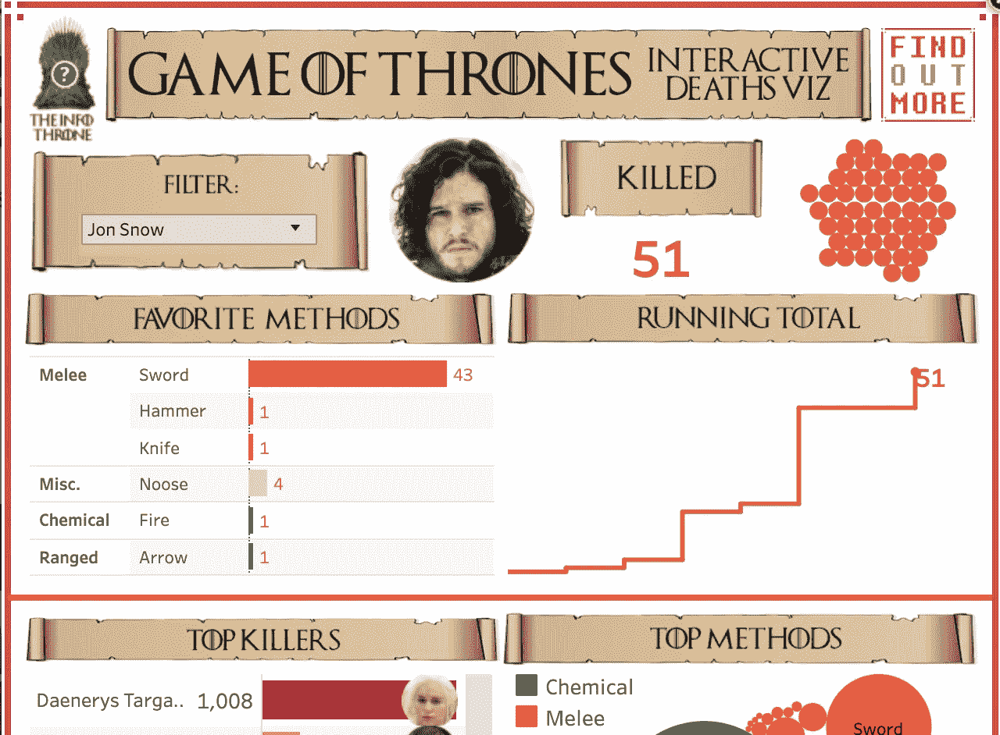
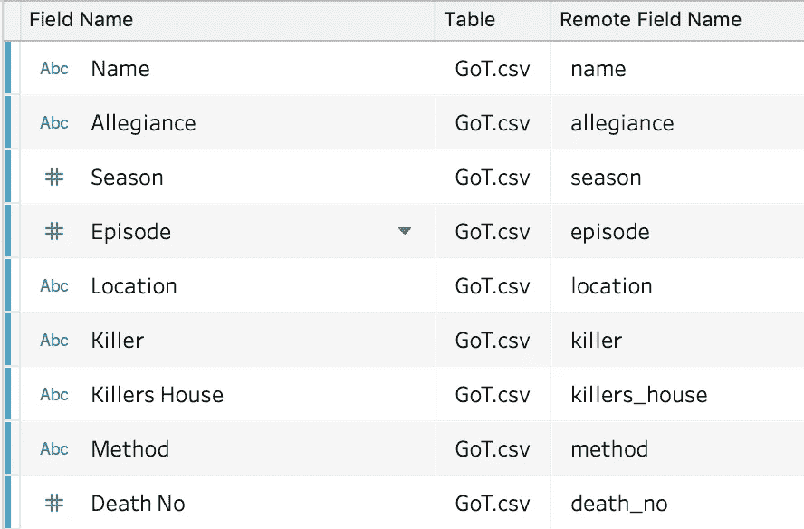
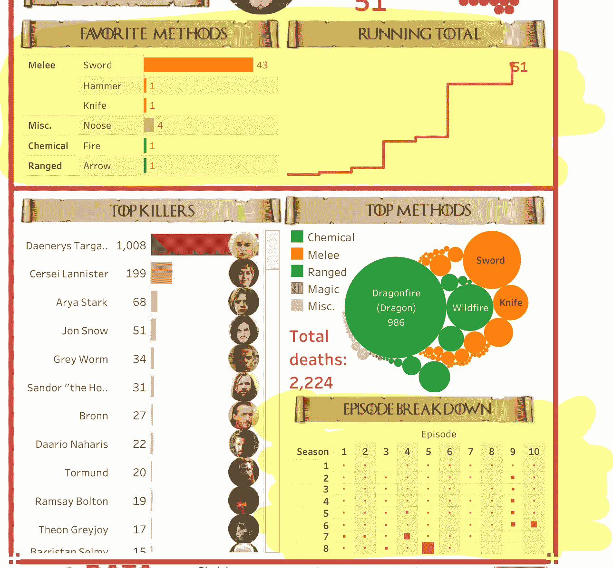
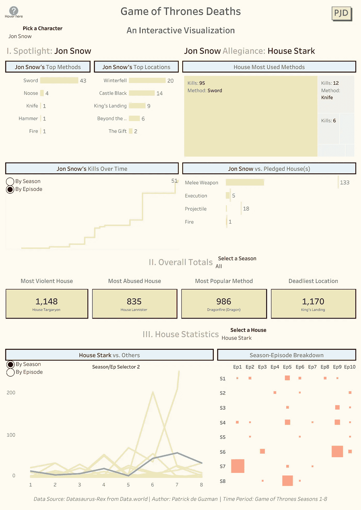

# 改头换面星期一:权力的游戏版

> 原文：<https://towardsdatascience.com/makeover-monday-game-of-thrones-edition-65432e684318?source=collection_archive---------33----------------------->

## 以 GoT 为主题的现代简约风格仪表盘。

我的[仪表板片段](https://public.tableau.com/views/GoT_MM/GoTDashboard?:display_count=y&publish=yes&:origin=viz_share_link)

大卫·墨菲的[以《权力的游戏》为主题的仪表盘](https://public.tableau.com/shared/275M66Y7Y?:display_count=y&:origin=viz_share_link&:embed=y&:showVizHome=no#1)(如下图)是一个不可思议的成就。墨菲煞费苦心地收集了所有屏幕上的死亡数据，并创建了一个仪表盘，将他的个性和品牌与《权力的游戏》系列的设计元素结合在一起。

原始仪表板的片段

*注:该数据集和原始仪表板来自 2019 年第 27 周周一的* *改头换面* [*。*](https://makeovermonday.co.uk/data/data-sets-2019/)

在这篇博文中，我将向你介绍我在重新设计大卫·墨菲的仪表盘时所做的设计决定。但是首先，让我们回顾一下源数据背后的一些背景。

# 数据

(计划或理论的)纲要

正如我前面提到的，这些数据是由原作者收集的。这显然容易犯些小错误，而且带有主观因素，比如效忠(例如，自从乔拉·莫尔蒙在整个系列中为丹妮莉丝·坦格利安效力以来，他效忠的是莫尔蒙家族还是坦格利安家族？).无论如何，对于像我这样的数据发烧友来说，这是一个宝库。

这里有一些关于数据你应该知道的有用的花絮…

*   只有银幕上的杀戮才算数。
*   不死生物不在考虑之列。
*   动物算武器。

现在这个问题已经解决了，让我们来谈谈仪表板改造。

# 重新设计考虑因素

## 原始仪表板

墨菲的仪表板做了很多事情非常好。事实上，我保留了不少他创作的可视化作品。具体来说，我喜欢他对条形图、连续杀人计数和剧集分解的使用(所有这些都在下面突出显示)。

我一直用黄色突出显示的元素。

我喜欢他的仪表板有 GoT 主题的元素，比如滚动的标题、字体和角色的图片。在我的仪表板中，我选择删除这些元素，因为我希望我的仪表板感觉更现代和简约。

我还强烈地感觉到，在向用户展示分类数据方面，树形图和条形图比打包的气泡图(在“Top Methods”一节中使用)做得好得多。此外，我希望我的仪表板能够回答更多关于该系列的问题，如房屋如何相互比较，哪些方法被使用最多，以及哪个房屋被杀害最多。

我重新设计的主要目标可以用下面的问题陈述来总结:**在一个更干净、更清爽的仪表盘中，我如何更好地理解角色和英雄之间的差异和趋势？**

就捕获的要素数量而言，数据集非常有限，但仍可提供大量信息。让我们来看看重新设计的仪表板可以回答的所有问题…

## 这些问题

我的仪表板分为三个部分，每个部分回答不同种类的问题…

**第一部:人物聚光灯**

1.  对于一个给定的角色，他们最常用的方法是什么？他们在哪里杀得最多？
2.  他们在一季或一集里杀了多少人？
3.  对于同一个角色，他们抵押房子最常用的方法是什么？
4.  这个角色的方法和他/她抵押房子的方法相比如何？

**第二部分:总计**

1.  哪个房子杀人最多？(整体或特定季节。)
2.  哪个房子被杀的最多？(整体或特定季节。)
3.  哪些方法用的最多？(整体或特定季节。)
4.  哪些地方的死亡人数最多？(整体或特定季节。)

**第三部分:房屋聚光灯**

1.  对于一个给定的房子，在不同的季节或不同的剧集中，它们的趋势与其他房子相比如何？
2.  在这个系列的所有剧集中，豪斯医生的杀戮是如何分布的？
3.  在特定的一季或一集里，哪个房子杀的人最多？

# 改造

[完整的仪表盘](https://public.tableau.com/views/GoT_MM/GoTDashboard?:display_count=y&publish=yes&:origin=viz_share_link)

总的来说，新的仪表板去掉了所有额外的 GoT 主题设计元素，看起来应该更整洁。还有很多可视化，所以肯定更复杂更密集，但是可以回答很多问题。

还有一些观众可以修改的可调参数(季/集视图和特定的房子)，一些可视化更便于比较(房子与房子比较的折线图或人物与房子比较的项目符号图)。

我也非常喜欢摘要瓦片(第 2 部分:总体总计),因为它们可以快速简洁地传递重要信息。

最后，在格式方面，我喜欢颜色协调的工具提示和标题，它们突出了每个可视化的动态方面。例如，栗色中的所有文本都会根据您的参数选择而变化。此外，如果将鼠标悬停在每个可视化对象上，将使用相同的栗色高亮显示方法。

# 结论

我不声称我的仪表板比原来的更好或更差。改头换面星期一是关于个人喜好，来自他人的灵感和创造力。

最后，大声喊出来，谢谢大卫·墨菲的灵感和数据来源。