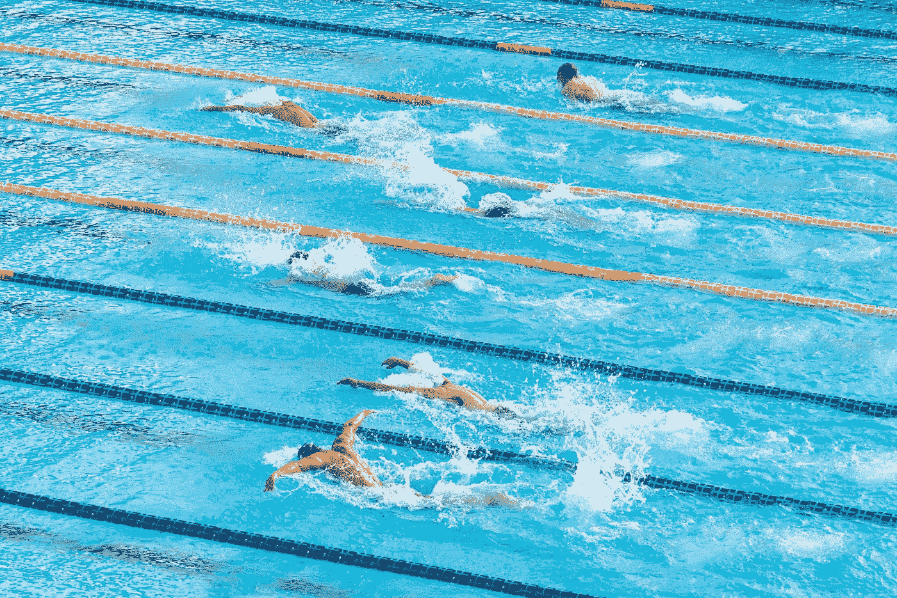

# 使用 Plotly 制作条形图比赛图——变得简单

> 原文：<https://towardsdatascience.com/making-a-bar-chart-race-plot-using-plotly-made-easy-8dad3b1da955?source=collection_archive---------23----------------------->



在 [Unsplash](https://unsplash.com/s/photos/swimming-birdseye?utm_source=unsplash&utm_medium=referral&utm_content=creditCopyText) 上 [Serena Repice Lentini](https://unsplash.com/@serenarepice?utm_source=unsplash&utm_medium=referral&utm_content=creditCopyText) 的照片

你见过这些随着时间的推移对事物或人进行排名的赛车条形图吗？他们越来越受欢迎，他们看起来很有趣，他们可以看到谁或什么随着时间的推移在某个排名中名列前茅。你可能已经看过 2020 年根据 COVID19 案例进行的国家排名，或者从洛克斐勒到杰夫·贝索斯的最富有的人的排名。无论你的排名如何，今天你将学习如何使用 Python 和 Plotly 制作你自己的赛车图！—也提供包装:)

1995 年至 2019 年间全球 10 大富豪

一段时间内 COVID 病例最多的国家 19

**致谢**

*   [阿曼达·伊格莱西亚斯·莫雷诺](https://medium.com/u/1bace2932c65?source=post_page-----8dad3b1da955--------------------------------)在 2017 年写了一篇[中期文章](/bar-chart-race-with-plotly-f36f3a5df4f1)，讲述了巴塞罗那顶级婴儿名字的条形图比赛情节。我从那篇文章中学到了很多，我在这篇文章中的意图是使用我从她的文章和其他资源中学到的东西来编写可用于任何特定用例的代码。
*   本教程提供了制作动画 Gapminder 散点图的所有代码。虽然这个例子非常丰富，但是几乎没有解释任何代码。我写这篇文章是为了帮助其他人理解所有这些诡秘的论点意味着什么。当我使用“奇怪的”情节性参数时，我会在代码注释中用简单的术语解释它们的作用。

# **TL；博士**

如果你对如何制作这种图表不感兴趣，我已经为你写了一个包，让你轻松地绘制你自己的数据。使用`pip`简单安装以下软件包

```
pip install raceplotly
```

然后在一个`python`脚本中运行以下内容:

您将获得 1961 年至 2018 年间产量最高的 10 种作物的时间表(见下文)。我从[粮农组织](http://www.fao.org/faostat/en/#data/QC)获得数据。

如果您发现任何问题，请向`[raceplotly](https://github.com/lc5415/raceplotly)` [库](https://github.com/lc5415/raceplotly)提交问题，如果您想提供改进，请向 PRs 提交问题！

# **龙(呃)解释**

对于那些留在这里的人，谢谢。我会尽可能简洁地让你明白如何建立一个这样的情节并超越它。

## **情节性基础**

许多 Plotly 新用户第一次接触到`plotly.express`库。在这个库中，Plotly 开发人员去除了 Plotly 图形的复杂性，使其更加用户友好。尽管每当一个人想要超越`plotly.express`的能力时，就有必要看看在引擎盖下发生了什么。

首先要知道的是，所有 Plotly 图形都包含 3 个主要元素:*数据*、*布局、*和*帧*。

*   *数据*元素是一个 *python 列表*,包含关于您想要绘制的绘图类型的信息:散点图、条形图、漏斗图、热图、choropleth…以及此类绘图的相关参数:x、y、z、颜色、大小…
*   *布局*元素是一个 *python 字典*，包含关于绘图外观的信息，即图形的属性(标题、大小、图例、背景色……)、轴的属性(标题、颜色、刻度……)，以及关于图形的交互属性(按钮、滑块、当用户点击或悬停在图形上时显示的内容和位置)。此外，还有许多参数用来调整每一种图形(特别是条形图，特别是漏斗图……)。
*   *帧*元素允许用户制作动画情节。*帧*是一个 *python 列表*包含了每一个要按顺序渲染的帧。

如果您想了解更多细节，请参考官方的 [Plotly 基础指南，了解其图形数据结构](https://plotly.com/python/figure-structure/)和/或核心 Plotly 图形的[文档。](https://plotly.com/python-api-reference/generated/plotly.graph_objects.Figure.html)

与许多其他绘图库一样，Plotly 提供了大量的参数来修改绘图。虽然这在你希望完善一个情节时很有用，但它也可能是压倒性的，尤其是在开始或原型制作时。 ***现在让我们探索一下如何用 python 写一个 Plotly figure 来生成如上图的种族栏图。***

## **从头开始编写种族栏剧情图**

正如在 [Plotly 基础](https://plotly.com/python/figure-structure/)中提到的，在 python 中，一个 Plotly 图形可以是一个字典或者一个`plotly.graph_objects.Figure`实例。我个人不喜欢其中一个，我喜欢先创建一个实例，然后再访问。我们将逐个元素地创建 Plotly 图形，首先是数据，然后是布局，然后是框架，当然，您可以在一个块中完成所有这些。

我们将首先加载我们的数据(我从粮农组织下载的数据):

下载粮农组织数据

***注意:*** *如果您使用的是自定义数据集，请确保它有 3 列:一列对应于您正在排序的项目(本教程中的* **项目)** *，一列对应于您正在排序的值(本教程中的* **值** *)，另一列对应于每个对应的项目-值对的年份或日期(本教程中的* **年份** *)*

现在让我们实例化我们的图形:

```
import plotly.graph_objects as go
fig = {
    "data": [],
    "layout": {},
    "frames": []
}
```

接下来，让我们定义*数据*元素。正如我们之前所说，这必须是一个 python 列表，其中包含我们希望绘制的绘图类型(在本例中为条形图)以及与每个轴对应的数据框的相应列。在我们的例子中，我们正在构建一个动画，我们为默认图形选择的数据将对应于动画开始前显示的数据切片。在这里，我选择了最早的数据(从 1961 年开始)作为默认框架。

我们还需要一个颜色的每一个项目，我们正在排名。[阿曼达·伊格莱西亚斯·莫雷诺](https://medium.com/u/1bace2932c65?source=post_page-----8dad3b1da955--------------------------------)在她的 [2017 帖子](/bar-chart-race-with-plotly-f36f3a5df4f1)中，写了一个函数来为每个类别分配一个 RGB 三元组。使用列表理解，我们可以在一行中做到这一点(参见下面的代码)。

填充绘图图形数据条目

***注:*** 要了解`texttemplate`的功能，请参考 [Plotly 文档](https://plotly.com/javascript/texttemplate/)

现在让我们继续填充*布局。*我在这里的默认选择是使用白色背景，y 轴上没有轴信息(对应于项目名称)，因为我们已经显示了带有文本注释的信息。此外，我决定显示 x 轴刻度及其相应的值，并将 x 轴设置为一个固定值(等于表中的最大值)。

初始化默认框架的布局

因为我们正在创建一个动画情节，所以我们必须在布局中包含两个额外的条目:更新按钮(播放和暂停)和滑块。我们暂时将滑块留空，因为我们将在创建框架时填充一个滑块字典。Plotly 提供了一个名为`[updatemenus](https://plotly.com/python/reference/layout/updatemenus/#layout-updatemenus-buttons-method)`的*布局*属性，允许我们[创建按钮、下拉菜单、更新布局和控制动画](https://plotly.com/python/dropdowns/)。

添加播放和暂停按钮

***注:***[过渡](https://plotly.com/python/reference/#layout-transition)持续时间对应于帧过渡所需的时间。低值将使过渡非常快，就像切换图片，而长值将使它更像一个视频。帧持续时间控制每帧显示多长时间。

**最后**，我们将创建对应于每年前 10 名的帧。在这一步，我们还填充布局的*滑块*属性。这样做是为了使每一帧都链接到滑块中的一个位置。首先，我们用滑块元信息和一个空的`steps`列表初始化一个字典:

接下来，我们制作框架并生成步骤:

最后，在所有这些艰苦的工作之后，你可以简单地运行`go.Figure(fig)`来展示你来之不易的数字。

# **结论**

*   我们需要大量的代码来生成条形图比赛图。移动代码是痛苦的，**如果你打算经常使用的话，我鼓励你使用**[](https://github.com/lc5415/raceplotly)***！***
*   *我应该指出的一点是，我们的杆在相互超越时不会滑过对方。我无法用 Plotly 实现这一点， [Ted Petrou](https://medium.com/u/cf7f60f2eeb3?source=post_page-----8dad3b1da955--------------------------------) [使用](https://medium.com/dunder-data/create-a-bar-chart-race-animation-in-python-with-matplotlib-477ed1590096) `[matplotlib](https://medium.com/dunder-data/create-a-bar-chart-race-animation-in-python-with-matplotlib-477ed1590096)`设法做到了这一点，所以看看他吧！*

*如果你已经做到了这一步，我希望你已经发现这是有用的。如果你对自己的情节有任何具体问题，请随时联系。*

***PS:** 我一定要把你指向[兴旺 app](https://app.flourish.studio/@flourish/bar-chart-race) 获得无代码的快乐*