# 使用全球新闻(使用 Python)通过连续 ML 预测苹果股票的出色结果

> 原文：<https://towardsdatascience.com/making-a-continual-ml-pipeline-to-predict-apple-stock-with-global-news-python-90e5d6610b21?source=collection_archive---------5----------------------->

## 简单是关键。

# 目标

在本教程中，我们将制作一个机器学习管道，它输入商业新闻，并随着时间的推移为[苹果](https://www.openblender.io/#/dataset/explore/5d4c39d09516290b01c8307b/or/32)股价**再培训**生成**预测**。


图片来自 apple.com

我们还将衡量**它在现实生活中有多有利可图。**

# 我们要做什么

*   步骤 1:设置技术**先决条件**
*   第二步:**获取 2017 年以来每日苹果库存的数据**
*   步骤 3:定义并理解 ML 的**目标**
*   第四步:**将**商业新闻融入我们的数据
*   第五步:**准备**我方数据并应用 ML
*   第六步:测量和分析**结果**
*   第七步:打破数据和**训练/测试**穿越时间

# 第一步。先决条件

*   安装 Python 2.6+或 3.1+版本
*   安装熊猫、sklearn 和 openblender(带 pip)

```
$ pip install pandas OpenBlender scikit-learn
```

# 第二步。获取数据

我们将使用这个每日[苹果股票数据集](https://www.openblender.io/#/dataset/explore/5d4c39d09516290b01c8307b/or/32)

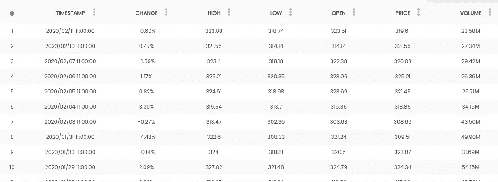

它有每天的最高价、最低价、开盘价和收盘价，以及当天的百分比变化。

所以让我们**通过 OpenBlender API **拉数据**。**打开一个 python 脚本，运行以下代码:

```
# Import the librariesimport OpenBlender
import pandas as pd
import numpy as np
import jsontoken = '**YOUR_TOKEN_HERE**'# Specify the action
action = 'API_getObservationsFromDataset'interval = 60 * 60 * 24 # One dayparameters = { 
 'token' : token,
    'id_dataset':'5d4c39d09516290b01c8307b',
    'date_filter':{"start_date":"2017-01-01T06:00:00.000Z",
                   "end_date":"2020-02-09T06:00:00.000Z"},
    'aggregate_in_time_interval' : {
              'time_interval_size' : interval, 
              'output' : 'avg', 
              'empty_intervals' : 'impute'
      }
}

# Pull the data into a Pandas Dataframedf = pd.read_json(json.dumps(OpenBlender.call(action, parameters)['sample']), convert_dates=False, convert_axes=False)
df.reset_index(drop=True, inplace=True)
df['date'] = [OpenBlender.unixToDate(ts, timezone = 'GMT') for ts in df.timestamp]
df = df.drop('timestamp', axis = 1)
```

**注意:**要获得您*需要的令牌*必须在 [openblender.io](https://www.openblender.io/#/welcome/or/32) (免费)上创建一个帐户，您可以在您个人资料图标的“帐户”选项卡中找到它。


现在让我们来看看数据:

```
df.head()
```

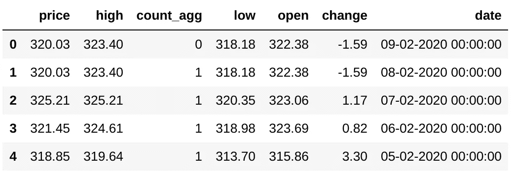

检查！

# 第三步。定义和理解目标

让我们画出**价格**和**变化**:

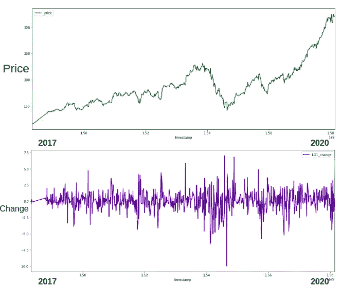

现在，我们想要的是检测第二天价格是否会在*上涨或**下跌**，这样我们就可以买入或做空。*

“**变化**”是开盘价和收盘价之间发生的百分比上升或下降，因此它对我们有效。


让我们将我们的目标变量定义为大于 0.5%的增长(这样就不值得购买):

**阳性 POC:** 其中“变化”增加超过 0.5%

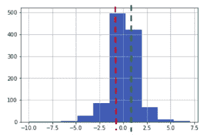

“变化”的分布

这意味着绿线右侧的所有观察结果都将是我们的“成功”情景。

# 第四步。向量化和混合商业新闻

这是**非常** **简单的**执行，但是让我们试着理解后台发生的事情。

我们想要的:

1.  我们需要**收集有用的新闻数据**，这些数据与我们的目标相关
2.  我们希望将它融入我们的数据中，使**消息与第二天的价格**“变化”保持一致(这样模型就可以学习预测第二天的价格，我们就可以实际使用它)
3.  我们想把它转换成**数字特征**，这样它就可以遍历一个 ML 模型。

因此，让我们寻找时间重叠的商业新闻数据集:

```
# First we need to add the UNIX timestamp which is the number 
# of seconds since 1970 on UTC, it is a very convenient 
# format because it is the same in every time zone in the world!df['timestamp'] = OpenBlender.dateToUnix(df['date'], 
                                           date_format = '%d-%m-%Y %H:%M:%S', 
                                           timezone = 'GMT')  # Now, let's search on OpenBlendersearch_keyword = '**business**'df = df.sort_values('timestamp').reset_index(drop = True)print('From : ' + OpenBlender.unixToDate(min(df.timestamp)))
print('Until: ' + OpenBlender.unixToDate(max(df.timestamp)))# We need to pass our timestamp column and 
# search keywords as parameters.OpenBlender.searchTimeBlends(token,
                             df.timestamp,
                             search_keyword)
```

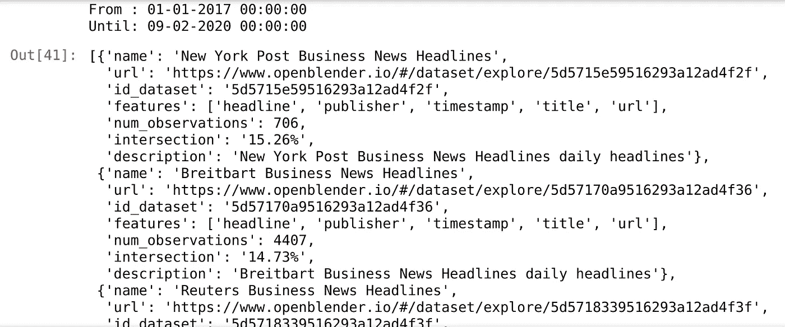

我们可以看到时间重叠(交叉)数据集及其一些属性，甚至可以看到界面的 url。

因此，让我们挑选这个[华尔街日报新闻](https://www.openblender.io/#/dataset/explore/5e2ef74e9516294390e810a9/or/32)数据集:


这是[今日美国](https://www.openblender.io/#/dataset/explore/5e32fd289516291e346c1726/or/32)推特新闻。


*   *注意:*我选择这些是因为它们有意义，但是你可以搜索数百个其他的。

我们可以**通过搜索按时间聚合的新闻术语，将新的列混合到我们的数据集**中。例如，我们可以用“华尔街”数据集中的新闻数量创建一个“苹果”特征，该特征与我们自制的 ngrams 相匹配:

```
**positive_filter** = {'name' : 'apple', 
                   'match_ngrams': ['apple', 'iphone', 'ipad', 
                                    'tim cook', 'mac store']}# We need to pass the 'id_dataset', the name of the
# column (which is 'text') and an optional filter.blend_source = {
                'id_dataset':'**5e2ef74e9516294390e810a9**',
                'feature' : '**text**',
                'filter_text' : **positive_filter**
            }df_blend = OpenBlender.timeBlend( token = token,
                                  anchor_ts = df.timestamp,
                                  blend_source = blend_source,
                                  blend_type = 'agg_in_intervals',
                                  interval_size = 60 * 60 * 24,
                                  direction = 'time_prior',
                                  interval_output = 'list')df_anchor = pd.concat([df, df_blend.loc[:, df_blend.columns != 'timestamp']], axis = 1)
df_anchor
```

timeBlend 函数的参数:

*   **anchor_ts** :我们只需要发送我们的时间戳列，这样它就可以作为锚来混合外部数据。
*   **blend_source** :我们想要的特性的信息。
*   **blend _ type**:‘agg _ in _ intervals’因为我们想要对我们的每个观察值进行 24 小时间隔聚合。
*   **inverval_size** :间隔的大小，以秒为单位(本例中为 24 小时)。
*   **方向**:‘time _ prior’因为我们希望间隔收集之前 24 小时的观察值，而不是向前。

输出是两个新的列，我们的“苹果”功能的“计数”和一个实际新闻的列表，以防有人想遍历每一个。

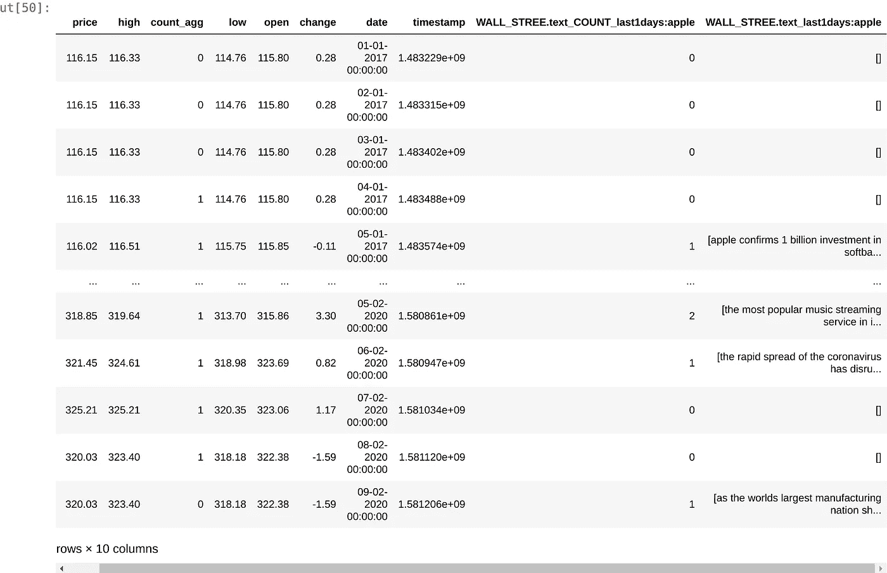

现在让我们**创建一个文本矢量器**，它是 OpenBlender 上的一个模型，你可以从中提取数千个计算化的 ngrams 作为特征:

```
action = 'API_createTextVectorizerPlus'parameters = {
    'token' : token,
    'name' : 'Wall Street and USA Today Vectorizer',
    'sources':[
              {'id_dataset':"**5e2ef74e9516294390e810a9**", 
               'features' : ["**text**"]},
              {'id_dataset' : "**5e32fd289516291e346c1726**", 
               'features' : ["**text**"]}
    ],
    'ngram_range' : {'min' : 1, 'max' : 2},
    'language' : 'en',
    'remove_stop_words' : 'on',
    'min_count_limit' : 2
}response = OpenBlender.call(action, parameters)
response
```

根据上述内容，我们指定了以下内容:

*   **名称:**我们将其命名为“华尔街和今日美国矢量器”
*   **源**:要作为源包含的数据集的 id 和源列(在本例中，两者都只有一个名为“text”)
*   **ngram_range** :将被标记的单词集的最小和最大长度
*   语言:英语
*   **remove_stop_words** :这样就从源头上消除了停用词
*   **min_count_limit** :被认为是令牌的最小重复次数(出现一次很少有帮助)

现在，如果我们转到 OpenBlender 的仪表板，我们可以看到矢量器:


它生成了 4999 个 n-gram，这些 n-gram 是最大 2 个单词的令牌的**二进制特征**，如果提到了 **n-gram 则为“1”**否则为“0”。

现在**我们希望矢量化的数据**在 24 小时内被压缩，并与第二天的苹果股票价格保持一致。

您需要添加您的**矢量器的 id** (它是在您创建它时打印的，或者您可以在 OpenBlender 中获得它。

```
blend_source = { 
                'id_textVectorizer':'**5f74fb7895162967ca2160fe**'
               }df_blend = OpenBlender.timeBlend( token = token,
                                  anchor_ts = df_anchor.timestamp,
                                  blend_source = blend_source,
                                  blend_type = 'agg_in_intervals',
                                  interval_size = 60 * 60 * 24,
                                  direction = 'time_prior_strict') .add_prefix('VEC.')df_anchor = pd.concat([df_anchor, df_blend.loc[:, df_blend.columns != 'timestamp']], axis = 1)
df_anchor.head()
```

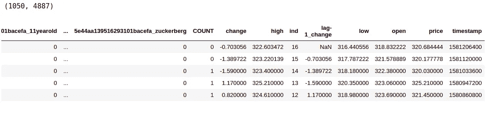

现在我们有了 **1068** 个观察值和 **4887** 个特征。我们的原始数据集加上过去 24 小时的矢量化和聚合新闻。

# 第五步。准备数据并应用 ML

没有更多的争论或清理要做，我们只需要**创建我们的目标特性**正 POC 和负 POC(我们将使用‘正 POC’来实现前面定义的目的)。

```
# Where ‘change’ **decreased** more than 0.5%
df_anchor['negative_poc'] = [1 if log_diff < -0.005 else 0 for log_diff in df_anchor['change']] # Where ‘change’ **increased** more than 0.5%
df_anchor['positive_poc'] = [1 if log_diff > 0.005 else 0 for log_diff in df_anchor['change']]# We need to shift our target one day so that we predict 
# for what will happen 'tomorrow' with news and data from 'today'df_anchor['target'] = df_anchor['positive_poc'].shift(-1)
df_anchor[['change', 'positive_poc', 'target']]
```

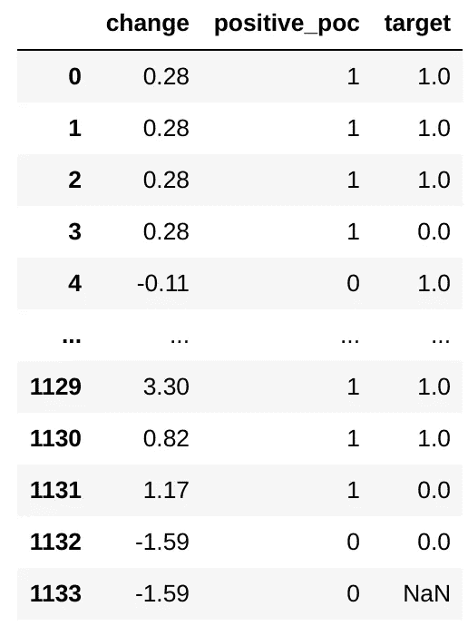

现在我们有了'**目标**'特性，它简单地将**的“变化”值与“**前一天的数据**对齐**，这正是我们所需要的。最近的观察(最后一次)是 NaN，因为那是我们想要为“明天”预测的。

现在，让我们尝试一些 ML 来学习和预测**目标**。

```
# Import libraries
from sklearn.ensemble import RandomForestRegressor
from sklearn.metrics import roc_auc_score
from sklearn.metrics import accuracy_score
from sklearn import metrics
df_anchor = df_anchor[:-1] # Remove the last one with NaN# Define target
target = 'target'
df_positive = df_anchor[1:].select_dtypes(['number'])# Create train/test sets
X = df_positive.loc[:, df_positive.columns != target].values
y = df_positive.loc[:,[target]].values
div = int(round(len(X) * 0.71))X_train = X[:div]
y_train = y[:div]
X_test = X[div:]
y_test = y[div:]print('Train:')
print(X_train.shape)
print(y_train.shape)
print('Test:')
print(X_test.shape)
print(y_test.shape)
```

产出:

```
Train:
(758, 4995)
(758, 1)
Test:
(310, 4885)
(310, 1)
```

现在让我们训练模型并预测:

```
rf = RandomForestRegressor(n_estimators = 1000, random_state = 1)
rf.fit(X_train, y_train)
y_pred = rf.predict(X_test)
```

# 第六步。分析结果

现在公布结果。

```
print("AUC score:")
print(roc_auc_score(y_test, y_pred))
print('---')# Let's binarize and look at the confusion matrix
preds = [1 if val > 0.5 else 0 for val in y_pred]
print('Confusion Matrix:')
print(metrics.confusion_matrix(y_test, preds))
print('---')# Lets look at the accuracy score
print('Accuracy:')
print(accuracy_score(y_test, preds))
print('---')
```

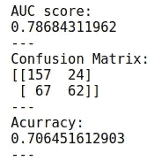

如果我自己这么说的话，这是相当惊人的。

我们来分析一下结果。

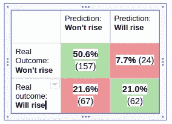

这意味着，从这个模型预测第二天价格变化将增加 0.5%或更多的所有时间来看，**它有 72%的时间是正确的**。我不知道任何现实生活中的模型甚至可以与此相比。

如果我们在一天结束时运行模型，我们可以在第二天早上买入/做空，期待当天结束时的结果。

**旁注:如果你们中的任何人把这个投入到自动交易(或手工交易)的生产中，至少送我一份礼物。*

# 第七步。打破时间的数据

现在，我们需要一种方法，在这种方法中，数据经过训练和测试，以观察结果是否一致。


让我们运行我们刚刚做的，但是在这个循环中中断数据。

```
results = []for i in range(0, 90, 5): 
 time_chunk = i/100
 print(“time_chunk:” + str(time_chunk) + “ starts”)
 df_ml = df_positive[:int(round(df_positive.shape[0] * (time_chunk + 0.4)))]
 X = df_ml.loc[:, df_ml.columns != target].values
 y = df_ml.loc[:,[target]].values
 div = int(round(len(X) * 0.29))
 X_test = X[:div]
 y_test = y[:div]
 X_train = X[div:]
 y_train = y[div:]
 rf = RandomForestRegressor(n_estimators = 1000, random_state = 1)
 rf.fit(X_train, y_train)
 y_pred = rf.predict(X_test)
 preds = [1 if val > 0.5 else 0 for val in y_pred]
 try:
 roc = roc_auc_score(y_test, y_pred)
 except:
 roc = 0
 conf_mat = metrics.confusion_matrix(y_test, preds)
 accuracy = accuracy_score(y_test, preds)
 results.append({
 ‘roc’ : roc,
 ‘accuracy’ : accuracy,
 ‘conf_mat’ : conf_mat,
 ‘time_chunk’ : time_chunk
 })
```


我们可以看到**指标增加**并稳定低谷时间！

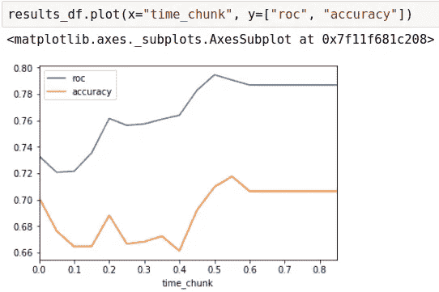