# 容错和冗余系统与 AWS 上的开发无缝集成

> 原文：<https://towardsdatascience.com/making-a-fault-tolerance-redundant-system-with-seamless-integration-to-development-on-aws-465acc556406?source=collection_archive---------27----------------------->

## [理解大数据](https://towardsdatascience.com/tagged/making-sense-of-big-data)

## 受网飞猿人军队的启发，使用 AWS 自动伸缩组和 CI/CD 构建了一个完全管理良好的容错系统，利用 CodeDeploy 和 CodePipeline 将 GitHub 作为源代码控制。


由[卡尔·奥尔登伯格](https://unsplash.com/@coldenbourg?utm_source=unsplash&utm_medium=referral&utm_content=creditCopyText)在 [Unsplash](https://unsplash.com/s/photos/servers?utm_source=unsplash&utm_medium=referral&utm_content=creditCopyText) 上拍摄的照片

每个架构师都梦想为他们的开发环境开发一个复杂的系统。制造一个**容错**系统可以确保从单点故障到系统的高可用性和冗余。现在有很多工具可以自动完成这项工作，比如 AWS 自动缩放组，我们需要使用它。我从[网飞科技博客](https://medium.com/u/c3aeaf49d8a4?source=post_page-----465acc556406--------------------------------)上读到这篇文章，并有了写这篇博客的动力。我的博客包括一个全面的端到端系统，从 GitHub 开始，到您的浏览器结束。我画了一张草图，这样你会对这篇文章的输出有一个更清晰的了解。

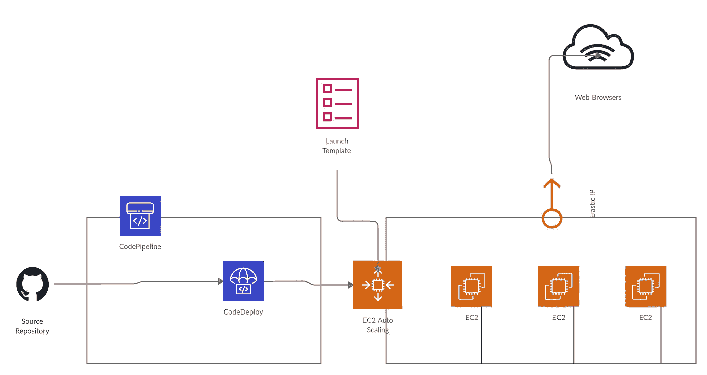

苏拉布什雷斯塔。AWS UML 图。2020.JPEG 文件。

> 陷阱:这个博客有一个单独的部分叫做陷阱，它显示了我在哪里绊倒了，在哪里你也可能滑倒和绊倒。在写这篇博客的时候，我犯了很多这样的错误，并花了很多时间来解决它。因此，了解你可能跌倒的地方也很重要，可以防止你跌倒。

> [网飞科技博客](https://medium.com/u/c3aeaf49d8a4?source=post_page-----465acc556406--------------------------------)创建了一个名为**混沌猴的工具，“**一个随机禁用我们生产实例的工具，以确保我们能够在没有任何客户影响的情况下经受住这种常见类型的故障。”[1](网飞四面军，2011 年)

因此，基本上我们将复制相同的工具，如**混沌猴**，并将其部署在我们的系统上。他们的名字**混沌猴**来自于猴子的不可预测性属性，它会破坏服务器中它去的任何地方，我们做的完全相反。我们选择**昏睡的熊猫**，它是如此懒惰以至于忘记更新云上的一些服务器。我们将把这只熊猫放在服务器上，并修复它造成的问题。

对于这个项目，我将使用 AWS 的服务，如用于冗余和容错系统的 **EC2 实例、启动模板、弹性 IP** 和**自动扩展组**、 **CodeDeploy、**和 **CodePipeline** 用于实例的无缝代码集成，以及作为我们代码库的 **GitHub** 。在开始之前，我们需要知道这些服务到底是什么。

*   **Amazon Elastic Compute Cloud(Amazon EC2)**是 Amazon 提供的虚拟机服务，根据使用情况以最低的成本使云计算变得更简单、更快速、更可扩展。[2](亚马逊 EC2，未注明日期)
*   **一个** **自动缩放组**是一组 Amazon EC2 实例，用于根据使用参数自动缩放。**自动缩放组**主要用于防止云上可能出现的任何容错。[3](自动缩放组，未注明)
*   **一个** **启动模板**是一个配置模板，用于自动伸缩或者作为一个单一服务来启动 EC2 实例。[4](上市配置，未注明)
*   **弹性 IP** 是由 EC2 实例分配的动态 IP 地址的静态 IPv4 地址。对于自动扩展组，弹性 IP 被动态分配给当前正在运行的实例，以减少或消除停机时间。[5](弹性 IP 地址，未注明)
*   **AWS CodeDeploy** 是一个部署服务，它自动将代码部署到不同的 Amazon 服务中，如 Amazon EC2、Lambda 和本地服务器。[6] (AWS 代码部署，未注明)
*   AWS CodePipeline 是亚马逊提供的持续集成和持续部署服务，有助于将不同来源的代码引入 AWS 服务。 **AWS CodePipeline** 也在顶层使用 CodeDeploy 将代码部署到 CodeDeploy 上配置的服务中。[7] (AWS 代码管道，未标明)
*   GitHub 是一个代码托管服务，它提供了一个版本控制系统，来自一个名为 Git 的开源服务。[8] (GitHub，未注明日期)

# 弹性 IP

让我们开始建立这个系统吧。我们将首先从弹性 IP 中分配一个弹性 IP 地址。打开 AWS 控制台，然后进入 EC2 服务，在屏幕左侧滚动时，您会看到 **Elastic IPs** 。选择它然后点击**分配弹性 IP 地址。**

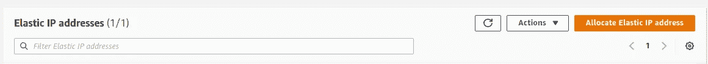

苏拉布什雷斯塔。分配弹性 IP 地址 1。2020.JPEF 档案。

点击后，您将被重定向到下一页。

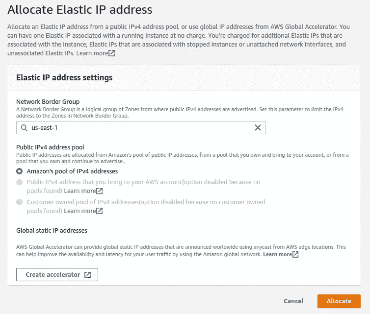

苏拉布什雷斯塔。分配弹性 IP 地址 2。2020.JPEG 文件。

在这里，您必须输入您希望系统存在的区域。我所在的地区目前在北弗吉尼亚，所以对我来说是“美国东部-1”。您可以在您/您想要的地区相应地进行更改。点击**分配。**

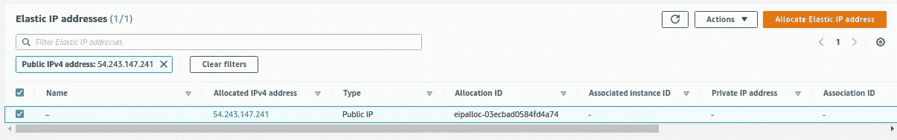

苏拉布什雷斯塔。分配弹性 IP 地址。2020.JPEG 文件。

因为您已经分配了一个弹性 IP 地址。现在，需要注意的重要部分是**分配的 IPv4 地址**和**分配 ID。**这是因为我们需要将它与我们的自动缩放组相关联。

> 陷阱 1:事实证明，我们不能简单地将弹性 IP 地址添加到自动扩展组中，也不能通过 AWS 控制台添加启动模板。这只能通过 AWS CLI 完成。

现在，我们需要一个 bash 脚本来动态分配地址。你需要做一些小的改动，所以一定要在一些文本编辑器上复制下面给出的代码

苏拉布什雷斯塔。Bash 脚本二分法。2020.JPEG 文件。

在获得那些**分配的 IPv4 地址**和**分配 ID 后，**将它们复制到它们适当的位置，行号 10 和 11。如果您所在的地区不是 **us-east-1，**在第 6(2)、10 和 11 行更改您所在的地区。不要担心第 2–9 行，因为它们是 AWS CodeDeploy 的一部分，用于在实例上安装代码部署代理。

> 陷阱 2:我已经测试了上面的代码，到目前为止它运行得很好，但是如果后来有什么不工作，你需要改变，唯一的方法就是创建一个实例，然后一个接一个地运行这个命令。如果你发现错误——修复它，如果没有，转到下一个命令，如果一切正常，那么就太棒了。此外，您还会在第 10 行看到一条错误消息，因为它试图取消一个甚至没有关联的 IP，所以您可以忽略它。

# 启动模板

到目前为止一切顺利，现在我们需要为我们的自动缩放组创建一个模板，以便从中启动实例。对于这个系统，我们将创建一个 t2.micro 实例，只需进行最少的设置就可以运行一个网页。在同一个 EC2 服务上，选择**启动模板**，然后点击**创建启动模板**。

> 你也可以使用**启动配置**，但是 AWS 更喜欢**启动模板**，所以最好使用后者。

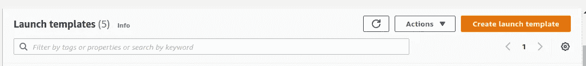

苏拉布什雷斯塔。正在创建启动模板 1。2020.JPEG 文件。

在你被重定向到下一页后，你会得到一个表格来填写细节。用我提供的图像填充它。有些很简单，不需要解释，但有些需要解释，我会用图片来解释。

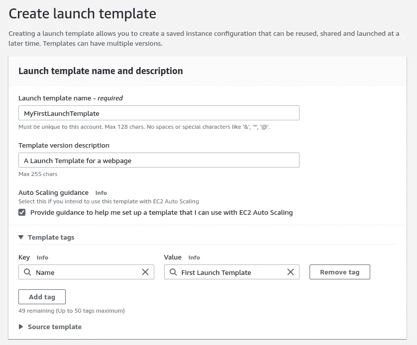

苏拉布什雷斯塔。正在创建启动模板 2。2020.JPEG 文件。

这是带有标签的基本名称和描述。相应地把它们装满。

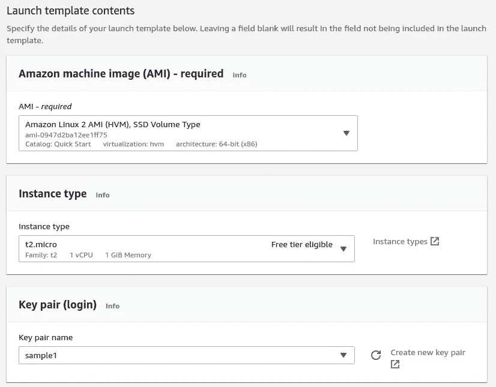

苏拉布什雷斯塔。正在创建启动模板 3。2020.JPEG 文件。

我在 t2.micro 上用默认的 keypair 选择了 Amazon Linux 2 AMI。

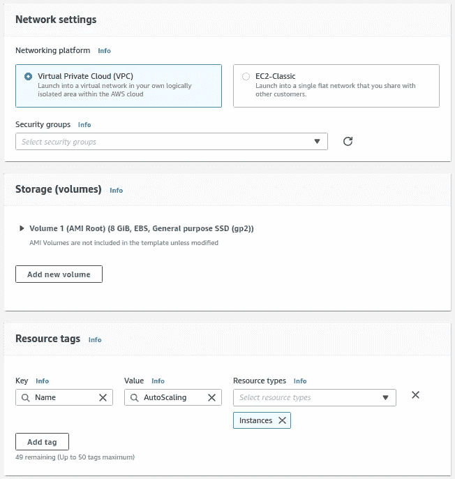

苏拉布什雷斯塔。正在创建启动模板 4。JPEG 文件。

养成添加标签的习惯。如图所示，输入实例的标记名。

> 陷阱 3:如果你不打算在模板中使用图形，那么就不要添加 **Elastic graphics** 标签，因为这会在 CodeDeploy 阶段产生错误。因此，根据需求选择实例标签至关重要。

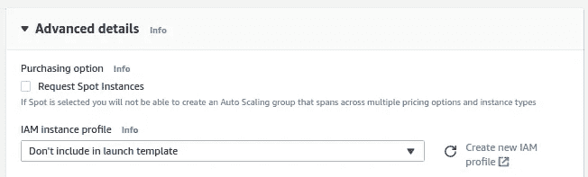

苏拉布什雷斯塔。正在创建启动模板 5。JPEG 文件。

现在，展开高级细节，点击**创建一个新的 IAM 配置文件。**您将被重定向至 IAM 服务。用这个 JSON 制定政策。

苏拉布什雷斯塔。EC2 模板策略。2020.JPEG 文件。

EC2 策略用于实例从命令行分配弹性 IP。

> 陷阱 4:您可以看到有 S3 get 和 list 访问，您可能想知道为什么？这正是我所想的。不知何故，CodeDeploy 代理需要 S3 get 和 list 操作来使其工作。我在哪里可以看到我的错误，并且知道我在哪里得到错误。如果您的实例在部署 CodeDeploy 代理时出现问题，您可以随时在此处查看日志:
> -less/var/log/AWS/code deploy-agent/code deploy-agent . log
> 从这里您可以调试将来可能面临的任何问题。

制定策略后，将其附加到您创建的新角色，然后保存它*。*点击刷新，然后你会看到新的角色在选择中弹出。我的角色名是 EC2AddressRole。

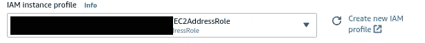

苏拉布什雷斯塔。正在创建启动模板 6。2020.JPEG 文件。

记得你上面复制的脚本。现在，是时候将脚本代码复制回**用户数据**上的模板了。

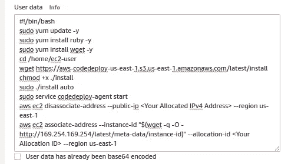

苏拉布什雷斯塔。正在创建启动模板 7。2020.JPEG 文件。

点击**创建模板版本**和**查看启动模板。**您已经成功制作了一个启动模板。现在到自动缩放组。

# 自动缩放组

让我们制作自动缩放组。转到同一 EC2 服务上的**自动缩放组**，然后单击**创建自动缩放组。**


苏拉布什雷斯塔。创建自动缩放组 1。2020.JPEG 文件。

现在添加名称并选择我们刚刚制作的模板。

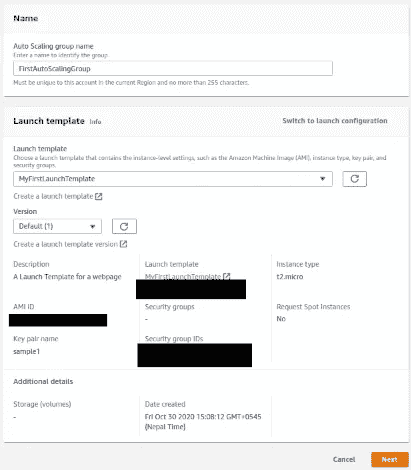

苏拉布什雷斯塔。创建自动缩放组 2。2020.JPEG 文件。

从给定区域中选择子网。

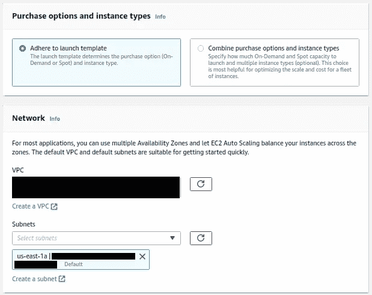

苏拉布什雷斯塔。创建自动缩放组 3。JPEG 文件。

> 陷阱 5:选择子网时要非常小心。在我的例子中，t2.micro 实例在 us-east-1e 上不可用，这导致自动缩放组崩溃。您总是可以在自动缩放组活动部分看到错误。请仔细阅读，因为这对于调试您的系统以及了解整体情况非常重要。

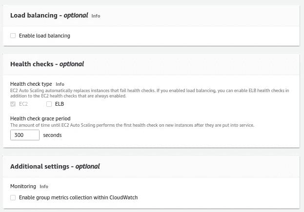

苏拉布什雷斯塔。创建自动缩放组 4。JPEG 文件。

让它默认。

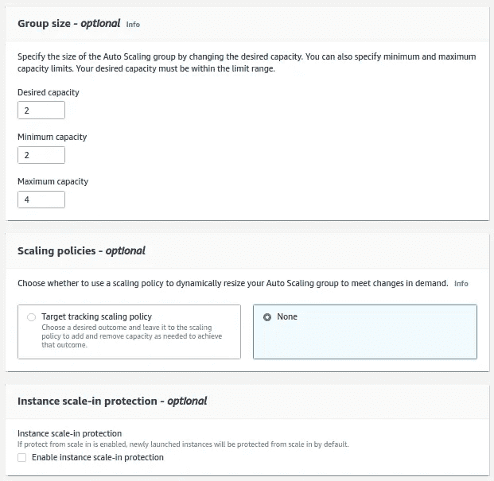

苏拉布什雷斯塔。创建自动缩放组 5。2020.JPEG 文件。

在这里，添加您想要的容量，即您想要启动并运行多少个实例。选择最小容量始终等于或小于所需容量，最大容量等于或大于所需容量。在扩展策略中，您可以选择它，并且可以将 CPU 利用率作为您的指标添加到自动扩展中，但是现在，我将保留默认设置。

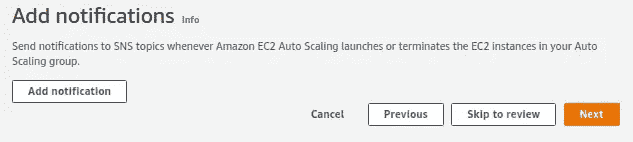

苏拉布什雷斯塔。创建自动缩放组 6。2020.JPEG 文件。

如果需要，可以在电子邮件或电话中添加通知。

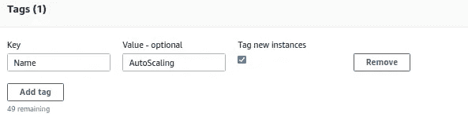

苏拉布什雷斯塔。创建自动缩放组 7。2020.JPEG 文件。

> 陷阱 6:不要依赖启动模板标签，因为有时标签不会写在实例上。所以最好把他们放在自动缩放组里，这样比较安全。

按照上面的选择添加标签。单击下一步，然后创建自动缩放组。您将看到您的实例在 EC2 仪表板上弹出。

# 代码部署

现在下一步是设置 CodeDeploy 和 CodePipeline，将您的代码从 GitHub 部署到这些实例。在此之前，您需要再次创建一个新角色，这次是为了 CodeDeploy。转到 IAM 并为 CodeDeploy 创建一个角色。这很简单:进入**角色- >创建角色- >** 选择 **CodeDeploy - >** 选择**第一个** ( *允许 CodeDeploy 调用 AWS 服务，比如代表你自动伸缩。* ) - > **下一个- >** 给个**名- >评**完事。现在，从 AWS 服务转到 CodeDeploy，并从**应用程序中单击**创建应用程序**。**


苏拉布什雷斯塔。设置代码部署 1。2020.JPEG 文件。

写下名称并在计算平台上选择 EC2，然后点击**创建应用。**

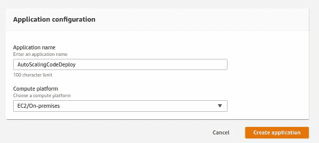

苏拉布什雷斯塔。设置代码部署 2。2020.JPEG 文件。

现在，点击**创建部署组。**

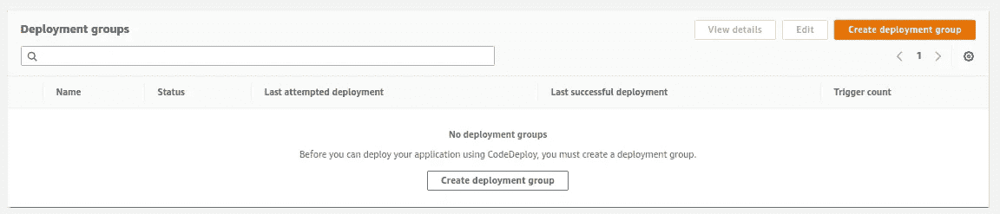

苏拉布什雷斯塔。设置代码部署 3。2020.JPEG 文件。

添加名称并选择您刚刚从上面创建的角色。我的角色名是 **CodeDeployUnit4。**

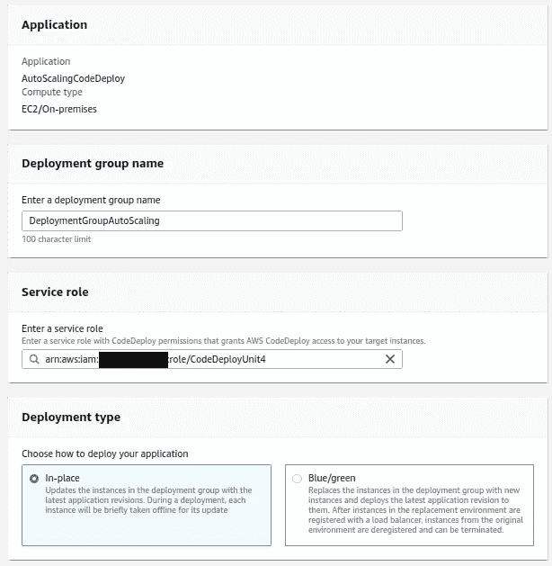

苏拉布什雷斯塔。设置代码部署 4。2020.JPEG 文件。

选择**自动缩放组**作为您的部署设置。

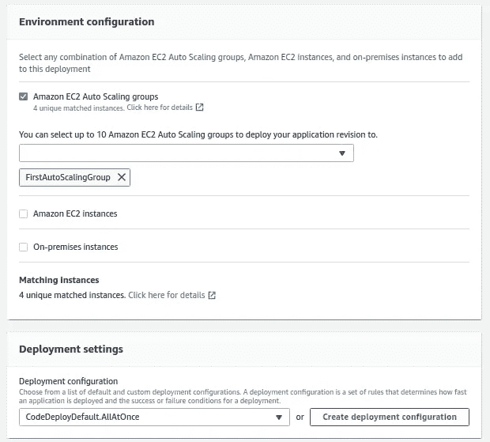

苏拉布什雷斯塔。设置代码部署 5。2020.JPEG 文件。

禁用**负载平衡**和**创建一个部署组。**

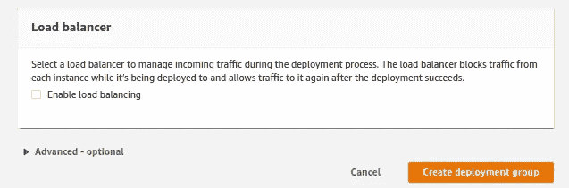

苏拉布什雷斯塔。设置代码部署 6。2020.JPEG 文件。

您的部署组现在已经准备好了。现在让我们向您的 Git 存储库添加一些示例代码。

# 代码管道

AWS 有自己的代码准备从 CodeDeploy 推送，这里是桶。

```
aws s3 cp s3://aws-codedeploy-us-east-1/samples/latest/SampleApp_Linux.zip . — region us-east-1
```

> 陷阱 7:现在不要试图上传你自己的代码，因为你稍后会看到它本身有一些钩子，我们可以在另一个博客中深入挖掘，所以现在坚持使用 AWS 给出的默认代码。从桶中下载时也要注意区域。

将此代码添加到您的存储库中，私有/公共无关紧要。现在在开发者工具的设置上，选择**连接**

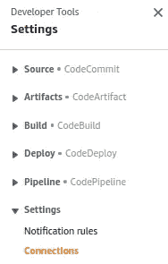

苏拉布什雷斯塔。设置代码管道 1。2020.JPEG 文件。

点击**创建连接**

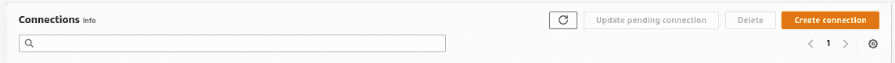

苏拉布什雷斯塔。设置代码管道 2。2020.JPEG 文件。

它会将您重定向到下一页，在这里您给出连接名称。在那里添加任何名称。

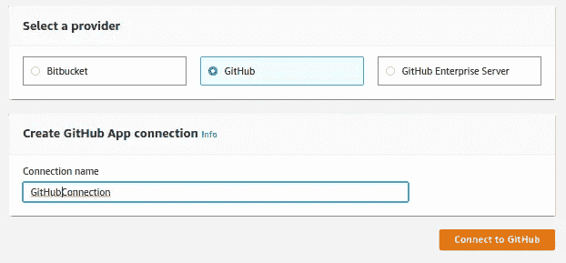

苏拉布什雷斯塔。设置代码管道 3。2020.JPEG 文件。

这将把你重定向到 GitHub 页面。登录，如果已经登录，则允许访问。之后，您将在 Connections 选项卡上看到您的连接。很好。现在转到代码管道，点击**创建管道。**

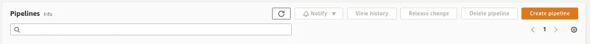

苏拉布什雷斯塔。设置代码管道 4。2020.JPEG 文件。

添加您的姓名，一切保留默认值，然后单击下一步的**。**

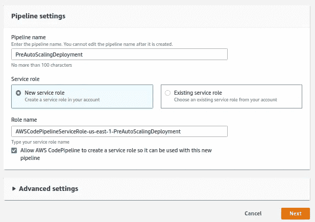

苏拉布什雷斯塔。设置代码管道 5。2020.JPEG 文件。

选择 **Github 版本 2** 并在设置中选择您刚刚建立的连接。此外，给出存储库名称和它的分支名称。

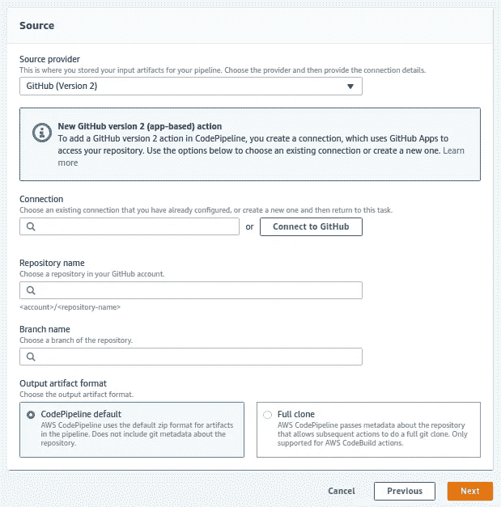

苏拉布什雷斯塔。设置代码管道 6。2020.JPEG 文件。

**跳过构建阶段**，因为我们使用的是普通的 HTML 代码。现在，选择您刚刚创建的**应用名称**和**部署组**，点击**下一步**和**创建管道。**

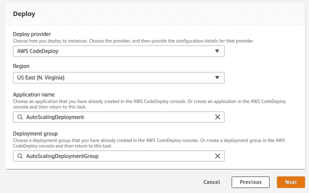

苏拉布什雷斯塔。设置代码管道 7。2020.JPEG 文件。

# 结果

现在，唯一要做的就是测试。在 HTML 页面上编辑一些行，并推送代码。一旦您推送代码，代码管道将运行，然后将其部署到自动扩展组，这将通过单个弹性 IP 显示。

> 陷阱 8:这段代码将会运行，但是当然，当你把你自己的代码放入时，你将会遇到部署问题。为此我有备而来。
> [https://docs . AWS . Amazon . com/code deploy/latest/user guide/error-codes . html](https://docs.aws.amazon.com/codedeploy/latest/userguide/error-codes.html)
> code deploy 有自己的错误，你可以使用上面的链接对它们进行排序。还要检查陷阱 4，因为也可以在那里找到错误
> 
> 陷阱 9:有时一切从头到尾都是正确的，但是代码部署失败了。你可能会笑，但这里的解决方案是
> sudo 服务代码部署-代理重启
> 是的，重启有时会修复所有错误，所以在调试时也使用它

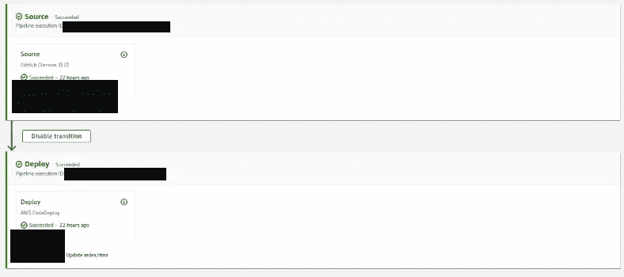

苏拉布什雷斯塔。代码管道 1 的结果。2020.JPEG 文件。

现在让我们看看弹性 IP。我将把我的名字写进 index.html 档案。

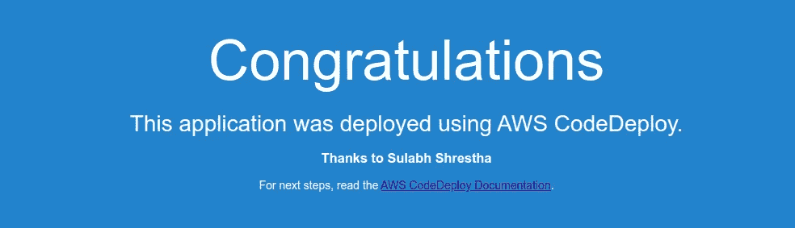

苏拉布什雷斯塔。代码管道 2 的结果。2020.JPEG 文件。

我把我的名字加在了样板文本的下面，这看起来很有效。Yayyy！

# 昏睡的熊猫

事不宜迟，让我们召唤昏睡的熊猫行动起来。对于它的先决条件，您只需要安装一个 **AWS CLI** 、 **AWS IAM 用户**和 **EC2 访问角色**，并将其添加到您将要使用的机器上。

苏拉布什雷斯塔。昏睡的熊猫二分法。2020.JPEG 文件。

运行该命令，您可以看到这只熊猫导致您的一个实例被终止。但是担心，不是我们的自动缩放组已经得到了它。现在检查你的弹性 IP，看看你的网站是不是宕机了。它运行正常。


苏拉布什雷斯塔。昏睡的熊猫的结果。2020.JPEG 文件。

# 结论

我真的很喜欢做这个系统，它能流畅地运行代码并具有容错能力。这只是一个开始，因为我们可以采用其他技术，如通过它运行机器学习代码，使用 S3 保存模型，托管 Node/React 应用程序，同时利用代码管道上的构建步骤，使用代码管道将 GitHub 代码推送到 CodeDeploy 以外的地方，利用 AWS Lambda 上的部署组，但让我们具体谈谈这在数据科学中的使用。

> 陷阱 10:这更像是我过去所做的事情。在部署用于构建模型的机器学习代码时，我将代码推入 GitHub，然后打开实例，提取最新的代码，运行代码并生成模型。有时在对代码做小的修改时，我会直接在实例上修改它，这有时会导致两个本地存储库之间的差异。落实到这一点，不仅仅是在做一些网站的同时，在大数据科学上，机器学习项目肯定会加速，工作流的速率也会提高。执行这些步骤可以让您更专注于模型的研究方面，而不是配置方面，因为做数据科学就是要进行实验和交付。
> 
> 缺陷 11:在生成机器学习模型后，你可以在 linux 系统的 cronjob 上使用这个命令将其自动同步到 S3。
> AWS S3 sync<source>S3://<destination-bucket>
> 这将使您的模型在单一路径上高度可用。不需要进入实例，搜索和下载路径。

然而，选择是无穷无尽的，你想做什么取决于你自己。如果你遇到任何问题或难以遵循这些步骤，请在下面评论这篇文章或在 tsulabh4@gmail.com 给我发消息。你也可以通过 Linkedin[和 GitHub](https://www.linkedin.com/in/sulabhshrestha/)[与我联系，或者订阅我的时事通讯来获得精彩的博客。](https://github.com/codexponent)

[](http://eepurl.com/hg2RQP) [## 苏拉布·什雷斯塔

### Sulabh Shrestha 电子邮件表单

eepurl.com](http://eepurl.com/hg2RQP) 

# 参考

[1] [网飞科技博客](https://medium.com/u/c3aeaf49d8a4?source=post_page-----465acc556406--------------------------------)，[网飞猿猴军](https://netflixtechblog.com/the-netflix-simian-army-16e57fbab116) (2011)，中等。

[2]亚马逊 EC2，检索自亚马逊官网【https://aws.amazon.com/ec2[。](https://aws.amazon.com/ec2)

[3]自动缩放组，检索自[https://docs . AWS . Amazon . com/Auto Scaling/ec2/user guide/Auto Scaling group . html](https://docs.aws.amazon.com/autoscaling/ec2/userguide/AutoScalingGroup.html)(n . d)，亚马逊官网。

[4]启动配置，检索自[https://docs . AWS . Amazon . com/auto scaling/ec2/user guide/Launch configuration . html](https://docs.aws.amazon.com/autoscaling/ec2/userguide/LaunchConfiguration.html)(n . d)，亚马逊官网。

【5】弹性 IP 地址，检索自[https://docs . AWS . Amazon . com/AWS C2/latest/user guide/Elastic-IP-addresses-EIP . html](https://docs.aws.amazon.com/AWSEC2/latest/UserGuide/elastic-ip-addresses-eip.html)(n . d)，亚马逊官网。

[6] AWS CodeDeploy，检索自亚马逊官网[https://aws.amazon.com/codedeploy/](https://aws.amazon.com/codedeploy/)(未注明)。

[7] AWS CodePipeline，检索自亚马逊官网[https://aws.amazon.com/codepipeline/](https://aws.amazon.com/codepipeline/)(未注明)。

[8] Github，从 https://github.com/的 GiHub 公司检索。