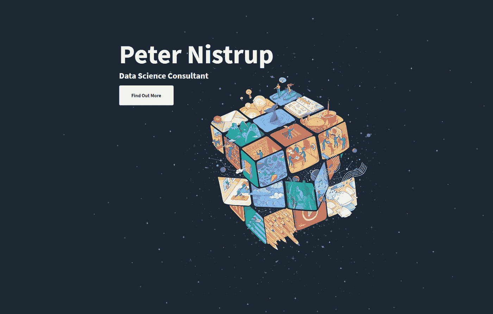
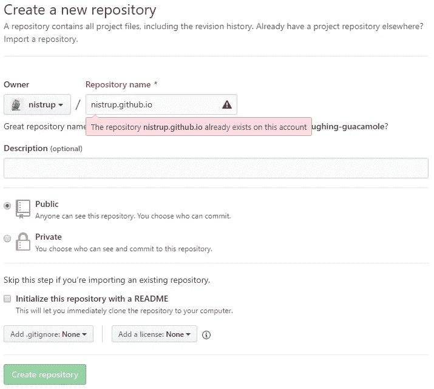
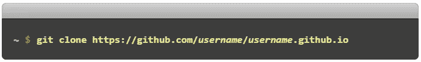
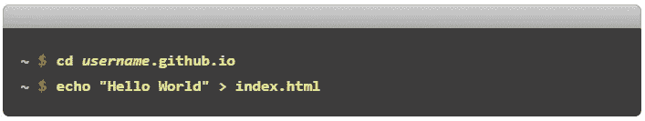
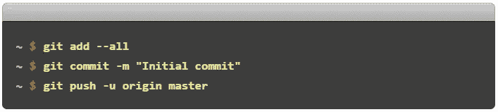
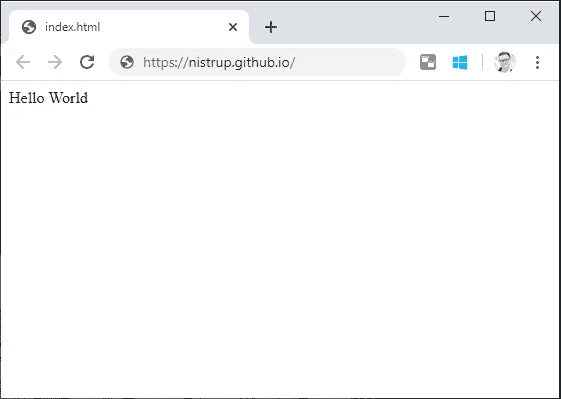

# 制作一个免费的单页闪屏

> 原文：<https://towardsdatascience.com/making-a-free-personal-one-page-splash-screen-60344f243dfd?source=collection_archive---------25----------------------->

## 想炫耀你的作品集吗？也许你需要一个网页来放你的在线简历？也许你想演示一个 web 开发项目？

不要再看了！

[https://nistrup.github.io/](https://nistrup.github.io/)

## 这是我们将要做的:

*   从头开始建立 GitHub Pages 网站。
*   添加一个模板，使它看起来很漂亮。

这是我的:[T3【https://nistrup.github.io/】T5](https://nistrup.github.io/)

## 开始之前，我们有几个先决条件:

*   GitHub 账户。
*   一个终端。
*   非常有限的 Git 和一般 HTML 编辑经验。*(我拒绝称之为“HTML 编程”)*

我们需要一个 GitHub 帐户的原因是我们将使用 GitHub 页面，所以如果你还没有 GitHub 档案，现在是时候创建它了！

现在，请准备好直接从 GitHub 中大量复制/粘贴一些分步说明。

# 步骤 1，创建一个存储库

转到 [GitHub](https://github.com/) 和[创建一个名为***username***. GitHub . io 的新存储库](https://github.com/new)，其中 ***username*** 是你在 GitHub 上的用户名(或组织名)。

**忽略错误**，这只是因为我已经创建了我的。

注意:如果存储库的第一部分与你的用户名不完全匹配，它就不能工作，所以要确保它是正确的。

# 步骤 2，克隆您的新存储库

导航到终端中您想要存储项目的任何文件夹，并克隆新的存储库:

将 ***用户名*** *替换成自己的。*

可能会提示您输入 GitHub 凭据，只需输入并继续。

# 步骤 3，创建初始 index.html

进入项目文件夹并添加一个 index.html 文件:

将 ***用户名*** *替换成自己的。*

如果你在 web 开发方面更有经验，可以随意使用你的 index.html 文件。如果没有，请继续阅读，我们将建立一个很好的模板。

# 第四步，把它推送到你的仓库

添加、提交和推送您的更改:

# 第五步，它是活的！

打开浏览器，进入 [https:// ***用户名*** .github.io](https://username.github.io)

**宏伟！**

虽然这是伟大的，我相信所有轻微的改善是有序的..！让我们给它加点料。

# 第六步，找到并应用一个模板！

我发现[**Start Bootstrap**](https://startbootstrap.com/)**对于单页模板来说是一个非常好的资源，这正是我们所需要的！一个明显的候选是“[一页奇迹](https://startbootstrap.com/themes/one-page-wonder/)”:**

****

**[https://startbootstrap.com/themes/one-page-wonder/](https://startbootstrap.com/themes/one-page-wonder/)**

**现在简单地说:**

1.  ****直接下载模板或者从 GitHub 克隆。****
2.  ****提取到与步骤 2** 相同的目的地。(*很可能会让你覆盖 index.html，显然没问题*)**

**一旦所有内容都与初始 index.html 在同一个文件夹中，导航到终端中的文件夹，然后将新模板提交到存储库:**

****

**这只是步骤 4 中的映像的副本，**但这是相同的过程**，在提交消息中写入您想要的任何内容，不必是“**初始提交**”。**

# **第七步，个性化**

**现在你已经在 [https:// ***用户名*** .github.io](https://username.github.io.) 上用你选择的模板有了一个活的网站！**

**显然你会想要做一些改变，这可以通过简单地在你喜欢的文本编辑器中编辑模板中包含的 **HTML** 和 **CSS** 文件来实现(*主要关注****index.html****文件*)。这些是你唯一需要担心的文件，你可以忽略其他一切！**

# **结束语**

**我希望这篇短文对你有所帮助！**

**如果你想多看多学，一定要上 [**关注我的**](https://medium.com/@peter.nistrup) 🔍**[**碎碎念**](https://twitter.com/peternistrup) 🐦****

**** [## 彼得·尼斯特鲁普-中等

### 阅读彼得·尼斯特拉普在媒介上的作品。数据科学、统计和人工智能...推特:@PeterNistrup，LinkedIn…

medium.com](https://medium.com/@peter.nistrup)****