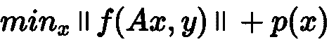
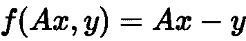

# 做模型就像烤蛋糕

> 原文：<https://towardsdatascience.com/making-a-model-is-like-baking-a-cake-5f2443894c5f?source=collection_archive---------32----------------------->


照片由[亨利·贝](https://unsplash.com/@henry_be?utm_source=medium&utm_medium=referral)在 [Unsplash](https://unsplash.com?utm_source=medium&utm_medium=referral)

## 可供选择的蛋糕种类

随着我们在当今时代的进一步发展，数据科学和技术的进步继续在研究和实践的各个领域取得惊人的进展。由于数据科学和技术的广泛适用性，已经构建了各种不同类型的模型。

举几个例子:广义线性模型、支持向量机、K-最近邻算法、梯度推进决策树、随机森林和神经网络。

鉴于数据量和数据内交互的复杂性，已经用几种不同的语言开发了各种特定于数据科学的包。在 python 中，我们有 sklearn、xgboost、lightgbm、pyspark 和 H2O。在 R 中，我们有，但不限于，Caret、Prophet、SparkR 和 xgboost。

上述每个软件包都试图解决非常具体的数据科学问题。然而，考虑到初始问题的性质，我们可能需要一种更加定制的方法来导出解决方案。这就是每个数据科学家努力解决的问题。

> 通常，由于该领域中存在各种各样的问题，数据科学家使用模型和预定义的模型架构来开发解决方案，并寻求提高预定义模型无法解决的某些 KPI 指标性能。

幸运的是，有一种方法可以开发一个建模架构来专门解决您的问题。通过理解这些预定义模型架构中每一个所使用的数学和统计过程，就有可能针对您的具体问题对模型进行逆向工程。

首先，让我们检查一系列模型，然后继续开发我们自己的模型。

## 我们的预制蛋糕


照片由[卡米·塔尔朋](https://unsplash.com/@camitalpone?utm_source=medium&utm_medium=referral)在 [Unsplash](https://unsplash.com?utm_source=medium&utm_medium=referral) 上拍摄

如前所述，有不同类型的模型，其中大多数是预定义的。唯一的例外是神经网络，在神经网络中，可以指定您自己的模型架构，并定义您自己的性能来直接优化。然而，考虑到参数的整体复杂性，我们将不讨论如何做到这一点。

为了便于讨论，我们将讨论一个相当基础的模型架构，它很容易进一步扩展。我们将考虑广义线性模型族。

> **警告。**这部分文章本质上是非常数学化的，需要一定程度的数学成熟度和理解力。如果您不想阅读这一部分，请跳到下一节，因为这一节有更多的 python 代码表示。

广义线性模型族由不同的模型架构组成。它可以是普通的最小二乘线性回归、休伯回归、逻辑回归和泊松回归，具有 *L2* 或 *L1、*或两者的混合、*正则化。从解决数据科学问题的角度来看，这些不同的模型都是相似的*



在这个问题陈述中，我们有一个任意函数， ***f*** ，作用于我们提出的定义为 ***Ax*** 的预测，其中 ***A*** 是我们的训练数据集， ***x*** 是我们的系数列表，以及我们的实际训练标签， ***y*** 。我们的罚函数，可以作为我们的正则子，是 ***p*** 。此外，双括号指的是一个规范。

我们的预定义模型架构如何使用的一个示例是我们的普通线性平方问题，其中



而我们的范数叫做[2-范数](https://en.wikipedia.org/wiki/Norm_(mathematics))。

我们的罚函数，***【p】*****取决于我们是否要使用正则化。目前，让我们假设 ***p(x) = 0*** 。**

**在下一节中，我们将介绍一个例子，说明如何为我们自己的指标创建我们自己的 GLM。**

## **我们需要的原料**

**现在让我们定义我们想要直接优化的指标！**

**对于我们的例子，让我们优化平均绝对误差。**

**对于这个任务，我们将使用两个特定的 python 包。一个是 scipy，另一个是亲笔签名的。下面是如何利用这两者来创建我们选择的模型的代码片段，请注意这是如何遵循 sklearn API 的。**

```
**# this is for our optimization scheme
from scipy.optimize import minimize# this is to allow autograd to perform auto-differentiation
from autograd import grad
import autograd.numpy as np# this function calculates our metric
def mean_absolute_error(y_pred, y_true):
    return np.mean(np.abs(y_pred - y_true))# the loss function we want to use, where data is our training data,# y is our training labels, and x is our linear coefficients
def loss(data, x, y):
    return mean_absolute_error(np.dot(data, x), y)# this class is fully equipped with all of the needed functions to # follow the sklearn API
class MAERegressor: def __init__(self, fit_intercept=True):
        self.fi = fit_intercept
        self.coef_ = None def fit(self, data, y):
        # we try to determine whether we want to fit the intercept
        # or not fi = self.fi if fi:
            _data = np.hstack((np.ones((data.shape[0], 1)), data))
        else:
            _data = data # below we define the optimization function and the gradient def opt(x):
            return loss(_data, x, y) def f_grad(x):
            return grad(opt)(x) # we assume our initial coefficients follow a normal
        # distribution res = minimize(opt, x0=np.random.normal(0, 1, (_data.shape[1], 1)),
                       jac=f_grad) # the coefficient is saved here
        self.coef_ = res.get("x")

        return self def predict(self, data): fi = self.fi if fi:
            _data = np.hstack((np.ones((data.shape[0], 1)), data))
        else:
            _data = data coef_ = self.coef_ if coef_ is None:
            raise RunTimeError("The model has not been trained yet") return np.dot(_data, coef_) def score(self, val_data, val_y): return mean_absolute_error(self.predict(val_data), val_y)**
```

**从上面可以看出，我们能够创建我们自己的模型架构，并优化我们自己的度量函数！**

## **别忘了糖霜！**

****

**Jordane Mathieu 在 [Unsplash](https://unsplash.com?utm_source=medium&utm_medium=referral) 上拍摄的照片**

**作为演示，在将上一节中的代码复制并粘贴到 Python 内核中之后，尝试运行以下代码片段**

```
**n = 10000
m = 5num_labels = 1data = np.random.normal(0, 1, (n, m))
w_ = np.random.random((m + 1, num_labels))
_data = np.hstack((np.ones((n, 1)), data))
labels = np.dot(_data, w_)model = MAERegressor(True)model.fit(data, labels)model.score(data, labels)**
```

**你有它！自定义模型，它将确定线性模型的系数，该模型专门设置为最小化平均绝对误差。**

**为了创造一个类似的模型，你所要做的就是按照食谱做，你应该很棒！**

**如果这引起了你的共鸣，请到我的主页订阅我的时事通讯**

 **[## 主页

### 在这里，您将找到有关 Edward Turner 所做工作的信息，以及…

ed-特纳. github.io](https://ed-turner.github.io/)** 

**或者，在 LinkedIn 上关注我**

**[](https://www.linkedin.com/in/edward-turner-polygot/) [## 爱德华·特纳-数据科学家- Paylocity | LinkedIn

### 爱德华·特纳(Edward Turner)是一名多语言开发人员，懂 Python、R 和 Scala，懂 Java 和 C/C++的语法。他…

www.linkedin.com](https://www.linkedin.com/in/edward-turner-polygot/)** 

**如果你有兴趣了解更多关于我是如何在这个领域变得熟练的，你可能也会对这篇文章感兴趣。**

 **[## 数据科学之旅

### 通常，所有的旅程都有开始和结束。幸运的是，或者至少我现在知道，我的…

medium.com](https://medium.com/@edward.turnerr/the-journey-into-data-science-d702f8b810a9)** 

**一如既往，#快乐编码**