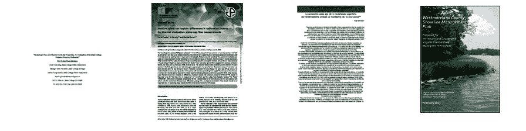
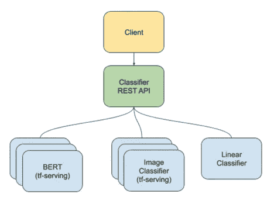

# 制作生产分类器集成

> 原文：<https://towardsdatascience.com/making-a-production-classifier-ensemble-2d87fbf0f486?source=collection_archive---------32----------------------->

## 使用 BERT、Inception 和 fastText 的现成 PDF 分类器服务

照片由 Jason Dent 在 Unsplash 上拍摄

机器学习的演示很容易找到，但是实用的、可以投入生产的端到端解决方案呢？我在这里描述了一个用于 pdf 的开源的、生产就绪的、基于集成的文档分类器。它达到了 98%的准确率。这是对它如何产生的解释，为什么不同的分类器被结合，以及我如何把它变成一个生产系统。

# 需求

我的客户，非盈利的互联网档案馆保存着网络上的内容，这样过去就不会丢失。几乎每个人都知道“[时光倒流机](https://archive.org/web/)”，他们提供的网络时光机器。

互联网存档有一个选择存档内容的启发法:如果某样东西可能很快就会永远丢失，那就先存档。有时这是战术性的，也是必然的，就像在拔掉插头之前保存 Google Plus 内容一样。[这项工作](https://blog.dshr.org/2017/01/the-long-tail-of-non-english-science.html)的重点是保存那些不为人知的 pdf 文件，但也许有一天在长尾理论中会很重要。特别是，像学术论文这样由小出版商提供服务的研究工作可能会消失，因为它们没有足够的资金。相比之下，在天平的另一端，公共科学图书馆的论文没有丢失的危险。

安德鲁·梅隆基金会有支持图书馆的历史，它为这项工作提供了资助。该授权规定所开发的软件是开源的；这使得把这个项目放在 github.com 变得很容易。

Internet Archive 在 2019 年初向我呈现了这种情况:确定一个 PDF 是否是研究作品需要 30 秒，但需要小于 1 秒。它将用于已存档的 pdf 和在网络搜索中找到的 pdf。使用将是批处理，而不是交互式的，它必须在没有 GPU 的情况下工作。重要的是，它必须与多种语言一起工作，因为没有太多的训练示例。该计划是处理 6.5 亿个 pdf 文件，以找到 6%的研究工作。

正面训练集是已知的 1800 万篇论文的集合，这些论文可以被认为是干净的、基本的事实。负面训练集只是从被正面案例污染的 6.5 亿个 pdf 中随机选择的。对 1，000 个负面案例的审核显示有 6–7%的正面案例。通过手动检查对这些进行清理，并使用自举来增加集合的大小。

带着这些目标和事实，我开始形成一个解决方案。

# PDF 挑战

任何机器学习项目的第一步都是了解你的数据。我检查了 pdf 的一个子集，发现:
一些 pdf 仅包含文本图像
页面数量从一个到数百个
纵横比和页面布局各不相同

要处理只有图像的文档，第一页可用于制作图像，然后用于图像分类。

一小部分研究作品在出版时会附上封面，为出版商做广告和/或展示许可文本。这表明可以呈现多个页面来提高准确性，但是在项目的这个阶段，仅使用第一个页面就已经给了我们足够的准确性，因此检查更多页面的工作留待将来完成。

你可能会想象一项研究工作看起来像一篇典型的计算机科学会议论文，在第一页上有标题、作者、居中的摘要，也许还有一些正文。我当然预料到了这一点，但是一旦你涉足生命科学、立场文件、转录的会议主题演讲等等，设计是相当多样的。以下是一些随机挑选的正面和负面例子:

四个正面例子

四个反面例子

即使对于人类来说，这也不是视觉分析的不二法门。

# PDF 到图像

ImageMagick 被选择用于第一页图像生成。它使用下面的 ghostscript 来渲染图像。最初，有许多问题图像大多是黑色的。解决这个问题的诀窍是将背景明确设置为白色。显然，大约有一半的 pdf 实际上是打印到透明背景上的。

产生的图像实际上是一个缩略图。这样做很好，因为很多成功的图像分类都是在小图像上完成的。这有一个附带的好处，即结果与语言无关:在 224x224 的情况下，不可能辨别文档中使用的语言。

必须开发一种试探法来检测和剔除空白图像。这可能是由于渲染错误，如缺少日语字体，或者实际上可能有一个空白的第一页。显然，如果正负样本集都包含空白图像，那么分类就像扔骰子一样，所以这些必须被移除。

与自然图像不同，猫可以出现在框架的任何地方，研究工作 pdf 是严格对齐的，通常在标题中居中显示文本。为了捕捉这个方面，ImageMagick 被指示水平居中渲染，使其与北边齐平。在一项对 2000 个例子的研究中，我没有看到对齐带来的大的准确性提高，所以可能的情况是，已经能够处理未对齐图像的模型没有从更多的对齐中受益。

# PDF 转文本

文本需要提取以及首页图像。经过大量实验后，发现 pdftotext 实用程序对于文本来说是快速而有效的。此外，因为它是作为子流程运行的，所以使用超时来避免陷入寄生案例。当一个系统暴露在数以百万计的例子中时，导致过程缓慢或停滞的坏的苹果 pdf 是可能的。

使用 pdftotext 是一种乐趣。开箱即用，它只是工作，它可以保持人类阅读的顺序，即使有 2 列格式的话。

# 预处理可以跳过吗？

PDF 格式是一组使用排版、艺术线条和图像来呈现文档的指令。有许多自由度，所以 PDF 的每个实现可能都有稍微不同的风格。如果有些是专门用于研究工作或没有，指令模式可能是一个廉价的线索，但没有保证它是稳定的时间；风格会随着时间来来去去。我估计大概有 100 种指令模式在使用中。对于只有图像的 pdf，仅仅通过对正面和反面例子的训练，训练不可能在任何合理的计算预算上学会 OCR。这就像科幻作家斯坦尼斯拉夫·莱姆的想法，通过在阳光下用放大镜杀死出错的蚂蚁来训练蚂蚁写自然语言。

在放弃端到端原始 PDF 的想法后，我认为文本提取和将第一页呈现为图像是很好的方法。这些特征提取预处理步骤的速度很容易控制在 1 秒的时间预算内。

# 基线

假设使用 pdftotext，那么什么是好的基线模型？经典的计算机科学论文有“摘要”和“参考文献”这两个词。只需要这两个词会有多好？我进行了非正式的测量，发现要求两个单词只有 50%的准确性，这是令人沮丧的。要求任一关键字对于阳性情况有 84%的准确性。只有 10%的阴性病例有这些关键词。这给了我一个需要打破的准确性目标。

接下来，有哪些模型可以使用？

# 图像分类

利用迁移学习，TensorFlow Hub 用于测试十几个图像分类器模型的准确性。InceptionV3 和 Resnet 最好，为 87%；我选择 InceptionV3 有些武断。

虽然 87%并不完全是一流的，但只有包含文本图像的 pdf 才会遭受 13%的错误率。大多数 pdf 包含明确的文本。

# 一袋单词

线性文本分类器可以非常快，但是当没有足够的训练样本时，它们在处理多种语言时会有麻烦。在这个项目中，选择了 FaceBook 的 fastText[1]。这是一个写得很好的带有 python 绑定的 C++包，在速度方面毫不妥协。

“快”是指 0.4 毫秒，比 CPU 上的深度神经网络快 3 个数量级。在 20，000 个文档训练和测试集上的准确率达到 96%。一个很大的优点是它是全文，但一个很大的缺点是这种词袋分类器对很少或没有训练样本的语言没有泛化能力。

FastText 能够处理 n 元语法，比如单词对。在测试中，没有发现二元模型的准确性优势。

# 伯特

到目前为止，每个人都知道 BERT[2]模型是“自我监督”自然语言的一大进步。多语言模型是用 100 多种语言训练的，它是这个项目的完美选择。

使用 BERT 的分类器模式，在 20，000 个文档训练和测试集上对模型进行微调。结果是 98%的准确率。

一些语言中的例子数量并不多，但是分类对于非英语语言是正确的，这表明它确实是跨语言通用的。

# 整体建筑

21 世纪初，整体学习风靡一时。那是在贝叶斯学习流行之前。事实上，随机森林通常被认为是一种集成，因为它在训练示例上创建了一个拼凑物。

我们现在处于深度学习时代，但集成是组合文本和图像等多种形式的标准工具包的一部分。下一步是使用集成，通过使用快速的线性模型有条件地加速分类，如果置信度低，则使用 BERT。

下图显示了生产分类器集成的工作原理:

运行时架构显示 REST via Flask、TensorFlow Serving for BERT/CNN 和 FastText 线性分类器

上述每个模型计算一个分类置信度。这使得创建选择性地使用模型来强调速度或准确性的集成分类器成为可能。对于速度示例，如果文本可用并且快速文本线性分类器置信度高，则可以跳过 BERT。为了强调准确性，可以运行所有三个模型，然后结合置信值和分类预测进行总体分类。

# REST 接口

使用 Flask 实现的 REST 接口使用 URI 路径中的变化来指示运行哪个分类器的偏好。URI 指出的可能的加工选择:

使用特定的分类器列表

运行所有分类器

自动模式使用最快的方法，这取决于可信度

# 使其可以投入生产

TensorFlow Serving[3]对于在生产中运行 TensorFlow 模型至关重要。一些实际的评论是适当的。TensorFlow Serving 是一个张量图计算引擎，它加载“保存的模型”(我引用它是因为它听起来很普通，但它是一种特定的数据格式)，并通过网络为请求提供服务。为了提高速度，它是用 C++编写的，可以重新编译以利用机器提供的精确指令集来获得最大的吞吐量。

TensorFlow 服务可以使用 REST 或 gRPC。事实证明，gRPC 对客户端的干扰相当大，因为当使用 gRPC 时，用于创建输入张量的服务器端 Python 代码(“处理器”)往往也会在客户端使用。这导致了非常混乱的集成，服务器端和客户端的耦合超过了必要的程度；不仅仅是 API，还有代码。这可能只是 BERT 中的一个疏忽，也可能是 gRPC 在与 TensorFlow 结合使用时普遍缺乏封装实践。

另一方面，REST 能够使用不需要后端代码的更通用的调用签名。与 HTTP 相比，gRPC 的优势是通过较小的消息传输速度稍快，但是在只有 CPU 的部署中，这种速度差异可以忽略不计。由于这些原因，REST 在这个项目中更受欢迎。

来自 Google 的 BERT 的原始代码没有导出模型的“保存的模型”格式。为了解决这个问题，正式的 BERT 项目被分叉，并添加了一个选项来创建必要的模型格式。

# 回购协议

这个项目被戏称为三个分类器的集合:“pdf_trio”。

有 3 个回购:

主要项目[https://github.com/tralfamadude/pdf_trio](https://github.com/tralfamadude/pdf_trio)

图像分类器【https://github.com/tralfamadude/pdf_image_classifier 

https://github.com/tralfamadude/bert 的伯特分类器

首先是主体工程。第二个是来自 TensorFlow Hub 的 CNN 分类器示例。第三个是官方 BERT 的一个小 delta。pdf_trio 有 5 个 README.md 文件作为参考文档，并有用于训练、测试和部署的脚本。

经过训练的模型对于 github 来说太大了，但是可以从 archive.org 下载，正如项目自述文件中所描述的。

# 最后

这次 PDF_trio 的温柔之旅到此结束。通过使用不同的训练示例，可以简单地制作不同种类的 PDF 分类器。希望你觉得 [PDF_trio](https://github.com/tralfamadude/pdf_trio) 有用。

## 承认

感谢:布莱恩·纽博尔德，杰斐逊·贝利，大卫·s·h·罗森塔尔。

## 参考

[1] [快速文本](https://fasttext.cc/)

[伯特](https://en.wikipedia.org/wiki/BERT_(language_model))

[3] [张量流发球](https://www.tensorflow.org/tfx/guide/serving)