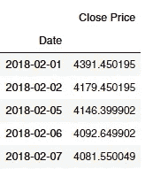
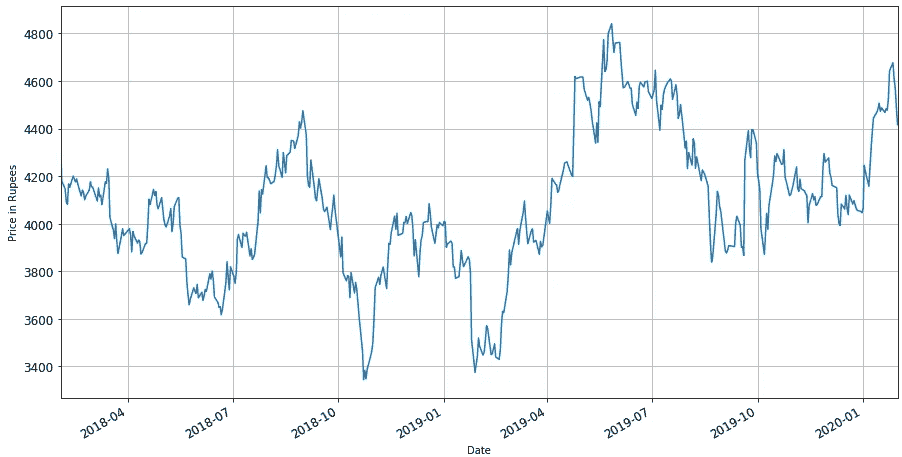
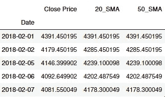
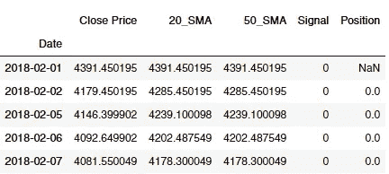
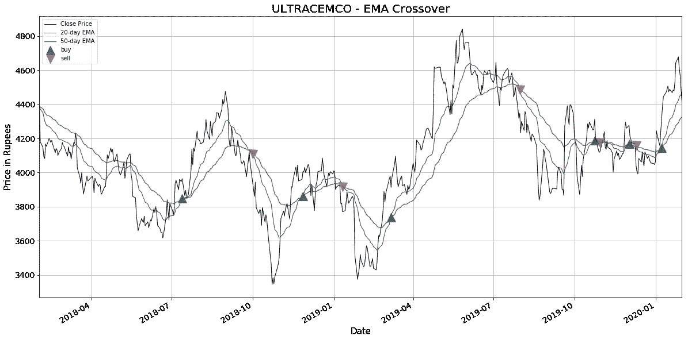
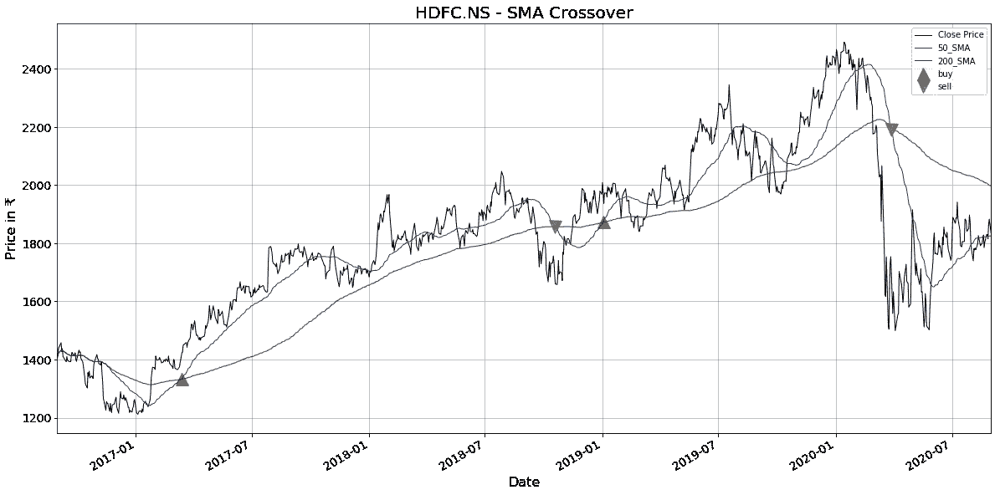
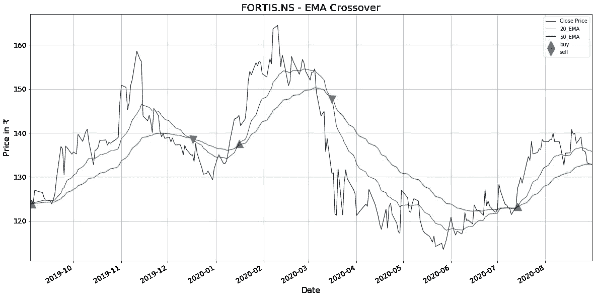

# 使用移动平均交叉策略生成交易信号——Python 实现

> 原文：<https://towardsdatascience.com/making-a-trade-call-using-simple-moving-average-sma-crossover-strategy-python-implementation-29963326da7a?source=collection_archive---------1----------------------->

## 移动平均线通常用于股票的技术分析，以预测未来的价格趋势。在本文中，我们将开发一个 Python 脚本，使用简单移动平均线(SMA)和指数移动平均线(EMA)交叉策略生成买入/卖出信号。


尼古拉斯·卡佩罗在 [Unsplash](https://unsplash.com?utm_source=medium&utm_medium=referral) 上拍摄的照片

*——————* ***免责声明*** *—本文交易策略及相关信息仅供教育之用。股票市场上的所有投资和交易都有风险。任何与购买/出售股票或其他金融工具相关的决定都应在彻底研究后做出，并在需要时寻求专业帮助。* ——*————*

移动平均线(MAs)、布林线、相对强弱指数(RSI)等指标是交易者和投资者用来分析过去和预测未来价格趋势和形态的数学技术分析工具。基本面分析者可能会跟踪经济数据、年度报告或各种其他指标，而量化交易者和分析师则依靠图表和指标来帮助解读价格走势。

使用指标的目的是识别交易机会。例如，移动平均线交叉通常预示着趋势即将改变。将移动平均线交叉策略应用于价格图表，交易者可以识别趋势改变方向的区域，从而创造潜在的交易机会。

在我们开始之前，你可以考虑通读下面的文章，让自己熟悉一些与股票市场相关的常见金融术语。

[](https://medium.com/datadriveninvestor/beginners-guide-to-stock-market-understanding-the-basic-terminology-e4e2751dfd77) [## 股票市场入门指南——理解基本术语

### 15 个常见的股票市场术语和相关的概念，每个新手投资者都应该知道。

medium.com](https://medium.com/datadriveninvestor/beginners-guide-to-stock-market-understanding-the-basic-terminology-e4e2751dfd77) 

# 什么是均线？

移动平均，也称为滚动平均或移动平均，用于通过计算完整数据集的不同子集的一系列平均值来分析时间序列数据。

移动平均线是一系列数值的平均值。它们有一个预定义的长度来表示要平均的值的数量，随着时间的推移，随着更多数据的增加，这组值会向前移动。给定一系列数字和一个固定的子集大小，移动平均值的第一个元素是通过取数字系列的初始固定子集的平均值获得的。然后，为了获得随后的移动平均值，子集被“前移”，即排除前一个子集的第一个元素，并将前一个子集之后的元素立即添加到新的子集，保持长度固定。由于它涉及在一段时间内对数据集取平均值，因此也称为移动平均值(MM)或滚动平均值。

在金融数据的技术分析中，移动平均线(MAs)是最广泛使用的趋势跟踪指标之一，它展示了市场趋势的方向。

# 移动平均线的类型

根据平均数的计算方式，有许多不同类型的移动平均数。在任何时间序列数据分析中，最常用的移动平均线类型是—

*   简单移动平均线
*   加权移动平均(WMA)
*   指数移动平均线(均线或 EWMA)

各种移动平均线之间唯一值得注意的区别是在移动平均线周期内分配给数据点的权重。简单移动平均线对所有数据点应用相同的权重。指数和加权平均值对最近的数据点应用更多的权重。

其中，简单移动平均线(SMAs)和指数移动平均线(EMAs)可以说是分析师和交易员最常用的技术分析工具。在本文中，我们将主要关注涉及 SMA 和 EMA 的策略。

# 简单移动平均线

简单移动平均线是交易员和投资者用于股票、指数或证券技术分析的核心技术指标之一。简单移动平均线的计算方法是将最近 *n* 天的收盘价相加，然后除以天数(时间段)。在我们深入探讨之前，让我们先了解简单平均值背后的数学原理。

我们在学校学习了如何计算平均值，甚至在我们的日常生活中也经常会遇到这个概念。假设你正在观看一场板球比赛，一名击球手前来击球。通过查看他之前的 5 场比赛得分——60、75、55、80、50；你可以预计他在今天的比赛中大约能得 60-70 分。

通过计算一名击球手过去 5 场比赛的平均得分，你可以粗略地预测他今天会得这么多分。虽然，这是一个粗略的估计，并不能保证他会得到完全相同的分数，但机会仍然很高。同样，SMA 有助于预测未来趋势，并确定资产价格是否会继续或逆转牛市或熊市趋势。SMA 通常用于识别趋势方向，但是它也可以用于产生潜在的交易信号。

**计算简单移动平均线** — 计算 SMA 的公式很简单:

简单移动平均线=(过去 *n* 个周期的资产价格之和)/(周期数)


来源: [Investopedia](https://www.investopedia.com/terms/s/sma.asp)

SMA 中的所有元素都具有相同的权重。如果移动平均周期是 5，那么 SMA 中的每个元素在 SMA 中的权重是 20% (1/5)。

n 个句号可以是任何东西。你可以有 200 天简单移动平均线，100 小时简单移动平均线，5 天简单移动平均线，26 周简单移动平均线，等等。

现在我们已经熟悉了基础知识，让我们跳到 Python 实现。

## 计算 20 天和 50 天移动平均线

对于这个例子，我取了从 2018 年 2 月 1 日到 2020 年 2 月 1 日的 [*UltraTech 水泥有限公司*](https://www.ultratechcement.com/about-us/overview) 股票(在 NSE 注册的 ULTRACEMCO)的收盘价的 2 年历史数据。你可以选择自己的股票组合和时间周期来进行分析。

让我们从使用 [Pandas-datareader](https://pandas-datareader.readthedocs.io/en/latest/remote_data.html) API 从[雅虎财经](https://in.finance.yahoo.com/)中提取股票价格数据开始。

导入必要的库—

```
import numpy as np 
import pandas as pd
import matplotlib.pyplot as plt
import datetime
import 
```

提取上述时间段内 UltraTech 水泥股票的收盘价数据

```
# import package
import pandas_datareader.data as web# set start and end dates 
start = datetime.datetime(2018, 2, 1) 
end = datetime.datetime(2020, 2, 1) # extract the closing price data
ultratech_df = web.DataReader(['ULTRACEMCO.NS'], 'yahoo', start = start, end = end)['Close']
ultratech_df.columns = {'Close Price'}
ultratech_df.head(10)
```



*请注意，SMA 是根据收盘价计算的，而不是根据收盘价调整的，因为我们希望交易信号是根据价格数据生成的，而不是受支付的股息的影响。*

观察给定期间收盘价的一般价格变化—

```
ultratech_df[‘Close Price’].plot(figsize = (15, 8))
plt.grid()
plt.ylabel("Price in Rupees"
plt.show()
```



在我们的数据框架中为长期(即 50 天)和短期(即 20 天)简单移动平均线(SMAs)创建新列

```
# create 20 days simple moving average column
ultratech_df[‘20_SMA’] = ultratech_df[‘Close Price’].rolling(window = 20, min_periods = 1).mean()# create 50 days simple moving average column
ultratech_df[‘50_SMA’] = ultratech_df[‘Close Price’].rolling(window = 50, min_periods = 1).mean()# display first few rows
ultratech_df.head()
```



在熊猫中，*[*data frame . rolling()*](https://pandas.pydata.org/pandas-docs/stable/reference/api/pandas.DataFrame.rolling.html)函数提供了滚动窗口计算的功能。min_periods 参数指定窗口中需要有一个值的最小观察次数(否则结果为 NA)。*

*现在我们有了 20 天和 50 天的 SMAs，接下来我们来看看如何利用这些信息来产生交易信号。*

# *移动平均交叉策略*

*股票市场分析师和投资者可以通过多种方式使用移动平均线来分析价格趋势并预测未来的趋势变化。使用不同类型的移动平均线可以开发出各种各样的移动平均线策略。在本文中，我试图展示众所周知的简单而有效的动量策略——简单移动平均交叉策略和指数移动平均交叉策略。*

*在时间序列统计中，特别是在股票市场技术分析中，当绘制时，基于不同时间段的两条移动平均线趋于交叉时，移动平均线交叉。该指标使用两条(或更多)移动平均线，一条较快的移动平均线(短期)和一条较慢的移动平均线(长期)。快速移动平均线可以是 5 天、10 天或 25 天的周期，而慢速移动平均线可以是 50 天、100 天或 200 天的周期。短期移动平均线*比*快，因为它只考虑短期内的价格，因此对每日价格变化更敏感。另一方面，长期移动平均线被认为是*较慢的*，因为它包含了更长时期的价格，并且更加呆滞。*

## *从交叉点产生交易信号*

*移动平均线本身是一条线，通常覆盖在价格图表上来指示价格趋势。当较快的移动平均线(即较短周期的移动平均线)与较慢的移动平均线(即较长周期的移动平均线)交叉时，就会发生交叉。在股票交易中，这个交汇点可以作为买入或卖出资产的潜在指标。*

*   *当短期移动平均线越过长期移动平均线时，这表明一个*买入*信号。*
*   *相反，当短期移动平均线低于长期移动平均线时，可能是卖出的好时机。*

*具备了必要的理论，现在让我们继续我们的 Python 实现，其中我们将尝试合并这个策略。*

*在我们现有的 pandas 数据框架中，创建一个新的列' *Signal* ，这样如果 20 天 SMA 大于 50 天 SMA，则将信号值设置为 1，否则当 50 天 SMA 大于 20 天 SMA 时，将其值设置为 0。*

```
*ultratech_df['Signal'] = 0.0
ultratech_df['Signal'] = np.where(ultratech_df['20_SMA'] > ultratech_df['50_SMA'], 1.0, 0.0)*
```

*从这些“*信号*值中，可以产生代表交易信号的位置指令。当较快的移动平均线和较慢的移动平均线交叉时，交叉发生，或者换句话说，“信号”从 *0* 变为 *1* (或者 1 到 0)。因此，为了合并这些信息，创建一个新的列' *Position* ，它只不过是' *Signal* 列的日常差异。*

```
*ultratech_df[‘Position’] = ultratech_df[‘Signal’].diff()# display first few rows
ultratech_df.head()*
```

**

*   *当'*位置* ' = 1 时，意味着信号已经从 0 变为 1，意味着短期(更快)移动平均线已经越过长期(更慢)移动平均线，从而触发*买入*看涨。*
*   *当'*持仓* ' = -1 时，意味着信号已经从 1 变为 0，意味着短期(较快)移动平均线已经穿过长期(较慢)移动平均线下方，从而触发*卖出*指令。*

*现在让我们用一个图来形象化地说明这一点。*

```
*plt.figure(figsize = (20,10))
# plot close price, short-term and long-term moving averages 
ultratech_df[‘Close Price’].plot(color = ‘k’, label= ‘Close Price’) 
ultratech_df[‘20_SMA’].plot(color = ‘b’,label = ‘20-day SMA’) 
ultratech_df[‘50_SMA’].plot(color = ‘g’, label = ‘50-day SMA’)# plot ‘buy’ signals
plt.plot(ultratech_df[ultratech_df[‘Position’] == 1].index, 
         ultratech_df[‘20_SMA’][ultratech_df[‘Position’] == 1], 
         ‘^’, markersize = 15, color = ‘g’, label = 'buy')# plot ‘sell’ signals
plt.plot(ultratech_df[ultratech_df[‘Position’] == -1].index, 
         ultratech_df[‘20_SMA’][ultratech_df[‘Position’] == -1], 
         ‘v’, markersize = 15, color = ‘r’, label = 'sell')
plt.ylabel('Price in Rupees', fontsize = 15 )
plt.xlabel('Date', fontsize = 15 )
plt.title('ULTRACEMCO', fontsize = 20)
plt.legend()
plt.grid()
plt.show()*
```

**

*正如你在上面的图中看到的，蓝线代表较快的移动平均线(20 天 SMA)，绿线代表较慢的移动平均线(50 天 SMA)，黑线代表实际收盘价。如果你仔细观察，这些均线只不过是实际价格的平滑版本，只是滞后了一段时间。短期移动平均线非常类似于实际价格，这完全有道理，因为它考虑了更近的价格。相比之下，长期移动平均线具有相对更大的滞后性，与实际价格曲线大致相似。*

*当快速移动平均线穿过慢速移动平均线时，就会触发买入信号(用绿色向上三角形表示)。这表明趋势发生了变化，即过去 20 天的平均价格已经超过了过去 50 天的平均价格。同样，当快速移动平均线穿过慢速移动平均线下方时，会触发卖出信号(由红色向下三角形表示),表明最近 20 天的平均价格已低于最近 50 天的平均价格。*

# *指数移动平均线(均线或 EWMA)*

*到目前为止，我们讨论了使用简单移动平均线(SMAs)的移动平均线交叉策略。显而易见，SMA 时间序列比原始价格噪音小得多。然而，这是有代价的——SMA 滞后于原始价格，这意味着趋势的变化只有在延迟*1*天后才能看到。这个滞后 *L* 是多少？对于使用 *M* 天计算的 SMA 移动平均线，滞后大约是 *M/2* 天。因此，如果我们使用 50 天的 SMA，这意味着我们可能会晚了将近 25 天，这可能会极大地影响我们的策略。*

*减少使用 SMA 导致的滞后的一种方法是使用指数移动平均线(EMA)。指数移动平均线给予最近的时间段更多的权重。这使得它们比 SMAs 更可靠，因为它们相对更好地代表了资产的近期表现。均线的计算方法如下:*

*EMA[今日]=(*α*x*价格[今日])+((1—*α*)x EMA[昨日])**

*其中:
*α = 2/(N + 1)
N =窗口长度(均线周期)
EMA【今日】=当前 EMA 值
价格【今日】=当前收盘价
EMA【昨日】=前一个 EMA 值**

*虽然均线的计算看起来有点吓人，但实际上很简单。事实上，它比 SMA 更容易计算，此外， [*Pandas ewm*](https://pandas.pydata.org/pandas-docs/stable/reference/api/pandas.DataFrame.ewm.html) 功能将在一行代码中为您完成！*

*理解了基础，让我们试着在均线策略中用 EMAs 代替 SMAs。我们将使用与上面相同的代码，只是做了一些小的改动。*

```
*# set start and end dates
start = datetime.datetime(2018, 2, 1)
end = datetime.datetime(2020, 2, 1)# extract the daily closing price data
ultratech_df = web.DataReader(['ULTRACEMCO.NS'], 'yahoo', start = start, end = end)['Close']
ultratech_df.columns = {'Close Price'}# Create 20 days exponential moving average column
ultratech_df['20_EMA'] = ultratech_df['Close Price'].ewm(span = 20, adjust = False).mean()# Create 50 days exponential moving average column
ultratech_df['50_EMA'] = ultratech_df['Close Price'].ewm(span = 50, adjust = False).mean()# create a new column 'Signal' such that if 20-day EMA is greater   # than 50-day EMA then set Signal as 1 else 0

ultratech_df['Signal'] = 0.0  
ultratech_df['Signal'] = np.where(ultratech_df['20_EMA'] > ultratech_df['50_EMA'], 1.0, 0.0)# create a new column 'Position' which is a day-to-day difference of # the 'Signal' column
ultratech_df['Position'] = ultratech_df['Signal'].diff()plt.figure(figsize = (20,10))
# plot close price, short-term and long-term moving averages 
ultratech_df['Close Price'].plot(color = 'k', lw = 1, label = 'Close Price')  
ultratech_df['20_EMA'].plot(color = 'b', lw = 1, label = '20-day EMA') 
ultratech_df['50_EMA'].plot(color = 'g', lw = 1, label = '50-day EMA')# plot ‘buy’ and 'sell' signals
plt.plot(ultratech_df[ultratech_df[‘Position’] == 1].index, 
         ultratech_df[‘20_EMA’][ultratech_df[‘Position’] == 1], 
         ‘^’, markersize = 15, color = ‘g’, label = 'buy')plt.plot(ultratech_df[ultratech_df[‘Position’] == -1].index, 
         ultratech_df[‘20_EMA’][ultratech_df[‘Position’] == -1], 
         ‘v’, markersize = 15, color = ‘r’, label = 'sell')plt.ylabel('Price in Rupees', fontsize = 15 )
plt.xlabel('Date', fontsize = 15 )
plt.title('ULTRACEMCO - EMA Crossover', fontsize = 20)
plt.legend()
plt.grid()
plt.show()*
```

**

*以下节选自约翰·j·墨菲的著作《金融市场的技术分析》，由纽约金融研究所出版，解释了指数加权移动平均线相对于简单移动平均线的优势*

> *“指数平滑移动平均线解决了与简单移动平均线相关的两个问题。首先，指数平滑的平均值给较新的数据分配较大的权重。因此，它是一个加权移动平均线。但尽管它对过去价格数据的重视程度较低，但它确实在计算中包括了该工具生命周期中的所有数据。此外，用户能够调整权重，以给予最近一天的价格更大或更小的权重，该权重被添加到前一天的价值的百分比中。两个百分比值之和为 100。*

## *完整的 Python 程序*

*函数'*MovingAverageCrossStrategy()'*接受以下输入—*

*   *股票代号—(str)股票代号，如雅虎财经。例如:ULTRACEMCO。纳秒*
*   *start_date — (str)从此日期开始分析(格式:' YYYY-MM-DD')
    例如:' 2018-01-01 '。*
*   *end_date— (str)在此日期结束分析(格式:' YYYY-MM-DD')
    例如:' 2020-01-01 '。*
*   *short_window— (int)短期移动平均线的回看周期。例:5，10，20*
*   *long_window — (int)长期移动平均线的回看周期。
    例如:50，100，200*
*   *moving_avg— (str)要使用的移动平均线的类型(“SMA”或“EMA”)。*
*   *display_table — (bool)是否在买入/卖出位置显示日期和价格表(真/假)。*

*现在，让我们用过去 4 年的 HDFC 银行股票来测试我们的脚本。我们将使用 50 天和 200 天的 SMA 交叉策略。*

****输入:****

```
*MovingAverageCrossStrategy('HDFC.NS', '2016-08-31', '2020-08-31', 50, 200, 'SMA', display_table = True)*
```

****输出:****

****

*富通 Healtcare 股票怎么样？这次我们分析过去 1 年的数据，考虑 20 天和 50 天的均线交叉。此外，这次我们不会显示表格。*

****输入:****

```
*MovingAverageCrossStrategy('FORTIS.NS', '2019-08-31', '2020-08-31', 20, 50, 'EMA', display_table = False)*
```

****输出:****

**

*由于它们计算方式的根本不同，均线对价格变化反应迅速，而均线反应相对较慢。但是，一个不一定比另一个更好。每个交易者必须决定哪个 MA 更适合他或她的策略。一般来说，短线交易者倾向于使用 EMAs，因为他们想在价格向相反方向变动时得到提醒。另一方面，长期交易者倾向于依赖 SMAs，因为这些投资者不急于行动，更喜欢不太积极地参与交易。*

*当心！作为一个趋势跟踪指标，移动平均线适用于具有明确长期趋势的市场。在长期波动的市场中，它们并不那么有效。故事的寓意——均线不是万能的圣杯。事实上，没有完美的指标或策略可以保证在任何情况下每项投资都能成功。量化交易者经常使用各种技术指标及其组合来制定不同的策略。在我随后的文章中，我将尝试介绍其中的一些技术指标。*

# *结束注释*

*在本文中，我展示了如何构建一个强大的工具来执行技术分析，并使用移动平均交叉策略生成交易信号。这个脚本可以用于调查其他公司的股票，只需将参数更改为函数 *MovingAverageCrossStrategy()。**

*这仅仅是开始，有可能创造出更复杂的策略，这是我所期待的。*

## *展望未来*

*   *结合更多基于指标的策略，如布林线、移动平均线收敛发散(MACD)、相对强弱指数(RSI)等。*
*   *使用适当的指标执行回溯测试，以评估不同策略的性能。*

## *参考资料:*

1.  *[QuantInsti](https://blog.quantinsti.com/) 博客*
2.  *[Investopedia](https://www.investopedia.com/technical-analysis-4689657)*
3.  *[雅虎财经](https://in.finance.yahoo.com/)*
4.  *[Clif Droke 简化的移动平均线](https://www.google.co.in/books/edition/Moving_Averages_Simplified/B_sXAQAAMAAJ?hl=en&sa=X&ved=2ahUKEwiZ75CbkcbrAhV6yDgGHRgdA80QiqUDMBN6BAgQEAI)*
5.  *约翰·j·墨菲对金融市场的技术分析*

*你可能也想看看我的另一篇文章——*

*[](/data-analysis-visualization-in-finance-technical-analysis-of-stocks-using-python-269d535598e4) [## 金融中的数据分析和可视化—使用 Python 对股票进行技术分析

### 如何使用 Pandas、Matplotlib、Seaborn 这样的 Python 库从股市数据中获取洞见？

towardsdatascience.co](/data-analysis-visualization-in-finance-technical-analysis-of-stocks-using-python-269d535598e4)*