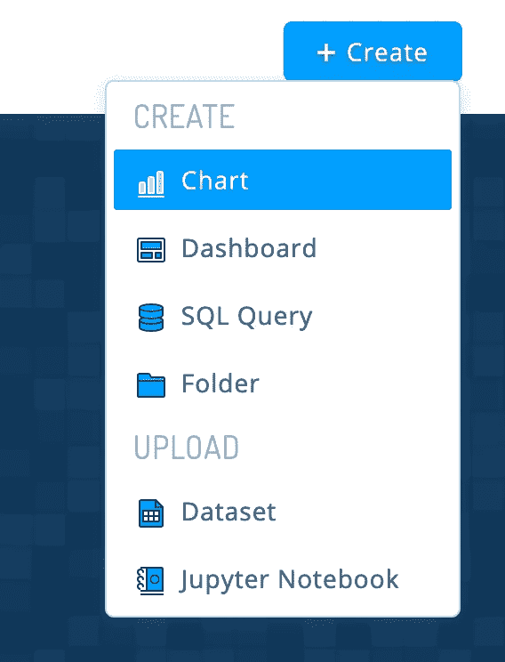
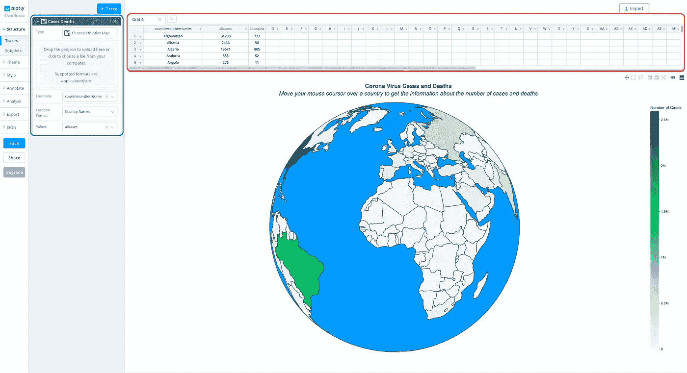
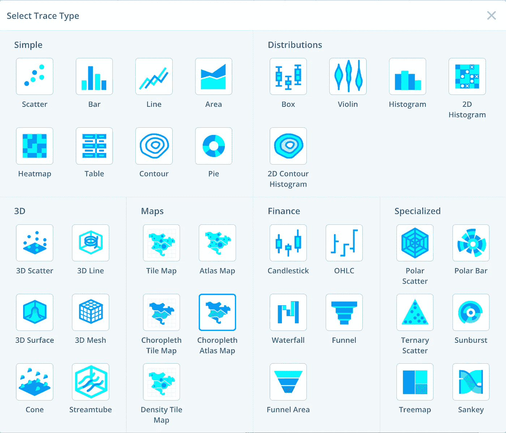
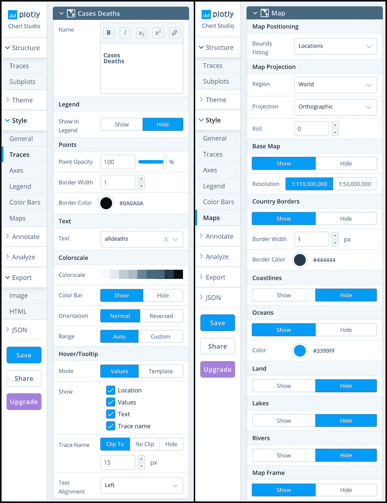
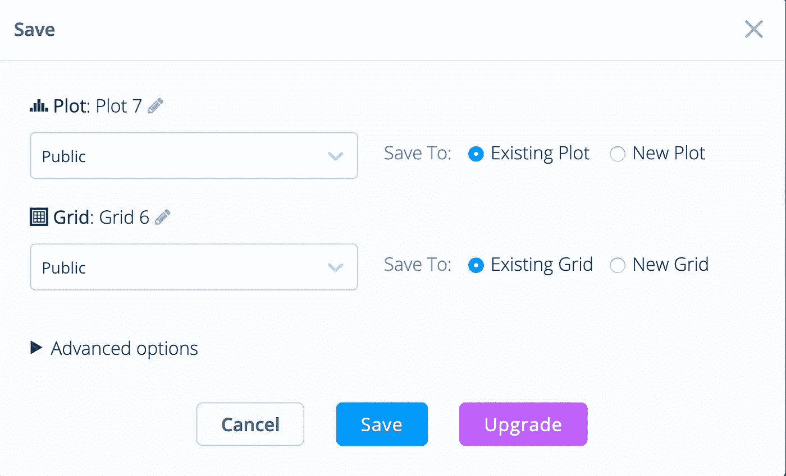
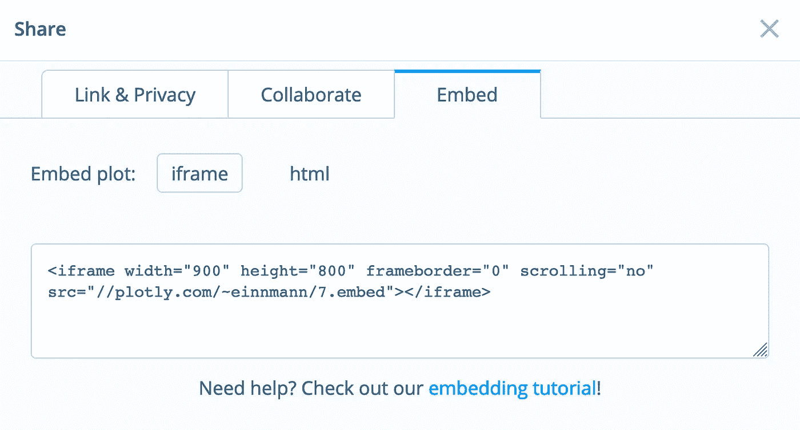

# 使用 Plotly 为 Django HTML 页面制作漂亮的可视化效果

> 原文：<https://towardsdatascience.com/making-beautiful-visualizations-for-a-django-html-page-using-plotly-f4e97d3f6bc7?source=collection_archive---------25----------------------->

## 创建交互式可视化并不需要了解 Python 或 HTML

结果可视化，作者提供的图像

大家好！最近，我不得不为我的大学项目做一些可视化，我做了一些谷歌搜索，还没有找到任何关于如何在 HTML 页面上放置情节的简单指南。

在开始之前，我假设您已经运行了 Django HTML 页面。为什么是 Plotly？Plotly 允许你在几分钟内制作出**互动**，设计精美的情节。尽管最初 Plotly 是一个 Python 库，但我们今天不会使用任何 Python 编程。

## 对于那些没有太多时间的人，这里有一个简短的指南:

*   去 [Plotly 图表工作室](https://chart-studio.plotly.com/)，创建你的账户。
*   点击“创建”按钮并选择“图表”。
*   导入您的数据，然后单击“跟踪”按钮。
*   选择您想要的绘图类型。
*   一旦你制作了你的梦境，保存它，设置所有的设置为“公共”。
*   通过从“嵌入”标签中复制 iframe 代码并将其粘贴到 HTML 页面的正文中来共享您的绘图。

现在，对于那些有时间的人来说，让我们详细看看我们如何才能得到相同的结果，就像你们在开始时看到的那样。

# 第一步。创建帐户并上传数据。

作者图片

我们将使用 [Plotly 图表工作室](https://chart-studio.plotly.com/)。注册后，您会在右上角看到“创建”。

为了创建我们的可视化，我们必须首先导入我们的数据。数据可以是 CSV，单表 Excel 文件，链接到 CSV 文件或使用 SQL 和 Falcon SQL 客户端获得的数据。

上传数据后，您会在屏幕顶部的表格(红色方块)中看到它。

Plotly 工作室，作者图片

# 第二步。选择绘图类型并追踪数据。

现在让我们看看图片上的蓝色方块，并追踪一些数据。

作者图片

您可以在不同类型的地块之间进行选择。在这里，我选择了 Choropleth 地图集，因为它可以让我得到这个漂亮的地球可视化。

# 第三步。指定位置和值。

然后，您必须指定将用作位置和值的列。您还必须选择位置格式，因为它可以是国家名称或缩写等。

作者图片

在这里你可以看到我所有的设置，你可以用它来得到和我一样的结果。

# 第四步。保存和共享情节。

作者图片

我们快到了！单击“保存”按钮，并为绘图和网格选择“公共”。

作者图片

最后，你点击“共享”按钮，选择“嵌入”并复制 iframe HTML 代码，你可以在你的 HTML 页面的主体中传递这些代码。

感谢您的阅读！