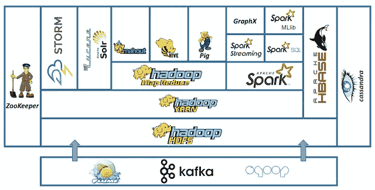
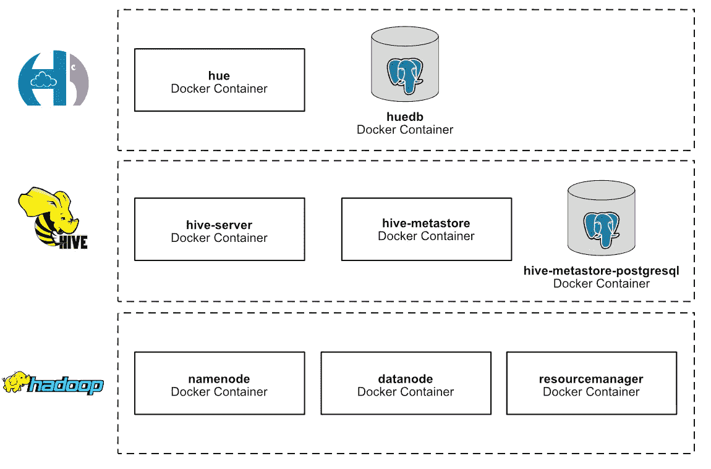
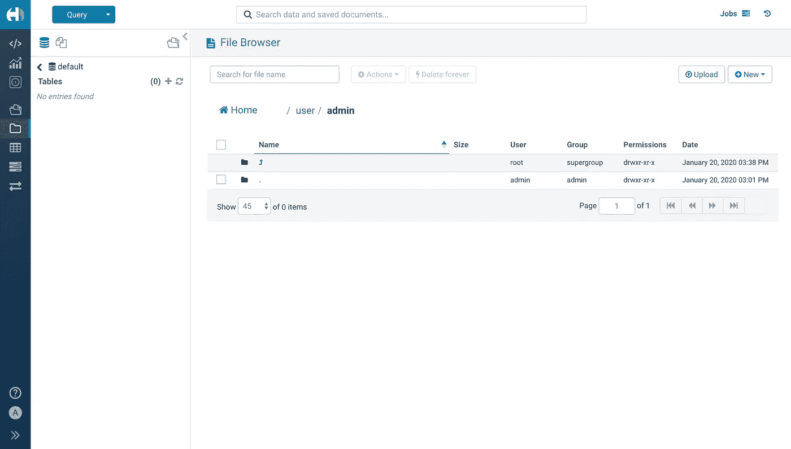
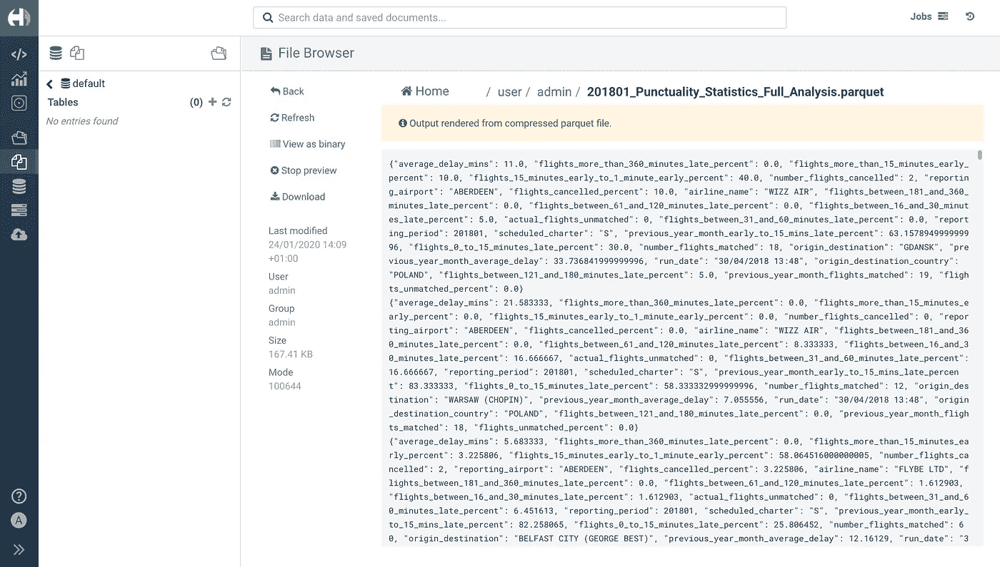
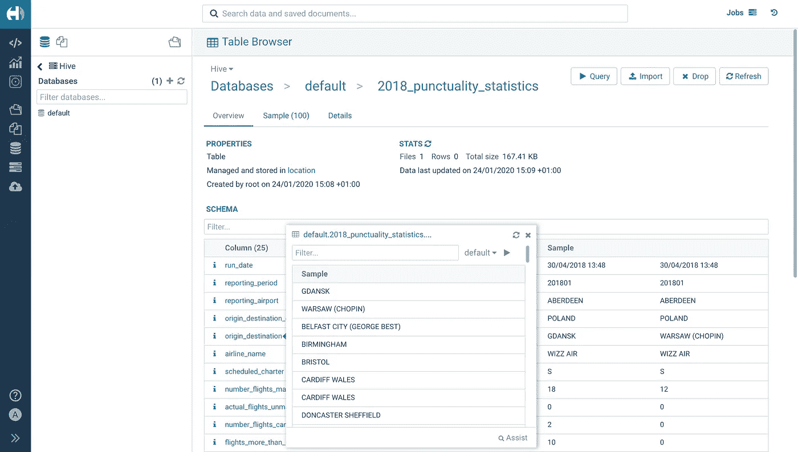
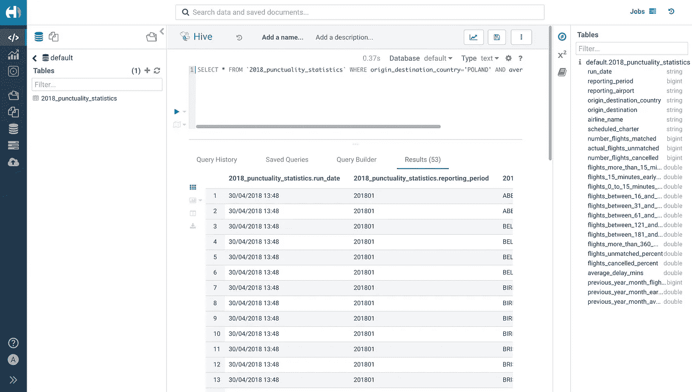

# 利用 Hadoop、Hive、Parquet、Hue 和 Docker 在大数据领域取得重大进展

> 原文：<https://towardsdatascience.com/making-big-moves-in-big-data-with-hadoop-hive-parquet-hue-and-docker-320a52ca175?source=collection_archive---------7----------------------->

## 在这篇大数据简介中跳跃和奔跑

2020 年大多数大公司的数据是什么样的。说真的。

本文的目标是向您介绍大数据领域的一些关键概念。在阅读完这篇文章之后——可能还需要一些额外的谷歌搜索——你应该能够(或多或少)理解整个 Hadoop 是如何工作的。

因此，在本文中更准确地说，您将:

*   学习很多定义(耶)
*   通过 docker-compose，使用一些附加功能构建一个 Hadoop 集群。
*   了解拼花文件以及如何将 csv 数据集转换为拼花文件。
*   对您的拼花文件运行 SQL(技术上是 HiveQL，但它非常类似)查询，就像与 Hive 无关一样。
*   此外，预计有一些 Docker 和 docker-compose，运行 Python 脚本等基本知识。—没什么疯狂的，但如果你事先知道会更好。

如果你已经在使用 Hadoop 生态系统的替代产品——cool——这篇文章更适合那些由于工作、大学等原因必须熟悉 Hadoop 的读者。这只是大数据难题的一个“解决方案”,各有利弊。

**大数据:**这是一个大数据。*大数据通常包括数据集，其大小超出了常用软件工具在可容忍的运行时间内捕获、筛选、管理和处理数据的能力。*现在你可能会问一个简单的问题(很多人都问过):“大数据有多大？”坦率地说，这是一个非常困难的问题，取决于技术发展的速度，今天被认为是“大”数据的东西明天可能就是“小”数据。尽管如此，上面的定义是非常永恒的，因为它指的是超出常用工具能力的尺寸——这是你的参考线；因此，在 2020 年，让我们咬紧牙关，假设以下情况属实:当您开始处理数据库及以上数据库中两位数的 TB 数据集时，您可能会触及一些更普通的工具的极限，也许是时候研究分布式计算了，可能还有本文。

Hadoop: 一个框架，允许使用简单的编程模型在计算机集群上分布式处理大型数据集。它旨在从单个服务器扩展到数千台机器，每台机器都提供本地计算和存储。您应该了解的 3 个最重要的核心模块是:

*   (存储)HDFS:一种分布式文件系统，同时具有高吞吐量访问和冗余(跨集群维护所有文件的副本)
*   又一个资源协商者:一个作业调度和集群资源管理的框架，例如哪些节点是可用的等等。
*   (处理)MapReduce:一个基于 YARN 的大数据集并行处理系统。这是用于跨集群节点无缝分配计算任务的主要算法。你可以在网上阅读 MapReduce 的起源。流行的替代品是 TEZ 和 Spark，它们后来被开发出来用于更有效地处理数据。

在一张图中展示 Hadoop 生态系统的各个部分。现在关注 HDFS，纱，MapReduce 和蜂巢。

**Hive:** 一个数据仓库软件，使用 SQL 帮助读取、写入和管理驻留在分布式存储中的大型数据集。结构可以被投影到已经存储的数据上。提供了命令行工具和 JDBC 驱动程序来将用户连接到 Hive。因此，基本上 Hive 位于前面提到的 Hadoop 堆栈之上，它允许您在集群上直接使用 SQL。

**Hue:** 一个用于数据库的开源 SQL 助手&数据仓库，即一个用于查看 HDFS、Hive 等的简单 GUI。对于初学者来说非常方便！它由 Cloudera 维护，你可以在 GitHub 上找到它。

**Parquet:** 一种柱状存储*格式，适用于 Hadoop 生态系统中的任何项目。你可以在下面的解释中了解为什么这是一个关于大数据集的好主意。同样，有许多替代方案，但这项技术是免费的、开源的，并在整个行业的生产中广泛使用。

*列存储:在普通的基于行的数据库(如 MySQL)中，数据是按行存储的，如果无法将数据存储在一个块中，这些数据将分布在不同的块中。现在，如果您的数据中有许多列和行分布在多个块中，那么事情会变得非常慢。这就是为什么您可以将每一列存储在单独的块中。在这种情况下，你可以通过访问一个块来访问一列的所有数据。此处对概念[有更长的解释。正如 AWS 所言(与 Parquet 无关，但仍然正确):*“数据库表的列存储是优化分析查询性能的一个重要因素，因为它大大降低了整体磁盘 I/O 需求，并减少了需要从磁盘加载的数据量。”*](https://docs.aws.amazon.com/redshift/latest/dg/c_columnar_storage_disk_mem_mgmnt.html) [这里的](https://databricks.com/glossary/what-is-parquet)也是对 CSV 的另一种比较，它显示了你可以节省多少存储空间，以及你可以期待什么样的加速*。*

只是一个伟大的大白鲨参考，这是在这里只是为了照亮你的心情，如果文章已经太多了。

**建造某物**

好的。是时候做点什么了！即一个 Hadoop 集群，上面有 Hive，可以对存储在 HDFS 的 Parquet 文件运行 SQL 查询，同时在 Hue 中可视化所有内容。这句话现在比文章开头更有意义吗？酷毙了。

有很多方法可以做到这一点，Hadoop 以运行基于“商用硬件”构建的计算机集群而闻名，但由于这只是一个学习练习，所以使用 docker-compose 在 Docker 中快速构建一个具有上述堆栈的小型 Hadoop 集群会更容易一些——当然，您也可以在 Kubernetes 中这样做，但这超出了本文的范围。这里的设置甚至不会接近生产，但本文应该只是作为您大数据之旅的一个门户。

以下是这篇文章的回复:

 [## tech 4242/docker-Hadoop-hive-parquet

### 这个项目将展示如何用 Hive 启动 Hadoop 集群，以便在 Parquet 文件上运行 SQL 查询…

github.com](https://github.com/tech4242/docker-hadoop-hive-parquet) 

资源库中 docker-compose 文件的更好视图，它应该粗略地勾勒出项目的架构。

**Docker**中实现的一些亮点

这并不像最初想的那么简单，所以如果你想进一步定制的话，这里有一些来自开发的提示。本文的重点也不是给你一个 Docker 和 docker-compose 的速成课程，所以这一节很简短，只强调一些你可能遇到困难的地方。

*   如果您想让任何东西与 Hue 一起工作，您需要通过挂载 hue-overrides.ini 文件来覆盖 Hue 的默认配置(您可以在 repo 和 docker-compose 中的覆盖中找到它)。很明显对吗？眨眼眨眼。
*   在 hue-overrides.ini 中，您应该看到:[[database]] = >这是内部的 hue 数据库，[[hdfs_clusters]] = >连接到 hdfs 以查看 Hue 中的文件，[[yarn_clusters]] = >设置 yarn 和[bewax]= >连接到 Hive 以运行 Hue 中的 SQL 查询。
*   如果在 hue-overrides.ini 中没有这一行 *thrift_version=7* ，hue 将拒绝连接到 Hive (=Thrift)服务器，因为它默认为过高的 Hive 服务器版本。这花了几个小时。
*   如果您使用 Hue 的默认 SQLite DB，当您尝试连接到 Hive 时，将会得到“database locked”消息= >这就是 docker-compose 文件中有 db-hue Postgres DB 的原因。关于 SQLite 不适合多线程环境的一些事情在这里[描述](https://mapr.com/community/s/question/0D50L00006BIsdlSAD/database-is-locked-in-hue)。Cloudera 应该处理他们的错误信息…
*   hadoop-hive.env 中的 POSTGRES_DB、POSTGRES_USER、POSTGRES_PASSWORD 可以与官方 postgres Docker 映像一起使用，以便在启动容器时直接创建 DB 用户。检查。
*   注意你的 5432 端口，不要多次暴露它，因为 PGDB 为这个项目运行了不止一次(一次作为 Hive 的 metastore，一次作为 hue 的 DB)

**TL；博士接下来的步骤**

好的。对没有耐心的工程师来说，接下来会发生什么的简短总结:

1.  用 docker-compose up 启动 Hue、Hive 和你的 Hadoop 节点
2.  从 Kaggle 下载一个. csv 数据集，并使用提供的 Python 脚本进行转换
3.  导入所说的拼花文件到 HDFS 通过色调和预览它，以确保一切正常
4.  在使用 parquet-tools CLI 工具检查模式后，使用 Parquet 文件模式创建空的配置单元表
5.  将文件从 HDFS 导入到 Hive 的表中
6.  运行一些 SQL 查询！

**启动集群，用 docker-compose 启动 Hue**

好了，既然一切都已经设置好了，只需在您的计算机上克隆存储库，并在您的终端中键入 docker-compose up。就是这样。然后转到 localhost:8888，您应该(在设置 Hue 的初始密码后)看到这个屏幕:

这个屏幕显示了您的 Hadoop 集群的 HDFS，而侧栏显示了 Hive 的 metastore 中的 DB 表——在本例中这两个表都是空的。

**在 HDFS 上传拼花文件并在 Hue 中预览**

当试图在 Hue 中打开一些(相当多的)拼花文件时，您会得到以下错误消息:

*“无法读取拼花文件”*

在您的 docker-compose 日志中:

*名称错误:全局名称‘snappy’未定义*

事实证明，Hue 不支持 snappy 压缩，这是 pandas 等许多拼花转换工具的默认设置。除了重新创建您的拼花文件(如果他们使用 snappy)之外，没有其他解决方法。Cloudera 有史以来最差的 UX…

在 GitHub 存储库中，您将找到一个 parquet_converter.py，它使用 pandas 并指定压缩为 None，因此不会默认为 snappy，因为这会破坏 Hue。这意味着你可以从 Kaggle 中获取任何数据集。csv 格式，并使用提供的 Python 模块将其转换为 Parquet。

在这一点上——如果你不喜欢 CLI——最好的建议是你忘记色调，直接使用配置单元和 HDFS 为你的拼花文件。但是如果你像我一样坚持使用 Hue，你可以看到一份来自 Kaggle 的[英国守时统计报告，它是用上面提到的 Python 脚本转换的，然后上传为一个文件:](https://www.kaggle.com/ferhat00/uk-flight-stats-2018/data)

当您单击成功导入的拼花文件时，文件浏览器显示为 Hue。你可以从左边黑色的边栏进入文件浏览器。

**从您的 Parquet 文件和模式创建一个配置单元表**

在看到您的数据被正确导入后，您可以创建您的 Hive 表。为此，您应该在您转换文件的文件夹(可能是/your_github_clone/data)中的命令行中运行以下命令:

工具模式 201801 _ 守时 _ 统计 _ 完整 _ 分析

这将输出创建色调表所需的模式(UTF8 =色调字符串):

*消息模式{
可选二进制 run _ date(UTF8)；
可选 int64 reporting _ period
可选二进制报告 _ airport(UTF8)；
可选二进制 origin _ destination _ country(UTF8)；*

创建表格的时间:

您创建的新表格的预览。转到黑色侧边栏中的 DB 图标，使用上面描述的模式手动创建一个新表。然后点击黑色侧边栏中的导入按钮，将您的拼花文件导入到空桌子中。之后，您应该会看到上面的屏幕。

**运行 SQL 查询**

运行 SQL 查询是承诺过的，应该会实现。Hue 侧边栏的第一个图标是它的查询编辑器。

如果您想找到所有从波兰起飞的平均延误超过 10 分钟的航班，该怎么办？

SELECT * FROM ` 2018 _ 守时 _ 统计`其中始发地 _ 目的地 _ 国家= '波兰'，平均 _ 延误 _ 分钟> = 10；

编辑器中的自动完成特性非常棒，所以即使您是 SQL 新手，也应该能够轻松地处理数据。

最后。

**该放手了**

亲爱的读者，很遗憾你已经到了这篇文章的结尾。如果你觉得这个旅程应该有续集，请在下面的评论中写下。因此，概括地说，您学习了如何使用 Hive 运行 Hadoop 集群来运行 SQL 查询，同时使用 docker-compose 可视化 Hue 中的所有内容。还不错。

这当然是对 Hadoop 可能实现的功能的一个非常*非常*简化的介绍，但是您可能刚刚开始涉足这一领域，所以请给自己一些时间，在这些知识和基础设施的基础上进行构建。此外，还有很棒的在线课程，你接下来可以去看看。

**展望 2020 年及以后**

现在，如果你在过去几年中一直在收听 Hadoop 的生态系统，你就会看到市场上最大的两家公司——cloud era 和 Hortonworks — [大约在一年前合并了](https://techcrunch.com/2019/01/03/cloudera-and-hortonworks-finalize-their-merger/?guccounter=1&guce_referrer=aHR0cHM6Ly93d3cuZ29vZ2xlLmNvbS8&guce_referrer_sig=AQAAAFdWl96BCgH521hvgxIYTl5hVRxsg-B6Nj6_q5C9nY3_SVtz7qmGHpnGmuLxoZhv7_OXLaYSmtuQlD2BcGGKqyaT_Vz_mgfpTaE7JZZ241vBM43dLmYQsoSiqK8lidE-92bDNI69PaxqA1Z6tnjx-kUAGfvrD9zL3Bvt6j4uufAo),当时 Hadoop 大数据市场发展缓慢。事实上，人们似乎对 Kubernetes 比对更老的 Hadoop 特定技术更感兴趣，如用于资源管理和编排的 YARN，对 PyTorch 等 DL 框架的快速采用，以及对老化的 Hadoop 堆栈的完美风暴的形成。尽管如此，像 Apache Spark 这样的项目仍在稳步前进，例如引入 Kubernetes 作为纱线的替代品。生态系统激动人心的时刻！

来源:

*   2020 年 1 月 17 日，[里克·梅森](https://unsplash.com/@egnaro?utm_source=unsplash&utm_medium=referral&utm_content=creditCopyText)在 [Unsplash](https://unsplash.com/s/photos/lego-bricks?utm_source=unsplash&utm_medium=referral&utm_content=creditCopyText) 拍摄的照片
*   Hadoop 架构图:[https://2 . BP . blogspot . com/-w7 keanwwnbq/WfYBJzgtvQI/aaaaaaaaaaamk/d 58 spzfk 7 lkj 8 qnknqzw 268 mkzrvuoonaclcbgas/s640/Hadoop stack . png](https://2.bp.blogspot.com/-w7KeAnwWnBQ/WfYBJzgtvQI/AAAAAAAAAMk/D58SpZfK7lkJ8QnKnQZW268mKzRvuOOnACLcBGAs/s640/HadoopStack.png)，2020 年 1 月 23 日
*   [https://hadoop.apache.org/](https://hadoop.apache.org/)，2020 年 1 月 17 日
*   2020 年 1 月 17 日，https://hive.apache.org/
*   2020 年 1 月 17 日，http://parquet.apache.org/
*   [https://docs . AWS . Amazon . com/redshift/latest/DG/c _ column _ storage _ disk _ mem _ MGM nt . html](https://docs.aws.amazon.com/redshift/latest/dg/c_columnar_storage_disk_mem_mgmnt.html)，17.01.2020
*   斯尼德斯角；Matzat，u；美国大学 reips(2012 年)。“‘大数据’:互联网领域的知识大空白”。*国际互联网科学杂志*。7:1–5.
*   2020 年 1 月 19 日，https://pbs.twimg.com/media/BiZiNmXCAAA2n8U.jpg