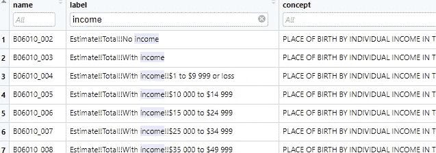
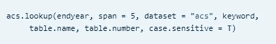
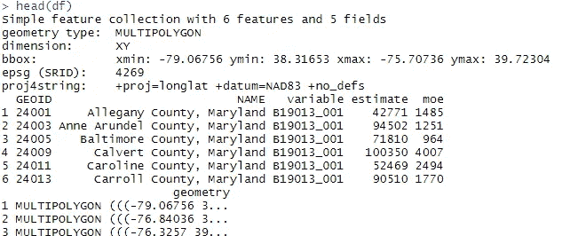
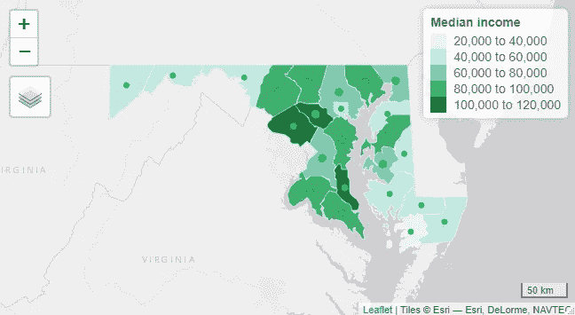
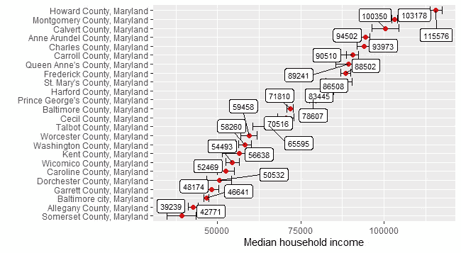

# 通过 5 个简单的步骤使用人口普查数据制作酷地图

> 原文：<https://towardsdatascience.com/making-cool-maps-using-census-data-in-5-easy-steps-1f80a6bcb457?source=collection_archive---------29----------------------->

## 面向数据科学家的基础地理空间数据可视化

克里斯·劳顿在 [Unsplash](https://unsplash.com?utm_source=medium&utm_medium=referral) 上的照片

人类有 1100 万个感觉受体，其中 90%以上是光学审查者。这就是为什么数据的可视化表示如此重要，并且没有比制作地图更好的方式来表示数据。人们不常看到表格、饼状图和条形图，但他们每天都会用到地图。因此，地理空间分析是每个数据科学家工具箱中如此强大的工具。

使用人口普查数据库([Census.gov](https://www.census.gov/))这篇文章将演示如何制作简单的地图来可视化数据。该职位主要面向:a)希望学习空间数据表示基础知识的人，以及 b)对普查数据分析感兴趣的人。

所以让我们开始吧。

# 1.加载库

在继续之前，首先您需要有自己的 API 键来访问来自人口普查局 API 的数据。你可以[在这里注册](https://api.census.gov/data/key_signup.html)来获得你的密钥——这应该是一个快速的过程。

Python 是我处理所有数据的“首选”语言。除了两种情况——[时间序列预测](/time-series-forecasting-from-naive-to-arima-and-beyond-ef133c485f94)和地理空间分析。所以我用 r 做这个演示。

有相当多的 Rstat 软件包可以用来处理人口普查数据，但是`tidycensus`可以说是记录最完整的软件包，在网上有很多例子。除此之外，我还是绘制人口普查变量的`tmap`的忠实粉丝。因此，让我们在第一步加载所有的包！

> 库(tidysensus)
> 库(tmap)
> 库(tidyverse)

当然，您将使用`census_api_key()`函数加载您的 API 密匙。

> census _ API _ KEY(" YOUR _ API _ KEY _ HERE ")

# 2.寻找正确的变量

人口普查局既是工厂(即制造商)，也是仓库(即储存库)，储存了美国人类生活几乎每个方面的大量数据集。许多数据是通过每五年一次的美国社区调查(ACS)收集的。

一旦您准备好启动您的 IDE，您需要知道您感兴趣的变量的正确标识符(ID)。如果你不知道如何访问变量 ID，这将是一个真正的挑战。这里有 3 个选项来找到合适的变量:

a)`tidycensus`中的`[load_variable](https://walkerke.github.io/tidycensus/articles/basic-usage.html#searching-for-variables)()`函数加载 RStudio 中的所有普查变量。从这里你可以搜索你正在寻找的变量。

b)使用`acs`包中的`[acs.lookup](https://www.rdocumentation.org/packages/acs/versions/2.1.4/topics/acs.lookup)()`功能

c)如果您不想在您的计算机中添加另一个软件包，可以从[这里](https://www2.census.gov/geo/tiger/TIGER_DP/2015ACS/Metadata/STATE_METADATA_2015.txt)或[这里](https://api.census.gov/data/2017/acs/acs5/variables.html)轻松访问 25，000 个变量的列表。

# 3.获取数据

一旦你知道你在找什么，那么获取数据只是一行代码。我将提取马里兰州每个县的家庭收入中位数变量(ID: B19013_001)。

> df
> 
> head(df)

The dataframe may look a bit messy and intimidating but all you need to care about are 4 columns: NAME (name of the state/county), variable (variable ID: median household income), estimate (the actual data you are looking for) and moe (margin of error).

The rest of the info in the dataset are basically metadata and geometry information for mapping purpose.

# 4\. Mapping data

The data you fetched in the previous step has a geometry column in it for displaying on the map. And for that you’ll need another package. Of all the mapping packages out there I prefer 【 the most because it’s easy to write, read and interpret.

You can make two kinds of maps: a static map and an interactive map. You need to tell 【 upfront which kind do you want.

> tmap_mode(“view”) # you can change “view” to “plot” for static map

Now you can add as many layers of other info to make your map pretty and beautiful by tuning mapping parameters.

> tm_shape(df)+
> tm_fill("estimate "，palette = "BuGn "，title = " Median income ")+
> TM _ scale _ bar(breaks = c(0，25，50)，text . size = 0.5)+
> TM _ borders(" white "，LWD = . 5)+
> TM _ bubbles(size = " estimate "，col = " green ")+
> tmap _ options(BG . color = " white "，legend.text.color = "black ")

显示马里兰州所有县的家庭收入中位数的地图。

# 5.统计可视化

地图是可视化和交流数据空间变化的一种很好的方式，但有些东西在传统的数据可视化中表现得更好。例如，在上面显示的地图中，您看到了不同县的中值收入的全州分布，但如果您有一个类似于下图的图表，则更容易看到哪些县在顶部，哪些县在底部。

> ggplot(data = df，aes(x = estimate，y = reorder(NAME，estimate))+
> geom _ error barh(AES(xmin = estimate—moe，xmax = estimate+moe))+
> geom _ point(color = " red "，size = 2)+
> geom _ label _ repult(AES(label = estimate)，size = 3) +
> xlab("家庭收入中位数")+ ylab(")

可视化马里兰州所有 24 个县的中值家庭收入[这是第一次剪切的可视化，有点乱，需要做一些清理]。

这里不仅列出了估计收入，还列出了误差幅度。可以想象，统计可视化是地图表示的真正补充。

如果你有问题，请在下面的评论中写下，现在就可以开始了。我也在[推特](https://twitter.com/DataEnthus)和 [LinkedIn](https://www.linkedin.com/in/mab-alam/) 上。