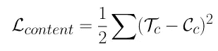

# 用风格转移让深度学习成为你的艺术家

> 原文：<https://towardsdatascience.com/making-deep-learning-your-artist-with-style-transfer-4854055f79b7?source=collection_archive---------42----------------------->

> "风格是我们每个人已经拥有的东西，我们需要做的只是找到它."— **黛安·冯·芙丝汀宝**

由[马修·科莫伊](https://unsplash.com/@alienwannabe?utm_source=medium&utm_medium=referral)在 [Unsplash](https://unsplash.com?utm_source=medium&utm_medium=referral) 上拍摄的照片

为了用 CNN 对图像进行分类，我们需要首先提取特征，然后将这些特征输入到我们的分类器中。这些特征不仅有助于分类，也有助于图像重建，并且是风格转移和[深度梦境](https://en.wikipedia.org/wiki/DeepDream)的基础。由深度卷积神经网络的进步所驱动的计算机视觉算法已经能够提取图像的纹理、边缘、颜色和其他更高级的特征，并将这些特征融合到另一幅图像中。这个过程就是我们所说的风格转换。

[Tensorflow page](https://www.tensorflow.org/tutorials/generative/style_transfer) 将样式转移定义为:“神经样式转移是一种优化技术，用于获取两个图像——一个*内容*图像和一个*样式参考*图像(如著名画家的作品)——并将它们混合在一起，以便输出图像看起来像内容图像，但以样式参考图像的样式“绘制”

# CNN 和 Images 背景下的内容和风格是什么？

如果我们有几层 CNN 堆叠在一起，随着我们在网络中深入，我们的 CNN 学会从图像中提取更复杂的特征，并在池层的帮助下丢弃那些对我们的图像分类无用的噪声。因此，我们在 CNN 网络中的图像的最后一层将理想地表示图像的内容，其中像像素颜色和纹理这样的细节已经被移除，并且我们留下了表示对象以及它在输入图像中如何排列的高级内容。换句话说，网络较高层中的特征表示被称为内容表示

图像中的样式代表了图像中的纹理、颜色和曲率。风格转移的目的是分离出艺术形象的风格(风格形象)，并将其与内容形象融合或适应，以产生一种新的形象，称为目标形象。

# 我们如何隔离内容和风格？

这篇文章将描述 2014 年 CVPR 题为“使用卷积神经网络的图像风格转换”的论文中使用的方法

VGG19 架构([来源](https://www.researchgate.net/publication/325137356_Breast_cancer_screening_using_convolutional_neural_network_and_follow-up_digital_mammography))

仔细观察上面的网络，可以看到它是由 5 个由最大汇集层分隔的 2 或 4 个卷积层堆叠而成。每个堆叠中的层的深度是标准值，但是深度随着堆叠从 64 增加到 512。网络通常接受彩色图像。在我们的例子中，彩色图像是内容图像、风格图像和目标图像。本文利用了来自 **conv4_2 层的特征响应。**可以使用任何更深的层，并且仍然获得一些好的结果。该算法的目标之一是最小化内容表示和我们想要产生的实际新艺术图像之间的差异。也就是说，新样式的图像(目标表示)和原始内容图像彼此非常接近，网络几乎会将它们视为同一图像。损失被表示为内容表示和目标表示的平均差。

由于我们使用预训练的 VGG19 网络，我们不需要进行任何训练来提取特征。我们只需要将内容和目标图像输入到网络优化中，使得它们之间的平均差异尽可能地接近。应该注意，我们的内容图像的内容表示没有改变。然而，目标图像的内容表示将继续改变，直到内容损失被最小化。

表示图像的样式有点复杂，但和前面讨论的内容表示一样简单。

通过计算每一层的相关性(相似性)来找到风格表示？每一层的相关性由一个 [Gram 矩阵给出。](https://en.wikipedia.org/wiki/Gramian_matrix)让我们记住最大池层的工作是丢弃每个连续层的样式。因此，我们在丢弃发生之前获取特征图。

## **如何求克矩阵**

让我们举一个例子，我们有一个 8*8 的图像与 20 个特征图或内核卷积。结果输出将是 20*8*8。这意味着我们有 20 个特征图，我们想找到它们之间的相关性。为了找到这种相关性，我们首先需要对该特征图中的值进行矢量化(或多或少地将 20*8*8 的 3 维重新成形为 2 维)。因为我们有 20 个 8*8 的向量，所以我们展平 8*8 图像的 x 和 y 维度，以给出 1*64 的长度，其现在表示特征地图。堆叠 20 行 1*64 的特征地图将得到 20*64 的特征地图。现在，通过将 20*64 特征图与其转置相乘来给出 gram 矩阵，以给出 20*20 矩阵，该矩阵是我们的特征图的非局部化信息，其在正交空间中是不相关的。从上面我们可以看出，Gram 矩阵的维数只是一个平方矩阵，其维数是特征图的数目，并且不依赖于输入图像的维数。

Gram 矩阵的 x 行和 y 列简单地表示了图层中第 x 个和第 y 个特征图之间的相关性。由此，gram 矩阵的对角线将简单地具有相关值 1，因为在这种情况下，我们正在寻找特征图和它本身之间的相似性。

风格损失简单地被给定为我们的风格图像和目标图像的 gram 矩阵之间的均方差之和。目标是最小化这种差异。再次，表示样式图像的样式表示的样式图像的 gram 矩阵不变。然而，目标图像的样式表示将继续改变，直到目标被最小化。

每层中的权重 w 是给出某种偏好的值(根据层的不同，权重更大或更小)

上面给出的总损失函数是样式损失和内容损失的权重之和。但是，这两种损失的计算方式不同，大小也不同。因此，内容损失可能会对我们的目标图像产生更大的影响，我们希望确保这两种损失对最终目标图像的影响几乎相等。α和β在原始论文中被引入作为权重，用于使总权重显示内容损失和风格损失之间的平衡。实际上，β值总是比α值大。α-β比率越低，我们的最终目标图像将越有风格，因为这意味着在这种情况下β具有非常高的幅度。因此，Alpha 和 beta 是超参数，我们可以根据图像的类型和我们想要的结果输出风格来调整和选择。

对于本文中给出的例子，选择α为 1，β为 0.00001。

## 初始化目标图像

再次需要注意的是，目标形象是我们想要产生的新的艺术形象。我们可以使用任何随机噪声值来初始化图像，或者使其成为恒定的彩色图像或具有 0 的行和列的黑色图像，或者具有 1 的行和列的白色图像。在这项工作中，目标映像已经用内容映像的副本进行了初始化。

# 一些结果

下面的结果显示了我们试图实现最小化目标时的优化过程示例。我们会看到，如下图所示，这种风格正在逐渐被学习并在内容图像上进行调整。

最终的样式图像如下所示:

用于这项工作的代码可以在[这里](https://github.com/jimohafeezco/style_transfer)找到

## 最后一点:风格转移的应用

*   照片和视频编辑:我实际上已经使用了几个移动应用程序将样式应用到我的图像中，事实上，深度学习原理在这里很方便，它让我们了解后台可能发生的事情。
*   商业艺术:[这里](https://dl.acm.org/doi/abs/10.1145/2897824.2925968)是另一篇有用的论文，题为“使用卷积神经网络的头像绘画风格转换”
*   游戏:你会发现[这个视频](https://www.youtube.com/watch?v=K4610QkRCnI)很有趣，视频游戏看起来像另一个有风格转移的游戏。这里是另一个引人入胜的[视频](https://www.youtube.com/watch?v=yF1bZiH-wJQ)及其[文章](https://twinfinite.net/2019/03/google-stadia-action-demo-videos/)。
*   虚拟现实:这是一份报告的参考文献,展示了它在虚拟现实中的应用

## 参考

1.  Gatys、Leon A .、Alexander S. Ecker 和 Matthias Bethge。"使用卷积神经网络的图像风格转换."*IEEE 计算机视觉和模式识别会议论文集*。2016.
2.  Tensorflow 关于风格传递的文档:[https://www . tensor flow . org/hub/tutorials/tf2 _ arbitrary _ image _ stylization](https://www.tensorflow.org/hub/tutorials/tf2_arbitrary_image_stylization)
3.  郑，于峰，Clifford Yang 和 Alex Merkulov。“使用卷积神经网络和后续数字乳腺摄影进行乳腺癌筛查。”*计算成像 III* 。第 10669 卷。国际光学与光子学会，2018。
4.  用神经网络风格转移让《我的世界》看起来像其他游戏:[https://www.youtube.com/watch?v=K4610QkRCnI](https://www.youtube.com/watch?v=K4610QkRCnI)
5.  EE267 虚拟现实，2018 春季 Style Transfer for VR:[http://Stanford . edu/class/ee 267/Spring 2018/report _ lei _ Castillo . pdf](http://stanford.edu/class/ee267/Spring2018/report_lei_castillo.pdf)
6.  Google Stadia-Style Transfer ML 演示:【https://www.youtube.com/watch?v=yF1bZiH-wJQ 
7.  观看令人印象深刻的演示视频中的谷歌 Stadia 将于 2019 年推出:[https://twin finite . net/2019/03/Google-stadia-action-demo-videos/](https://twinfinite.net/2019/03/google-stadia-action-demo-videos/)
8.  使用卷积神经网络的头像绘画风格转换:[https://dl.acm.org/doi/abs/10.1145/2897824.2925968](https://dl.acm.org/doi/abs/10.1145/2897824.2925968)