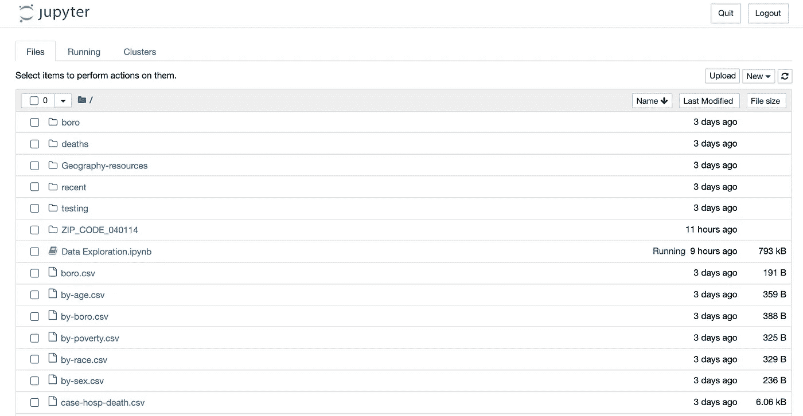
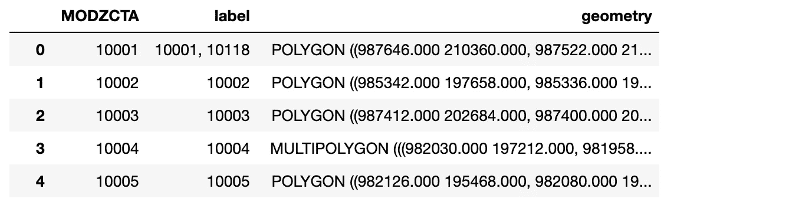
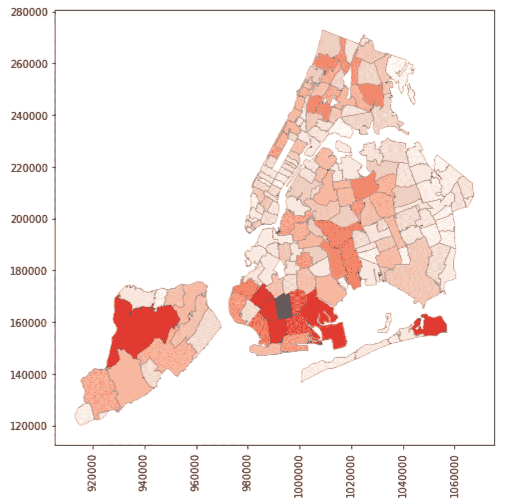
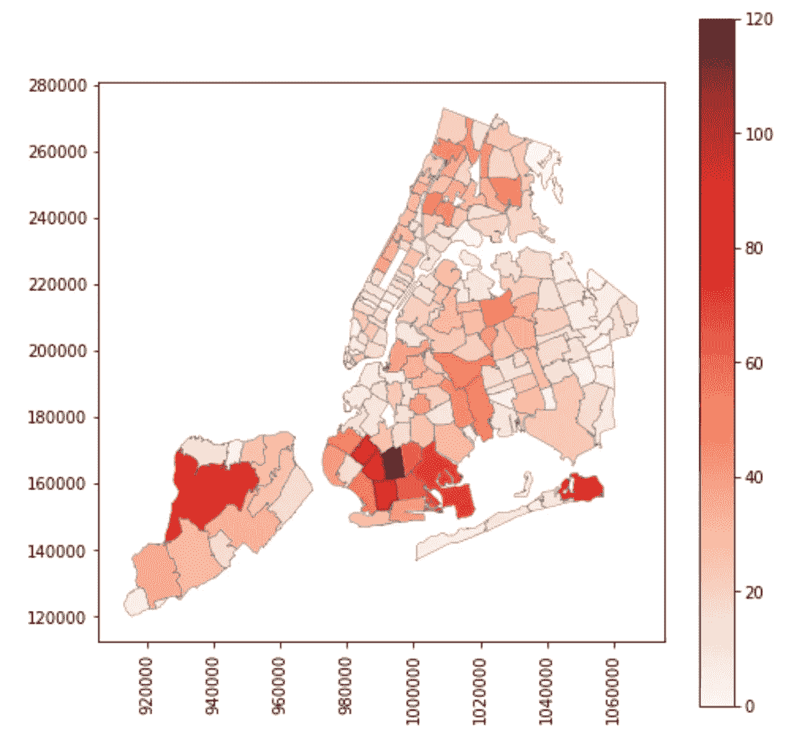
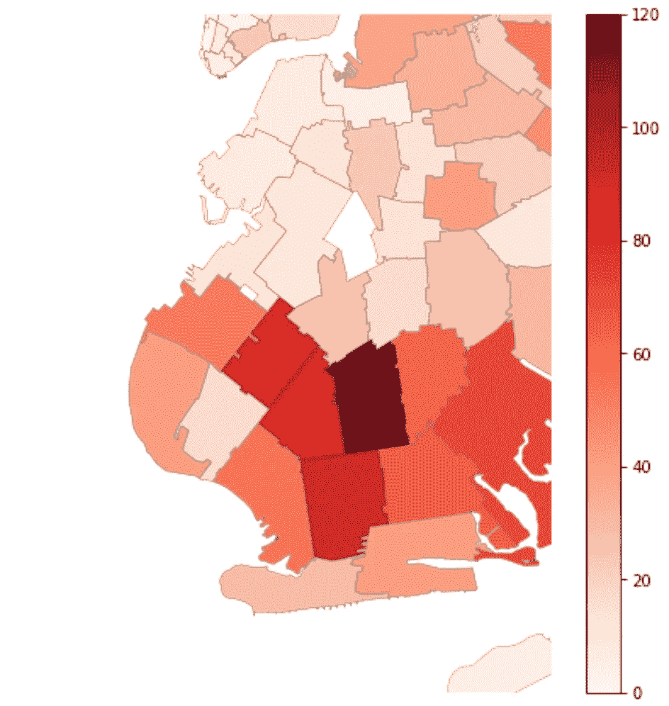

# 用文字地图制作热图:如何使用 Python 构建一个 Chloropleth

> 原文：<https://towardsdatascience.com/making-heat-maps-with-literal-maps-how-to-use-python-to-construct-a-chloropleth-6b65e4e33905?source=collection_archive---------6----------------------->

你有没有读过一篇新闻文章，读到一半时，你看到了一幅文章所讨论的任何内容的漂亮的图形表示？它是完美的——这是一张地理地图，某些区域阴影的深浅对应于该区域特定统计趋势的存在或强度。你心里想，“哇，真不错。我真的理解为什么他们说一张照片胜过千言万语。因为这篇文章只花了我五分钟的时间告诉我一些我可以单独从这张图中收集到的东西。强大。我敢打赌，你必须是某种数学奇才或计算机天才，才能弄明白如何制作其中的一个。”

我很高兴告诉你一些关于这个时刻的事情。第一，我完全同意你的观点；这些图表很简洁。它们被称为氯普图，它们可以提供大量的信息。你可能会比你意识到的更经常地看到这些(我们正处于美国最激烈的选举季节，所以我觉得我每周都要被它们轰炸好几次)。第二，你不需要成为一名电脑大师来制造一台电脑；事实上，用一些基本的 Python 技巧就可以很容易地构建它们。在博客的其余部分，我将向你展示如何制作这样一个图表，这样你就可以给你所有的朋友留下深刻印象。本指南将假设您对 Python 和 Pandas 包有基本的了解(如果您没有，您真正需要知道的是如何从您的计算机上打开一个 Jupyter 笔记本，并用您的计算机终端导航到文件夹；理论上你可以复制粘贴剩下的部分)。

**第一步:安装 Geopandas**

所以你需要做的第一件事就是安装一个名为 *Geopandas 的新 python 包。*这基本上只允许我们导入形状文件，并使用 Python 绘制图形。要安装 *Geopandas* ，只需在您的终端中运行以下代码行:

```
conda install geopandas
```

您将看到软件包下载，好消息，您已经上路了！

**第二步:获取一些数据**

接下来，我们要下载一些数据来使用。你想做什么地图？！因为我住在纽约州的布鲁克林，而且这里每个人脑子里无处不在的话题是新冠肺炎，所以我将使用我在下面的 GitHub 页面上找到的一些最近的测试数据:[https://github.com/nychealth/coronavirus-data](https://github.com/nychealth/coronavirus-data)

具体来说，我将使用每个邮政编码最近的正 COVID 测试率，并将它们绘制在纽约市的地图上，该地图恰好按邮政编码划分。

您确实可以使用任何您想要的数据，但是对于您自己的修补，您至少需要在您的数据中有一个. csv 文件和一个. shp 文件。第一个是您想要使用的类似电子表格的实际数据列表，第二个是实际绘制地图的形状文件。你要确保你的。csv 文件。shp 使用相同的惟一键对地区进行分类(在我的例子中，这些惟一的地区是邮政编码)。将这些文件下载到计算机后，打开终端，导航到包含这些项目的相应文件夹，然后运行以下代码:

```
jupyter notebook
```

您应该会看到类似下图的内容。只是为了检查一下你的。csv 和。shp 文件应该列在屏幕的左侧:



在这个页面中，通过点击右上角的“new”按钮创建一个新的 Python 笔记本，我们终于可以开始构建我们的图表了。

**第三步:导入 Python 中的相关包和文件**

在我们的笔记本中，我们希望首先导入相关的 Python 包和我们下载的数据。为此，请使用以下代码:

```
# import relevant packages
import geopandas as gpd
import pandas as pd
import matplotlib.pyplot as plt# import relevant data
nyc_map = gpd.read_file("Geography-resources/MODZCTA_2010.shp")
stats=pd.read_csv("recent/recent-4-week-by-modzcta.csv")
```

如果您使用自己的数据，只需确保用您实际的文件路径/名称替换最后两行中引号内的文本。作为参考，分配包含在我的。csv 文件中的数据保存到名为“stats”的变量中。shp 文件保存到名为“nyc_map”的变量中。如果您要查看我们刚刚导入的任何一个文件，它们看起来会像这样:


我的。csv 文件



我的。shp 文件

这里我想让大家注意两件事。首先，浏览一下我的“几何”专栏。shp 文件。你会看到它看起来有点像一个坐标列表。差不多就是这样。存储在该列中的是 Geopandas 绘制一个形状(或者在我们的例子中是多个形状)所需的所有几何数据。其次，检查“MODZCTA”列，注意这个列出现在我的文件的*和*中。这些是我前面提到的唯一的区域键，它们很重要，因为它们允许我们将。csv 文件中的几何数据。shp 文件。

**第四步:准备绘图数据**

那么，我们如何执行这种数据婚姻呢？我们将通过合并两个表来创建一个包含地理和统计数据的新数据框架。我们使用以下代码来执行此操作:

```
map_and_stats=nyc_map.merge(stats, on="MODZCTA")
```

在这里，我把我的“纽约市地图”数据(的。shp 文件)，并使用“MODZCTA”列中的邮政编码，附加我的“stats”中的所有数据。csv 文件)。我将这个新表命名为“map_and_stats”(我知道这很有想象力)。我们可以看看新的数据框来验证:


我的组合“地图和统计”数据框架

看看吧，我们现在把所有信息都放在一个地方了。我们准备好策划了。

**第五步:绘制数据**

好了，我们一直在等待的时刻，我们数据的实际绘图。首先，我们要建立我们的情节和大小(我使用 8“x8”大小)。我还将把我们的 x 轴标签旋转 90 度，只是为了让内容更具可读性。我们用下面的代码实现了这一点:

```
fig, ax = plt.subplots(1, figsize=(8, 8))
plt.xticks(rotation=90)
```

接下来，我们希望专门绘制上一步中连接的新数据帧中的数据。具体来说，我想看看我的数据中名为“最新利率”的一栏。您可以在这里调整其他属性(线条粗细、阴影颜色等。)，但我会把它留给你们去玩。该图形的代码如下:

```
map_and_stats.plot(column="Latest Rates", cmap="Reds", linewidth=0.4, ax=ax, edgecolor=".4")
```

当我们执行此操作时，会得到下图:



纽约市的 COVID 检测率

很酷，是吧？我们也可以做一些装饰。标题、轴标签等。可以像添加其他支线剧情一样添加，但是让我们在这里添加一个颜色标尺，这样我们就可以告诉人们这些红色的阴影实际上意味着什么。我们可以通过下面的代码实现这一点:

```
bar_info = plt.cm.ScalarMappable(cmap="Reds", norm=plt.Normalize(vmin=0, vmax=120))
bar_info._A = []
cbar = fig.colorbar(bar_info)
```

您需要注意的是，色阶的界限是通过上面看到的“vmin”和“vmax”属性设置的。在我的数据中，最大的阳性测试率大约是 100，所以我决定将我的最大值设为 120。在任何情况下，如果您现在绘制图表，您可以看到以下内容:



纽约市使用色标的 COVID 测试率

哇，看看我们看起来多专业。我们有了这张图，但是假设我对其中的某个部分感兴趣。再说一次，我住在布鲁克林，所以也许我想放大那个地区。我们可以通过在图表上设置 x 和 y 的极限来达到这个目的。你可以在轴上看到，我们有类似坐标的数字，Geopandas 用来绘制我们的地图。我们使用这些相同的坐标来有效地放大感兴趣的区域。我要查看的区域在 x 轴上介于 970000 和 1010000 之间，在 y 轴上介于 140000 和 200000 之间，因此我将使用以下代码将我们的图像限制在这些范围内(然后出于美观的原因关闭我们的轴):

```
ax.set_xlim(970000, 1010000)
ax.set_ylim(140000, 200000)
ax.axis("off")
```

当我们执行时，我们得到下面的图形:



布鲁克林的 COVID 测试率与色标

太棒了，对吧？现在你要做的就是保存你的形象，打印出来，向你所有的朋友和家人吹嘘你有多专业。