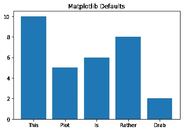
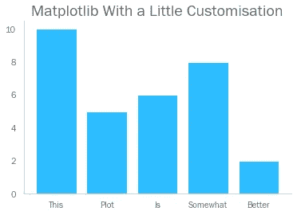
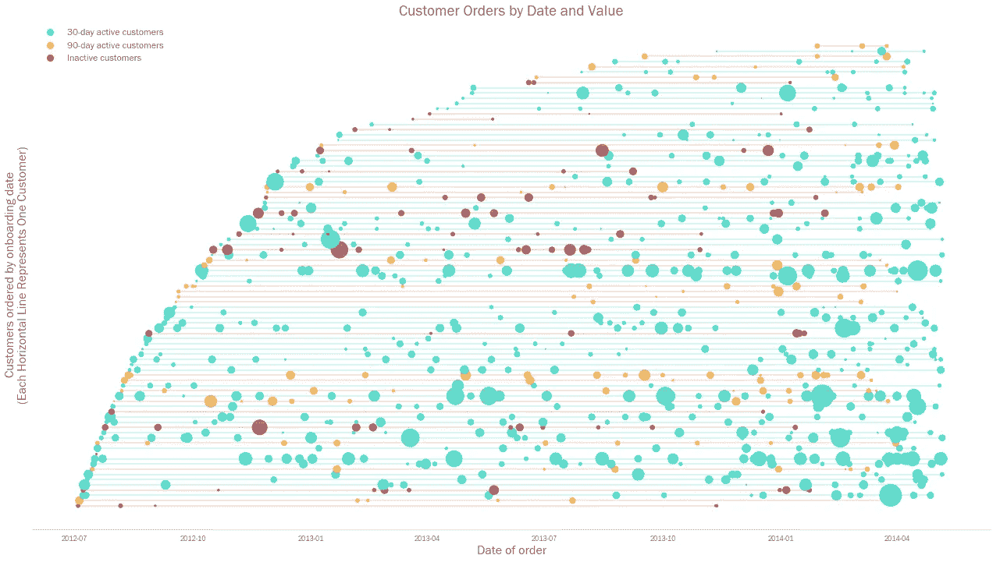
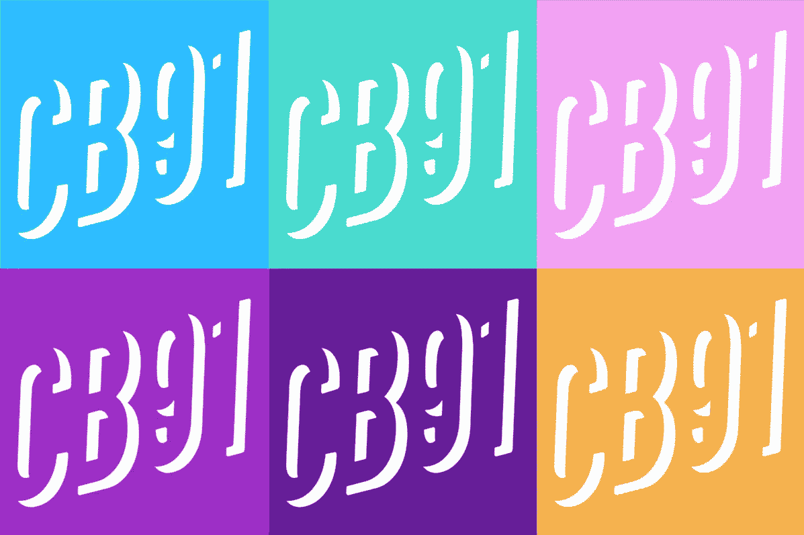
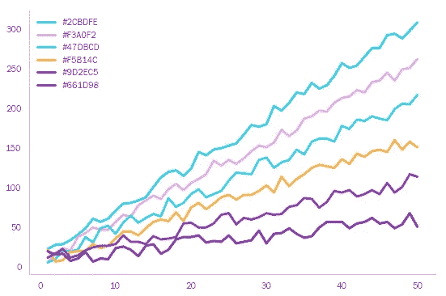
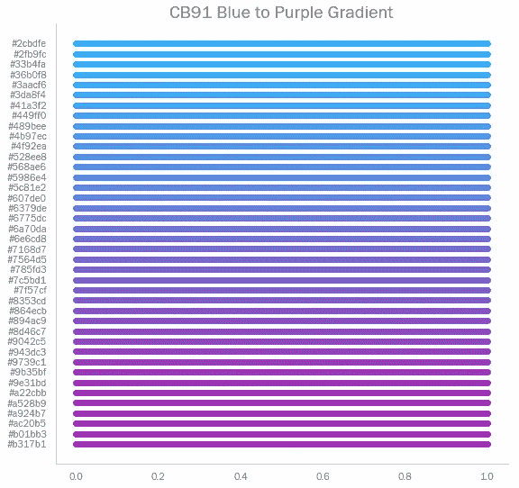
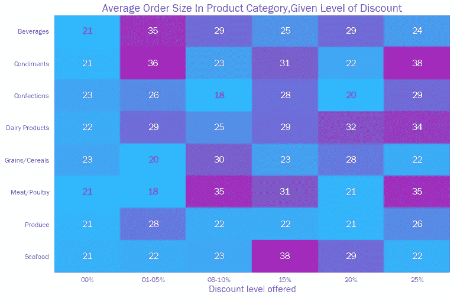
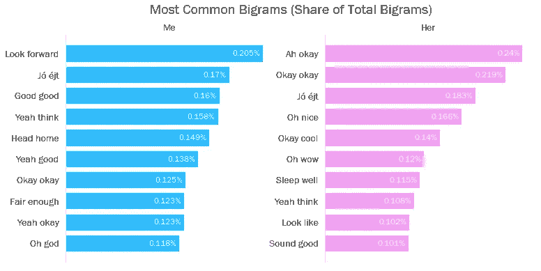

# 默认情况下使 Matplotlib 美观

> 原文：<https://towardsdatascience.com/making-matplotlib-beautiful-by-default-d0d41e3534fd?source=collection_archive---------7----------------------->

## 使用 Seaborn 来控制 Matplotlib 默认值(永远忘记蓝色的阴影)


我的网站的背景图片——用 Matplotlib 创建

如果你曾经用 Python 做过数据可视化，那么你很可能用过 Matplotlib。这是一个意见分歧的方案。一些概念上简单的可视化需要惊人数量的代码来生成。在这个时代，人们希望能够与图表进行交互——这是普通 Matplotlib 所不具备的。而且，也许最重要的是，Matplotlib 图表通常看起来很简单*不好。*

诚然，默认的 Matplotlib 设置可以让你的视觉效果看起来很简单，如果不是有点过时的话(如果我们很大方的话)。它默认的蓝色阴影萦绕在许多数据科学家的梦中。



然而，Matplotlib 被低估的一个方面就是它的可定制性。远离上面的例子，您可以创建非常复杂的视觉效果(不可否认，这个例子需要许多行代码，并且大部分数据科学家很少有时间)。



更重要的是，我们可以编写一些相关的代码来设置默认的视觉设置。我们可以变得非常精细。不想让那个讨厌的盒子围着每一个情节？默认去掉。想使用你品牌的调色板，而不必每次都指定十六进制代码*？默认设置它们。想在所有图表标签中使用漫画字体吗？寻求专业帮助(尽管你也可以默认设置，如果你坚持的话)。*

# *处理色彩*

*尽管 Matplotlib 中有[命名的颜色(如众所周知的颜色‘bisque’，‘lavender blush’和‘lightgoldendoryellow’)，但绘图也将采用十六进制代码形式的颜色。如果我们想使用自定义调色板，这尤其有用。例如，我的 CB91 品牌使用一组预定义的颜色。](https://matplotlib.org/3.1.0/gallery/color/named_colors.html)*

**

*我们可以将它们设置为变量，将它们的六进制作为字符串传递:*

```
*CB91_Blue = '#2CBDFE'
CB91_Green = '#47DBCD'
CB91_Pink = '#F3A0F2'
CB91_Purple = '#9D2EC5'
CB91_Violet = '#661D98'
CB91_Amber = '#F5B14C'*
```

> *注意——如果你想创建自己的调色板，网上有一些有用的工具可以帮助你。Colormind.io 特别酷——它使用深度学习从照片、电影和流行艺术中学习颜色风格，从而推荐搭配良好的色调和阴影。此外，我可以确认，作为一个英国人，在“颜色”和“色彩”之间不分青红皂白地切换已经导致了我这段时间内一些令人深感烦恼的代码错误。*

*我们可以将这些定义的颜色放入一个列表中，然后将这个列表传递到 Matplotlib 的颜色“cycler”中。*

```
*color_list = [CB91_Blue, CB91_Pink, CB91_Green, CB91_Amber,
              CB91_Purple, CB91_Violet]plt.rcParams['axes.prop_cycle'] = plt.cycler(color=color_list)*
```

*现在，它将使用“CB91_Blue”作为笔记本中所有绘图的默认图表颜色，并在创建多类别绘图时按顺序在颜色列表中循环。*

**

*你也可以使用十六进制颜色列表来定义渐变，这可以在任何地方使用，只要 [viridis](https://matplotlib.org/3.1.1/gallery/color/colormap_reference.html) 是一个有效的条目(例如 Seaborn heatmaps)。当然，为了让这些渐变更好更平滑，你需要在列表中定义很多十六进制值(根据我的经验，至少 40 个)。手动创建这么长的列表可能会很痛苦——我建议使用类似 [colordesigner.io](https://colordesigner.io/gradient-generator) 这样的网站自动生成一个列表(只需选择你希望渐变过渡的颜色，最大化渐变步骤的数量，然后从结果 HTML 中提取十六进制代码)。*

> ***编辑:**彼得·卡希尔写了一个 Python 函数，可以在两个颜色六边形之间用 n 步生成渐变列表——请看下面这篇博客的回复。*

*这是我品牌的两种颜色之间的渐变示例，以及它们在 matplotlib 图表上的外观。*

```
***#A list of hex colours running between blue and purple**
CB91_Grad_BP = ['#2cbdfe', '#2fb9fc', '#33b4fa', '#36b0f8',
                '#3aacf6', '#3da8f4', '#41a3f2', '#449ff0',
                '#489bee', '#4b97ec', '#4f92ea', '#528ee8',
                '#568ae6', '#5986e4', '#5c81e2', '#607de0',
                '#6379de', '#6775dc', '#6a70da', '#6e6cd8',
                '#7168d7', '#7564d5', '#785fd3', '#7c5bd1',
                '#7f57cf', '#8353cd', '#864ecb', '#894ac9',
                '#8d46c7', '#9042c5', '#943dc3', '#9739c1',
                '#9b35bf', '#9e31bd', '#a22cbb', '#a528b9',
                '#a924b7', '#ac20b5', '#b01bb3', '#b317b1']*
```

**

# *调整轴*

*Matplotlib 最好的特性之一是一个完全不同的包； [Seaborn](https://seaborn.pydata.org/) 。Seaborn 是一个使用 Matplotlib 作为基础的库，是创建更复杂图表类型的好方法，比如用一两行代码创建[热图](https://seaborn.pydata.org/examples/heatmap_annotation.html)、[小提琴](https://seaborn.pydata.org/examples/wide_form_violinplot.html)和[联合图表](https://seaborn.pydata.org/examples/joint_kde.html)。*

**

*一个 Seaborn 热图的例子，它可以接受十六进制颜色列表作为它的 cmap 参数。*

*Seaborn 的一个鲜为人知的特性是它能够使用。set()方法。这是一个整理绘图的好方法，可以改变坐标轴的颜色和粗细(或者完全删除它们)以及默认字体。我们也可以使用。set_context()方法来微调字体大小设置。*

*下面是我如何使用所有这些的一个例子(一个完整的列表，列出了您可以使用。set()方法可以在 Matplotlib 的[自带教程中找到关于此事的](https://matplotlib.org/3.2.1/tutorials/introductory/customizing.html))。*

```
***import** matplotlib.pyplot **as** plt **import** seaborn **as** snssns.set(font=’Franklin Gothic Book’,
        rc={
 ‘axes.axisbelow’: False,
 ‘axes.edgecolor’: ‘lightgrey’,
 ‘axes.facecolor’: ‘None’,
 ‘axes.grid’: False,
 ‘axes.labelcolor’: ‘dimgrey’,
 ‘axes.spines.right’: False,
 ‘axes.spines.top’: False,
 ‘figure.facecolor’: ‘white’,
 ‘lines.solid_capstyle’: ‘round’,
 ‘patch.edgecolor’: ‘w’,
 ‘patch.force_edgecolor’: True,
 ‘text.color’: ‘dimgrey’,
 ‘xtick.bottom’: False,
 ‘xtick.color’: ‘dimgrey’,
 ‘xtick.direction’: ‘out’,
 ‘xtick.top’: False,
 ‘ytick.color’: ‘dimgrey’,
 ‘ytick.direction’: ‘out’,
 ‘ytick.left’: False,
 ‘ytick.right’: False})sns.set_context("notebook", rc={"font.size":16,
                                "axes.titlesize":20,
                                "axes.labelsize":18})*
```

# *把所有的放在一起*

*当然，如何构建回购是一件非常私人的事情。我发现把所有讨论过的代码放在一个 Jupyter 笔记本的顶部会很不整洁——特别是当你需要设置多个不同的渐变和它们相关的 40+十六进制代码列表的时候。此外，如果您在一个 repo 中有多个笔记本，如果您想要对可视化默认设置进行更改，保持一致性可能是一件痛苦的事情。*

*为了解决这些问题，我喜欢将所有与可视默认值相关的代码保存在 repo 中其他地方的一个单独的 python 文件中(名为' *cb91visuals.py* ')，然后将它们作为标准导入的一部分导入到每个笔记本的顶部。因此，所有乱七八糟的十六进制代码列表都是隐藏的，如果您确实需要进行编辑，只需在一个地方完成，更改会根据需要自动反映在任何地方。*

```
****#Bring in data visualisation libraries as usual***
**import** matplotlib.pyplot **as** plt
%matplotlib inline
**import** seaborn **as** sns***#Bring in our custom settings
#Assumes that cb91visuals.py is in the repo's root folder*
from** cb91visuals **import** **
```

# *杂项提示*

*还有一些我经常使用的不太为人所知的 Matplotlib/Seaborn 命令。我倾向于不将它们设置为默认值，但是它们仍然很有用。*

*   ***图例框架:**图例周围的小方框通常是不必要的，会增加视觉上的混乱。这些可以通过以下方式关闭:*

```
*plt.legend(frameon=**False**)*
```

*   ***去自旋:**有时候我们想要移除一个轴，比如在条形图上。这是通过 Seaborn 的 despine 方法完成的(根据需要指定左、右、上或下):*

```
*sns.despine(left=**True**, bottom=**True**)*
```

*   *条形图上的数字标签:一个应该作为软件包的一部分提供的特性，你可以用 for-looping 和 Matplotlib 在条形图顶部添加数字标签。text()方法。例如，下面的代码…*

```
****#Here, 'labels' refers to the bigrams on the y-axis
#i.e. 'Look forward', 'Jó éjt', etc.
#and X is the list of values determining bar length******#Loop through these labels***
for n, i in enumerate(labels): #**Create an axis text object**
    ax.text(X[n]-0.003, ***#X location of text (with adjustment)***
            n, ***#Y location***
            s=f'{round(X[n],3)}%', ***#Required label with formatting***
            va='center', ***#Vertical alignment***
            ha='right', ***#Horizontal alignment***
            color='white', ***#Font colour and size***
            fontsize=12)*
```

*…将数字标签放在水平条形图上，例如几周前我的博客中的[图。注意，为此我还使用了 sns.despine()方法来移除 x 轴，并传递了 plt.xticks([])来移除轴刻度。](/how-happy-is-my-girlfriend-be895381d7c2)*

**

**感谢一路看完博客！我很乐意听到任何关于以上的评论，或者这篇文章涉及的任何概念。如果你还有其他的 Matplotlib 小技巧和窍门，欢迎在下面留言，或者通过*[*LinkedIn*](https://www.linkedin.com/in/callum-ballard/)*联系我。**