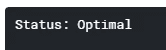

# 让麦当劳健康

> 原文：<https://towardsdatascience.com/making-mcdonalds-healthy-197f537f931d?source=collection_archive---------40----------------------->

## 用 Python 和 Pulp 实现数学优化的方法


Joiarib Morales Uc 在 [Unsplash](https://unsplash.com?utm_source=medium&utm_medium=referral) 上拍摄的照片

> 麦当劳是一个超级健康的选择！没有人曾经

如果你问任何人他们对在麦当劳吃饭的感觉，标准的回答是他们喜欢吃，但知道他们不应该一直吃。麦当劳被吹捧为众所周知的不健康，甚至导致摩根·斯普尔洛克拍摄了一部名为[超码我](https://www.imdb.com/title/tt0390521/)的纪录片，讲述了每天在麦当劳吃饭如何导致非常严重的健康问题。

这是我的问题。当然，如果你一天吃三个巨无霸，你的心脏会爆炸，但这可能是许多餐馆的真实情况。我想要确定的是

> 麦当劳菜单项目的最佳组合实际上严格遵循了一些营养指南

这种健康组合会是什么样的呢？

为此，我求助于*线性优化*和 *python* 的威力。我们要彻底解决这个问题，所以坐好！

# **数据和假设**

这个旅程的第一步是从麦当劳找到菜单数据。我看了一下 Kaggle，这是一个数据科学网络平台，有许多有趣的开源数据集。快速搜索之后，我可以很容易地找到一份表格格式的完整菜单[1]。它包括卡路里的数量、食物的种类(饮料、汉堡等)以及所有的宏量营养素，如钠、脂肪的含量。

第二部分是找到一个合法的来源，告诉我们什么是健康饮食。另一个快速的谷歌搜索，我能够找到 NHS 提供的营养分类。按照他们的说法，一个普通人每天需要的基本消耗量是:

> 能量:约 2000 千卡
> 
> 总脂肪:< 70 g (Saturated < 20g)
> 
> Carbohydrates >260 克
> 
> 糖:约 90 克+-10 克
> 
> 蛋白质:约 50 克+-10 克
> 
> 钠:< 6g

So now I have the menu and I have my nutrition targets. The question is how do I find the optimal combination of meal items to be health? Well, this is where the magic of Linear Programming comes in. It’s a nice technique that is adaptable to this problem and implemented in the **浆**蟒包。我们真正需要知道的是你的极限是什么(上面的营养数据)和我们的变量宇宙(麦当劳的菜单项目)。谁渴望…真相！

# 篡改数据

首先，我们确保已经使用我们的老朋友 **pip:** 在 python 中安装了**纸浆**包

```
pip install **pulp**
```

安装完成后，我们可以继续导入我们的软件包:

```
import numpy as np
import pandas as pd
from pulp import *
import plotly.plotly as py
from plotly.offline import init_notebook_mode, iplot
init_notebook_mode(connected=True)
import plotly.graph_objs as go
import matplotlib.pyplot as plt # matplotlib
import os 
```

接下来，我们将简单地将数据集加载到 pandas 数据框对象中:

```
McData = pd.read_csv('../input/menu.csv')
```

只是为了好玩，我们可以使用 Plotly 包来了解数据。让我们来看一张*碳水化合物与卡路里*的图表，按菜单项类型进行着色。为此，我将首先定义一个新函数，用 **Plotly:** 制作一个散点图

```
**# The function creates a Scatter graph object (go) and uses the data frame .isin() selection to extract the requested information**
def make_scatter(McData,category,x_cat,y_cat):
    return  go.Scatter(
       x = McData[McData['Category'].isin([category])][x_cat],
       y = McData[McData['Category'].isin([category])][y_cat],
       mode = "markers",
       name = category,
       text=  McData.Item)
```

现在我们可以看看几个相互关系。正如我上面所说，让我们找到*卡路里与碳水化合物*:

```
**# Define our categories to plot** x_cat = 'Calories'; y_cat = 'Carbohydrates'**# Create a list of scatter plots to view all at once** data = [make_scatter(McData,cat,x_cat,y_cat) for cat in
   McData.Category.unique().tolist()]**# Define the plot layout (title, ticks etc.)**
layout = dict(title = 'McDonalds Nutrition',
   xaxis= dict(title= 'Calories',ticklen=5,zeroline= False),
   yaxis= dict(title= 'Carbohydrates(g)',ticklen= 5,zeroline=False))**# Finally we will plot the data with the layout**
fig = dict(data = data, layout = layout)
iplot(fig)
```


似乎相当线性！

让我们再做一个。*钠 vs 脂肪*怎么样？


又是一个很好的线性关系！

现在我们对数据有了一个概念，我们可以继续设置优化代码来帮助我们从变量(菜单项)的离散集合中进行选择。

我们将使用线性规划作为优化方法。我在这里不再赘述细节，但当目标函数中没有高阶相关性时，这是一种非常快速的计算方法。

首先要做的是定义我们的**目标函数。目标是我们试图最小化或最大化的东西。在这种情况下，假设我们想摄入所有的营养常量营养素，但是，我们也想减少卡路里。**

> 我们的目标是尽量减少卡路里

接下来，我们必须定义我们的约束。因为我们知道每天的摄入量应该基于什么[2]，我们可以将它们作为优化的约束条件。在一个完美的世界中，你将消耗零卡路里并获得所有需要的营养(显然这在许多方面是不现实的)，因此为了将这一点纳入优化，我们定义如下:

将数据转换为字典，这是约束变量进入优化函数的方式:

```
**# Convert the item names to a list**
MenuItems = McData.Item.tolist()**# Convert all of the macro nutrients fields to be dictionaries of the item names**
Calories = McData.set_index('Item')['Calories'].to_dict()
TotalFat = McData.set_index('Item')['Total Fat'].to_dict()
SaturatedFat = McData.set_index('Item')['Saturated Fat'].to_dict()
Carbohydrates = McData.set_index('Item')['Carbohydrates'].to_dict()
Sugars = McData.set_index('Item')['Sugars'].to_dict()
Protein = McData.set_index('Item')['Protein'].to_dict()
Sodium = McData.set_index('Item')['Sodium'].to_dict()
```

如果我们打印出来，约束的格式应该是这样的；例如，钠:


约束字典的输出示例

现在我们已经有了正确格式的所有数据，我们可以继续设置优化器了！

# 设置优化器

在本例中，我们正在进行 ***最小化*** 优化:

```
**# Set it up as a minimization problem**
prob = LpProblem("McOptimization Problem", LpMinimize)
```

此外，我们可以告诉优化器我们只对整数解感兴趣。即。我们会说一个项目只有 0.5 是不可能的(没有半个芝士汉堡)。除此之外，我们还可以为解决方案选择最大和最小数量的项目:

```
MenuItems_vars = LpVariable.dicts("MenuItems",MenuItems,**lowBound=0**,
   **upBound=10**,cat='**Integer**')
```

你看到我们如何给出 0 的下界和 10 的上界了吗？如果我们不这样做，菜单上可能会有 ***负*** 项。这就像通过…把你吃的东西还给你来抵消它。*咱们别这样。然而上限有点宽松，只是说我们不会购买超过 10 的单一项目。*

*此时，我们可以继续将约束输入到运行中:*

```
***# First entry is the calorie calculation (this is our objective)**
prob += lpSum([Calories[i]*MenuItems_vars[i] for i in MenuItems]),
   "Calories"**# Total Fat must be <= 70 g**
prob += lpSum([TotalFat[i]*MenuItems_vars[i] for i in MenuItems]) <=
   70, "TotalFat"**# Saturated Fat is <= 20 g**
prob += lpSum([SaturatedFat[i]*MenuItems_vars[i] for i in
   MenuItems]) <= 20, "Saturated Fat"**# Carbohydrates must be more than 260 g**
prob += lpSum([Carbohydrates[i]*MenuItems_vars[i] for i in
   MenuItems]) >= 260, "Carbohydrates_lower"**# Sugar between 80-100 g**
prob += lpSum([Sugars[i]*MenuItems_vars[i] for i in MenuItems]) >=
   80, "Sugars_lower"
prob += lpSum([Sugars[i]*MenuItems_vars[i] for i in MenuItems]) <=
   100, "Sugars_upper"**# Protein between 45-55g**
prob += lpSum([Protein[i]*MenuItems_vars[i] for i in MenuItems]) >=
   45, "Protein_lower"
prob += lpSum([Protein[i]*MenuItems_vars[i] for i in MenuItems]) <=
   55, "Protein_upper"**# Sodium <= 6000 mg**
prob += lpSum([Sodium[i]*MenuItems_vars[i] for i in MenuItems]) <=
   6000, "Sodium"*
```

*现在，我们运行求解器(希望)找到超级健康的最佳菜单项集！*

```
***# Tadaaaaa** prob.solve()*
```

*快速检查以确保它确实找到了解决方案:*

```
*print("Status:", LpStatus[prob.status])*
```

**

*休斯顿。我们有健康的麦当劳套餐。*

*终于！我们来看结果！*

```
***# Get the total calories (minimized)**
print("Total Calories = ", value(prob.objective))**# Loop over the constraint set and get the final solution** results = {}
for constraint in prob.constraints:
    s = 0
    for var, coefficient in prob.constraints[constraint].items():
        sum += var.varValue * coefficient
    results[prob.constraints[constraint].name.replace('_lower','')
        .replace('_upper','')] = s*
```

*结果是……*

> *总热量: **1430***

**

*我们的最终优化显示，一个 McHealthy 组合超级超级无聊！*

*有请麦克健康组合！主要是苹果、沙拉和燕麦片。确实很无聊。这表明，粉丝最喜欢的巨无霸和薯条不是超级健康的选择，因为它们富含特定的营养物质和高热量，会破坏整体优化。*

*这是一个非常有趣的项目，所以如果你有任何要求或想法，请让我知道！*

## *参考和链接*

*[1]https://www.kaggle.com/mcdonalds/nutrition-facts*

*[2][https://www . NHS . uk/live-well/eat-well/what-are-reference-摄入量-食品标签/](https://www.nhs.uk/live-well/eat-well/what-are-reference-intakes-on-food-labels/)*

*[3][https://www . ka ggle . com/kapastor/optimizing-McDonalds-nutrition](https://www.kaggle.com/kapastor/optimizing-mcdonalds-nutrition)*