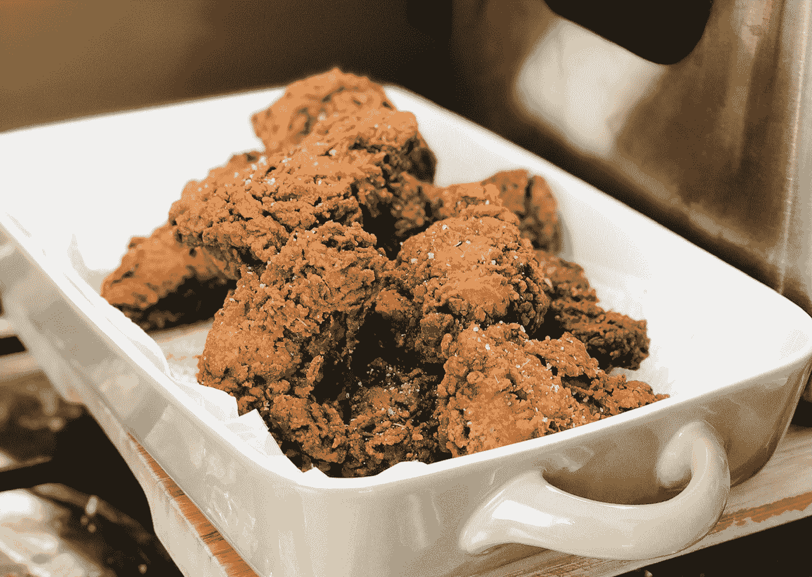

# 制作模型:评估和内核的炸鸡

> 原文：<https://towardsdatascience.com/making-models-estimation-and-the-kernels-fried-chicken-ea3d2934eba3?source=collection_archive---------46----------------------->

## [理解大数据](https://towardsdatascience.com/tagged/making-sense-of-big-data)

由[弗兰基·查马基](https://unsplash.com/@franki?utm_source=medium&utm_medium=referral)在 [Unsplash](https://unsplash.com?utm_source=medium&utm_medium=referral) 上拍摄的照片

当我想到构建数据科学能力时，我经常会回到 Harlan Harris 2011 年的一篇文章。哈里斯提出，数据科学的职业道路是由来自不同学科的从业者定义的，其受欢迎程度与棒球(即钱球)中 sabermetrics 的兴起相同，即在定量分析中应用人才的异国组合可以产生优于直觉的结果。

我倾向于同意；数据科学是一个不寻常的领域。它是深度的(结合了研究方法、统计学、机器学习和计算机科学；大量[定义性](https://en.wikipedia.org/wiki/Data_science) [论文](https://medium.com/hackernoon/what-on-earth-is-data-science-eb1237d8cb37#:~:text=Data%20science%20is%20a%20'concept,analyze%20actual%20phenomena'%20with%20data) [存在](https://www.svds.com/machine-learning-vs-statistics/))和后果性(无论是指导性决策还是构建产品，数百万客户都受到影响)——但它也很容易理解。每一门学科，作为一门独立的专业，都需要数年才能掌握；然而，数据科学作为这些部分的总和似乎更容易参与——如今，新的从业者可以在训练营或 MOOC 后短短三个月内培养出来。

在一个具有如此多样从业者背景的领域中的能力发展引起了有趣的讨论。有多严谨才能在数据科学中有效？一个特别的问题不断出现——我们需要多深地理解一个分析模型的黑箱？

# “但我们正在做所有正确的事情”

蓬勃发展的资源带来了一定程度的效率，一些人认为这消除了学术严谨的必要性。[打包的框架](https://scikit-learn.org/stable/)、[社区平台](https://www.kaggle.com/)和现成的[建模](https://aws.amazon.com/sagemaker/)、[技术](https://www.datarobot.com/)形成了绕过正式培训、直接进入即插即用以获得即时模型满足的诱人主张。任何有网络连接的人都有大量的机会参与分析建模；事实上，在加入开源数据科学社区时，一个[被](https://github.com/lisa-lab/pylearn2) [宠坏了](https://github.com/scikit-learn/scikit-learn/blob/master/CONTRIBUTING.md)[选择](https://github.com/JuliaLang/julia)；如今，构建一个合理的模型就像一个 jupyter 笔记本(和一些 StackExchange 线程)一样简单。

然而，值得注意的是这种简单的资源访问的副产品:过程建模——其中更加强调遵循过程而不是推理本身的质量。虽然有有用的教程可以帮助新的实践者通过普通的实践，但是它可能导致过程完成被误认为是好的建模。根据我的经验，许多人很好地描述了教科书式的过程，但在面对非教科书式的情况时却做出了特殊的选择——例如即使在有限的样本上也默认使用神经网络(因为*“神经网络具有更强的预测能力”*)，或者得出*水是湿的*式的结论，如*“任期是流失的最强预测因素”*——这就提出了模型是否实际可用的问题。

来源:[https://xkcd.com/1838/](https://xkcd.com/1838/)

概括地说，无数的建模*技术，无论是用于[统计还是数字](https://www.svds.com/machine-learning-vs-statistics/)用途，都是通过“模型”将输入信息映射到输出，即真实(未知)现象的表征。模型的可用性——无论是模型的准确性、解释力还是预测性能——都受到模型如何被*估计的严重影响。所以让我们花点时间来解开这个谜团。*

# 果仁炸鸡

在估计过程中，数据通过算法程序运行，以获得一些映射，作为实际上链接输入和输出的看不见的关系的“最佳猜测”(或估计)。虽然有时被比作“机器学习”的“学习”部分，但“估计”和“学习”之间存在着[的区别](https://www.quora.com/Whats-the-difference-between-learning-and-estimation-in-machine-learning)。在“估算”中，“估算者”可以被认为是一种获得估算值的算法方法。例如，最大似然估计(MLE)产生的模型参数最大限度地提高了观察到数据的概率，假设你的模型反映了现实(如果你觉得这是倒退，贝叶斯会同意)。

更粗略地说，我认为评估就像我认为对我喜欢的食物的配方进行逆向工程一样，比如说，肯德基。饥渴的建模者可以看两种***方法来做到这一点。

## **参数估计**:

*   我们**假设**有 11 种药草和香料，并且我们知道它们是如何影响风味的(两个*大的*假设)。
*   然后我们运行一系列的测试厨师，品尝和调整我们对**相对配料数量的猜测**在每次品尝测试之后，基于**我们假设的风味特征**。
*   最终模型:根据假设的风味特征，该食谱尝起来与肯德基**的**(在所有测试中)**差别最小吗**

## **非参数估计**:

*   我们不会假设有多少香草和香料，或者它们如何影响风味。
*   然后，我们运行一个(巨大的)系列测试厨师，**从我们的餐具室中随机挑选**配料*和*数量组合，**而不假设任何特定的风味特征**
*   最终模型:是我们所有口味测试的平均值，用我们认为每个尝起来像肯德基的程度来加权

图片作者。几年前我的非参数估计炸鸡。

不严格地说，参数估计是基于统计假设的，而非参数估计是从可用信息中强行提取结论。在这个例子中，负责解释*为什么*他们的食谱如此指定的建模者可能更喜欢参数方法，因为它用味道匹配的接近程度来换取对其结论的清晰解释。但是建模者只对与肯德基最接近的匹配感兴趣，并且财力雄厚，可能选择使用非参数估计。

根据各自的优缺点，每种估计方法产生不同的成分估计值。两个“模型”都不会完全复制原件；这种差异源于不完善的假设，不完全代表肯德基成分的样本，或者两者的结合。然而，普遍未知的是真正的肯德基食谱本身——我们建立的每个模型都是一个“知情的估计”，基于其制造商选择优先考虑的具体条件。

# 为什么估计性思维很重要

我认为理解评估的重要性与具体的技术细节关系不大，**，而与深思熟虑地处理分析得出的决策关系更大。**

仅仅*接受*所有模型都是现实的代理是不够的；相反，这一知识应该促使我们思考“炸鸡是如何制作的”以及如何使其食用安全。我想到了几件事:

*   **考虑底层** [**数据生成过程【DGP】**](https://stats.stackexchange.com/questions/443320/what-does-a-data-generating-process-dgp-actually-mean)。在选择合适的估计量时，建模者还应该考虑他们正在处理的数据的性质。理解估计有助于指导将适当的工具应用于问题——例如，表现良好的现象(如保险问题中的风险率)非常适合参数方法；而消费者选择的高度可变性质可能要求使用非参数贝叶斯方法。
*   **寻求暗示**:决策者应该时刻注意他们的建模选择意味着什么。例如，劳动力计划经理应该记住 [ARIMA](https://en.wikipedia.org/wiki/Autoregressive_integrated_moving_average) 需求预测模型(由于简单的参数属性)在复活节等可变日期事件上的预测不如在圣诞节等固定日期事件上的预测。同时，如果使用稀疏数据，一个有见识的建模者将从评估参数模型相对于非参数模型的稳定性中获益。
*   **谨慎的模型使用**:由此可见，我们对评估的理解应该有助于提高我们使用模型的方式。例如，一个计划经理，在需求预测模型产生不良估计的条件下接受教育，可以在这些条件下建立替代决策规则。从模型管理的角度来看，技术度量——比如模型重新评估的性能阈值，或者模型接受的收敛标准——可以根据评估框架进行定制。

由[克里斯·利维拉尼](https://unsplash.com/@chrisliverani?utm_source=medium&utm_medium=referral)在 [Unsplash](https://unsplash.com?utm_source=medium&utm_medium=referral) 上拍摄的照片。让我想起了在时间序列数据中寻找平稳性。

> 也许最重要的是记住[“所有的模型都是错的，但有些是有用的”](https://en.wikipedia.org/wiki/All_models_are_wrong)。

远离象牙塔中的数学纯粹性；因为我们肯定无法描述现实，所以实践的严格性对于维持有意义的数据科学是必要的。随着它对商业和社会决策的影响越来越大，我们必须让我们的员工具备良好实践的基础。坚持培养好奇心——对于模型是如何建立的以及这对推理意味着什么——将保护我们远离程序建模，并让我们建立有用的模型。

**在这里，我们将参考有监督(与无监督相对)环境中的模型*

***我不为肯德基工作，但我确实喜欢美味的炸鸡。*

****在这两种方法之间还有半参数估计的怪异而奇妙的世界，但为了简洁(也为了理智起见)，我们不会深入探讨。*