# 使用 datasette 使开放数据更易访问

> 原文：<https://towardsdatascience.com/making-open-data-more-accessible-with-datasette-480a1de5e919?source=collection_archive---------55----------------------->


照片由 [NASA](https://unsplash.com/@nasa?utm_source=medium&utm_medium=referral) 在 [Unsplash](https://unsplash.com?utm_source=medium&utm_medium=referral) 拍摄

加利福尼亚州最近发布了与该州八大机构官员在 2018 年 7 月至 12 月期间进行的拦截有关的数据。这是将在未来几年生效的第一波数据发布。数据覆盖了全州 180 多万个站点。虽然这是朝着正确方向迈出的一步，但一个大约 640 兆字节、180 多万行和 140 多列的文件可能会让一些从探索这些数据中受益的人感到害怕:地方领导人、记者、活动家和组织者，等等。

[开放数据宪章](https://opendatacharter.net/principles/)的第三个原则是数据应该*可访问和可用。*提供数据是第一步，但为了让大多数人能够使用和访问数据，我们不能简单地发布数据；我们必须考虑到用户体验，并开发出便于探索和使用这些数据的方法。

在本教程中，我分享一种方法:使用**dataset**，一种用于探索和发布数据的 python *工具。它帮助人们获取任何形状或大小的数据，并将其发布为一个交互式、可探索的网站和附带的 API。”*

我们采用加州最近发布的警察停车数据，清理和转换数据，并向 Heroku 部署一个 datasette 实例。

## **目录**

— [序幕](#fe64)
— [关于数据](#6e08)
— [关于数据集](#44d1)
— [分步](#f6a2)
—[获取数据](#0e36)
—[准备数据](#ba93)
—[服务数据](#594a)
— [部署到 heroku](#aa2a)
— [自动化一切](#6dd2)

# 序言

探索这个数据集的想法来自于听 2020 年 3 月 3 日的一集 **Pod 拯救人类**

[](https://overcast.fm/+I9KRmEwJc/04:12) [## 即使是最好的球员也有教练(乔治·加斯东)

### 本周，DeRay、Clint 和 Sam 讨论了旧金山的量刑加重、弗吉尼亚州的儿童假释和选民…

阴. fm](https://overcast.fm/+I9KRmEwJc/04:12) 

他们在上诉中提到了这篇文章:

> 布丹今天将宣布第二项指令，也由上诉机构审查，关于所谓的文本前拦截，其中一名官员因轻微违法或违规(如交通违规)而拦截某人，以进行无关的搜查，如枪支或毒品。根据新政策，当违禁品是由于与违规相关的停车而被收集时，“在没有其他明显的犯罪活动嫌疑的情况下”，地方检察官办公室将不会起诉持有违禁品的案件。任何与政策的背离都应以书面形式做出，并需要 DA 或刑事部门负责人的批准。此外，根据该指令，该禁令包括个人同意搜查的情况，“因为执法部门要求同意搜查的长期和有记录的种族和民族差异”。
> --[https://the appeal . org/San-Francisco-da-to-announce-sweeping-changes-on-pending-policy-and-police-stops/](https://theappeal.org/san-francisco-da-to-announce-sweeping-changes-on-sentencing-policy-and-police-stops/)

在这一集里，萨姆提到黑人和棕色人种被拦截和搜查的比例更高*，而且很多这样的搜查是他们所谓的“同意搜查”，这意味着警察实际上根本没有理由搜查这个人，除了问那个人他们是否可以搜查他们和那个据称同意的人。*

这种严重的种族差异令人心碎，但并不令人惊讶。

当我第一次开始探索数据集时，我发现使用它*很麻烦*。数据集的大小使得那些没有使用付费资源(如 stata 和 sas)或开源资源(如 python 和 r)以编程方式分析数据的人很难做到这一点。这些信息不是为了方便研究而设计的，但有一些工具可以帮助他们。

> *💡*该法案要求收集数据并向司法部长报告。这个数据集就是为这个目的服务的。

# 关于数据

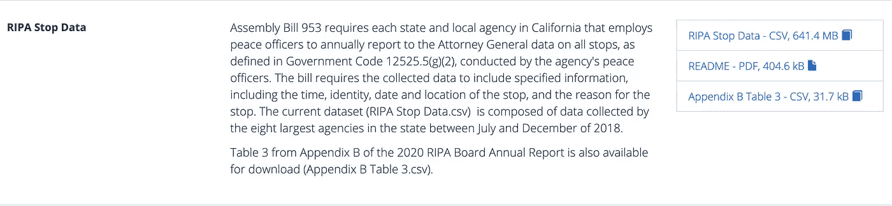

**来源:**[https://openjustice.doj.ca.gov/data](https://openjustice.doj.ca.gov/data)

数据集由一个 641.4 MB 的`.csv`文件组成，该文件包含 180 万行和 143 列。每个停止实例都有一个惟一的`DOJ_RECORD_ID`，每个被停止的人都有一个`PERSON_NUMBER`。该数据集中总共有 1，708，377 个停靠点，涉及 1，800，054 人。

该数据集包括关于每个停留的基本信息(如持续时间、一天中的时间、最近的城市、机构名称)、**感知的**人口统计信息(种族/民族、性别、年龄、残疾)，以及关于停留原因、搜查、扣押、停留期间采取的行动、发现的违禁品或证据等的信息。有关数据集的更多详细信息，您可以阅读司法部整理的自述文件和 2020 年年度报告。

这是未来几年将发布的一系列 RIPA 数据中的第一波。这一波发布的数据与加州 8 个最大的执法机构(执法机构)有关(这些执法机构雇佣了 1000 多名官员)。这些 lea(及其在总观测值中所占的份额)是:

[自述](https://data-openjustice.doj.ca.gov/sites/default/files/dataset/2020-01/RIPA%20Dataset%20Read%20Me%2020200106.pdf) | [2020 年年报](https://oag.ca.gov/sites/all/files/agweb/pdfs/ripa/ripa-board-report-2020.pdf)

# 关于 datasette

> **dataset**是一个探索和发布数据的工具。它帮助人们获取任何形状或大小的数据，并将其发布为一个交互式的、可探索的网站和附带的 API。**dataset**面向数据记者、博物馆馆长、档案管理员、地方政府和其他任何希望与世界分享数据的人。它是一个更大的工具和插件生态系统的一部分，致力于尽可能提高结构化数据的工作效率。 *-*[*datasette . readthedocs . io*](https://datasette.readthedocs.io/)

**数据集**是这个项目的引擎。简而言之，它抓取一个 sqlite 数据库，并创建一个*交互式的、可探索的网站和附带的 API* 。为了准备数据，我们使用了`csvs-to-sqlite`，这是来自**dataset**生态系统的另一个工具，它抓取 CSV 文件并从它们创建 sqlite 数据库。

你可以在 [GitHub repo 的维基](https://github.com/simonw/datasette/wiki/Datasettes)上找到一些公开**数据集**的例子。这里有一个服务于 FiveThirtyEight 发布的数据集(在他们的 [GitHub repo](https://github.com/fivethirtyeight/data) 中找到):[https://fivethirtyeight.datasettes.com/](https://fivethirtyeight.datasettes.com/)

主页显示了数据的许可、来源，并提供了对一些表格的快速访问。

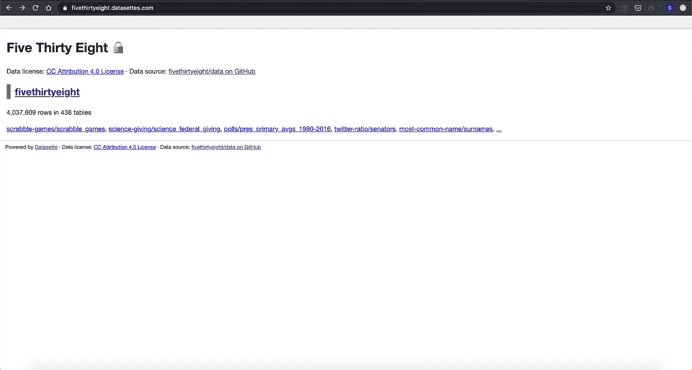

如果你点击你的数据库名称，它会提供一个所有表的视图，并为你提供一个文本框来运行定制的 SQL 查询。这是使**数据集**成为如此强大的工具的特性之一。

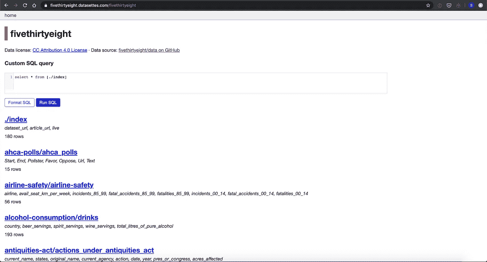

如果您深入研究其中一个表，您会看到建议的方面、一个易于使用的过滤器按钮、一个 JSON 和 CSV 链接，它将提供这些格式中的一种格式的表(这意味着您可以将它用作 API)，以及对表的描述。在这种情况下，描述包含一个带有标题和定义的 HTML 表。

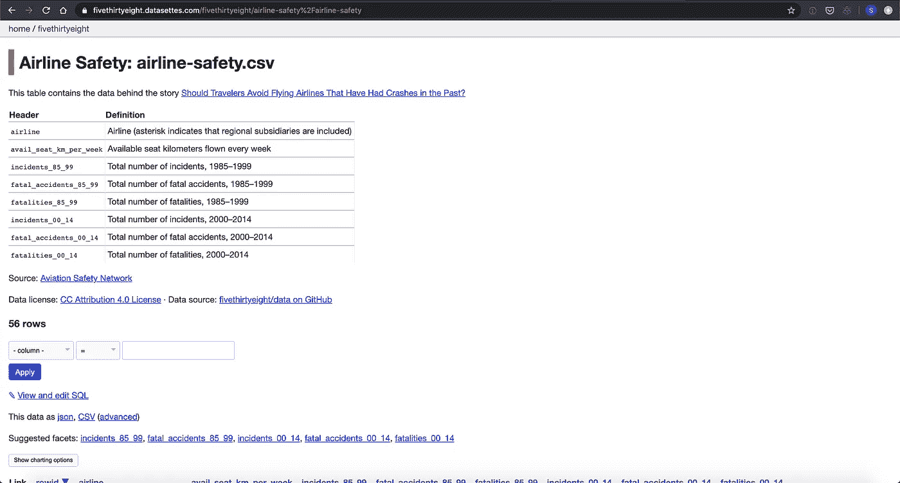

如果您单击“查看和编辑 SQL”按钮，您将再次访问一个文本框，以便在上面编写您自己的查询。

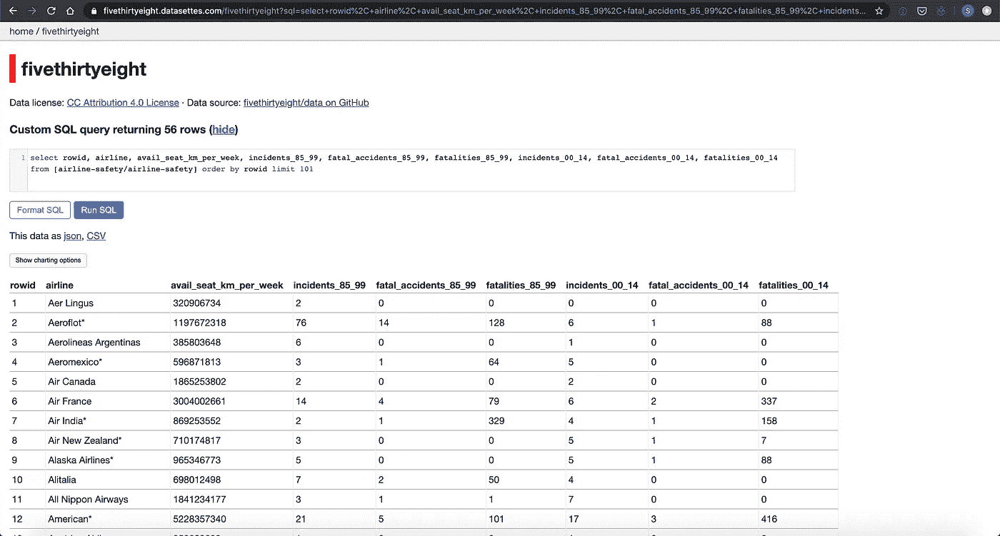

datasette 是丰富的工具和插件生态系统的一部分。您可以添加 **datasette-vega** 插件( [repo](https://github.com/simonw/datasette-vega) )来添加当前表格的交互式可视化(使用 [altair](https://altair-viz.github.io/) 制作)

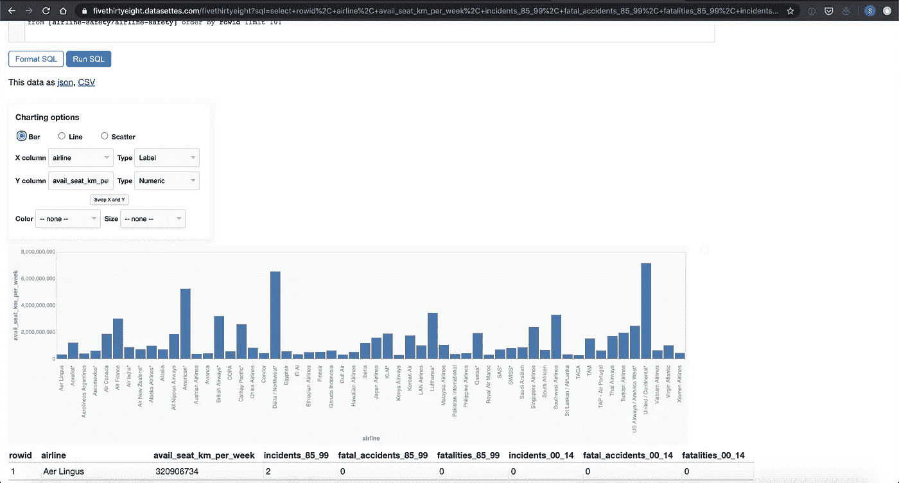

这就是一个基本的数据集网站的样子，但是 T2 的数据集是高度可定制的。以《巴尔的摩太阳报》的**数据集**为例，人们可以探索每年更新的公共工资记录。

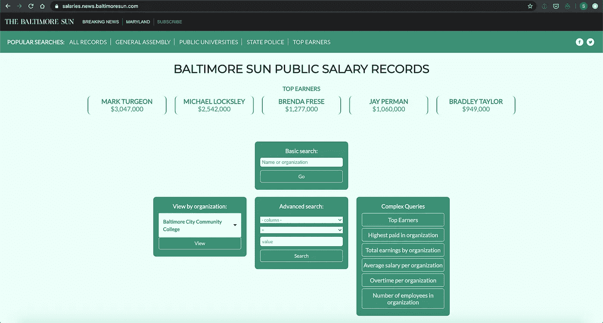

这是在后台运行的数据集，但是他们添加了自己的模板/布局，css 和 javascript 文件。关于如何定制**dataset**的更多信息，请点击这里:[https://dataset . readthe docs . io/en/stable/custom _ templates . html](https://datasette.readthedocs.io/en/stable/custom_templates.html)

# 按部就班的

这一部分是对该项目的技术性更强的描述。**数据集**的数据准备和部署非常简单，可以分为三个阶段:

—获取数据
—准备数据
—服务数据

# 获取数据

这些数据是从加州司法部的公开司法网站上获得的:[https://openjustice.doj.ca.gov/data](https://openjustice.doj.ca.gov/data)。网站提供了下载数据的链接(截止到 2020 年 5 月 5 日，我为这个项目下载的)。要了解更多关于数据本身的信息，你可以阅读项目 GitHub repo 上关于数据 的 [*部分。*](https://github.com/chekos/RIPA-2018-datasette#about-the-data)

# 准备数据

原始 CSV 文件的大小超过 650 MB，所以第一步是将*分割成 15 个 CSV 文件，这样每个文件都可以上传到这个存储库中的 GitHub。*

[https://github . com/chekos/RIPA-2018-dataset/blob/FEA 53 ce 60 AE 43 f 0d 7 b 0dd 130109 a 01496 f 08 e20 a/src/data/split _ data . py # L1-L16](https://github.com/chekos/RIPA-2018-datasette/blob/fea53ce60ae43f0d7b0dd130109a01496f08e20a/src/data/split_data.py#L1-L16)

> *💡* **为什么是**？以防它神秘地从原始数据源中消失…

然而，因为数据集太大而不能作为一个单独的表(180 万行乘 143 列)，所以它也被*分解为*更小的表。这意味着我们将相关变量(基于它们的后缀)提取到它们自己的表中。例如，从“主”表中提取与性别相关的变量，如`G_FULL`、`G_MALE`、`G_FEMALE`、`G_TRANSGENDER_MAN`、`G_TRANSGENDER_WOMAN`、`G_GENDER_NONCOMFORMING`和`G_MULTIGENDER`，并添加到数据库中的**性别**表中。可以使用分配给它们的 **UNIQUE_ID** 将它们连接回主表。

[](https://github.com/chekos/RIPA-2018-datasette/blob/master/src/data/break_down_database.py) [## chekos/RIPA-2018-数据集

### CA RIPA 2018 数据发布数据集。通过创建一个……为 chekos/RIPA 2018-dataset 的发展做出贡献

github.com](https://github.com/chekos/RIPA-2018-datasette/blob/master/src/data/break_down_database.py) 

该数据集的每个观察或行被分配一个`DOJ_RECORD_ID`和一个`PERSON_NUMBER`。这些分别是停靠点和被停靠的人员所特有的。这意味着我们可以将它们组合起来，为每一行创建一个`UNIQUE_ID`，我们可以用它将表连接在一起。然而，这最终是一个 22 个字符的字符串，这是不必要的大。为了方便起见，每一行都分配了一个从 1，000，000 开始的数字 id。从一百万开始是完全随意的，我们可以从零开始，但是因为有 180 万行，我们决定让每个数字 id 都是七位数。这个数字`UNIQUE_ID`让我们将表连接在一起**和**在内存方面对数据库来说并不是一个很大的增加。

一旦创建了这个`UNIQUE_ID`,我们就可以从“主”表中提取列到它们自己的表中，并将它们保存为单独的 CSV 文件，确保每个观察都可以在这些新表中匹配。

然后我们使用`csvs-to-sqlite`创建一个 sqlite 数据库，其中每个 CSV 都是一个表。在这一步中，我们还包括从 DOJ 网站获得的**附录 B 表 3.csv** 文件，以及我们可能已经创建的伴随数据集的任何其他补充表。

```
csvs-to-sqlite data/processed/*.csv "data/external/Appendix B Table 3.csv" datasette/ripa-2018-db.db
```

# 提供数据

在准备数据和创建 sqlite 数据库之后，我们使用**dataset**作为一个交互式网站和 API。这和跑步一样简单

```
datasette ripa-2018.db
```

然而，对于这个项目，我们稍微定制了一下我们的**dataset**实例。

我们包括标题、描述、数据源 URL 和一些额外的 CSS 和 JS 资产。你可以探索[dataset/metadata . JSON](https://github.com/chekos/RIPA-2018-datasette/blob/master/datasette/metadata.json)来找到细节。

[https://github . com/chekos/RIPA-2018-dataset/blob/FEA 53 ce 60 AE 43 f 0d 7 b 0dd 130109 a 01496 f 08 e20 a/dataset/metadata . JSON](https://github.com/chekos/RIPA-2018-datasette/blob/fea53ce60ae43f0d7b0dd130109a01496f08e20a/datasette/metadata.json)

我们还包括*预设查询；*查询默认包含在我们的实例中，显示在主页中，并带有自己的 URL 以方便访问。包含这些查询是因为它们是在数据中发现的有用和/或有趣的事实。其中一些是计算 2020 年年度报告中发布的特定事实的查询。

我们还从**数据集**中修改了一些模板，具体是`base.html`和`query.html`。第一个被修改为在`<head>`(网站预览描述等)中包含一些元数据。第二个进行了修改，在 SQL 文本框下面添加了一个按钮，用于提交用户刚刚在 GitHub 上作为建议运行的查询，以便于共享。

我们还更改了**数据集**的一些默认选项:

1.  `default_page_size:50` -每页仅显示 50 个结果
2.  `sql_time_limit_ms:30000` - 30 秒限时计算查询(限时在 Heroku 上)
3.  `facet_time_limit_ms:10000`-dataset 应该花费在计算表的一个方面的时间限制(默认为 200 毫秒，但是因为我们的数据集非常大，所以我们将其扩展到 10 秒)

运行的结果代码是:

```
datasette ripa-2018-db.db \\
  -m metadata.json \\
  --extra-options="--config default_page_size:50 --config sql_time_limit_ms:30000 --config facet_time_limit_ms:10000"
```

# 部署到 heroku

以下是该流程的高级概述

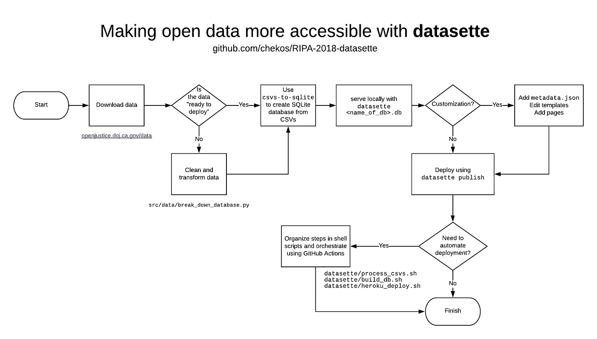

[https://github.com/chekos/RIPA-2018-datasette](https://github.com/chekos/RIPA-2018-datasette)

到目前为止，我们使用了一些 python 代码来处理我们的数据(创建一个`UNIQUE_ID`并将包含 143 列的原始数据集分解成各种更小的`.csv`文件)，我们还使用`csvs-to-sqlite`从这些`.csv`文件中构建了我们的`ripa-2018-db.db`数据库。到目前为止，我们一直通过运行运行本地服务器的命令`datasette ripa-2018-db.db`与我们的**数据集**进行交互。为了让我们的**数据集**对全世界可用，我们必须在线部署它，幸运的是这非常非常容易做到，因为**数据集**已经包含了一个`publish`命令。

使用**dataset，**可以直接发布到 [Heroku](https://datasette.readthedocs.io/en/stable/publish.html#publishing-to-heroku) 、 [Google Cloud Run](https://datasette.readthedocs.io/en/stable/publish.html#publishing-to-google-cloud-run) 或 [Fly](https://datasette.readthedocs.io/en/stable/publish.html#publishing-to-fly) (从 0.42 版本开始)。因为我以前有部署 heroku 的经验，我发现这是三个中最简单的，但是它们都是很好的选择，文档也很容易理解。

部署到 Heroku 就像运行几乎相同的命令一样简单，该命令用于本地服务我们的数据集。

```
datasette publish heroku ripa-2018-db.db \\
  --name ripa-2018-db \\
  -m metadata.json \\
  --extra-options="--config default_page_size:50 --config sql_time_limit_ms:30000 --config facet_time_limit_ms:10000"
```

> *💡* **注意**`--name`标志，它指定了我们 heroku 应用程序的名称。这意味着它会发布到[ripa-2018-db.herokuapp.com](http://ripa-2018-db.herokuapp.com)并且会覆盖之前的应用(如果有的话)。

要运行这个，你需要一个 [heroku 账号](https://signup.heroku.com/)并安装 [heroku cli 工具](https://devcenter.heroku.com/articles/heroku-cli)。**dataset**(使用 heroku cli)将要求您登录并打开一个浏览器窗口。你登录后，它会处理剩下的事情。

利斯托。至此，我们已经成功地将我们的**数据集**发布到 heroku，我们可以访问[ripa-2018-db.herokuapp.com](http://ripa-2018-db.herokuapp.com)或[ripa-2018.datasettes.cimarron.io/](http://ripa-2018.datasettes.cimarron.io/)

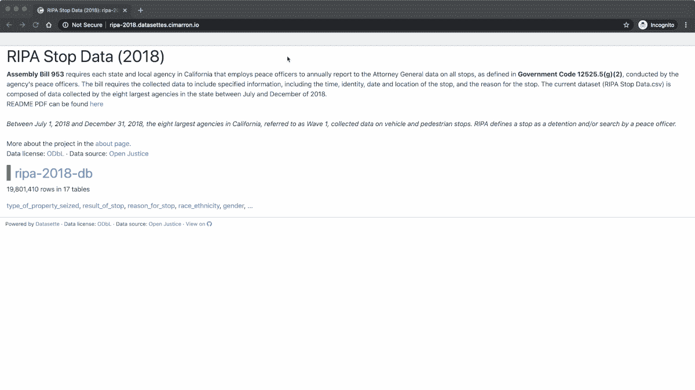

[http://ripa-2018.datasettes.cimarron.io/](http://ripa-2018.datasettes.cimarron.io/)

对许多人来说，这将是这个过程的结束。我们已经成功地获取和转换了一些数据，并将其部署到云中，供其他人探索和交互。我们还包括一个 HTML 描述，为用户描述我们的**数据集**，甚至还有一些*预设查询*，供人们重现 2020 年年度报告中公布的一些事实。

# 自动化一切

虽然您提供的底层数据可能不会经常改变，但是您可能会发现自己出于许多原因想要自动化部署您的**dataset**实例。例如，当我开始这个项目**时，datasette】的版本是 0.40，而当我写这篇文章时，它的版本是 0.42。大多数版本你都不想更新你的 datasette 实例，但是 0.41 版本包含了创建自定义页面的能力( [changelog](https://datasette.readthedocs.io/en/stable/changelog.html#v0-41) )。**

> 例如，添加一个名为`templates/pages/about.html`的模板文件将导致在实例的`/about`处提供一个新页面。

这意味着我们可以在实例中为用户添加更多的上下文。也许包括一个帮助人们为项目做贡献的逐步指南，其他有用的链接，或者一个简单的介绍你自己的页面，这样使用这些数据的人可以更多地了解你。

你可能还想包含更多的*固定查询*或者修改你描述中的一个错别字。不管是什么原因，自动化部署很容易实现。最终你需要做的就是运行`datasette heroku publish`,这是 GitHub 动作的一个完美用例

> *🚨* ***警告/注意:*** *这下一部分变得技术性真快多了。GitHub Actions 是一个更高级的主题。如果您不需要/不想定期更新新部署的****dataset****实例，我不建议您现在就考虑 GitHub 动作。*

# GitHub 操作

> GitHub 动作帮助您在存储代码和协作处理拉取请求和问题的同一位置自动化您的软件开发工作流程。您可以编写称为操作的单个任务，并将它们组合起来创建自定义工作流。工作流是定制的自动化过程，您可以在存储库中设置它，以便在 GitHub 上构建、测试、打包、发布或部署任何代码项目。
> 
> [-https://help . github . com/en/actions/getting-started-with-github-actions/about-github-actions](https://help.github.com/en/actions/getting-started-with-github-actions/about-github-actions)

在这篇文章中，我们不会深入讨论 GitHub 的行为。你需要知道的是，通过 GitHub 操作，你可以并行或按顺序运行任务，这些任务由 GitHub 事件触发，如推送到一个分支，打开一个拉请求，评论一个问题或多个问题的组合。

这些通常以 yaml 文件的形式存在于你的 GitHub repos 的`.github/workflows/`下。基本结构如下

```
name: Example of simple GitHub Actionon:
  push: 
    branches: [master]jobs:
  say-hi:
    runs-on: ubuntu-latest
    steps:
    - name: Echo Hello World
      run: |
        echo "Hello World!"
```

每当主分支上有一个推送时，这个动作就会被触发，它将运行作业`say-hi`，该作业运行在最新的可用 ubuntu 虚拟机(VM)上。在那个虚拟机中，它将运行代码`echo "Hello World!"`

您可以在 repo 的**操作**选项卡上查看您的操作的输出/日志。

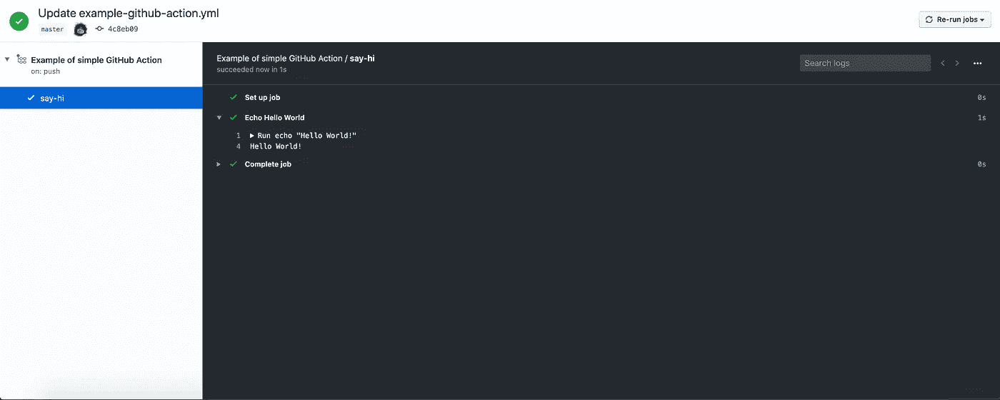

你可以很容易地改变`echo "Hello World!"`

```
datasette publish heroku ripa-2018-db.db \\
  --name ripa-2018-db \\
  -m metadata.json \\
  --extra-options="--config default_page_size:50 --config sql_time_limit_ms:30000 --config facet_time_limit_ms:10000"
```

或者更好的办法是将代码保存在 bash 脚本`heroku_deploy.sh`中，然后像运行`echo "Hello World!"`一样运行`sh heroku_deploy.sh`

幸运的是，Heroku 已经安装在我们的 GitHub Action runner([Ubuntu-latest](https://github.com/actions/virtual-environments/blob/master/images/linux/Ubuntu1804-README.md))中，所以我们需要做的就是登录，安装`heroku-builds`插件并运行我们的脚本`heroku_deploy.sh`。

> *💡在几次 GitHub 操作失败后，我了解到需要安装`heroku-builds`。我不确定它是否记录在 datasette】或 GitHub Actions 文档中。*

所以现在我们的 GitHub 动作应该是这样的

```
name: Example of simple GitHub Actionon:
  push: 
    branches: [master]jobs:
  publish-to-heroku:
    runs-on: ubuntu-latest
    steps:
    - name: Publish to Heroku
      run: |
        heroku container:login && heroku plugins:install heroku-builds && sh heroku_deploy.sh
```

然而，这还没有准备好。为了自动登录，您需要包含环境变量`HEROKU_API_KEY`。这可以通过使用 [GitHub 秘密](https://help.github.com/en/actions/configuring-and-managing-workflows/creating-and-storing-encrypted-secrets)来实现。

要创建 API 密钥，您需要在本地安装 heroku cli。运行命令`heroku authorizations:create`并将其添加到您的 repo 的**设置>机密**选项卡上。命名为`HEROKU_API_KEY`。

为了让您的 GitHub 操作能够访问它，您必须将下面一行添加到它的 yaml 文件中

```
name: Example of simple GitHub Actionon:
  push: 
    branches: [master]jobs:
  publish-to-heroku:
    runs-on: ubuntu-latest
    steps:
    - name: Publish to Heroku
      env:
        HEROKU_API_KEY: ${{ secrets.HEROKU_API_KEY }}
      run: |
        heroku container:login && heroku plugins:install heroku-builds && sh heroku_deploy.sh
```

利斯托。现在，每次你推 master，你都会部署一个新版本的 datasette】。这意味着你可以更新你的`metadata.json`，例如，用一个新的*预设查询*或者给你的`templates/pages`添加一个新页面。

对于这个项目，我有一些额外的步骤(也就是 GitHub 操作步骤),这些步骤处理数据，构建 sqlite3 数据库，并在每次需要 master 时将其部署到 heroku。我还包含了几个 python 脚本，它们读取一个单独的 yaml 文件，在这个文件中，我跟踪所有的*固定查询*，并将它们添加到一个`updated_metadata.json`。这是为了让事情更整洁，每个固定的查询都有一个标题、html_description 和一个长的 SQL 查询；在我看来，作为一个单独的文件更容易维护。

你可以在这里看到我的 GitHub Action yaml 文件:

[https://github.com/chekos/RIPA-2018-datasette/blob/master/.github/workflows/main.yml](https://github.com/chekos/RIPA-2018-datasette/blob/master/.github/workflows/main.yml)

# 额外收获:使用 github 问题来建议查询

如果你访问[ripa-2018 . datasets . cimarron . io](http://ripa-2018.datasettes.cimarron.io)并运行查询，你会注意到**在 GitHub 上提交**按钮

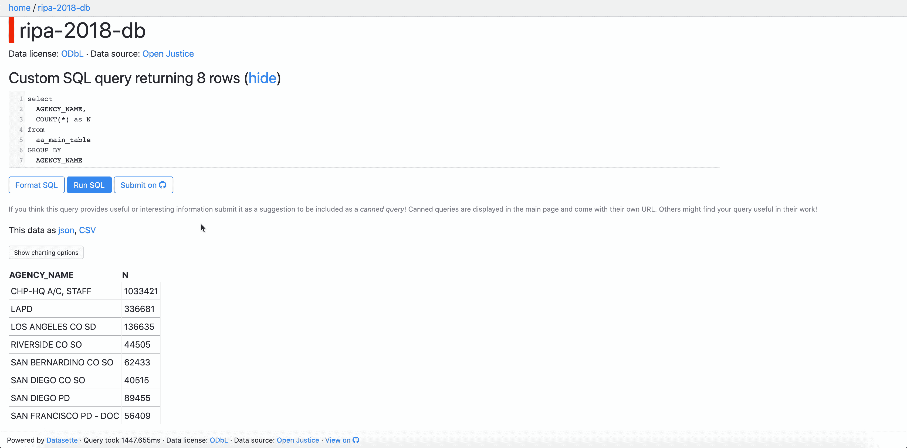

这是通过调整`query.html`模板来完成的。**dataset**在幕后使用`jinja2`,它实际上将 SQL 查询作为 url 查询参数传递，这意味着您可以使用`request.query_string.split('sql=')[-1]`来访问它

[https://github . com/chekos/RIPA-2018-dataset/blob/FEA 53 ce 60 AE 43 f 0d 7 b 0 DD 130109 a 01496 f 08 e20 a/dataset/templates/query . html # L53-L60](https://github.com/chekos/RIPA-2018-datasette/blob/fea53ce60ae43f0d7b0dd130109a01496f08e20a/datasette/templates/query.html#L53-L60)

一旦您可以访问它，您就可以在您的回购上创建一个新发行的简单链接:

```

```

# 花了多长时间

整个过程总共花费了大约 20 个小时，分散在 3-4 周内。大部分时间都是使用 GitHub Actions 来规划和协调整个自动化过程。我希望这篇教程能帮助你节省这些额外的时间。就像任何其他数据项目一样，最好花一些时间提前思考并勾画出过程的每一步。

# 行动呼吁

世界变了。这个项目的想法是在四月中旬的某个时候产生的，直到月底我才创建了 GitHub repo。我是五月下半月才开始写这个教程的。从那以后一切都变了。

每天在社交媒体上，我们都会看到有关当局滥用权力、对无辜民众实施暴力的视频和报道。不是全部，但也不应该是全部。

我相信数据是变革、问责和透明的工具。技术和数据永远改变了世界。读者们，作为一名技术专家、数据书呆子、政策专家，或者任何你们选择的自我标榜的标签，我们对我们的同行有责任使用我们的技能、我们强大的工具、我们的知识让世界变得更美好，因为**我们可以**。

我请你想一想你所扮演的角色。你能用你正在建造的工具让世界变得更美好吗？

我将从[数据 4BlackLives](http://d4bl.org/) 中摘录如下:

> **黑人生活数据**是一项由活动家、组织者和数学家发起的运动，致力于利用数据科学为黑人的生活带来具体而可衡量的变化。自从计算出现以来，大数据和算法已经渗透到我们社会和经济生活的方方面面。这些新的数据系统有着巨大的潜力来增强有色人种社区的力量。统计建模、数据可视化和众包等工具，在合适的人手中，是对抗偏见、建设进步运动和促进公民参与的有力工具。但历史讲述了一个不同的故事，在这个故事中，数据经常被用作压迫的工具，加剧不平等和延续不公正。红线是一个数据驱动的企业，导致黑人社区被系统性地排除在主要金融服务之外。最近的趋势，如预测性警务、基于风险的判决和掠夺性贷款，是同一主题的令人不安的变化。今天，歧视是一个高科技企业。
> 
> *——*[*d4bl.org*](http://d4bl.org/)