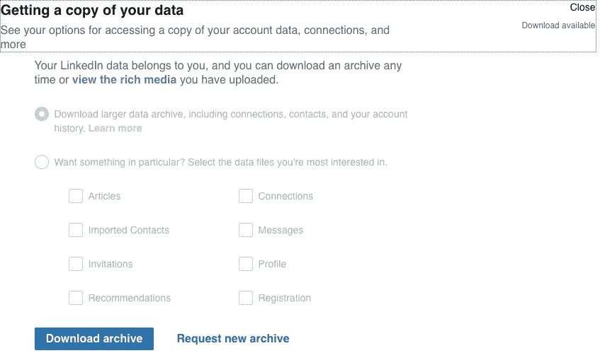
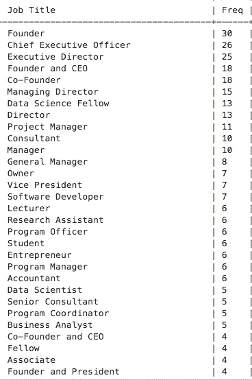
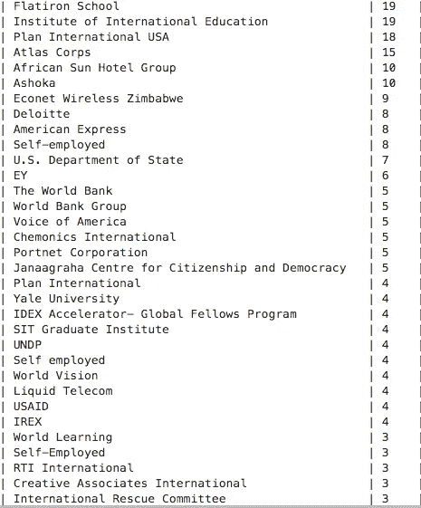

# 用机器学习让个人数据有意义。

> 原文：<https://towardsdatascience.com/making-personal-data-make-sense-with-machine-learning-c06206816d35?source=collection_archive---------28----------------------->

## 我们能理解自己的个人数据吗？我们知道保护或暴露我们的法律吗？

[来自 Unsplash 的图像](https://unsplash.com/photos/w7ZyuGYNpRQ)

随着大数据、机器学习和人工智能领域的不断发展，并彻底改变我们所知的当前世界，以及在决定未来方面发挥重要作用，毫无疑问，围绕大数据革命的道德、治理、监管和隐私问题开始出现某些问题。乍一看，这些主题都可以被归类为人工智能和机器学习进步的荆棘，特别是因为大多数企业对该领域的商业利益更感兴趣，而不一定是劣势。

## **法规**

然而，最近的活动和全球趋势开始显示，忽视试图从数据中赚钱的公司中一些看似棘手的问题可能会造成负面影响。欧盟是一个例子，说明政府如何开始优先考虑大多数科技公司以前没有关注的某些法规，从而影响他们的商业模式。脸书的约会应用本应在今天，情人节的前一天发布，但被欧盟[禁止，因为脸书未能向监管委员会提供足够的必要文件](https://www.telegraph.co.uk/technology/2020/02/12/facebook-dating-launch-postponed-eu-investigation/)。他们(脸书)在爱尔兰的办公室实际上被突击搜查，因为爱尔兰政府现在加强了对“大数据公司”的监控

[图片来自 Unsplash](https://unsplash.com/photos/JKUTrJ4vK00)

## 伦理学

围绕人工智能的伦理问题也是这个相当新的行业中一个非常令人担忧的问题，其中大多数利弊尚未可知。制造自动驾驶汽车面临的挑战是，根据最近面部识别系统错误识别有色人种，特别是黑人女性的新闻偏见，如何对算法进行编程，来做出道德决策。

> 《纽约时报》上的一篇文章称，美国国家标准和技术研究所的研究人员发现，算法错误识别的非裔美国人和亚洲人的面孔比白人面孔多 10 到 100 倍

随着我对人工智能领域兴趣的增长，人工智能的治理和伦理是我想深入研究的一个话题，我的责任感也应该如此。然而，今天我决定看一看在我们自己的手段和控制范围内的一些事情；*个人数据的所有权。*

## **个人和私人数据:**

你拥有在线账户的每家公司从你甚至你的朋友、同事和家人以及他们的朋友和家人那里收集的数据可以继续下去，直到你意识到公司可能拥有基本上每个人的个人和私人数据。关于这一点最令人不安的因素之一是，大多数用户不知道他们正在收集什么样的数据，更不用说这些数据被用于什么目的了。最近来自监管机构和公民社会的压力正迫使企业明确表示，不仅要允许个人知道他们的哪些数据正在被收集，而且如果可能的话，还要允许个人访问所有这些数据。

Linkedin 就是这样一个允许人们查看和访问他们数据的平台。只需进入你的 LinkedIn 个人资料隐私设置，你就可以从联系人、消息、赞、文章等下载你所有数据的副本。如下图所示:

链接的隐私设置页面的屏幕截图

作为数据科学家，访问个人数据可以让我们以一种有组织和有意义的方式对自己的个人数据进行更有意义的洞察。可以在 LinkedIn 个人数据等数据集上使用分层和 k-means 聚类以及自然语言处理等机器学习技术，来创建关于我们自己的个人数据的更深入的见解。以下是我从个人 LinkedIn 数据的初步分析中得到的一些见解。

## 1.标准化、计数和聚类公司、位置和连接的标题

来自社交媒体网络的数据往往不太结构化，因此不遵循相同的格式，这使得聚合类似的关联数据特征具有挑战性。例如，对于标题创建者，不同的用户可以将标题设为 1。创始人 2。联合创始人 3。创始人兼 CEO 4。创始人/首席执行官，使用数据标准化技术，可以将他们的专业知识和知识数据(如头衔、位置和公司名称)分组为有组织和结构化的数据，这将使其更容易应用于接近准确和有意义的聚类。以下是我整理我的联系人的头衔和公司的片段。

我的人脉半规范化 LinkedIn 职位

我的关系半规范化公司

我计划进一步应用多种聚类机器学习技术，使用位置、喜好、行业、角色重要性和专业领域等特征，从我的网络中提取更深入的见解。

总之，我敦促所有人检查你最常用的数字平台的隐私设置，并要求提供他们拥有你的什么数据的信息。数据科学家可以立即成为他们自己的个人数据的主题专家，这是自然语言处理等领域非常需要的一种品质，尤其是在实施标准化和相似性计算以及降维技术时。