# 让《朱庇特笔记本》的情节变得更美丽、更有意义

> 原文：<https://towardsdatascience.com/making-plots-in-jupyter-notebook-beautiful-more-meaningful-23c8a35c0d5d?source=collection_archive---------2----------------------->

## 数据可视化

## 自定义 matplotlib.pyplot 以提高绘图质量

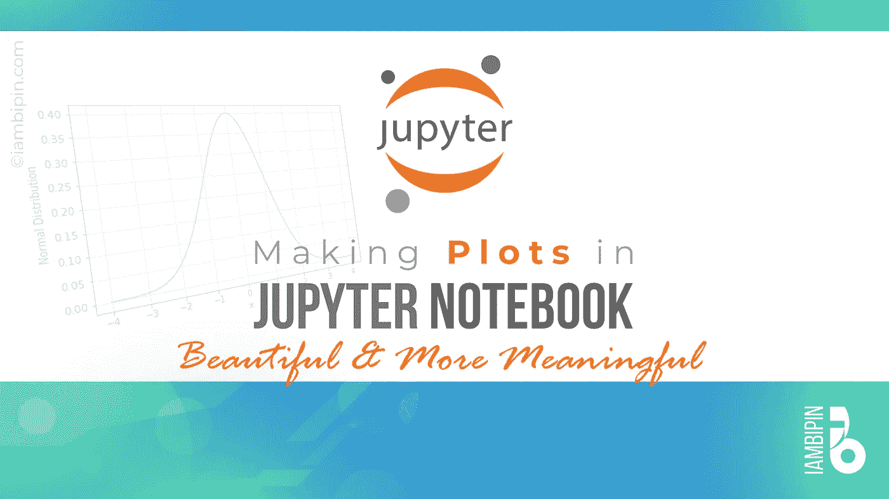

照片由 iambipin 拍摄

随着我们的世界变得越来越受数据驱动，那些可能对我们生活的世界产生巨大影响的人，如政府、大公司、政治家、商业大亨(你能想到的)，他们的重要决策都会受到数据前所未有的影响。因此，数据可视化开始在日常事务中发挥比以往任何时候都重要的作用。因此，在这个领域获得技能越来越重要。

在数据科学领域，Python 是首选的编程语言(数据科学领域无可争议的领导者)。因此我们会考虑用 Matplotlib 来绘图。Matplotlib 是一个用于在 Python 中创建静态、动画和交互式可视化的综合库。 *matplotlib.pyplot* 是一个命令风格函数的集合，使 matplotlib 能够像 MATLAB 一样工作。 *pyplot* 函数可以创建一个图形，在图形中创建一个绘图区，在绘图区中绘制一些线，用标签装饰绘图等。使用 pyplot 可以快速生成可视化效果。

让我们在 Jupyter notebook 中创建一些代码来创建一个正态分布。对于外行来说，正态分布是实值随机变量的连续概率分布。通过钟形曲线(概率密度函数)及其对称性可以很容易地识别它。

```
import numpy as np
import matplotlib.pyplot as plt
import scipy.stats as stats
mu = 0
std = 1
x = np.linspace(start=-4, stop=4, num=100)
y = stats.norm.pdf(x, mu, std) 
plt.plot(x, y)
plt.show()
```

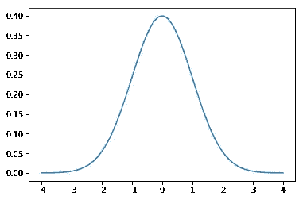

**图 1** :正态分布| iambipin 拍摄

该代码创建了一个简单的正态分布图，其中均值=0，标准差=1。因为我们主要关心的是如何让情节更漂亮，所以关于数学方面的代码解释将会非常简短。 ***np.linspace()*** 返回特定间隔[开始，停止]内间隔均匀的样本(样本数等于 num)。***scipy . stats . norm()***返回一个正态连续随机变量。***scipy . stats . norm . pdf()***针对给定的平均值(mu)和标准差(std)计算任意点的 PDF。

这张图表似乎显得过于普通和平淡。既没有标签，也没有头衔，向第三人提供一些有价值的信息。没有易于识别和关联值的网格。身材的大小也有点小合我意。

让我们通过利用 pyplot 的各种特性来使情节变得美丽。

## 添加网格线

网格有助于轻松识别和关联图中的值。 ***plt.grid()*** 配置网格线。它以默认设置显示网格。

```
plt.grid()
```

创建图形的简单代码如下:

```
import matplotlib.pyplot as plt
fig = plt.figure()
ax = plt.axes()
plt.grid()
plt.show()
```

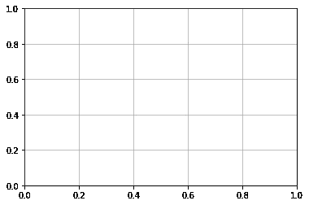

照片由 iambipin 拍摄

***plt.figure()*** 创建一个新的图形。 ***plt.axes()*** 给新图形分配轴，并使其成为当前轴(轴的复数)。Matplotlib 的*图*可以被认为是一个包含所有关于轴、图形、文本和标签信息的容器。轴可以被视为一个带有记号和标签的边界框，它将包含可视化的绘图元素。 ***plt.show()*** 显示所有图形，直到图形关闭

让我们来玩一下 ***网格()*** 的各个方面。从网格的颜色开始。

```
fig = plt.figure()
ax = plt.axes()
plt.grid(b=True, color='r')
```

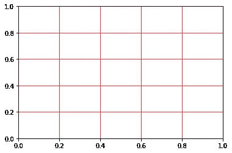

照片由 iambipin 拍摄

***颜色*** 是为网格指定颜色的关键字参数。可选参数 ***b*** 取布尔值(真或假)。如果设置为 False，网格将会消失。但是，如果存在任何关键字参数(如 alpha、color、linewidth 等)，那么 b 将被设置为 True，而不管给定的 b 值如何。例如，如果更改了上面的代码片段:

```
fig = plt.figure()
ax = plt.axes()
plt.grid(b=False, color = 'r')
```

输出将是如上所示的带有红色网格的相同图。

对于 ***颜色*** ，可以使用以下任意字符串作为值:

*   红色、蓝色、棕色、品红色等颜色的俗称。
    **color = '紫色'**
*   十六进制颜色代码#RRGGBB，取值范围为 00 到 FF。这里 r =红色，G =绿色，B =蓝色
    **color = '#e3e3e3'**
*   值从 0 到 1 的 RGB 元组。
    **color = (0.6，0.9，0.2)**
*   灰度值从 0.0 到 1.0。随着该值的增加，网格的黑线变暗。
    **color = '0.9'**
*   RGB 和 CMYK 的短色码。这里 r:红色，g:绿色，b:蓝色，c:青色，m:品红色，y:黄色，k:黑色。
    **color='c'**
*   HTML 颜色名称。你可以在这里找到更多的 HTML 颜色名称。
    **color= '番茄'**

```
fig = plt.figure()
ax = plt.axes()
plt.grid(b=True, color='aqua', alpha=0.3, linestyle='-.', linewidth=2)
```

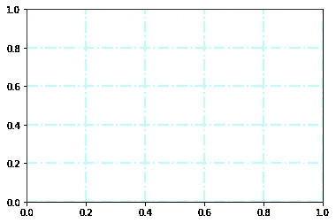

照片由 iambipin 拍摄

代码中各种关键字参数的属性如下所示:

*   ***alpha*** 用于改变网格的不透明度。alpha 的零值将使网格消失。
*   ***linestyle 或*ls**将设置网格线的样式。linestyle 的合适值是'-'、'-'、'-. '，':'，''，'实线'，'虚线'，'虚线'等。
*   ***线宽或*lw**决定了网格线的宽度。

**注意**:可以使用相同的关键字参数，以与网格相同的方式设计绘图的曲线或线条。

```
import numpy as np
import matplotlib.pyplot as plt
fig = plt.figure()
ax = plt.axes()
x = np.linspace(0, 5, 100)
plt.plot(x, np.sin(x), color='Indigo', linestyle='--', linewidth=3)
plt.grid(b=True, color='aqua', alpha=0.3, linestyle='-.', linewidth=2)
plt.show()
```

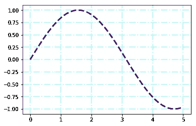

照片由 iambipin 拍摄

可以将 ***颜色*** 和 ***线条样式*** 参数组合起来，给出一个非关键字参数。例如，' c- -'相当于设置 color='cyan '，linestyle='-'，如下面的代码所示:

```
import numpy as np
import matplotlib.pyplot as plt
fig = plt.figure()
ax = plt.axes()
x = np.linspace(0, 5, 100)
plt.plot(x, np.sin(x), 'c--', linewidth=3)
plt.grid(b=True, color='aqua', alpha=0.3, linestyle='-.', linewidth=2)
plt.show()
```

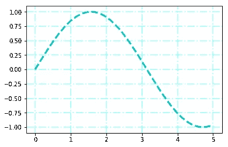

照片由 iambipin 拍摄

这种颜色和线条样式的组合对 grid() 不起作用。

## 主网格线和次网格线

通过向 ***plt.grid()*** 的 参数提供三个值中的任意一个，可以显示主网格线和次网格线。这三个值是主要值、次要值和两者。顾名思义，这些是不言自明的。值 ***主要*** 显示主要网格线，而 ***次要*** 显示次要网格线。值 ***both*** 同时显示主要和次要网格线。

```
import numpy as np
import matplotlib.pyplot as plt
x = np.linspace(0, 7, 100)
line1, = plt.plot(x, np.sin(x), label='sin')
line2, = plt.plot(x, np.cos(x), label='cos')
plt.legend(handles=[line1, line2], loc='lower right')
#major grid lines
plt.grid(b=True, which='major', color='gray', alpha=0.6, linestyle='dashdot', lw=1.5)
#minor grid lines
plt.minorticks_on()
plt.grid(b=True, which='minor', color='beige', alpha=0.8, ls='-', lw=1)
plt.show()
```

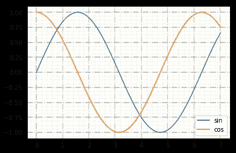

照片由 iambipin 拍摄

***PLT . minor ticks _ on()***显示坐标轴上的小刻度。缺点是它可能会降低性能。

## 为轴添加标签

首先向 x 轴和 y 轴添加标签。***matplotlib . pylot . xlabel()***用于给 x 轴添加标签。同样， ***ylabel()*** 用于给 y 轴分配标签。 ***fontsize*** 是 matplotlib 文本关键字参数(**kwargs)，是用来控制标签字体的大小。

```
plt.xlabel('x', fontsize=15)
plt.ylabel('PDF', fontsize=15)
```

## 设置轴限制

如果没有特别提到轴限制，Matplotlib 设置默认轴限制。您可以使用 ***plt.xlim()*** 和 ***plt.ylim*** 分别设定 x 极限和 y 极限。


无轴限制|照片由 iambipin 拍摄

```
import numpy as np
import matplotlib.pyplot as plt
fig = plt.figure()
ax = plt.axes()
x = np.linspace(0, 5, 100)
plt.plot(x, np.sin(x), 'c--', linewidth=3)
plt.xlim(-1, 6)
plt.ylim(-1.25, 1.25)
plt.grid(b=True, color='aqua', alpha=0.3, linestyle='-.', linewidth=2)
plt.show()
```

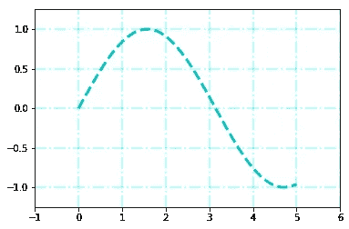

带轴限制|照片由 iambipin 拍摄

## 刻度参数

我们已经看到了如何定制网格。尽管如此，有一个***PLT . tick _ params()***方法可以在一行代码中改变刻度、刻度标签和网格线的外观。不是很方便很强大吗？

```
import numpy as np
import matplotlib.pyplot as plt
fig = plt.figure()
ax = plt.axes()
x = np.linspace(0, 5, 100)
plt.plot(x, np.sin(x), 'c--', linewidth=3)
plt.xlim(-1, 6)
plt.ylim(-1.25, 1.25)
plt.tick_params(axis='both', direction='out', length=6, width=2, labelcolor='b', colors='r', grid_color='gray', grid_alpha=0.5)
plt.grid()
plt.show()
```

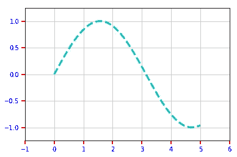

照片由 iambipin 拍摄

***轴*** 参数指定要应用参数的轴(“x”、“y”或“两者”)。 ***方向*** 将刻度置于轴内、轴外或两者。参数 length 和 width 给出了刻度长度和刻度宽度(浮点)。 ***标签颜色*** 给刻度标签分配颜色。 ***颜色*** 参数设置刻度颜色和标签颜色。 ***grid_color*** 设置网格的颜色 ***grid_alpha*** 设置网格的不透明度。***PLT . tick _ params()***可以用来改变网格的重要属性，如 **grid_color** (color) **、grid_alpha** (float) **、grid_linewidth** (float) **和 grid _ line style**(string)**。**

## 添加图例

图例是地图或图表上解释所用符号的文字。 ***plt.legend()*** 方法将图例放置在坐标轴上。

当一个图中出现多行时，代码与通常的做法略有不同。

```
import numpy as np
import matplotlib.pyplot as plt
x = np.linspace(0, 7, 100)
line1, = plt.plot(x, np.sin(x), label='sin')
line2, = plt.plot(x, np.cos(x), label='cos')
plt.legend(handles=[line1, line2], loc='best')
plt.grid(b=True, color='aqua', alpha=0.6, linestyle='dashdot')
plt.show()
```

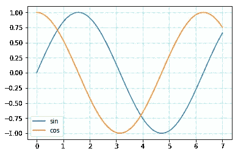

照片由 iambipin 拍摄

***图例*** 的位置也可以通过设置适当的值(‘右下’，‘左下’，‘右上’，‘左上’等)来改变。)到**到 *loc* 到**。

```
plt.legend(handles=[line1, line2], loc='lower right')
```

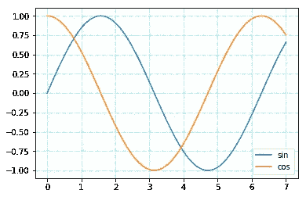

图例的位置更改为右下位置|图片由 iambipin 提供

让我们将所有这些函数添加到我们的代码中，看看**图 1** 是什么样子。

```
import numpy as np
import matplotlib.pyplot as plt
import scipy.stats as statsmu = 0
std = 1
x = np.linspace(start=-4, stop=4, num=100)
y = stats.norm.pdf(x, mu, std) 
plt.plot(x, y, label='PDF')
plt.xlabel('x', fontsize=15)
plt.ylabel('PDF', fontsize=15)
plt.grid(b=True, which='major', color='DarkTurquoise', alpha=0.4, linestyle=':', linewidth=2)
plt.minorticks_on()
plt.grid(b=True, which='minor', color='beige', alpha=0.2, linestyle='-', linewidth=2)
plt.legend()
plt.show()
```

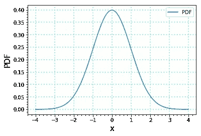

**地块 2** :正态分布| iambipin 拍摄

## 将图形保存到图像中

将绘图保存为图像的几种方法之一是右键单击绘图并选择“图像另存为”选项(任何网络浏览器的默认选项)。

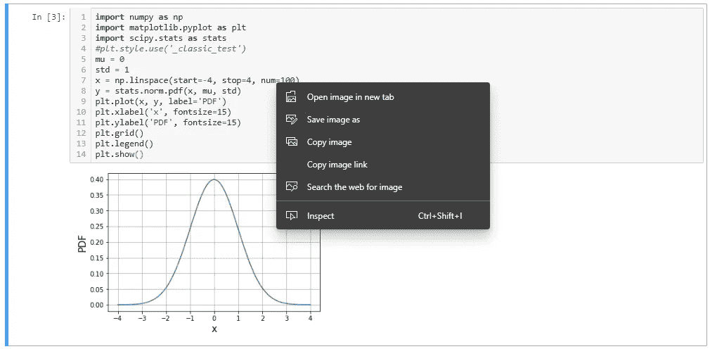

照片由 iambipin 拍摄

另一个选择是使用 plt.savefig()方法。它将当前图形保存到当前工作目录。

```
plt.savefig('Normal Distribution.png')
```

为了验证图像已被正确保存，使用了***ipython . display***模块的 ***Image*** 对象。下面的代码将显示图像。

```
from IPython.display import Image
Image('normal_distribution.png')
```

## 增加图形的大小

默认情况下，Jupyter notebook 显示的绘图大小相当小。默认大小仅为 640x480。但是，保存的图像尺寸更小。

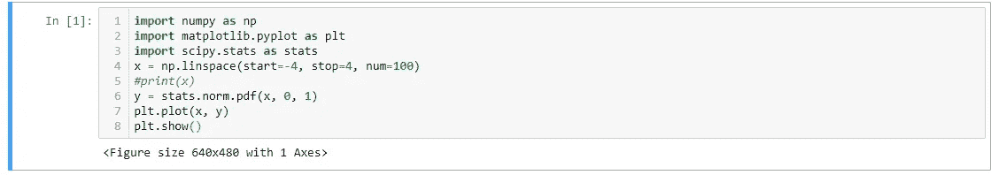

照片由 iambipin 拍摄

保存的文件尺寸为 433px * 288px。让我们调整设置，为地块定制大小。***PLT . RC params[]***就是为了这个特定的目的。一般语法如下:

```
plt.rcParams['figure.figsize'] = [width, height]
```

Matplotlib 使用 *matplotlibrc* 配置文件自定义各种属性，我们称之为‘RC 设置’或‘RC 参数’。Matplotlib 中几乎每个属性的默认值都可以控制:图形大小和 DPI、线条宽度、颜色和样式、轴、轴和网格属性、文本和字体属性等等。一旦找到 *matplotlibrc* 文件，它将不会搜索任何其他路径。通过键入以下命令，可以看到当前活动的 matplotlibrc 文件的位置:

```
import matplotlib
matplotlib.matplotlib_fname()
```

## 换算成厘米

这里需要注意的重要一点是， ***figsize*** 元组接受以英寸为单位的值。要转换成厘米(cm)，将该值除以 2.54 即可，因为 1 英寸= 2.54 cm。

```
plt.rcParams['figure.figsize'] = [10/2.54, 8/2.54]
```

现在尝试使用 rcParams 自定义**图 2** 的尺寸。

```
import numpy as np
import matplotlib.pyplot as plt
import scipy.stats as stats
mu = 0
std = 1
x = np.linspace(start=-4, stop=4, num=100)
y = stats.norm.pdf(x, mu, std) 
plt.plot(x, y, label='PDF')
plt.xlabel('x', fontsize=15)
plt.ylabel('PDF', fontsize=15)
plt.grid(b=True, color='DarkTurquoise', alpha=0.2, linestyle=':', linewidth=2)
plt.rcParams['figure.figsize'] = [10/2.54, 8/2.54]
plt.legend()
plt.show()
```

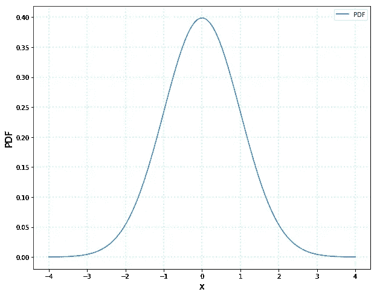

**地块 3** :正态分布| iambipin 拍摄

## 设置样式

***PLT . style . use()***可用于切换到易于使用的绘图样式。*样式*包提供了一系列广泛的预设样式，从而使图形更具吸引力，尺寸更大。

```
plt.style.use('classic')
```

***PLT . style . available***命令列出了所有可用的各种样式。

```
print(plt.style.available)['bmh', 'classic', 'dark_background', 'fast', 'fivethirtyeight', 'ggplot', 'grayscale', 'seaborn-bright', 'seaborn-colorblind', 'seaborn-dark-palette', 'seaborn-dark', 'seaborn-darkgrid', 'seaborn-deep', 'seaborn-muted', 'seaborn-notebook', 'seaborn-paper', 'seaborn-pastel', 'seaborn-poster', 'seaborn-talk', 'seaborn-ticks', 'seaborn-white', 'seaborn-whitegrid', 'seaborn', 'Solarize_Light2', 'tableau-colorblind10', '_classic_test']
```

假设如果我们希望有一个黑暗的背景，那么***PLT . style . use(' dark _ background ')***将服务于这个目的。

```
import numpy as np
import matplotlib.pyplot as plt
import scipy.stats as stats
plt.style.use('dark_background')
mu = 0
std = 1
x = np.linspace(start=-4, stop=4, num=100)
y = stats.norm.pdf(x, mu, std) 
plt.plot(x, y, label='PDF')
plt.xlabel('x', fontsize=15)
plt.ylabel('PDF', fontsize=15)
plt.grid(b=True, color='DarkTurquoise', alpha=0.2, linestyle=':', linewidth=2)
plt.legend()
plt.show()
```


**地块 4** :正态分布| iambipin 拍摄

## 结论

Matplotlib 是事实上的 Python 可视化库。我已经涵盖了 Pyplot 的每个重要方面，以使您在 Jupyter notebook 中的情节脱颖而出。我相信在这里分享的信息会让你的情节更加有意义和美丽。

数据可视化见证了我打字时的变化。有人说得对，唯一不变的是变化本身。永恒是一种幻觉。许多新工具正在出现，如 Tableau、Bokeh、Plotly 等。也许在未来，一个功能更加丰富、技术更加成熟的工具可能会取代 Matplotlib 成为头号工具。到那时，快乐的编码！！！

## 参考

*   [https://matplotlib.org/](https://matplotlib.org/)
*   [https://matplotlib.org/tutorials/introductory/pyplot.html](https://matplotlib.org/tutorials/introductory/pyplot.html)
*   [https://matplotlib . org/tutorials/introductive/customizing . html](https://matplotlib.org/tutorials/introductory/customizing.html)
*   [https://docs . scipy . org/doc/scipy/reference/generated/scipy . stats . norm . html](https://docs.scipy.org/doc/scipy/reference/generated/scipy.stats.norm.html)
*   [https://matplotlib . org/3 . 1 . 1/API/_ as _ gen/matplotlib . py plot . xlabel . html](https://matplotlib.org/3.1.1/api/_as_gen/matplotlib.pyplot.xlabel.html)
*   [https://matplotlib . org/3 . 1 . 1/API/_ as _ gen/matplotlib . py plot . grid . html](https://matplotlib.org/3.1.1/api/_as_gen/matplotlib.pyplot.grid.html)
*   [https://matplotlib . org/tutorials/intermediate/legend _ guide . html](https://matplotlib.org/tutorials/intermediate/legend_guide.html)
*   [https://matplotlib . org/tutorials/introductive/customizing . html # customizing-with-matplotlibrc-files](https://matplotlib.org/tutorials/introductory/customizing.html#customizing-with-matplotlibrc-files)
*   [https://matplotlib . org/API/_ as _ gen/matplotlib . axes . axes . tick _ params . html](https://matplotlib.org/api/_as_gen/matplotlib.axes.Axes.tick_params.html)
*   [https://www.w3schools.com/colors/colors_names.asp](https://www.w3schools.com/colors/colors_names.asp)