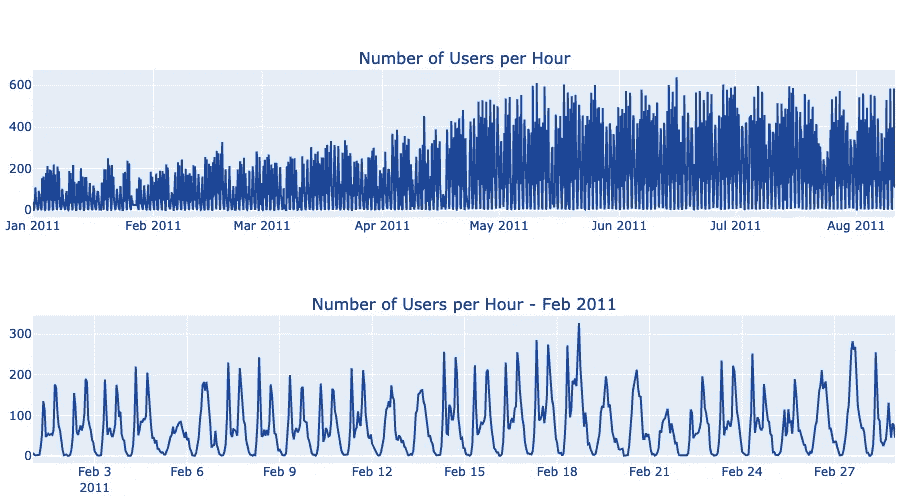
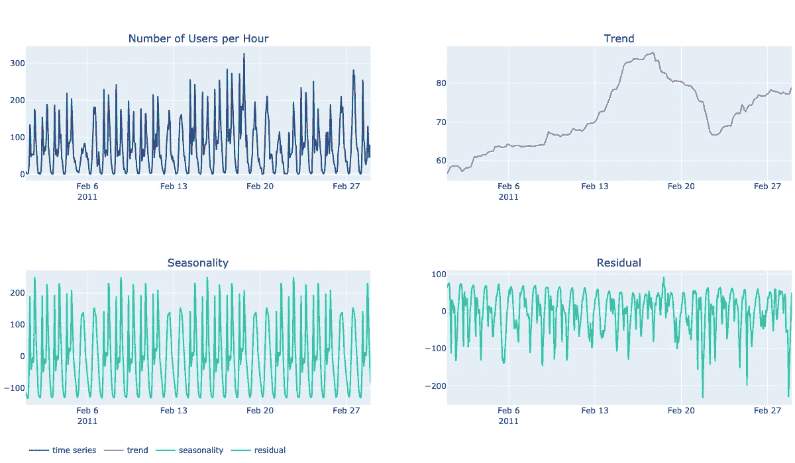
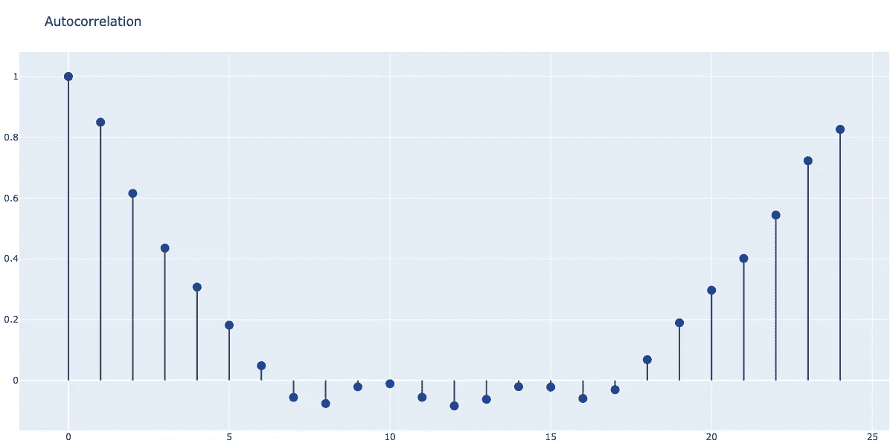
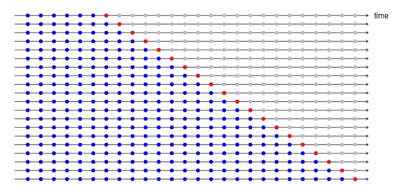
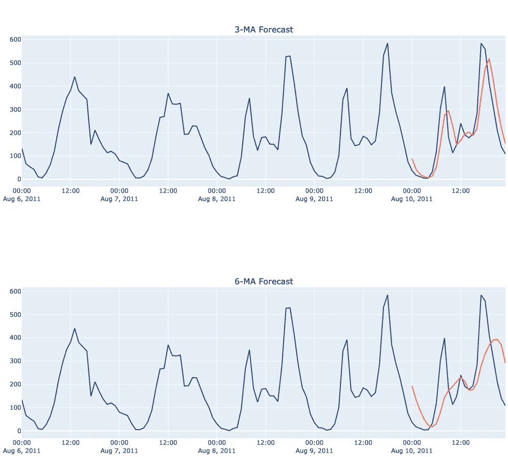
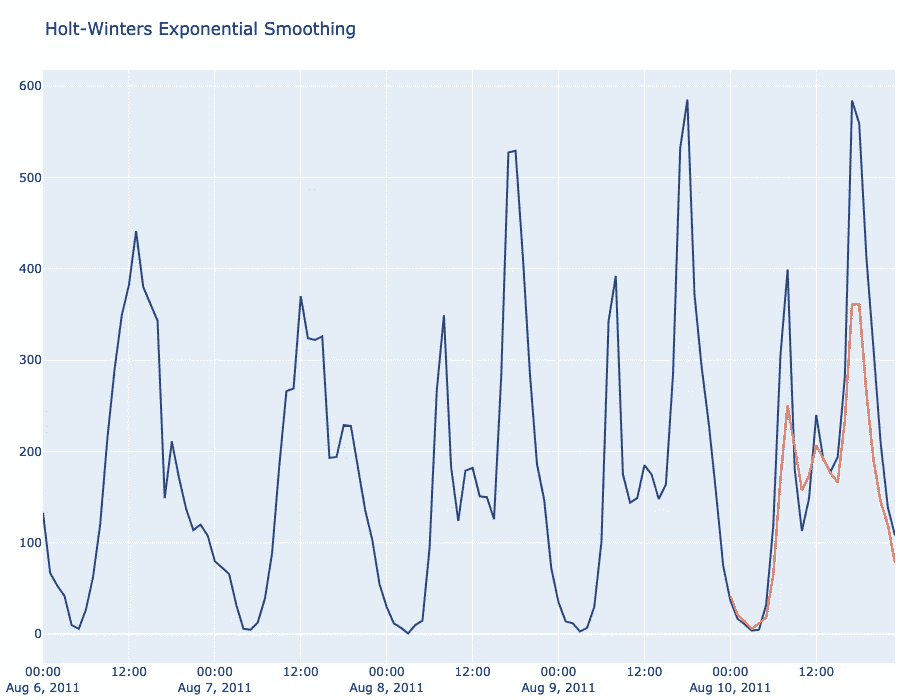
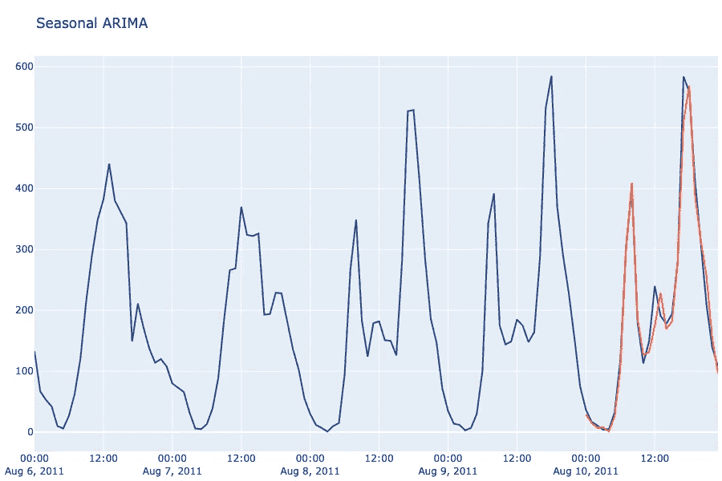
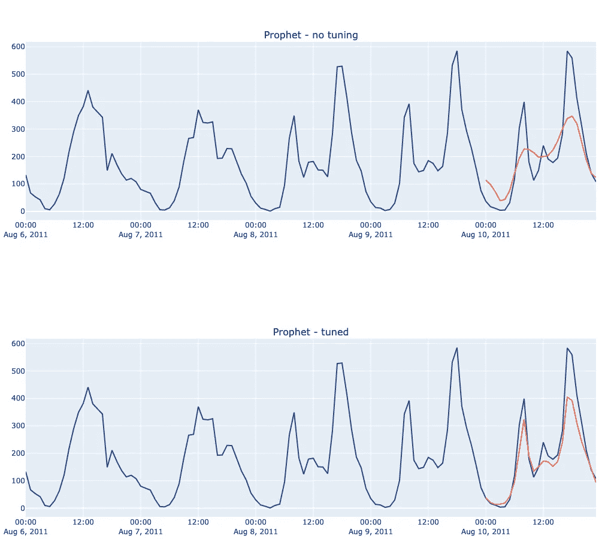
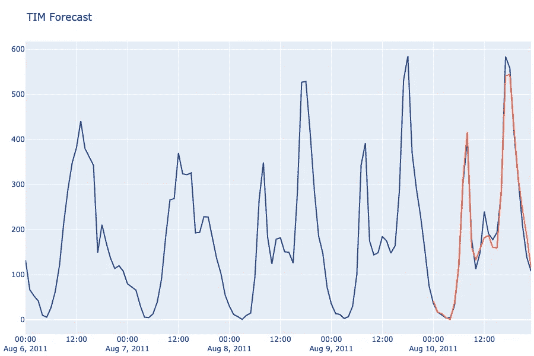
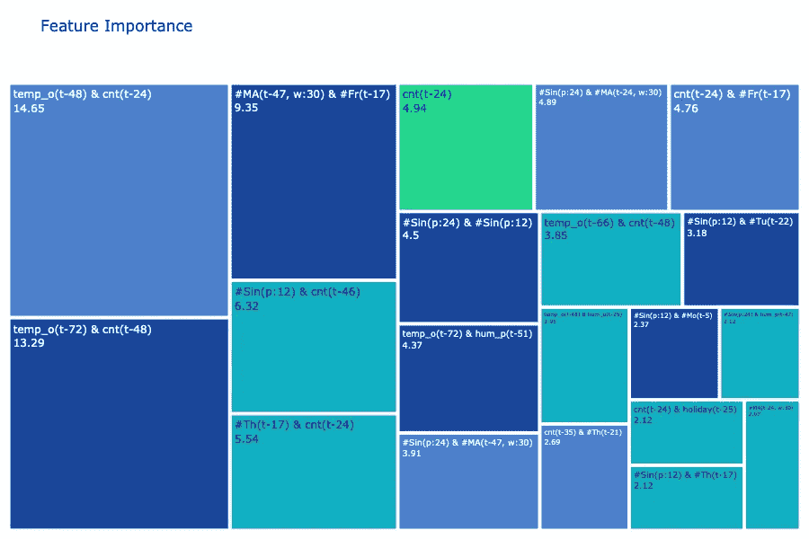

# 用数据做预言

> 原文：<https://towardsdatascience.com/making-prophecies-with-data-99d75e95c387?source=collection_archive---------36----------------------->

## 时间序列预测和最近发展的高级技术介绍。

预测是许多行业常见的问题，通常部署在财务规划、销售/需求预测、营销活动分析、预测性维护和社交媒体分析等场景中。虽然它有时在围绕机器学习的讨论中被忽略，但事实上它可以从机器学习方法中受益，最近开发了新技术来提高其准确性和效率。

# 什么是时间序列？

一个*时间序列*由一个有序的时间间隔相等的值序列组成。

时间序列可以应用于连续或离散数据:波士顿每小时消耗的能源量，每天从纽约飞往旧金山的经济舱乘客数量，美国每月的国内生产总值，都是时间序列的例子。

时间序列的*频率*是季节模式重复之前的观察次数，例如，对于月度数据，频率为 12。

DC 华盛顿州自行车共享服务使用的自行车数量，每小时计算一次。上图显示了整个时间序列，从 2011 年 1 月到 8 月。下图放大了 2 月份的数据。该时间序列在每周和每天的水平上都显示了季节性:工作日显示两个高峰，大约在上午 8 点和下午 5 点，这时大多数人通勤上班；周末在一天的晚些时候，大约下午 2-3 点，是用户开始休闲活动的时候。

# 时间序列模式

时间序列通常显示有规律的模式:识别和分析这些模式可以更容易地选择合适的预测模型。

## 季节性分解

时间序列分解是指将时间序列分为趋势、季节和周期部分:

*   当观察水平长期上升或下降时，就会出现*趋势*。
*   当时间序列受到季节因素(如一年中的某个时间或一周中的某一天)的影响时，就会出现季节性模式。季节性总是有一个固定和已知的频率。
*   当数据以非固定频率的模式上升和下降时，出现一个*周期*。

分解时间序列意味着提取代表这些模式的成分。大多数时间序列分解模型将周期成分纳入长期模式，并提取趋势、季节和残差成分。当季节性波动的幅度不随时间序列水平变化时，分解被认为是可加的。当季节性波动似乎与时间序列的水平成比例时，使用乘法模型。

2011 年 2 月 DC 华盛顿州自行车共享服务活跃用户数量的时间序列的季节性分解。

## 自相关

相关性测量两个变量之间的线性关系，而自相关测量时间序列的滞后值之间的线性关系。

可以为每个滞后计算自相关系数，例如 r₁是每个观测值与前一个观测值的相关性。对于每小时的数据，我们将有 24 个系数，它们共同组成了*自相关函数(ACF)* 。由此产生的图也被称为*相关图*。

DC 华盛顿州自行车共享服务每小时用户计数的*自相关函数*(相关图)图。任何给定小时的活动用户数高度依赖于最近活动的用户数，因此单次滞后测量的自相关性最高。同时，有很强的每日季节性，当我们接近 24 小时滞后时，自相关性再次增加。

# 预测考虑

预测是指一套使用历史数据作为输入来对变量的未来值做出明智估计的技术。

在预测项目的早期阶段，必须根据以下方面做出决策:

*   细分:不同的组是否需要单独的预测，或者是否可以汇总？
*   预测范围:是否需要提前一个月、六个月或一年的预测？
*   频率:需要多长时间预测一次？

## 确认

常规交叉验证方法不能用于验证时间序列预测，因为它们没有考虑数据的时间结构。时间序列交叉验证涉及一系列成对的训练/测试数据集，其中训练集由在测试集之前*发生的观察组成，测试集通常由单个观察形成。*

单步时序交叉验证图，定型集用蓝色表示，测试集用红色表示。来源:[https://robjhyndman.com/hyndsight/tscv/](https://robjhyndman.com/hyndsight/tscv/)

# 经典预测方法

## 天真的预测

最简单的预测方法——通常令人惊讶地有效——是将下一次观测的预测设定为前 *m* 次观测的平均值。

这是一种单变量方法，也就是说，只有关于被预测变量的信息才用于产生最终预测。另一方面，多变量方法将来自其他“外生”变量的信息整合到它们的预测中。

对 2011 年 8 月 10 日 DC 华盛顿州自行车共享服务的简单预测(m=3，6)。

## 指数平滑法

使用指数平滑方法生成的预测是过去观测值的加权平均值，随着观测值变老，权重呈指数衰减。也就是说，观察越近，相关的权重越高。

霍尔特-温特斯法是一种特别流行的指数平滑法，它能捕捉季节性。

Holt-Winters 对 2011 年 8 月 10 日 DC 华盛顿州自行车共享服务的预测。

## ARIMA 和季节性 ARIMA

ARIMA 代表自回归综合移动平均线。该模型实际上是一些更简单模型的组合:

*   *AR(p)* 是阶为 *p* 的自回归模型，这意味着预测是使用变量过去值的线性组合进行的，其中 *p* 是模型中包含的最大滞后。
*   *MA(q)* 是订单 *q* 的移动平均线。这一预测是基于类似回归模型的先前误差，其中 *q* 是考虑的最大滞后。
*   *I(d)* 是积分的阶数，也就是使时间序列*平稳*所需的差数。

注意，当时间序列的属性不随时间变化时，时间序列是*稳定的*，即它具有恒定的均值和方差。*差分*是通过计算连续观测值之间的差值，将非平稳时间序列转换为平稳时间序列的实践。

将[阿凯克信息准则(AIC)](https://en.wikipedia.org/wiki/Akaike_information_criterion) 最小化，以确定一个非季节性 ARIMA 模型的阶，记为 *ARIMA(p. d.q)。*

*季节性 ARIMA* 模型添加了一个用于模拟季节性的组件， *S(P，D，Q，s)* 其中 *s* 是季节性的长度或频率， *P* 是季节性组件上 AR 模型的最大长度，Q 是季节性组件上 MA 模型的最大长度，D 是季节性组件的积分阶，即从季节性组件中移除季节性组件所需的差数

结合一切我们得到 *SARIMA(p，D，q)(P，D，Q，s)。*SARIMA 有 7 个不同的参数可供选择，因此需要一名数据专家和深入的数据知识来创建有效的模型。

总的来说，ARIMA 和萨里玛模型可以非常精确，但它们的设置是耗时的，并且有效的模型需要专家的人工输入。

SARIMA(1，0，0)(2，1，2，24)2011 年 8 月 10 日 DC 华盛顿州自行车共享服务预测

# 最近的发展

近年来，已经开发了许多工具来自动化机器学习，其中一些现在专注于时间序列预测。

*   AutoML 工具:这些工具，如 [DataRobot](https://www.datarobot.com/) 和[H2O](https://www.h2o.ai/)，通过尝试许多不同的特征变换、模型和超参数，使用强力方法来拟合预测模型。
*   Prophet 和 Tangent Information Modeler (TIM)等自动化预测工具和库利用更加简化的算法，以极快的速度找到最佳模型和特征变换。

## 先知

[Prophet](https://facebook.github.io/prophet/) 是由脸书开发的开源库。它支持单变量和多变量模型，具有加法和乘法季节性。默认情况下，Prophet 会自动拟合一个具有非线性趋势和每日、每周和每年季节性的模型，并为假期添加一个二进制标志。

该库旨在允许完全自动化，但手动参数调整会产生更好的结果。

预言家预测 2011 年 8 月 10 日华盛顿州 DC 的自行车共享服务。这两个模型都是多变量的，包括外部天气变量，如感知温度和风速。

## 切线信息建模器(TIM)

[Tangent Information Modeler(TIM)](https://www.bardess.com/what-we-do/tangent-works-tangent-information-modeler/)是 Tangent Works 开发的预测程序。TIM 通过拟合广义加性模型(GAM)并将最佳特征变换集的选择视为优化问题来自动进行预测和异常检测。

TIM 预测 2011 年 8 月 10 日华盛顿州 DC 的自行车共享服务。该模型利用了 InstantML，一种全自动预测技术，并包括外部天气变量，如感知温度和风速。

潜在的假设是，选择正确的特征转换比选择模型重要得多。这是一种新颖的方法，利用信息几何进行优化，这使得该方法非常快速和准确。

表示由 TIM 算法创建的要素变换的树图，用于预测自行车共享服务的用户数量。一些特征与目标变量直接相关，另一些是目标变量和外生变量之间的交互项。例如，cnt(t-24)是预测时间之前 24 小时的用户计数，而 temp_o(t-72) & cnt(t-48)表示预测之前 72 小时的温度与目标的 48 小时滞后值之间的相互作用。

# 结论

预测是数据科学在商业中最常见的应用之一，在统计学和动态系统理论中有很好的理论基础。直到最近，与图像识别和自然语言处理等热门话题相比，它在某种程度上是一个被忽视的话题，但随着行业从经典的统计方法转向利用更加自动化的基于机器学习的方法，它现在变得更加重要。

# 参考

*   时间序列的交叉验证，罗布·J·海德曼，[https://robjhyndman.com/hyndsight/tscv/](https://robjhyndman.com/hyndsight/tscv/)
*   预测原理与实践，罗布·J·海曼和乔治·阿萨纳索普洛斯，【https://otexts.com/fpp2/ 
*   【https://facebook.github.io/prophet/ 
*   [https://www . bardess . com/what-we-do/tangent-works-tangent-information-modeler/](https://www.bardess.com/what-we-do/tangent-works-tangent-information-modeler/)