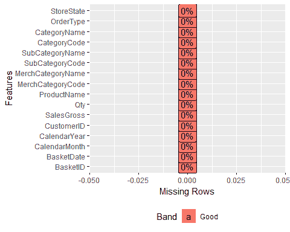
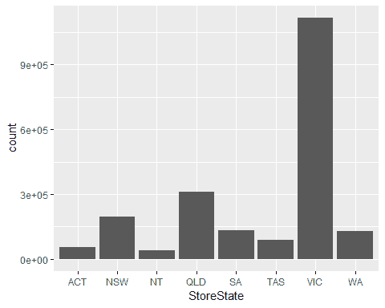
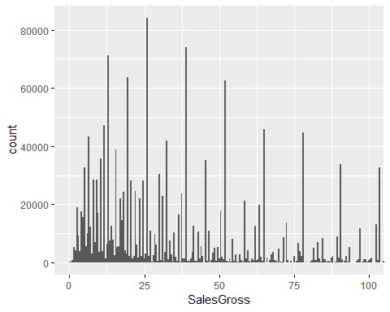
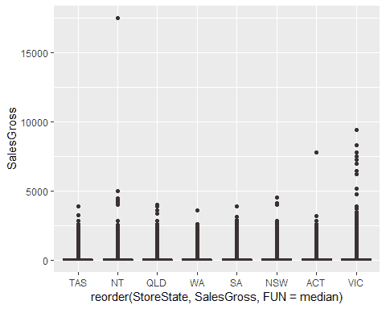
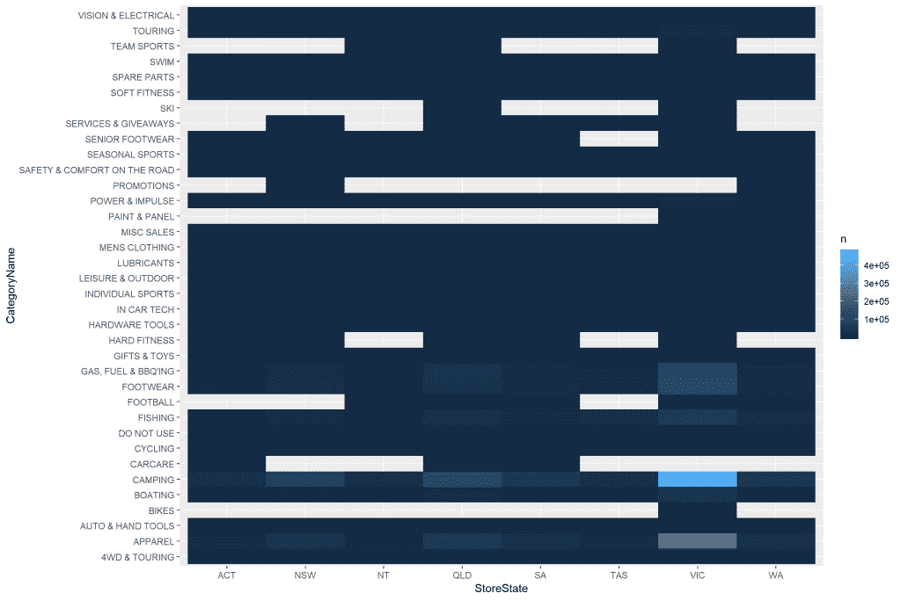
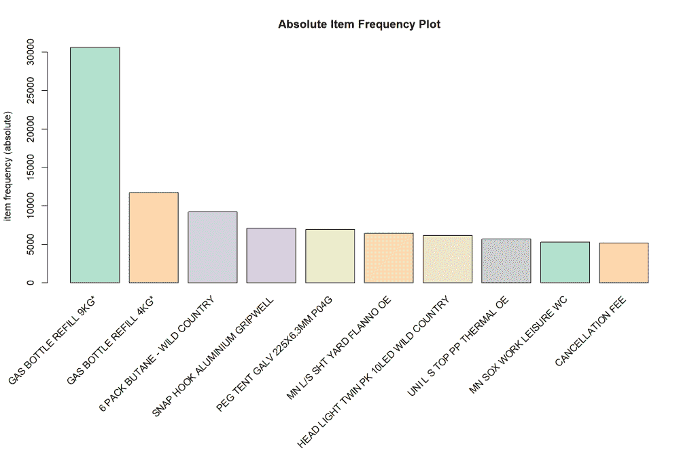
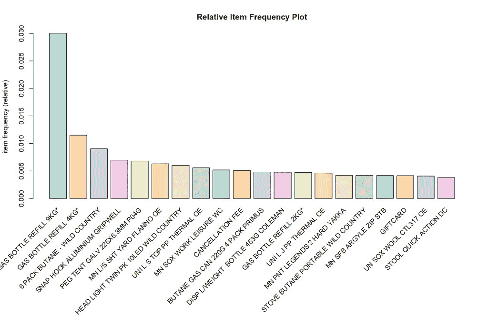
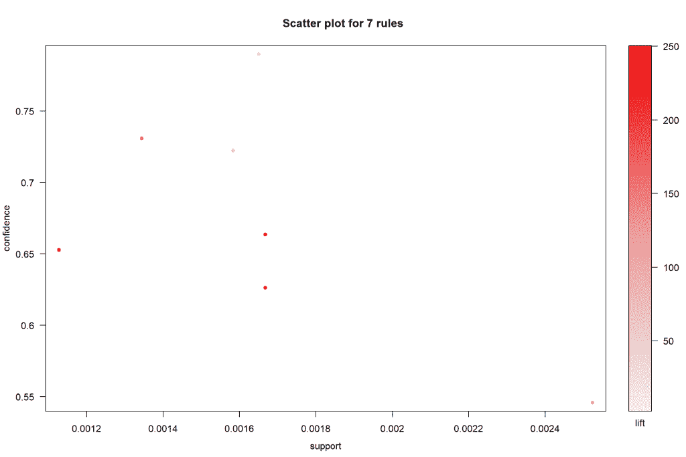
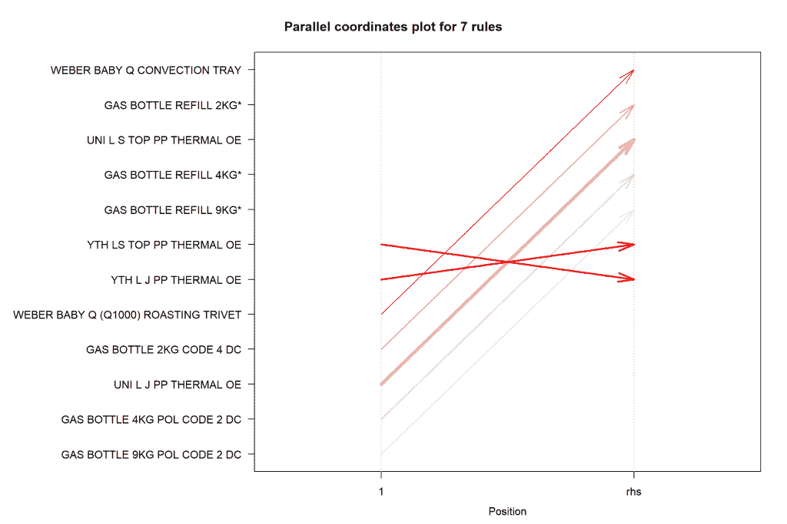

# 使用关联规则提出建议(R 编程)

> 原文：<https://towardsdatascience.com/making-recommendations-using-association-rules-r-programming-1fd891dc8d2e?source=collection_archive---------28----------------------->

## 购物篮分析简介

# 背景

零售商通常拥有大量的客户交易数据，包括客户购买的商品类型、价值和购买日期。除非零售商有忠诚度奖励系统，否则他们可能没有客户的人口统计信息，如身高、年龄、性别和地址。因此，为了对该顾客将来可能想要购买什么提出建议，即向顾客推荐哪些产品，这必须基于他们的购买历史和关于其他顾客的购买历史的信息。

在 ***协同过滤*** 中，基于发现客户购买历史之间的相似性，向客户进行推荐。因此，如果客户 A 和 B 都购买了产品 A，但客户 B 也购买了产品 B，那么很可能客户 A 也对产品 B 感兴趣。这是一个非常简单的例子，有各种算法可用于找出客户的相似程度，以便进行推荐。

一种这样的算法是***k-最近邻*** ，其中目标是找到与目标客户最相似的 *k* 个客户。它包括选择一个 *k* 和一个相似性度量(欧几里德距离是最常见的)。该算法的基础是空间上彼此最接近的点也可能彼此最相似。

另一个技术是使用 ***购物篮分析*** 或 ***关联规则*。**此方法的目的是找出哪些物品是一起购买的(放在同一个篮子里)以及购买的频率。该算法的输出是一系列 if-then 规则，即如果顾客购买蜡烛，那么他们也可能购买火柴。关联规则可以在以下方面帮助零售商:

*   修改商店布局，将相关商品存放在一起；
*   向客户发送电子邮件，根据他们之前的购买情况推荐要购买的产品(例如，我们注意到您购买了一支蜡烛，也许这些火柴会让您感兴趣？);和
*   对客户行为的洞察

现在让我们将关联规则应用到虚拟数据集

# 数据集

提供了 2，178，282 个观测值/行和 16 个变量/特征的数据集。

我对这个数据集做的第一件事是快速检查任何丢失的值或 NAs，如下所示。如下所示，没有发现缺失值。



现在，所有的变量要么以数字形式读入，要么以字符串形式读入。为了有意义地解释分类变量，需要将它们转换为因子。因此，进行了以下更改。

```
retail <- retail %>% 
  mutate(MerchCategoryName = as.factor(MerchCategoryName)) %>%
  mutate(CategoryName = as.factor(CategoryName)) %>% 
  mutate(SubCategoryName = as.factor(SubCategoryName)) %>%
  mutate(StoreState = as.factor(StoreState)) %>%
  mutate(OrderType = as.factor(OrderType)) %>% 
  mutate (BasketID = as.numeric(BasketID)) %>% 
  mutate(MerchCategoryCode = as.numeric(MerchCategoryCode)) %>%
  mutate(CategoryCode = as.numeric(CategoryCode)) %>% 
  mutate(SubCategoryCode = as.numeric(SubCategoryCode)) %>% 
  mutate(ProductName = as.factor(ProductName))
```

然后，所有的数字变量被总结成五点总结(最小值，中值，最大值，标准差。和平均值)来识别数据中的任何异常值。通过运行此摘要，发现功能*商品类别代码、类别代码、*和*子类别代码*包含大量 NAs。经进一步检查，发现这些代码值大多包含数字；但是，转换为 NAs 的文件包含“运费”或字母“C”等字符。由于这些代码与客户购买无关，这些观察结果被删除。

负总销售额和负数量表示错误的值或客户退货。这可能是有趣的信息；然而，它与我们的分析目标无关，因此这些观察结果被省略了。

# 数据探索

探索数据，看看能否在数据集中发现任何趋势或模式，这总是一个好主意。稍后，您可以使用算法/机器学习模型来验证这些趋势。

下图显示，交易数量最多的是维多利亚州，其次是昆士兰州。如果零售商想知道在哪里增加销售，那么这个图可能是有用的，因为在所有其他州，销售数量都是成比例的低。



下图向我们展示了大多数总销售额在 0-40 美元之间(中位数为 37.60 美元)。



我们也可以按州看到如下图。然而，维多利亚州和昆士兰州的交易似乎掩盖了其他州的信息。箱线图可能更便于可视化。


下面的箱线图(虽然很难看到，因为异常值扩大了范围)显示，所有州的大多数销售额都接近整体中位数。NT 和 VIC 都有异常高的异常值。出于我们的目的，由于我们只对了解客户一起购买了哪些产品感兴趣，以便进行推荐，因此我们不需要处理这些离群值。



既然我们已经看了各州的销售情况。让我们试着更好地了解客户购买的产品。

下图根据每件商品的购买频率进行着色。较浅的蓝色表示较高的频率。

一些关键要点是:

*   在澳大利亚首都地区、新南威尔士州、南澳大利亚州和西澳大利亚州没有团队运动产品的销售，可能是因为这些产品没有库存，或者可能需要更好地营销
*   在澳大利亚首都地区、新南威尔士州、南澳大利亚州和西澳大利亚州没有销售滑雪产品。我觉得这很令人震惊，因为新南威尔士州和 ACT 离一些主要的滑雪胜地很近，比如 Thredbo。奇怪的是，在一年四季都经历温暖气候的 QLD 有滑雪产品销售。这些产品要么贴错了标签，要么没有储存在新南威尔士州和澳大利亚首都地区。
*   仅在西澳大利亚销售油漆和面板。
*   仅在维也纳国际中心销售自行车。
*   露营和服装在维也纳的销售额最高，其次是汽油、燃料和烧烤用品。



由于销售是按产品和州分布的，所以我们提出的任何关联规则似乎都将主要基于 VIC 和 QLD 的销售。此外，由于不是所有的产品都在所有的州有库存/销售，所以预期关联规则将限于非常少数量的产品。不过，既然我已经走上了这种分析模式，那就继续看看我们得到了什么。

我们有两年的数据，2016 年和 2017 年。所以，我决定对比一下这两年的销售总数。

尽管 2016 年的交易数量有所增加(是 2017 年的 2.5 倍)，但 2017 年的平均总销售额仍高于 2016 年。这似乎很违背直觉。因此，我决定通过查看月销售额来更深入地研究这个问题。

交易年份 2016 年平均总销售额(美元)`1481922` $69.02017 `593315` $86.0

2016 年，1 月和 3 月的销售数量最高，9 月至 11 月急剧下降，然后在 12 月出现增长。然而，2017 年交易量继续下降，12 月(圣诞季)有所增加。

***扣除*** *:由于销售额最高的是露营、服装和烧烤&汽油，这些产品在节日期间的销售额高是有道理的*

***推荐*** *给零售商:可能想了解商店在 12 月至 1 月是否有足够的库存，因为这些产品最受欢迎。*

**:尽管交易数量稳步下降，但平均销售总额继续逐月增长，2017 年 12 月最高。这表明购买了更高价值产品的顾客减少了。**

# ***购物篮分析/关联规则***

***让我们回到我们的目标。***

******目的*** *:判断哪些产品是顾客有可能一起购买的，以便推荐产品****

***我使用了 *arules* 包和 *read.transactions* 函数将数据集转换为 *transaction* 对象。该对象的摘要给出了以下输出***

```
***## transactions as itemMatrix in sparse format with
##  1019952 rows (elements/itemsets/transactions) and
##  21209 columns (items) and a density of 9.531951e-05 
## 
## most frequent items:
##       GAS BOTTLE REFILL 9KG*       GAS BOTTLE REFILL 4KG* 
##                        30628                        11724 
## 6 PACK BUTANE - WILD COUNTRY SNAP HOOK ALUMINIUM GRIPWELL 
##                         9209                         7086 
## PEG TENT GALV 225X6.3MM P04G                      (Other) 
##                         6948                      1996372 
## 
## element (itemset/transaction) length distribution:
## sizes
##      1      2      3      4      5      6      7      8      9     10 
## 546138 234643 109888  55319  30185  16656   9878   6018   3716   2332 
##     11     12     13     14     15     16     17     18     19     20 
##   1611    993    751    490    353    237    157    140     99     88 
##     21     22     23     24     25     26     27     28     29     30 
##     53     48     28     31     20     13     12     15      8      1 
##     31     32     33     34     35     36     37     38     39     40 
##      4      2      4      3      4      1      4      2      1      4 
##     43     46 
##      1      1 
## 
##    Min. 1st Qu.  Median    Mean 3rd Qu.    Max. 
##   1.000   1.000   1.000   2.022   2.000  46.000 
## 
## includes extended item information - examples:
##   labels
## 1     10
## 2     11
## 3  11/12***
```

***基于上面的输出，我们可以得出以下结论。***

*   ***有 1019952 个收藏(篮)的物品，21209 个物品。***
*   ****密度*测量稀疏矩阵中非零细胞的百分比。它是被购买的项目总数除以矩阵中可能的项目数。您可以使用密度计算购买了多少件物品:1019952*21209*0.0000953 = 2061545***
*   ****元素(项集/事务)长度分布:*这告诉你 1-项集、2-项集等等有多少个事务。第一行告诉您项目的数量，第二行告诉您交易的数量。***
*   ***大多数购物篮(87%)由 1 至 3 件物品组成。***
*   ***购物篮中的最小项目数= 1，最大项目数= 46(只有一个购物篮)***
*   ***最受欢迎的项目是气瓶，气瓶填充，gripwell，和 peg 帐篷。***

***我们可以通过绝对频率和相对频率图来查看这些信息。***

***两个图都是按照购买频率降序排列的。绝对频率图告诉我们，销售额最高的是与气体相关的产品。相对频率图显示了条形图中彼此接近的产品的销售额如何相互关联(即相对)。因此，我们可以向零售商提出的建议是，将这些产品一起存放在商店中，或者向客户发送 EDM，对图中相关但客户尚未购买的产品提出建议。***

************

***下一步是为我们的事务对象生成规则。输出如下。***

```
***## Apriori
## 
## Parameter specification:
##  confidence minval smax arem  aval originalSupport maxtime support minlen
##         0.5    0.1    1 none FALSE            TRUE       5   0.001      1
##  maxlen target   ext
##      10  rules FALSE
## 
## Algorithmic control:
##  filter tree heap memopt load sort verbose
##     0.1 TRUE TRUE  FALSE TRUE    2    TRUE
## 
## Absolute minimum support count: 1019 
## 
## set item appearances ...[0 item(s)] done [0.00s].
## set transactions ...[21209 item(s), 1019952 transaction(s)] done [2.52s].
## sorting and recoding items ... [317 item(s)] done [0.04s].
## creating transaction tree ... done [0.84s].
## checking subsets of size 1 2 done [0.04s].
## writing ... [7 rule(s)] done [0.00s].
## creating S4 object  ... done [0.25s].***
```

***上面的输出显示生成了 7 条规则。***

***这些规则的详细信息如下所示。***

```
***## set of 7 rules
## 
## rule length distribution (lhs + rhs):sizes
## 2 
## 7 
## 
##    Min. 1st Qu.  Median    Mean 3rd Qu.    Max. 
##       2       2       2       2       2       2 
## 
## summary of quality measures:
##     support           confidence          lift            count     
##  Min.   :0.001128   Min.   :0.5458   Min.   : 26.30   Min.   :1150  
##  1st Qu.:0.001464   1st Qu.:0.6395   1st Qu.: 80.36   1st Qu.:1493  
##  Median :0.001650   Median :0.6634   Median :154.58   Median :1683  
##  Mean   :0.001652   Mean   :0.6759   Mean   :154.48   Mean   :1685  
##  3rd Qu.:0.001668   3rd Qu.:0.7265   3rd Qu.:245.30   3rd Qu.:1701  
##  Max.   :0.002524   Max.   :0.7898   Max.   :249.14   Max.   :2574  
## 
## mining info:
##  data ntransactions support confidence
##    tr       1019952   0.001        0.5***
```

***现在，这些规则都有支持、信心和提升值。***

***让我们从 ***support*** 开始，它是用于生成同时包含两个项目的规则(即 1，019，952)的所有事务中的事务的比例(即 1190/1019952 = 0.0011 或 0.11%，其中 count 是包含这两个项目的事务的数量。***

******置信度*** 是两个商品一起购买的交易占购买其中一个商品的所有交易的比例。由于这些是先验规则，购买商品 B 的概率是基于购买商品 a 的。***

***从数学上讲，这看起来如下:***

****置信度(A= > B) = P(A∩B) / P(A) =频率(A，B) /频率(A)****

***在上面的结果中，置信度值的范围从 54%到 79%。***

***顾客带着信心一起购买商品的概率在 54%到 79%之间，其中购买商品 A 对购买商品 B 有积极影响(因为提升值都大于 1)。***

****注意:当我运行该算法时，我试验了更高的支持度和置信度值，就好像数据集中一起购买两件商品的交易数量越多，置信度就越高。然而，当我以 80%或更高的置信度运行该算法时，我获得了零个规则。****

***这是预料之中的，因为常见物品的数据很少，其中 1 个物品的篮子最常见，大多数购买的物品与露营或气体产品有关。***

***因此，该算法在以下参数下运行。***

```
***association.rules <- apriori(tr, parameter = list(supp=0.001, conf=0.5,maxlen=10))***
```

******举*** 表示两个项目如何相互关联。正的 lift 值表示购买项目 A 可能会导致购买项目 b。数学上， ***lift*** 计算如下。***

******Lift(A =>B)= Support/(Supp(A)* Supp(B))******

***我们所有的规则都有正的提升值，表明购买商品 A 可能会导致购买商品 b。***

# ***规则检查***

***现在让我们检查一下规则。***

```
***lhs    rhs   support confidence      lift count
## [1] {GAS BOTTLE 9KG POL CODE 2 DC} => {GAS BOTTLE REFILL 9KG*}       0.001650078  0.7897701  26.30036  1683
## [2] {WEBER BABY Q (Q1000) ROASTING TRIVET} => {WEBER BABY Q CONVECTION TRAY} 0.001127504  0.6526674 241.45428  1150
## [3] {GAS BOTTLE 2KG CODE 4 DC}             => {GAS BOTTLE REFILL 2KG*}       0.001344181  0.7308102 154.58137  1371
## [4] {GAS BOTTLE 4KG POL CODE 2 DC}         => {GAS BOTTLE REFILL 4KG*}       0.001583408  0.7222719  62.83544  1615
## [5] {YTH L J PP THERMAL OE}                => {YTH LS TOP PP THERMAL OE}     0.001667726  0.6634165 249.13587  1701
## [6] {YTH LS TOP PP THERMAL OE}             => {YTH L J PP THERMAL OE}        0.001667726  0.6262887 249.13587  1701
## [7] {UNI L J PP THERMAL OE}                => {UNI L S TOP PP THERMAL OE}    0.002523648  0.5458015  97.88840  2574***
```

***第一条规则的解释如下:***

****如果顾客购买了 9 公斤的气瓶，有 79%的可能性顾客也会购买它的填充物。这是为数据集中的* 1，683 笔交易确定的。***

***现在，让我们直观地看看这些图。***

***所有规则的置信度值都大于 0.5，提升范围从 26 到 249。***

******

***七条规则的平行坐标图显示了一种产品的购买如何影响另一种产品的购买。RHS 是我们建议客户购买的项目。对于 LHS，2 是购物篮中最近添加的商品，1 是客户以前购买的商品。***

***查看第一个箭头，我们可以看到，如果顾客的购物篮中有 Weber Baby (Q1000)烘焙三脚架，那么他们可能会购买 Weber Baby q 对流托盘。***

***如果我们能看到多于两个项目集的篮子，下面的图会更有用。***

******

# ***包扎***

***现在，您已经学会了如何根据先验规则向顾客推荐最常一起购买的商品。然而，关于这个分析，有一些重要的事情需要注意。***

*   ***最流行/最频繁的项目在某种程度上混淆了分析，看起来我们只能有把握地对七个关联规则提出建议。这是因为购物篮中的项目数量按频率分布不均匀。***
*   ***客户细分可能是该数据集的另一种方法，其中客户按支出(销售总额)、产品类型(即类别代码)、状态商店和销售时间(即月/年)分组。然而，在客户身上有更多的功能来有效地做到这一点将是有用的。***

*****参考**:[https://www . data camp . com/community/tutorials/market-basket-analysis-r](https://www.datacamp.com/community/tutorials/market-basket-analysis-r)***

***【https://github.com/shedoesdatascience/basketanalysis】代码和数据集:***