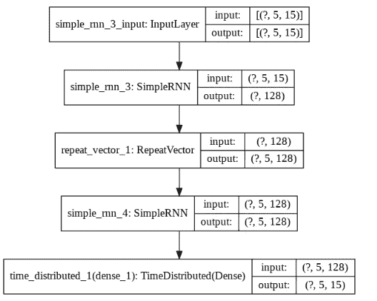

# 让 RNN 模型学习算术运算

> 原文：<https://towardsdatascience.com/making-rnn-model-learn-arithmetic-operations-b016ec4d8388?source=collection_archive---------25----------------------->

## 使用 RNN 的文本预测

**问题**:

给定短语“34+17”，模型应该预测序列“51”中的下一个单词。输入和输出是一个字符序列，依次是两个数及其结果的算术表达式。因此，我们的数据被表示为两个单词的序列*表达式*和*结果*。

**动机:**

由于递归神经网络(RNNs)最适合处理顺序数据，我们将建立一个简单的 RNN 模型来解决这个问题。

这可以通过 6 个步骤实现:

1.  生成数据
2.  建筑模型
3.  矢量化、去矢量化数据&移除填充
4.  创建数据集
5.  训练模型
6.  预言

**导入必要的库**

**步骤 1:生成数据**

我们需要为输入和输出字符串定义一个包含所需字符集的词汇表。因此，词汇表由 0 到 9 位数、+、-、*、/和十进制(.)符号。

我们正在构建的 RNN 模型需要张量中的数值作为输入。这个字符序列的一个合适的表示是独热编码矢量。向量的维数应该等于词汇的长度，也就是特征的总数。需要创建一个字典来将字符标记为数值。此外，创建另一个字典，将索引作为键，将相应的字符作为值，以便在后面的步骤中使用。

现在让我们生成数据，它是一个单一的**表达式、**和**结果**对。为了做到这一点，首先创建两个随机整数‘first’和‘second’，然后创建 ***表达式*** 作为字符串转换后的数字的串联，****结果*** 是字符串转换后的计算结果 ***first+second*** 。该函数应返回创建的**表达式、**和**结果**对。*

***第二步:建立模型***

*该模型是由编码器和解码器两部分组成的 keras 序列模型。编码器部分是一个 SimpleRNN 层，hidden_units=128，num_features。它是一个完全连接的 RNN 层，这些单元的输出反馈到网络，它默认使用“tanh”激活。该层的输出将是单个矢量表示，为了实现整个输出的单个矢量表示，我们将使用 RepeatVector()层，重复“max_time_steps”。*

*这个矢量表示被输入到解码器部分。解码器由另一个 SimpleRNN 层组成，它采用输入的矢量表示并生成预测序列。因此，用“hidden_units”定义这个层，并将“return_sequences”设置为“True”。*

*该 RNN 的输出是一个序列，该序列将进入具有“softmax”激活功能的密集层。所以，在每个时间步，对于不同的字符，输出会有不同的可能性。*

*由于我们需要将密集层应用于各个时间步长，我们将把密集层封装在 TimeDistribute 层中，不同时间步长的隐藏状态是不同的。我们需要我们的角色的概率分布‘num _ features’。*

**

*RNN 模型的编码器和解码器部分*

***步骤 3:矢量化、去矢量化数据&移除填充符***

*为了对给定的表达式和结果进行矢量化，定义了以下函数。*

*要将“表达式”和“结果”反向矢量化，请使用“index_to_char”字典和相关索引创建一个列表。使用“np.argmax()”通过枚举“expression”或“result”来选取最大索引值。*

*如果生成的(表达式，结果)是(' 3–34 '，'-31 ')，那么它的去矢量化形式应该用零填充，如' 03–34 '，' 00–31 '。我们可以在显示输出结果时删除填充。*

***第四步:创建数据集***

*我们已经定义了一个函数来创建一个(表达式，结果)对。现在创建一个包含许多这样的(表达式，结果)对的数据集来训练模型。*

***第五步:训练模型***

*创建 50，000 个样本的数据集，并使用 20%的验证拆分来训练模型。定义一个回调函数来监控“val_loss ”,如果连续 10 个时期没有观察到变化，则停止模型训练。*

***第六步:预测***

*现在创建一个包含 20 个样本的测试数据集，并使用训练好的模型预测结果。*

***输出:***

*下面给出了 20 个测试数据样本的预测，我们观察到 70%的预测是正确的。由于测试数据集是随机生成的，预测序列的准确性每次都会发生变化。*

**

*预测结果*