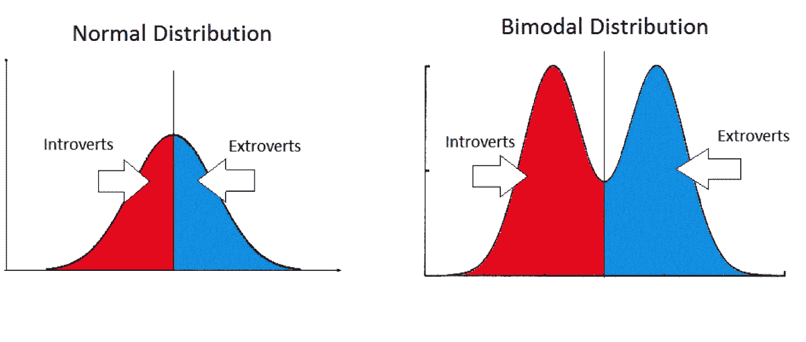

# 在数百个模型和研究论文中理解冠状病毒预测

> 原文：<https://towardsdatascience.com/making-sense-of-coronavirus-predictions-amongst-hundreds-of-models-and-research-papers-fcbb2f614319?source=collection_archive---------45----------------------->

## 理解和解释冠状病毒感染和死亡人数的预测。

来源:[联合国新闻](https://news.un.org/en/story/2020/02/1056562)

在本文中，我将尝试帮助您在世界各地产生的数百种估计和模型中，以统计和现实的方式浏览新冠肺炎疫情。我将解释一下这些模型的架构，它们的主观性，以及解释它们的估计的过程。

在过去的两个月里，我们都看到了冠状病毒增长的多种估计和模型。其中许多，例如[的最新模型](https://www.usatoday.com/story/news/nation/2020/03/31/us-coronavirus-deaths-could-peak-mid-april-restrictions-states/5100513002/)预测到今年夏天结束时 84，000 美国人死亡，特别令人担忧。国家过敏和传染病研究所的福奇博士的另一个[模型](https://www.nbcnews.com/news/us-news/dr-deborah-birx-predicts-200-000-deaths-if-we-do-n1171876)预测，如果不采取行动，在最好的情况下，大约 20 万美国人死亡，在最坏的情况下，大约 220 万美国人死亡。

但是所有这些模型都有意义吗？这些预测正确吗？如果不是，鉴于从 10 万人死亡到大约 220 万人死亡的预测，我们如何对当前的全球形势做出明智的判断？本文旨在回答其中的一些问题。

# **预测模型的架构**

生成模型是旨在预测未来结果的模型，是给定历史数据和当前环境的未来情景的近似。模型可以简单到线性回归，也可以复杂到由数千层神经网络试图准确预测这些数字。每个模型都有特定的输入，例如关于人口的信息和关于病毒的信息。

每个模型的动态都是利用我们已知的冠状病毒信息构建的。例如，一个人可以在一天内感染多达六个不同的人。因此，在一个非常简单和不知情的模型中，我们将简单地将感染人数乘以 6 来获得第二天的估计值。但是生活没那么简单。关于人性和互动，有无数不同的复杂性需要在模型中加以考虑。例如，有一个人际交往的范围:一些外向的人一天与 20 个人交往，而一些人一周几乎不与 5 个人交往。

在建立模型时，设计了许多参数(例如相互作用的次数、病毒的寿命、传播的概率、人类使用口罩的概率等。)并且每个参数被分配一个“分布”值。这些分布反映了我们对正常人类生活中所代表的一系列价值观的信念。在统计学术语中，它们被称为我们模型的先验。

这是外向者和内向者的简单分布。在左图中，我们假设一个简单的钟形曲线来表示这个分布。在右图中，我们假设了一个双峰分布，其中外向者和内向者的数量有一个峰值，而光谱中的其他人数量较少。(来源:[兴旺图](https://medium.com/@ThriveMap/introverts-need-not-apply-6dd64104e891))

所有这些先验分布连同所有这些参数之间相互作用的假设动力学一起被输入到模型中。一个数据科学家决定每个参数对我们因变量(感染人数)的可能影响。该模型接受我们的假设和分布以及历史数据，并根据我们对感染增长和输入参数的假设，尝试获得感染数量的最佳估计值。

**但这里有一个问题:**如果这些模型依赖于这样的主观假设，数据科学家可以定义不现实的假设，并预测一些根本不现实的感染/死亡。那么我们如何确保模型是可靠的呢？

# **评估模型的可靠性**

每个模型的可靠性都受到模型中编码的假设和动态的影响。如果假设一个简单的指数增长，模型结果将会比实际结果膨胀得多。与此同时，如果我假设一个人只能影响另一个人，我会看到过于乐观的估计。(这种估计叫做贝叶斯推断。如果你有兴趣，可以在这里阅读更多关于贝叶斯推理及其主观性[的内容。](https://www.cs.toronto.edu/~radford/res-bayes-ex.html))那么，这为什么这么难呢？在我们回答这个问题之前，有一个有趣的事实:

> 所有的模型都是错的，但有些是有用的。

上面的引用仅仅意味着我们对冠状病毒感染和死亡人数的预测永远不会正确。这仅仅是因为自然不会告诉我们不同输入因素如人口密度和输出变量之间的确切关系。如果大自然能说话，我们就能揭开它所有的秘密，但遗憾的是事实并非如此。

每一个模型和模拟都是试图根据我们收集的历史数据和信息来估计自然关系。不可能有一个“正确”的模型。因此，模型永远不可能完全正确。但这不代表模特帮不上忙。

# **模型有什么帮助？**

模型不能给我们精确的结果，这意味着只针对一个正确估计的确定性模型是不可靠的。但是评估最好的情况和最坏的情况是很有价值的。如果你回到我在第一段中链接的文章，这些文章实际上提供了这些估计的界限。福奇博士的模型实际上预测，在最好的情况下，夏季会有 10 万到 20 万人死亡，在最坏的情况下(如果我们不采取任何行动)，会有 160 万到 220 万人死亡。

**为什么这些估计区间这么大？**如果再小一点，理解和规划就容易多了。但这就是问题所在——我们对冠状病毒、它的毒株、它的能力、它的生长模式、它的死亡率等知之甚少。来预测比这更确定的估计。这并不意味着我们不应该尝试建立模型。但是我们应该小心我们的知识差距对我们的模型的能力的影响。

这些模型帮助我们评估形势的深度，并做最坏的打算。当谈到拯救生命时，考虑最坏的情况并为其做好计划是非常重要的，因为在最坏的情况下，社会付出的代价远远高于一般情况。

在某些情况下，不确定性比确定性更好，尤其是当涉及到诸如拯救生命这样的关键问题时。这听起来违反直觉，因为你想要确定一个场景，对吗？不完全是。

# **确定的成本和敏感度**

在统计模型中，我们评估每个场景的效用。一个场景比另一个场景成本高多少？当政治家和公共卫生官员依赖近似模型的估计时，回答这样的问题在决策过程中是非常重要的。

但是这种成本的敏感性随着环境的变化而变化。在一个试图预测向你推荐的产品的在线市场的背景下，预测一个错误的推荐产品不会对你对该网站的忠诚度产生巨大的影响，所以这对公司来说是一个非常小的损失。因此，公司官员很少关注评估他们预测推荐产品的绝对最坏情况。

但是当涉及到公共卫生时，事情就没那么简单了。如果一个国家为一个并非最坏的情况做打算，他们就会拿成千上万人的生命冒险。尽管人们对一条生命的成本存在巨大争议，但人类生命的成本大约为 1000 万美元。(注意:我不完全同意给生命贴上价格标签，但你应该读一下[这篇文章。)](https://www.wsj.com/articles/why-the-government-puts-a-dollar-value-on-life-1458911310)

为生命定价的原因之一是为了突出公共健康规划的重要性。如果一个在线市场由于对其产品的错误预测而失去了一个客户(这是极不可能的)，总的利润损失将少于 100 美元。另一方面，由于错误的卫生规划而失去的每一个生命都会给国家带来 1000 万美元的损失。

> 重要的不是预测，而是对这些预测的解释和衡量不同情景的方法。

除非有人从零开始建立模型，否则大多数现有模型不会衡量其最坏情况，而是将它们的估计值作为从最好情况到最坏情况的区间。

需要准确权衡这些情况，并考虑它们的敏感性。让我们在这里做一点数学计算。如果我们使用我们对生命成本的估计，仅在美国，我们就在人类生命方面损失了大约 1-2 万亿美元(这还不包括仅在美国估计约 3 万亿美元的经济损失)。哦，等等！这绝对是最好的情况。最糟糕的情况是，仅人类生命一项，我们就损失了 16—22 万亿美元。**如果我们不能恰当地计划和实施每一项我们可能采取的干预措施，我们将在最好的情况下损失 1 万亿美元的基础上，再损失 15 万亿美元的生命。**

给人的生命定价是困难的。这些估计被称为“估计”是有原因的，因为它们并不真实。他们是不正确的，因为你无法量化一个人的死亡对其整个家庭和其他人的情感、精神和经济负担。但是这些估计对于量化如果我们现在不采取行动可能遭受的损失是很重要的。

在数据科学的世界里，你可以尽可能地建立最奇特的模型，并添加多层神经网络。但是如果你不能将你的估计量化为现实生活中的成本，从而引导决策走向正确的道路，那你就大错特错了。

# **理解预测并告知自己**

您可以采取以下一些步骤来评估您所阅读的预测的质量:

1.  确保这些预测是由国家认可的合法来源提供的。必须由了解公共卫生和数据科学的专家提供。
2.  **仔细阅读模型的假设和融入其中的复杂性。**如果有人只是简单地模拟指数增长曲线，而不了解人类互动和冠状病毒的复杂性，您可以立即关闭标签。
3.  **处理最坏的情况**。这很重要。对公共卫生规划持乐观态度是一个严重的错误。这意味着你需要提前采取预防措施(自我隔离、社会距离、隔离、保持卫生等)。)并遵循公共卫生指南。不要被看起来太好的预测所左右。
4.  最重要的是，不要认为预测是骗局。这些预测是为了帮助你了解我们可能失去生命的程度。你们今天的行动将决定我们在未来几个月将遭受的人类生命损失(以万亿美元计)。

如果您有任何问题或希望与我联系，[这是我的 LinkedIn 个人资料。](https://www.linkedin.com/in/sohitmiglani/)

***编者按:*** [*走向数据科学*](http://towardsdatascience.com/) *是一份以数据科学和机器学习研究为主的中型刊物。我们不是健康专家或流行病学家，本文的观点不应被解释为专业建议。想了解更多关于疫情冠状病毒的信息，可以点击* [*这里*](https://www.who.int/emergencies/diseases/novel-coronavirus-2019/situation-reports) *。*