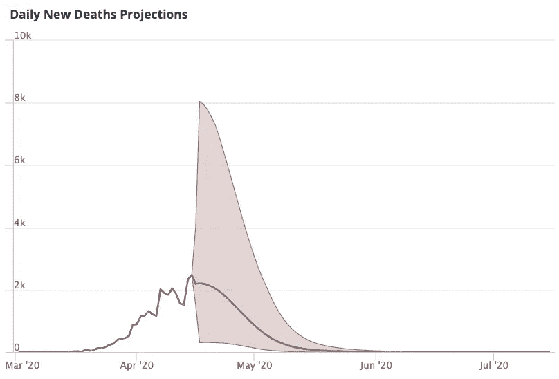
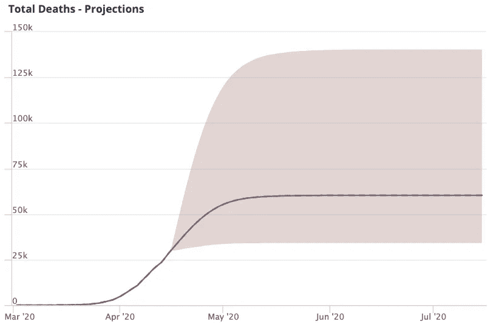
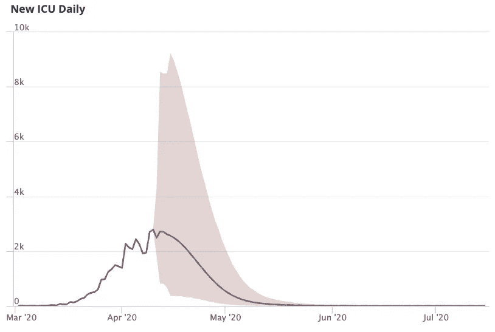
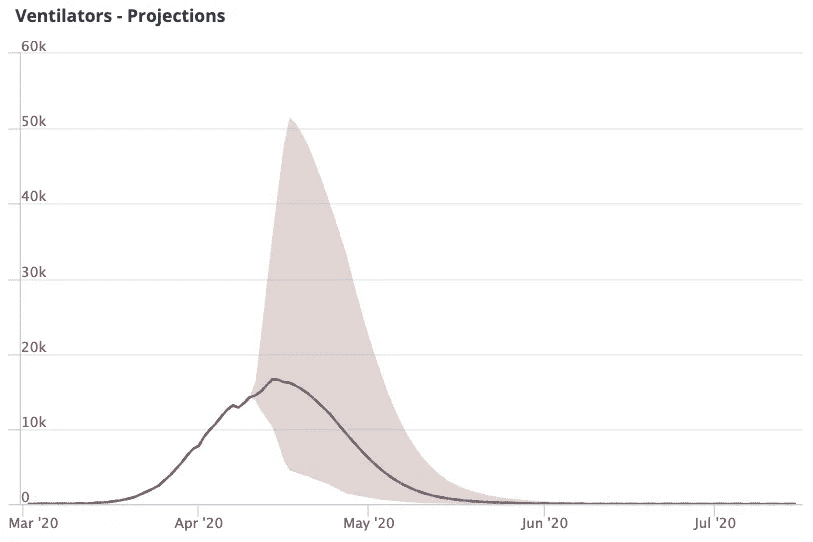
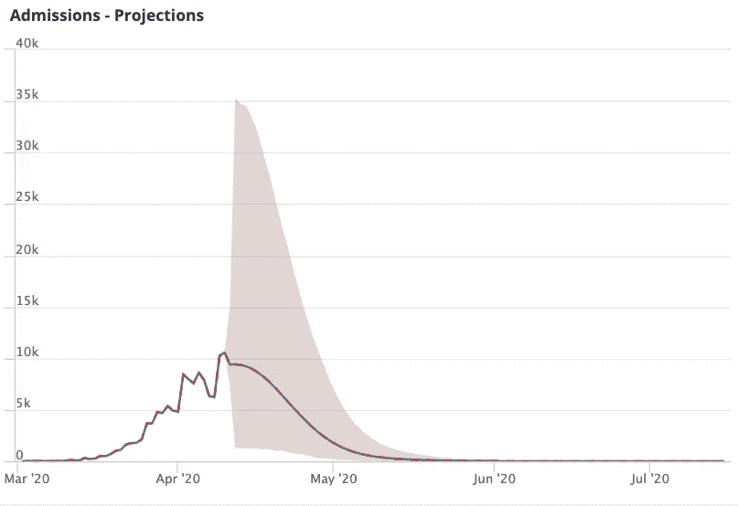

# 理解新冠肺炎预测数据

> 原文：<https://towardsdatascience.com/making-sense-of-covid-19-forecast-data-fd35b63c36e0?source=collection_archive---------48----------------------->

## IHME 天气预报是怎样做的，它们显示了什么？

IHME 模型被称为白宫冠状病毒特别工作组的首选模型

如果你想在我们讨论之前看一下数据，你可以在[已知冠状病毒数据中心](https://www.knowi.com/coronavirus-dashboards/covid-19-projections/)找到可视化的预测模型。

# 白宫的首选模式——但它有什么好的吗？

卫生计量与评估研究所，或 IHME，最近因其新冠肺炎预测模型而备受关注。他们的模型甚至被称为白宫冠状病毒特别工作组的首选模型。但是这些模型也引起了很多关于它们的有效性和如何使用它们的怀疑和担忧。在本文中，我们将快速浏览这些模型中的一些数据，并尝试给出它们是如何创建的以及它们的局限性的适当背景。

# IHME 模式

首先，值得注意的是，IHME 模型不是一个流行病学模型。它既不是一个 SIR 模型，也不是一个计算更密集的基于代理的模型。IHME 预测是一个实证模型，它采用其他国家的死亡曲线形状，并试图将当前数据拟合到这些曲线上。IHME 模型从新冠肺炎病毒早期爆发的地区的数据开始，如武汉以及西班牙和意大利的一些城市。然后，他们使用自己的基于 Python 的开源曲线拟合工具(恰当地称为 [CurveFit](https://github.com/ihmeuw-msca/CurveFit) )将美国的死亡数据与武汉和其他选定地区的死亡率曲线进行拟合。

> IHME 预测是一个实证模型，它采用其他国家的死亡曲线形状，并试图将当前数据与这些曲线拟合

## 这个模型假设了什么？

这里最大的假设应该有些显而易见；该模型假设疾病在美国人群中的发展与在其他地区的发展相似。

这一点引起了最多的警报，因为正如批评者所说，美国各州都有不同程度的限制，没有一个州像武汉那样 100%封锁。

# IHME·新冠肺炎预测

这些预测大致可分为两类:死亡预测和医院资源预测。

在所有这些图表中，x 轴显示日期，y 轴显示计数(例如，在每日新增死亡预测图表中，y 轴显示死亡人数)。红蓝线显示了截至当前日期的实际值。在这一点上，我们正在寻找预计的价值。对于预测值，粉红色部分显示上限和下限，直线显示预期值。

## 死亡预测

第一类是死亡预测。这里的目标是简单地预测每天预计的新死亡人数，假设全国各地完全就地隔离。

作者提供的图片(参见完整可视化[此处](https://www.knowi.com/coronavirus-dashboards/covid-19-projections/)

*每日新增死亡预测*图表显示每天的死亡人数(不要与下一个图表混淆，下一个图表显示的是累计死亡人数)。这份每日新增死亡人数预测显示了美国死亡率的增长曲线，也是决定曲线平滑程度的最重要的视觉工具。如果你仔细观察这张图表，你会发现这张图表显示美国的死亡人数在 4 月底 5 月初达到高峰，然后急剧下降，直到 5 月底。但是和所有的 IHME 视觉化一样，不确定性是巨大的。高峰时，上下限从 8000 人死亡(一天内)到 1000 人以下。

图片由作者提供(参见完整可视化[此处](https://www.knowi.com/coronavirus-dashboards/covid-19-projections/))

第二个死亡图表是*总死亡人数-预测*图表，显示了总的累积死亡人数。正如你从第一张图表中所猜测的那样，随着每日新增死亡人数的骤降，累计死亡人数也趋于平稳。但是，这里的不确定性是巨大的。总死亡人数的上限和下限从大约 40，000 到 140，000，极大地限制了该模型预测美国新冠肺炎死亡人数的实用性。

## 医院资源预测

第二类是医院资源预测。正如 IHME 在其网站上提到的，这篇文章的最初目标是预测医院的资源需求。他们希望创建预测来帮助医院管理者预测新冠肺炎带来的资源需求。

因此，这些模型试图预测对 ICU 病床、非 ICU 病床和有创呼吸机的需求——所有这些都适用于新冠肺炎病例。

作者提供的图片(参见完整可视化[此处](https://www.knowi.com/coronavirus-dashboards/covid-19-projections/))

*新的 ICU 每日*图表显示了全美 ICU 入院的预期需求。该曲线的形状与每日死亡曲线的形状非常相似——这似乎是符合逻辑的，因为大多数新冠肺炎死亡病例可能会在 ICU 度过一段时间。

图片由作者提供(参见完整可视化[此处](https://www.knowi.com/coronavirus-dashboards/covid-19-projections/))

*呼吸机预测*图表显示了新冠肺炎病例对有创呼吸机的预期需求。

作者提供的图片(见完整可视化[此处](https://www.knowi.com/coronavirus-dashboards/covid-19-projections/))

*入院预测*图表显示了非 ICU 新冠肺炎病例的预计病床需求。

# 对 IHME 模式的担忧

> “所有的模型都是错误的，但有些是有用的”——这是乔治 E.P 博克斯的统计格言

如上所述，IHME 模型使用武汉的数据进行预测，这一事实引起了强烈的批评。

虽然流行病学标准是使用 SIR 模型或基于代理的模型，但 IHME 模型是纯统计的。它是通过将新的数字与现有的分布(如武汉或意大利)进行拟合而创建的。这意味着该模型现在允许根据领域专长调整参数(如死亡率)。

这并不是说 IHME 模式没有价值。像 IHME 这样的纯经验模型可能是强有力的预测工具——特别是当像传染率和特定人群死亡率这样的因素没有被很好地理解时。但是，任何参考 IHME 模型的人都必须小心考虑所涉及的假设，并且只在适当的背景下使用它们。

# 大外卖

最重要的一点是，记者(和美国政府)在使用和报道这些 IHME 模式时需要谨慎。他们需要对模型中的假设以及这些假设带来的限制保持敏感。不同的模型适用于不同的领域。在疫情期间，对模特的误解可能是生死攸关的事情。

# 了解更多信息并查看数据

如果你想亲自看看 IHME 的预报数据，你可以在 [Knowi 冠状病毒数据中心](https://www.knowi.com/coronavirus-dashboards/covid-19-projections/)找到实时的可视化效果。

IHME 在 [Knowi 冠状病毒数据中心](https://www.knowi.com/coronavirus-dashboards/covid-19-projections/)的预测截图(图片由作者提供)

## IHME 资源公司

IHME 在 Medrxiv 预印本服务器上发表了一篇描述这些预测的科学论文。这意味着它还没有经过同行评审，而是正在接受整个科学界的检查。

[点击 Medrxiv](https://www.medrxiv.org/content/10.1101/2020.03.27.20043752v1.full.pdf) 阅读 IHME 论文全文

[查看 IHME 常见问题，他们讨论了一些这方面的问题。](http://www.healthdata.org/covid/faqs)

# 放弃

***编者按:*** [*走向数据科学*](http://towardsdatascience.com/) *是一份以数据科学和机器学习研究为主的中型刊物。我们不是健康专家或流行病学家，本文的观点不应被解释为专业建议。想了解更多关于疫情冠状病毒的信息，可以点击* [*这里*](https://www.who.int/emergencies/diseases/novel-coronavirus-2019/situation-reports) *。*