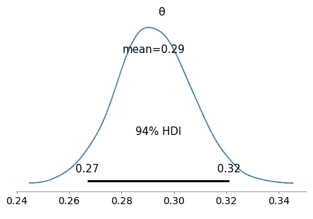
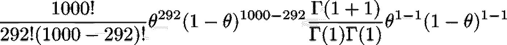
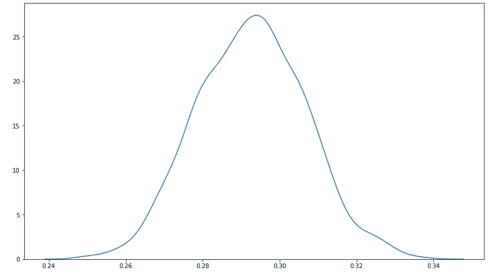

# 理解共轭先验

> 原文：<https://towardsdatascience.com/making-sense-of-posteriors-and-conjugate-priors-17f01e16c270?source=collection_archive---------41----------------------->

## 了解在某些情况下，如何手动计算后验分布！

[斯科特·格雷厄姆](https://unsplash.com/@sctgrhm?utm_source=medium&utm_medium=referral)在 [Unsplash](https://unsplash.com?utm_source=medium&utm_medium=referral) 上拍照

假设你扔了一枚硬币 1000 次，得到了 292。你想知道通过一次抛硬币获得正面的概率是多少——但是你不仅仅想要一个估计值，你想要整个分布。如果你定义

*   *y* :你获得的人头数
*   θ :一次掷硬币获得正面的概率

然后将 *y* 建模为[二项式分布](https://en.wikipedia.org/wiki/Binomial_distribution)，其中 *n=1* ，000 *，*那么后验分布很容易获得，只需几行代码:

作者图片

但是…如果没有 PyMC3 的帮助，我们能分析计算出这个分布吗？

## 贝叶斯定理

从[贝叶斯定理](https://en.wikipedia.org/wiki/Bayes%27_theorem)，我们得到:

作者图片

将此应用于我们的问题，我们得到

作者图片

代入这两种分布的定义，我们可以把右边的重新写成

作者图片

去掉常数(不依赖于θ)，我们可以把它代入上面的方程，得到

作者图片

我们可以(通过观察)将其识别为贝塔分布 *(292+1，1000–292+1)*。因为我们的后验和先验来自同一个家族，所以贝塔分布被称为二项分布的共轭先验。

如果我们尝试使用 [scipy](https://www.scipy.org/) 绘制这个图，我们将得到 PyMC3 为我们计算的相同分布:

作者图片

这就是共轭先验的好处:它们使得后验概率易于分析。

手动计算后验概率是加深理解的绝佳练习。然而，一般来说，我们不会发现自己处于如此幸运的境地——这时我们需要 PyMC3 这样的工具。

## 进一步阅读

为了获得优秀实用的贝叶斯统计指南，我推荐阅读[用 Python 进行贝叶斯分析](https://www.packtpub.com/product/bayesian-analysis-with-python-second-edition/9781789341652)和收听[学习贝叶斯统计播客](https://learnbayesstats.anvil.app/)。