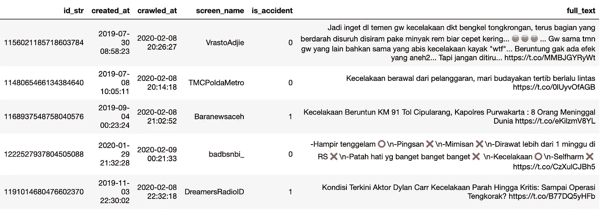
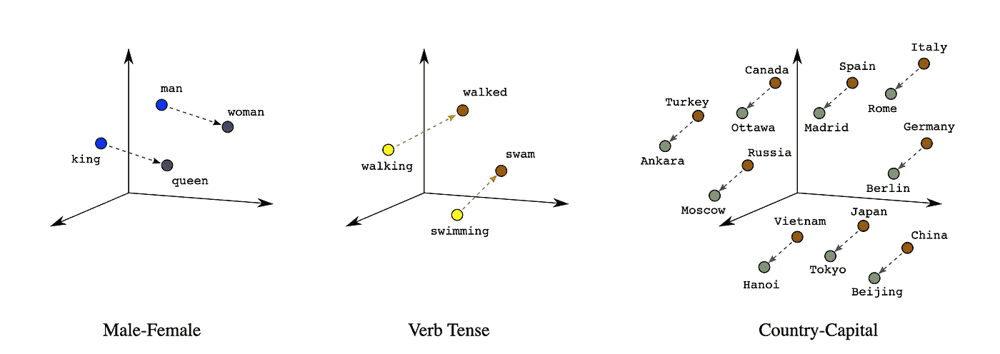
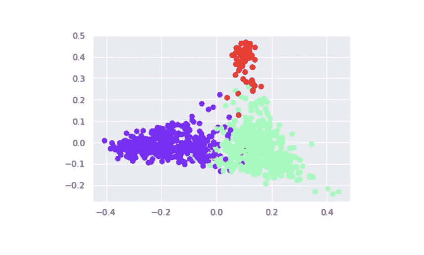
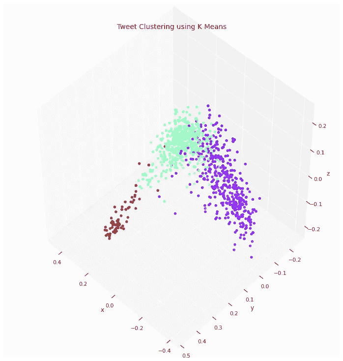
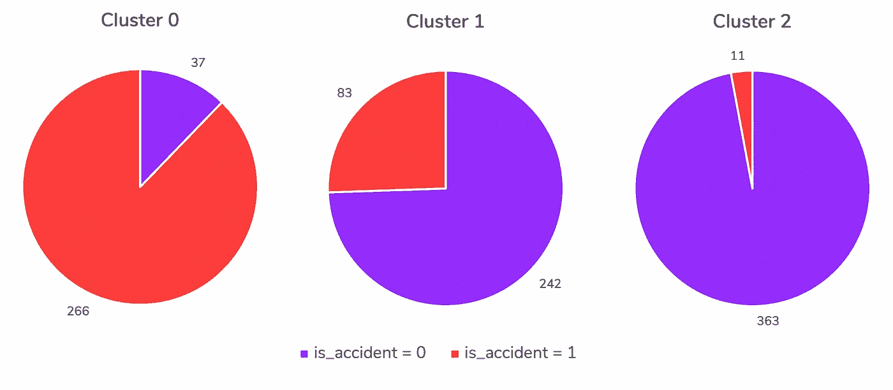
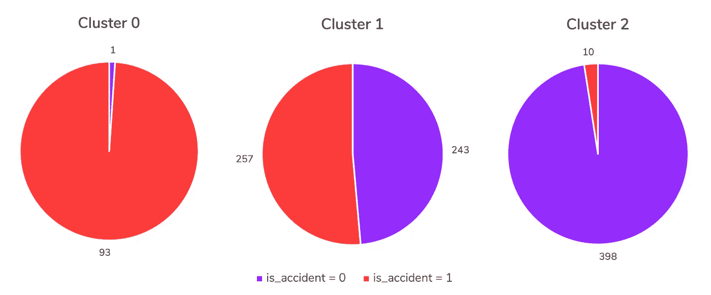

# 理解文本聚类

> 原文：<https://towardsdatascience.com/making-sense-of-text-clustering-ca649c190b20?source=collection_archive---------2----------------------->

## 数据科学/文本挖掘

## 又能有多大用处？


[真诚媒体](https://unsplash.com/@sincerelymedia?utm_source=medium&utm_medium=referral)在 [Unsplash](https://unsplash.com?utm_source=medium&utm_medium=referral) 上拍摄的照片

文本无处不在，社交媒体是其最大的发电机之一。人们不断在许多平台上分享它们。我们可以使用文本挖掘方法将它们加工成有用的东西，而不是听之任之。一个著名的应用是情感分析，我们可以识别文本的观点是积极的、消极的还是中立的。但是在这里，我们将讨论另一种方法并理解它:**文本聚类**。

作为无监督学习的一部分，聚类用于对相似的数据点进行分组，而无需知道数据属于哪个聚类。所以从某种意义上来说，文本聚类就是关于相似的文本(或句子)是如何分组在一起的。但是，我们究竟如何确定一些文本是相似的呢？怎样才能告诉机器“树”这个词和“植物”相似？

> 把无监督学习想象成一种“物以类聚”的数学版本— [*卡西科兹尔科夫*](https://medium.com/u/2fccb851bb5e?source=post_page-----ca649c190b20--------------------------------)

对于那些不了解文本数据处理但和我在一起的人来说，这可能是压倒性的，我不会进入许多复杂的细节，而只是覆盖容易理解的重要点。

如果你不是一个程序员，你可以跳过代码部分。对于感兴趣的人，你可以访问 GitHub 上的完整代码。

事不宜迟，我们开始吧！

# 让我们开始了解数据

我们将使用可以从 Kaggle 下载的开源数据。感谢 Dody Agung 创建了这个 [**印尼交通事故**](https://www.kaggle.com/dodyagung/accident) 数据集。

完整的数据集包含超过 150，000 条推文(语言为印度尼西亚语)，关键字为“kecelakaan”(意思是**事故**)。它包含推文 id、推文发布时间、抓取时间、推文发布者的用户名和完整推文。

手动标记的数据集也是由创建者提供的，包含 1000 条推文及其标志，无论推文是否指示真实的事故。标志 1 表示事故，标志 0 表示非事故。我们将尝试使用这个带标签的数据集进行文本聚类。下面看一下数据。



# **文本预处理**

如上所述，如何确定某些文本是否相似？计算机只计算数字，所以我们把文本翻译成数字！

在我们开始之前，我们需要净化我们的文本。以这句话为例，让我们看看为什么我们需要清理它们:

> 安全驾驶对我们每个人来说都是必须的🚌公交车，🚗车，🚛卡车或🛵两轮车..！！😱😱😱

## 过滤和外壳折叠

表情符号不是文本，符号和特殊字符也不是，比如“.”, "!"、“~”等。我们将过滤这些数据，使其成为纯文本。

做案例折叠也是因为可能会有带“开车”、“开车”、“开车”字样的推文。我们将所有文本都小写，以使它们具有相同的格式。

在我们应用过滤和大小写折叠后，句子看起来会更清晰:

> 无论是驾驶公共汽车、卡车还是两轮车，安全驾驶对我们每个人来说都是必须的

## 词干和停用词移除

词干化(或者我们可以使用*词汇化*)是将一个单词简化为其基本形式的过程。这里的要点是单词“drives”、“driving”、“driven”有相同的上下文，所以我们使用它的基本形式“drive”。参见词干化和词条化的区别，[这里](https://nlp.stanford.edu/IR-book/html/htmledition/stemming-and-lemmatization-1.html)。

另一件事是删除停用词，如“是”、“和”、“或”等。停用词指的是我们语言中最常见的词。我们经常看到它们，它们是多余的，所以它不能提供真实的信息。因此，我们完全删除它们。

在我们应用词干并删除停用词后，句子将如下所示:

> 驾驶安全的道路必须我们每一个人是否驾驶公共汽车卡车两轮车

为了进行前面提到的预处理， [NLTK](https://www.nltk.org/) (自然语言工具包)是语言处理的常用工具，但是因为语言是印度尼西亚语，所以我们使用 [Sastrawi](https://github.com/sastrawi/sastrawi) 来代替。

## **文字嵌入**

这一部分是直观理解文本聚类如何工作的关键。我们可以很容易地找到一组整数/数的和、平均、计数，但是文本呢？在这一部分，我们将它们转换成数字。

有像 [CountVectorizer](https://scikit-learn.org/stable/modules/generated/sklearn.feature_extraction.text.TfidfVectorizer.html) 和 [TF-IDF](https://scikit-learn.org/stable/modules/generated/sklearn.feature_extraction.text.CountVectorizer.html) 这样的一键编码方法，但是我们将在这个实验中专门使用单词嵌入。基本上，单词嵌入所做的是**将单词表示为空间**中的向量，在空间中，相似的单词被映射到彼此附近。

这是一个三维空间中单词向量表示的例子。



来源:[机器学习速成班](https://developers.google.com/machine-learning/crash-course/embeddings)

为了将单词嵌入应用到我们的数据集，我们将使用 fastText 库。他们提供了印度尼西亚语的预训练模型，但相反，我们将尝试使用可用的 150，000+tweet 作为我们的语料库来训练我们自己的单词嵌入模型。我已经预先处理了文本，并将其保存在`twitter.txt`中。

默认情况下，fastText 的`train_unsupervised`将使用 skipgram 模型并输出 100 维向量。这些向量表示一条推文在 100 个维度内的位置。

如果你注意到我们没有对句子进行分词，原因是有了`get_sentence_vector`，它会自动对句子进行分词(将文本拆分成块)。更多细节可以从[这里](https://fasttext.cc/docs/en/python-module.html)了解车型。

FastText 还计算单词之间的相似性得分。使用`get_nearest_neighbors`，我们可以看到最相似的前 10 个单词以及每个相似性得分。分数越接近 1，该单词与给定单词越相似。

这是来自 fastText 网站的演示。

```
model.get_nearest_neighbors(‘accomodation’)
```

> [(0.96342，'容纳')，(0.942124，'容纳')，(0.915427，'容纳')，(0.847751，'容纳')，(0.794353，'容纳')，(0.740381，'容纳')，(0.729746，'便利设施')，(0.725975，'餐饮')，(0.703177，'容纳')，(0.

他们预先训练好的模型甚至知道`accomodation`的上下文可以是`catering`和`hospitality`。现在它更强大了，因为您注意到输入是对`accommodation`的拼写错误(是的，它可以处理错别字)。

我们的模型怎么样？我们去看看。

```
# Motorcycle in Bahasa Indonesia
model.get_nearest_neighbors(‘motor’)
```

> [(0.776196300983429，' sepedamotor ')，(0.7229066491127014，' motor ')，(0.7132794260978699，' sepeda ')，(0.69809305678772，' motore ')，(0.6889493465423584，' motor ')，(0.6859888988)。

```
# Car in Bahasa Indonesia
model.get_nearest_neighbors(‘mobil’)
```

> [(0.7426463961601257，'林塞克')，(0.7367433905601501，'塔布拉克')，(0.7266382575035095，'美孚')，(0.7141972780227661，'美孚哇')，(0.7097604274749756，'林塞克')，，

看起来不错！如果你是印度尼西亚人，你会清楚地说这些单词在同一语境中。像`mobilio`、`pajero`、`fortuner`、`mpv`这些词在印尼其实是家喻户晓的车模。

一旦训练完成，该模型将用于将每条推文转换成 100 维向量。这里有一个矢量推文的例子:

> [-0.03824997, 0.00133674, -0.0975338 , 0.07422361, 0.04062992, 0.15320793, 0.0624048 , 0.08707056, -0.04479782, 0.01363136, 0.17272875, -0.03097608, 0.05366326, -0.09492738, 0.06163749, 0.04166117, -0.0779877 , 0.11031814, 0.04414257, -0.04424104, 0.02991617, -0.02359444, 0.08660134, -0.01918944, -0.02529236, -0.06084985, 0.00374846, 0.07403581, 0.03064661, 0.0105409 , 0.02821296, -0.08867718, -0.00845077, -0.04583884, -0.03845499, -0.04432626, 0.08085568, 0.0762938 , -0.03690336, 0.00286471, 0.05640269, 0.08347917, -0.12400634, 0.06856565, 0.09385975, 0.07298957, -0.03306708, 0.07894476, -0.03820109, -0.05187325, -0.08153208, -0.05167899, -0.07915987, 0.05901144, 0.00445149, -0.14628977, 0.04536996, 0.12275991, 0.14212511, -0.04074997, 0.04834579, 0.1293375 , 0.13116567, 0.10201992, -0.1010689 , -0.01407889, -0.01707099, 0.13866977, 0.03039356, 0.08307764, 0.06886553, 0.08681376, 0.02241692, -0.0974027 , -0.02969944, -0.06031594, 0.07977851, 0.09534364, -0.0803275 , -0.18087131, 0.00296218, 0.06247464, -0.00784681, -0.0209177 , 0.10568991, -0.06968653, -0.07200669, 0.06571897, 0.01448524, 0.15396708, 0.00435031, 0.02272239, 0.05981111, -0.03069473, -0.11629239, -0.11808605, -0.01497007, -0.00028591, 0.02116462, -0.11837215]

那是一堆数字，不是吗？别试图在脑子里想象 100 个维度，好吗？人类不行(至少目前不行？)，但我们的计算机可以处理得很好！现在我们已经创建了单词 vectors，我们如何将相似的 tweets 聚集在一起呢？

# **文本聚类**

对于刷新，聚类是一种无监督学习算法，用于将数据聚类到 *k* 个组(通常数量由我们预先定义),而无需实际知道数据属于哪个组。聚类算法将尝试自己学习模式。我们将使用最广泛使用的聚类算法: [K-means](https://scikit-learn.org/stable/modules/generated/sklearn.cluster.KMeans.html) 。该算法可以根据推文与聚类质心的距离对推文进行聚类。

我们已经存储了 tweet 所属的集群输出。我们试着把它画出来，但是怎样才能把 100 个维度可视化呢？

主成分分析(PCA)来拯救。这是一种常用的降维技术。并非所有的数据都代表了全貌，一些数据可能解释了一些事情，而另一些则不能。PCA 背后的思想是提取数据的主成分。这些主成分可用于可视化我们的数据，因为它们代表了我们的大部分数据。

很好，现在让我们用 2D 散点图来形象化它。



一些数据点相互重叠。如果我们用 3D 投影呢？



漂亮！

## 但是等等，

你们中的一些人注意到了吗，我们可以只建立一个**三维单词嵌入模型**而不是一个 100 维模型，然后对它使用 PCA。让我们试试那个。

但是，我们如何比较哪种单词嵌入模型能够更好地聚类相似的推文呢？这就是我们使用手动标记的数据集来预测聚类的原因。我们可以检查真实的事故推文是否分组，是否与非事故推文在同一个簇中。

## 实验结果

我们来看看每个集群的标签比例。第一张图使用 3D 单词嵌入，而第二张图使用默认的 100 维。集群 0 的创建方式有很大的不同。



使用 3D 单词嵌入，聚类 0 正确分组了 87%的事故，聚类 2 正确分组了 97%的非事故。



使用 100D 单词嵌入，聚类 0 正确分组了~99%的事故，而聚类 2 正确分组了 97.5%的非事故。

有了更多的维度，单词嵌入模型可以捕捉更多的信息，生成更好的聚类分组。使用 PCA 的可视化只是为了直观的理解。更优选的是能够准确聚类具有相同属性/特征的文本！

现在，让我们看看每个集群是否有某种特征。我们将从每个集群中看到一些样本。我将为非印度尼西亚人描述每个集群的特征(或者您可以使用翻译)。

## 聚类 0-事故-红色点

推文特点:可信用户的现场报道。

> 23.27:@ PTJASAMARGA:Kun ciran KM 14—KM 16 arah Bitung PADAT，ada penanganan kecelakaan kendar aan truk fuso di 胡巴路，”,
> 
> 20.35 WIB # Tol _ Japek Kara Wang Timur KM 51-KM 52 arah Cikampek PADAT，ada Evakuasi Kecelakaan kenda raan Truk di la jur 1/kiri 和胡巴路,
> 
> '♻️ @SenkomCMNP: 5:09 Wib。行驶里程超过 16+600 公里。Masih Penanganan Petugas。第一次和第二次是在莱瓦蒂。(uda)@ sonorafm 92 @ RadioElshinta【https://t.co/9QqgdoBzQW', 

## 聚类 1 —绿色聚类—随机

Tweet 特征:随机用户的随机 tweet，通常讲述他们的个人故事。

> 剧情转折:我不知道阿比斯·凯瑟拉肯是谁，他可能是 UGD，也可能是其他人。\n\nTapi ya ga masalah sih。Yg 是一家专业的服装公司。[https://t.co/0e2zHaMkCo',](https://t.co/0e2zHaMkCo',)
> 
> 在 Margonda 的视频会议上，..你是阿拉..sedih liatnya..\n\nSudah biasa liat yg ky gt..Ga serem，tp sedih iya..图鲁特·贝尔杜卡..:(\ n \ n 最后一个是伊格·巴瓦·坎达兰，约恩·卢帕·贝尔多阿·贝佩吉安，哈特 2 和帕图希·兰布·阿雅..',
> 
> '👦:“Abis kecelakaan dimna lo？”\n\n👧:" Gue GK kecelakaan kok aman 2 aja " \ n \ n👦:" trus itu knapa 卡姆 lo ancur"\n\nSABAR。卡姆·杰莱克·艾芒，

## 集群 2——紫色集群——并非偶然

Tweet 特性:包含新闻和信息(不是关于实时事故，而是过去的事件)

> rekaman CCTV Kecelakaan Motor di PIK，潘德 Taman Grisenda:\ nht TPS://t . co/gmhlep 9 ivz mhmmdrhmtrmdhn \ n 访问精彩# MRahmatRamadhan '，
> 
> 波音公司老板 Minta Maaf[https://t.co/wLRhFy8oYE',](https://t.co/wLRhFy8oYE',)
> 
> 台湾议会也增加了贫困人口的数量。https://t.co/GSWqziaKDN',

# 那么，下一步是什么？

请记住，我们没有将标志数据提供给模型，但是**一半**的数据被正确地分组(~99%)到真实事故和非事故的箱中。了解了这一点，我们可以使用聚类方法来标记未标记的数据。标记数据集的最初目的是解决分类问题(监督学习)，但是正如我们所看到的，聚类技术可以用来进一步丰富它。

> **“我们没有更好的算法。我们只是有更多的数据。”彼得·诺维格**

有时候，更多的数据(当然是质量数据)比一个算法的改进有用得多。有了更多更好的数据，即使是简单的算法也能给出很棒的结果。在我们使用 3D 与 100D 单词嵌入模型的实验中，我们也可以看到这种现象，对吗？

这是我的一个类比:

> 一辆好的赛车可能足够快来赢得你的比赛，但你只能用一辆更好的车来取得更好的成绩。
> 
> 你的驾驶技术就是算法，车就是数据。

因此，我希望阅读这篇文章的人能够对我们如何处理文本数据并将其用于文本聚类有更多的了解。如果有任何错误，请随意评论或指出。

谢谢大家！祝大家平安健康。

## 参考

[1] Saputro，D. A .，& Girsang，A. S .，[使用来自社交媒体的机器学习对交通事故信息进行分类](https://doi.org/10.30534/ijeter/2020/04832020) (2020)，《国际工程研究新兴趋势杂志》，8(3)，630–637

[2] Cassie Kozyrkov，[无监督学习去神秘化](https://hackernoon.com/unsupervised-learning-demystified-4060eecedeaf) (2018)，黑客正午

[3]博雅诺斯基，皮奥特&格雷夫，爱德华&茹林，阿曼德&米科洛夫，托马斯。，[用子词信息丰富词向量](https://arxiv.org/abs/1607.04606) (2017)，计算语言学协会汇刊

[4] [嵌入](https://developers.google.com/machine-learning/crash-course/embeddings/)，机器学习速成班

*特别感谢* [*奥马尔·阿卜迪拉*](https://medium.com/u/515de9dc778a?source=post_page-----ca649c190b20--------------------------------)*[*阿德里安·阿尔法里斯*](https://medium.com/u/47cb6f2f50b6?source=post_page-----ca649c190b20--------------------------------)*[*纳迪娅·毛利·阿文塔*](https://medium.com/u/764dee96034b?source=post_page-----ca649c190b20--------------------------------)*[*斯蒂芬妮·苏吉哈托*](https://medium.com/u/c5ecd26c517e?source=post_page-----ca649c190b20--------------------------------) *，以及* [*拉哈真·仁德萨里*](https://medium.com/u/82be1624681f?source=post_page-----ca649c190b20--------------------------------)***