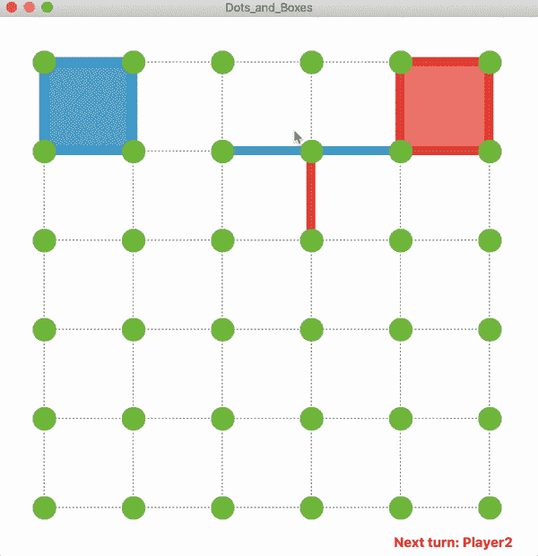
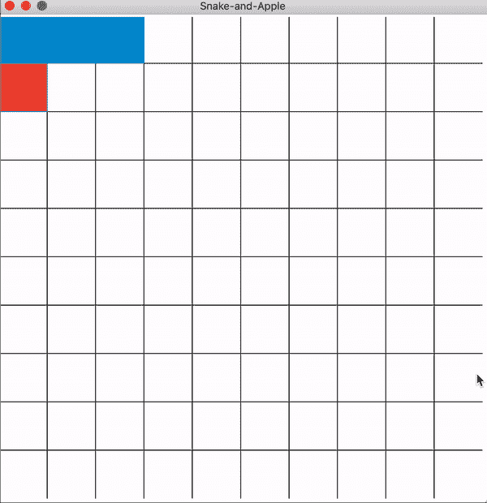
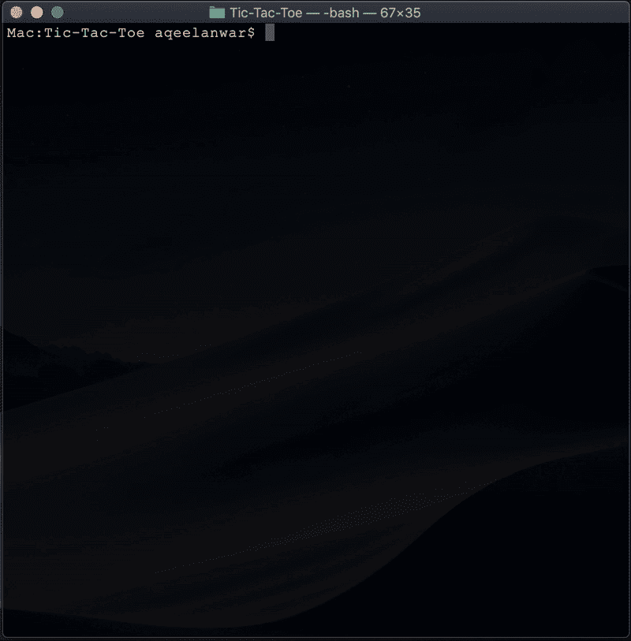
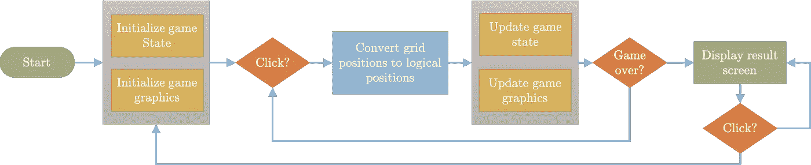
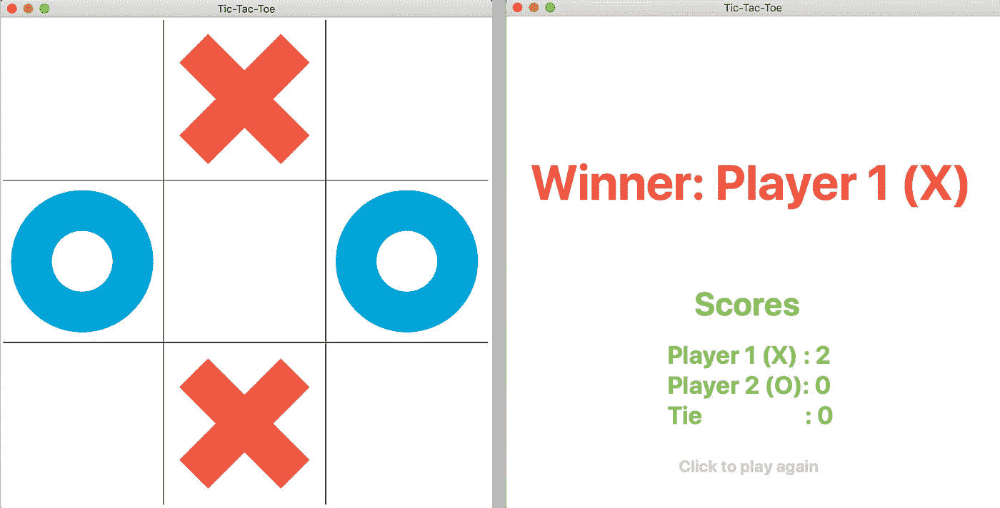
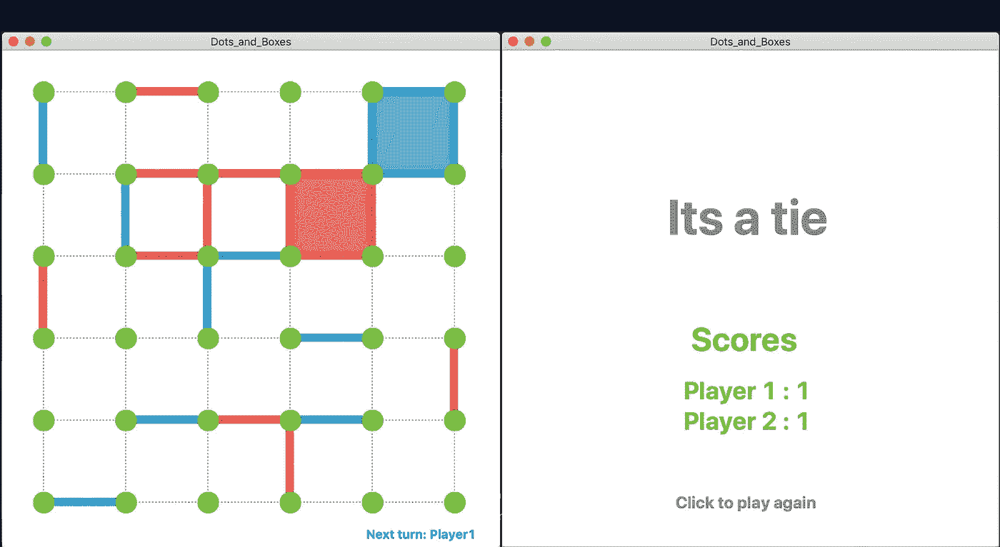
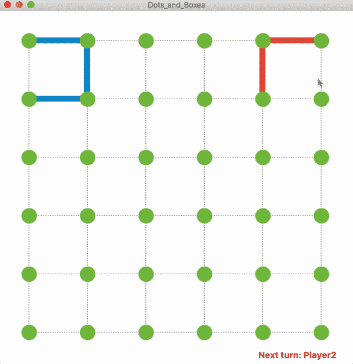
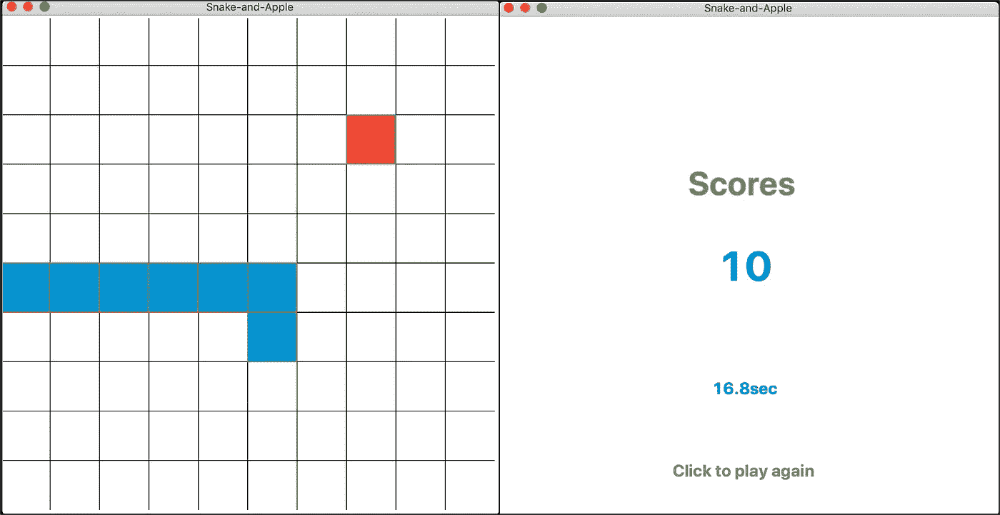

# 用 Python 制作简单的游戏

> 原文：<https://towardsdatascience.com/making-simple-games-in-python-f35f3ae6f31a?source=collection_archive---------3----------------------->

## 交互式 python 代码，用于井字游戏、点和盒子游戏以及蛇和苹果游戏

在本文中，我将详细介绍如何使用 Tkinter 包在 python 中创建简单的游戏，如井字游戏、点和盒子游戏以及蛇和苹果游戏。文章分为以下内容

1.  Tkinter 简介
2.  游戏流程图
3.  代码的结构
4.  例如，井字游戏、点和方框游戏、蛇和苹果游戏

# 使用 Tkinter 的 GUI

Tkinter 是 python 的标准 GUI 框架，与 python 3 捆绑在一起。一个伟大的初学者教程可以在这里找到。本教程的重点不是 Tkinter，而是如何使用它来创建简单的游戏。我们将使用的两个主要部件是

*   **画布:**在窗口上绘制游戏图形
*   **绑定:**捕捉用户输入。

## 画布部件:

Tkinter 上的 canvas 小部件用于在窗口上绘制几何对象。它有画各种形状的方法。简单游戏最常用的方法如下

*   **Create_line():** 绘制线条
*   **Create_oval():** 画圈
*   **Create_text():** 在窗口上打印文本
*   **delete():** 清除窗口中的绘制对象

## 绑定小部件:

Bind 用于接收鼠标点击事件的输入。可以在 bind 方法中使用以下参数来标识鼠标单击的类型

*   **<按钮-1 > :** 识别鼠标左键点击
*   **<按钮-2 > :** 识别鼠标中键点击
*   **<按钮-3 > :** 识别鼠标右键

bind 方法将上述参数作为第一个参数，将模块名作为第二个参数。当参数定义的鼠标点击事件被识别时，该模块被调用。

# 游戏流程图:

现在我们已经对 Tkinter 有了一个基本的概述，下面我们来画一个简单游戏的基本流程图。

根据一些游戏参数(如网格大小、颜色、文本和其他初始化特征)，游戏将初始化，然后开始寻找用户输入(以鼠标点击的形式)。一旦接收到，网格位置(鼠标点击的窗口的 x，y 坐标)将被转换成游戏相关的逻辑位置。然后，这些逻辑位置将用于更新在 python 中作为变量存储的游戏内部状态，并使用 canvas 方法更新游戏图形。这个过程会一直重复，直到游戏结束(这将取决于鼠标点击和游戏的内部状态)。游戏的结果将会显示出来。鼠标点击事件将被添加到结果屏幕，供用户选择他或她是否想再次玩游戏。

# 代码结构:

为了让代码有一个更好的逻辑组织，我们将功能分为三类。

1.  初始化功能
2.  绘图功能
3.  逻辑函数

## 初始化功能:

这些函数负责设置游戏的初始状态。这些包括定义游戏变量、初始化游戏图形、游戏结束时重置游戏变量、定义画布和绑定小部件等。初始化功能将主要处理在新游戏开始或游戏结束并需要再次玩的情况下设置游戏。

## 绘图功能:

顾名思义，这些函数将负责在 Tkinter 窗口上绘制基于游戏的图形元素。基于上面提到的基本画布绘制方法，我们将创建特定于我们游戏的高级绘制功能。这些高级绘图功能将被用作更新游戏图形的构建模块。

## 逻辑功能:

这些功能将与游戏图形无关，将处理游戏逻辑。这些包括但不限于跟踪游戏状态、接收用户输入、更新游戏状态、检查当前移动是否合法、跟踪玩家分数、检查游戏是否结束、决定游戏结果等。

既然我们已经讨论了一些游戏元素的基础知识，让我们来看看一些带有工作代码的例子

# 示例 1:井字游戏:

## 游戏代码:

工作代码可以从 [***这里***](https://github.com/aqeelanwar/Tic-Tac-Toe) 下载

## 游戏截图:

## 游戏预览:

## 控件:

1.  玩家 X 开始游戏
2.  单击每个网格放置一个符号
3.  游戏的结果会在游戏结束时显示
4.  保持对玩家分数的跟踪
5.  单击结果屏幕上的任意位置再次玩游戏

## 演练:

该代码使用大小为 3x3 的数组来跟踪游戏，即棋盘的状态。“x”标记为-1，而“O”标记为 1。所有未被占用的盒子被标记为 0(零)。用户在一个框内单击，用 bind 方法“click”捕获事件。然后，网格位置被转换，以标识发生单击事件的盒子。基于玩家，只有当盒子还没有被占用时，代码才在识别的盒子中画一个“X”或“O”。电路板状态也会更新。每一回合，代码都会检查是否有玩家赢了。这是通过在板状态的 3x3 阵列中寻找模式来完成的。当任何一方获胜或所有盒子都被占据时，游戏结束。在这个阶段，产生显示获胜者和每个玩家的分数的结果屏幕。

# 示例 2:点和方框:

## 游戏代码:

工作代码可以从 [***这里***](https://github.com/aqeelanwar/Dots-and-Boxes) 下载

## 游戏截图:

## 游戏预览:

## 控件:

1.  指定游戏的大小
2.  玩家 1 开始游戏
3.  单击边缘来标记它们
4.  如果做了一个盒子，它会用玩家指定的颜色变暗
5.  当所有的边都被标记后，结果显示在结果屏幕上
6.  单击结果屏幕上的任意位置再次玩游戏

## 演练:

该代码使用一个大小为*(num _ dots-1)x(num _ dots-1)*的数组来跟踪每个框*的标记边数。每当玩家 1 标记一个盒子的边缘时，与该盒子相关联的数组的值减 1，并且当它被玩家 2 标记时，它增加 1。每当这个数组中的任何一个元素的值达到-4(或 4)时，这表明玩家 1(玩家 2)已经成功地创建了这个盒子。*

玩家点击圆点之间的边缘来激活/标记它们。仔细计算每条边的激活面积，激活面积对应于位于边中间的正方形，其面积为盒子面积的 1/3。一旦标记了边缘，网格位置就被转换以识别对应于该边缘的框，并且对应于这些框的数组的值被递增/递减。当所有的边都被标记后，游戏就结束了。结果屏幕然后显示赢家和每个玩家标记的方块数。

# 例 3:蛇和苹果:

## 游戏代码:

工作代码可以从 [***这里***](https://github.com/aqeelanwar/Snake-And-Apple) 下载

## 游戏截图:

蛇和苹果游戏

## 游戏预览:

## 控件:

1.  游戏从一条等待用户输入的长度为 3 的蛇开始
2.  键盘上、下、右和左用于导航
3.  游戏的结果会在游戏结束时显示
4.  单击结果屏幕上的任意位置再次玩游戏

# 总结:

讨论了使用 Tkinter 包在 Python 中制作简单游戏的基本概要。提供了三个带有代码的示例，为用户提供了创建其他简单游戏的起点和基本理解。该代码可从以下链接获得

*   [井字游戏](https://github.com/aqeelanwar/Tic-Tac-Toe)
*   [点和方框](https://github.com/aqeelanwar/Dots-and-Boxes)
*   蛇和苹果

如果这篇文章对你有帮助，欢迎鼓掌、分享和回复。如果你想了解更多关于机器学习和数据科学的知识，请关注我@[**Aqeel an war**](https://medium.com/u/a7cc4f201fb5?source=post_page-----f35f3ae6f31a--------------------------------)**或者在**[***LinkedIn***](https://www.linkedin.com/in/aqeelanwarmalik/)***上与我联系。***