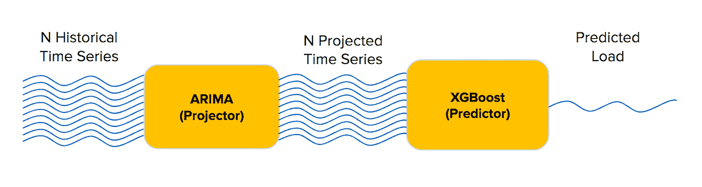
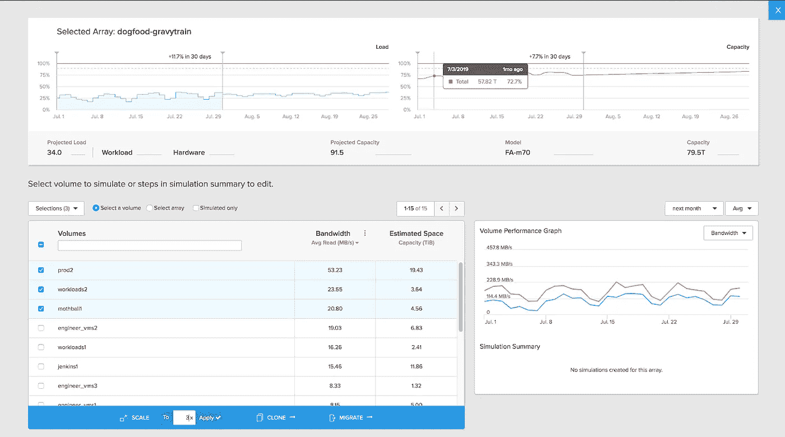

# 实现从公共云到内部的人工智能之旅

> 原文：<https://towardsdatascience.com/making-the-ai-journey-from-public-cloud-to-on-prem-ee33996e085c?source=collection_archive---------60----------------------->

## 从一个深度学习团队学到的经验教训

*与* [*法尔汉阿布罗尔*](https://medium.com/u/3558811b6b16?source=post_page-----ee33996e085c--------------------------------) *联合发文。*

## 阵列遥测的机器学习

我们 Pure Storage 的一个机器学习团队致力于一系列预测、回归和分类问题。我们构建的核心技术是为客户提供预测性能规划器。它对存储阵列进行建模，并根据来自其上运行的工作负载的信号预测其性能。这些信号包括读写带宽、IOSize、重复数据删除率、模式等。

在高层次上，我们的系统收集了过去 1 到 12 个月的时间序列数据，用于 *N* 特性，并预测系统在未来 1 到 12 个月的性能。然后，根据多个系统瓶颈(如 CPU、SSD、I 端口等)的导数来分析计算性能。(统称为“负载”)。

我们当前的模型将问题分成两部分:第一部分预测特性的时间序列，第二部分使用回归模型预测相关的负载。

时间序列预测基于 [ARIMA](https://www.machinelearningplus.com/time-series/arima-model-time-series-forecasting-python/) 和其他一些去趋势统计技术——即*而非*深度学习。我们发现，如果不进行重大调整，这个模型很难在大量情况下表现良好。作为一个开发团队，我们的目标是开发一个高度精确的模型，然后可以部署到生产中。

我们决定尝试基于深度学习的模型，看看我们是否可以通过从时间序列中直接预测负载来改善我们的时间序列模型或我们的整个管道。

数据集由从我们的遥测系统( [Pure1](https://www.purestorage.com/products/pure-1.html) )提取的约 25GB 的时间序列数据组成，并存储为 csv 文件。Pure1 每 30 秒从我们部署的系统中传输一次遥测数据。今天，我们每天捕捉大约 600 亿个事件。

在本帖中，我们将回顾我们所面临的一些挑战——从数据集规模到软件堆栈再到基础架构。

# 站在巨人的肩膀上…或者不是

当我们开始这个项目时，我们找到的最好的文献是来自优步的一篇论文。他们使用编码器-解码器架构来学习时间序列的结构，然后使用单独的神经网络进行推理。

我们试图复制这篇论文，但遇到了几个问题。这篇论文是每日的单变量时间序列预测，我们试图做每小时 N 到 1 的多变量时间序列预测。我们得到的模型只能学习预测值的平均值，并且具有较高的训练和测试误差。

最终，我们意识到我们建模的数据比论文中使用的数据要大得多，也复杂得多。

这提出了一系列我们必须回答的问题。首先，我们必须了解不同的层次如何学习时间序列的特征。第二，我们必须评估哪种层和拓扑能够提供更好的准确性。最后，我们必须探索层神经元获得良好性能所需的规模。

所有这些意味着我们需要更多的实验，我们需要它们更快地给我们答案。

# 更多的实验，更快的实验

我们对开发环境的主要要求是**让我们的数据科学家更有生产力**——这意味着消除他们实验速度的任何瓶颈。对我们来说，解决这个挑战意味着什么

➊提高硬件灵活性
➋转向全天候测试

我们的数据科学家已经做了很好的工作，但是他们只在白天工作(当然！)，他们不得不通过比我们喜欢的更慢的基础设施来满足他们的培训工作。

我们以前在公共云中运行所有的培训工作，但这在两个方面都限制了我们。

# 问题 1:硬件灵活性(计算和存储)

在公共云中，更高的 GPU 数量很快变得昂贵，并且 GPU 分配没有我们想要的那么精细。比如在 AWS 中，单个 V100 GPU 实例一次只允许 1 个作业；运行多个并发作业意味着管理多个 GPU 实例和更高的成本。

作为公共云 GPU 的替代方案，我们转向了两个 Nvidia DGX-1 服务器形式的本地 GPU(使用 FlashBlade 存储系统为本地数据提供服务)。由于每个 DGX-1 包含 8 个 GPU，开发人员可以通过定位特定的 GPU 来管理单个 DGX-1 服务器内的多个并发作业，这对于探索几个超参数设置非常有用，或者他们可以将两个 DGX-1 结合起来，在 16 个 GPU 上运行更大规模的培训作业。

在切换到 16 个本地 GPU 而不是各种单 GPU 公共云实例后，我们每月的计算成本明显降低了。

从我们转换时开始的成本比较。注意:我们可以使用一个更大的 AWS 实例(p3.8xlarge 和 4x Tesla V100 是 12.24 美元/小时)，但是这限制了并发作业数量的灵活性。当前 AWS 定价为[此处](https://aws.amazon.com/ec2/instance-types/p3/)。假设每个本地 DGX-1 的初始成本为 15 万美元。

即使假设我们只使用 DGX-1 一年，这些本地 GPU 的每小时“费率”也比公共云中的低。如果我们纵观 DGX-1 的多年使用情况，每小时的“费用”甚至会更低。

# 问题 2:每天 24 小时测试

为了从基础设施中获得最高的效率，我们切换到两阶段开发工作:。白天，当我们有人类的眼睛在测试时，我们通过调整超参数快速迭代模型实验。晚上，我们采用一天中最好的模型，通过使用更大的数据集和更多时期的训练来进行更艰苦的测试。

部分解决方案是有两个训练数据集:**一个较小的每日日志集和一个较大的每小时日志集。**我们不需要对日志中的每一个数据点进行训练，以便快速排除新网络架构的故障，但我们确实希望在解决问题时对每一个数据点进行训练，以获得最高的准确性。整夜运行真实数量的数据提供了更真实的测试。

每小时数据集的巨大规模意味着在公共云上训练它将会太慢和太昂贵。**使用我们的本地硬件，我们能够整夜运行 12 小时、16 个 GPU 的作业，而不用担心内存管理或内存/GPU 成本。**

虽然我们成功地切换到每天 24 小时的实验，但我们还没有达到理想状态。这个特殊的团队及其硬件和数据集目前足够小，我们可以手动管理作业。这个团队的最佳状态是使用某种资源调度器来管理作业，这将提供更紧密的基础设施利用率，并确保我们永远不会有用户引起的作业冲突。

今天存在几个机器学习平台，像 [Kubeflow](https://www.kubeflow.org/) 、 [MLflow](https://mlflow.org/) 和 [H2O.ai](https://www.h2o.ai/) 。如今，这些平台都不是通用的一站式解决方案，所以一些公司更喜欢简单地建立 [Slurm](https://developer.nvidia.com/slurm) 作为他们的资源管理器。

# 问题 3:大型数据集需要内存管理

我们在公共云中的最初实验是围绕这些实例中可用的固定内存设计的。借助我们的本地基础设施，我们可以获得更多的 HBM 和 DRAM，并且我们甚至可以根据需要扩展到 NFS，因此我们的实验可以更加雄心勃勃。然而，有时我们和硬件之间的软件堆栈会成为障碍。

例如，对于多 DGX-1 (16 GPU)作业，我们使用基于 [Horovod](https://eng.uber.com/horovod/) 的设置，该设置使用 Docker 在计算节点之间进行通信。不幸的是，内存管理对于这些有几层内存参数的工作流来说有点棘手:DGX HBM、Docker 容器内存、Docker 交换驱动器等。

这个问题在技术上对我们来说是最容易解决的。有几个参数可以根据工作负载微调内存限制，比如[增加 shm 大小](https://docs.nvidia.com/deeplearning/dgx/user-guide/index.html#setincshmem)和[增加一个临时 fs](https://docs.docker.com/storage/tmpfs/) 。

对我们的团队来说，更难的改变是重新训练一个习惯:如何让开发人员摆脱受内存容量限制的工作负载。在 AWS 中，我们为每个实例选择了特定的内存大小，这一硬性限制影响了我们团队进行实验的方式。在未来，既然我们已经调整了应用程序堆栈以支持大量可用内存，我们就可以开始测试更复杂的模型架构和更大的训练数据集。

# 我们学到了什么？

深度学习在许多方面仍然是一个新兴领域，将深度学习应用于非传统问题的文献很少。为了有效地将深度学习应用到新的领域，数据科学家需要在模型架构、大小和超参数上进行大量迭代，以获得最佳结果。

**我们需要基础设施的灵活性，以便高效和有效地进行实验，并获得最终的生产就绪模型。**

迁移到本地 GPU 集群有助于解决我们的一些测试规模和成本问题，但世界的现状远非理想。我们希望有一个更好的实验管理平台，一个更好的作业调度器来保持集群大规模忙碌，以及一个更好的内存管理工具包，在我们使用的机器学习库中。

虽然我们在内部不断迭代我们的人工智能开发平台，但我们已经将这个特定的人工智能项目投入生产。要阅读更多关于我们的最终模型以及客户如何使用它来模拟工作负载的信息，请查看这篇[博客文章](https://blog.purestorage.com/pure1-meta-workload-simulations/)。

