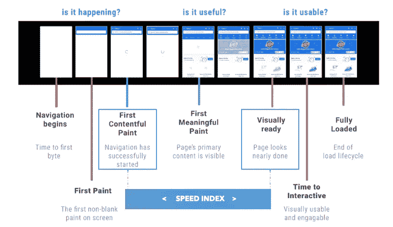
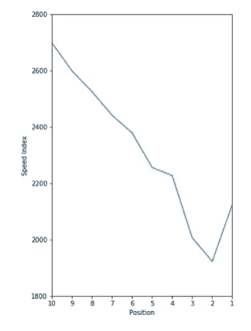
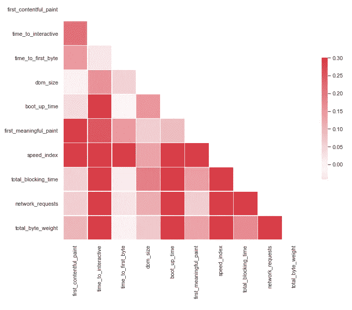
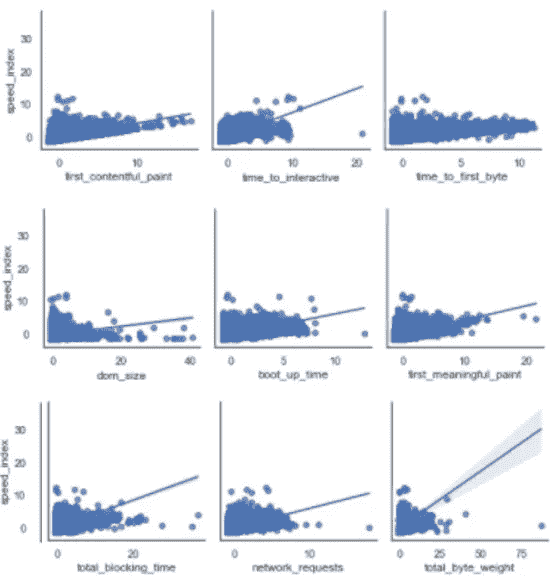
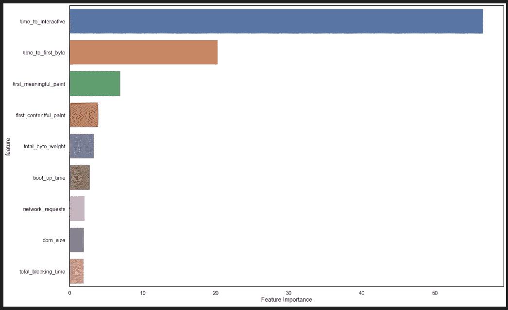

# 还在争论页面速度的价值和影响吗？

> 原文：<https://towardsdatascience.com/making-the-web-faster-3382d1bb2a16?source=collection_archive---------68----------------------->

## 使用机器学习对 Google PageSpeed Insights 进行逆向工程

米卡·鲍梅斯特在 [Unsplash](https://unsplash.com?utm_source=medium&utm_medium=referral) 上的照片

爱立信消费者实验室经常引用的[统计数据](https://www.ericsson.com/en/press-releases/2016/2/streaming-delays-mentally-taxing-for-smartphone-users-ericsson-mobility-report)显示，在移动设备上等待一个缓慢加载的网页所产生的压力相当于观看一部恐怖电影。Cloud Flare 的一项研究显示了网页速度和网站转化率之间的联系，如果一个网页在移动设备上的加载时间超过 4 秒，转化率就会下降到 1%以下。

页面速度是一件重要的事情，尤其是现在移动网络已经变得越来越普遍。自 2009 年以来，谷歌一直声称他们的目标是“让网络更快”，从那时到现在，谷歌已经发布了一系列不同的[计划](https://www.internetmarketingninjas.com/blog/google/google-making-web-faster-years/)来帮助网站管理员在考虑速度的情况下建立他们的网站。

谷歌鼓励网站所有者考虑页面速度的最大方法之一是公开声明页面速度是一个排名因素(即网页越快，它在谷歌排名靠前的机会就越大)。谷歌所有帮助网站所有者生存的资源都在[让网络更快](https://developers.google.com/speed)网站上。

## Google PageSpeed Insights API

Google PageSpeed Insights API 是一个工具，可以让您在每个 URL 的基础上以编程方式查询 Google PageSpeed 数据，它从两个数据源获得结果。第一个来源是 Chrome 用户体验([症结](https://developers.google.com/web/tools/chrome-user-experience-report))数据集，这是一个真实世界的网页性能数据数据集，匿名来源于选择加入谷歌 Chrome 的用户。

第二个数据来源是开源的 [Lighthouse 项目](https://developers.google.com/web/tools/chrome-user-experience-report)，这是一个预测网页页面速度性能并给出如何改进建议的工具。可以通过多种方式访问它，包括通过[网页](https://developers.google.com/speed/pagespeed/insights/)，命令行工具或者通过谷歌 Chrome 中的开发者工具。

PageSpeed Insights API 返回了 80 多个不同的结果，作为一个 JSON 对象，包含来自 CRuX 和 Lighthouse 的数据。这些数据中有很多都源于网页速度指标的测量方式。

## 如何测量网页速度

谷歌创建了一些页面速度指标来衡量页面速度性能，其中最重要的可以在下图中看到:

这些是谷歌页面速度工具中最重要的指标(来源:【https://developers.google.com/speed/docs/insights/v5/about】T4)

速度指数

## **为什么这很重要？**

**建立一个企业网站既复杂又昂贵，如果网站在搜索中表现不佳，会对网站所代表的业务底线产生不利影响。如果一个网站已经上线，但页面运行速度很慢，那么重新上线并进行更新以提高性能的成本可能会很高。**

**在竞争激烈的商业环境中，资源是有限的，这将有助于知道在哪里投入预算，而不是在你知道会获得最大利益的地方进行修复。我决定进一步研究这个问题，第一步是建立一个页面速度性能与排名的数据集，然后使用机器学习来尝试更好地理解数据并获得洞察力。**

**我建立了一个包含 10 万个网站的数据集，使用了谷歌上最受欢迎的前 1000 个搜索短语，并通过 serpapi.com 的 T2 得到了每个关键词前 100 个网站的位置。然后，我用[的 Pagespeed Insights API](https://developers.google.com/speed/docs/insights/v5/get-started) 查询了这 10 万个网站，从中提取出最重要的指标进行分析。**

**有趣的是，在 Google 上查看数据集的前 10 个位置的位置与平均速度指数的图表:**

****

**谷歌前 1000 个关键词的速度指数与位置**

**请记住，速度指数越低越好，可以看出，除了位置 1 之外，速度指数和位置之间有明显的关系(即页面越快，位置越高)。如果说速度指数驱动位置(从位置 1 可以看出)，那就太简单了，但是这里有一些东西需要研究。**

## **探索数据**

**我需要能够从 PageSpeed Insights API 获得响应，并尝试提取能够洞察如何以最佳方式构建页面以提高性能的功能。我决定用速度指数来预测这些特征。这将是一个回归问题，因为速度指数是一个连续变量。**

**此外，因为我希望能够尝试并从我创建的模型中获得洞察力，所以我决定使用更传统的建模方法，因为这将允许我查看模型中系数的强度，以尝试并建立业务洞察力。因此，我没有使用神经网络。**

**使用速度指数作为连续预测变量，我选择了以下可能对页面速度有最大影响的功能:**

*   ****First-Contentful-Paint**—First-Contentful-Paint 标记第一个文本或图像被绘制的时间。[了解更多](https://web.dev/first-contentful-paint)。—单位:**毫秒****
*   ****交互时间**—TTI 指标测量从页面开始加载到其主要子资源已经加载并且能够快速可靠地响应用户输入的时间。[了解更多](https://web.dev/tti/)。—单位:**毫秒****
*   ****首字节时间** —首字节时间标识服务器发送响应的时间。[了解更多](https://web.dev/time-to-first-byte)。—单位:**毫秒****
*   ****DOM Size**—DOM Size 指的是 HTML 文档中元素的数量以及它们之间的关系。大型复杂的 DOM 会降低网页的处理速度。[了解更多](https://web.dev/dom-size)。—单位:**元素个数****
*   ****启动时间** —这是解析、编译和执行 JavaScript 所花费的时间。较小的 JavaScript 有效负载有助于这一点。[了解更多](https://web.dev/bootup-time)。—单位**毫秒****
*   ****首次有意义绘制** —首次有意义绘制测量页面的主要内容何时可见。[了解更多](https://web.dev/first-meaningful-paint)。—单位**毫秒****
*   ****总阻塞时间**——当任务长度超过 50 毫秒时，从第一次内容绘制到交互的时间总和，以毫秒表示。—单位 **ms****
*   ****网络请求** —页面加载期间发出的网络请求数量。—单位**请求数量****
*   ****Total-Byte-Weight** —页面下载中请求的所有元素的大小总和。[了解更多](https://web.dev/total-byte-weight)。—单位**字节****

**对于回归模型，我们必须尝试控制多重共线性，因为这可能会使我们的模型在统计上非常不可靠。查看我们所有特征的关联矩阵，我们看到以下内容:**

****

**数据集中要素的皮尔逊相关矩阵**

**可以看出，数据集中的要素之间没有高度的相关性，因此多重共线性不是问题。如果我们查看所有特征与预测值的配对图，我们可以看到:**

****

**预测值对特征的配对图**

**我们可以看到大多数特性都有很高的线性度，尤其是第一内容绘制、第一字节时间和交互时间。这意味着我们最有可能使用回归模型来精确地模拟这些数据。**

**为了准备用于建模的数据，需要对其进行清理(移除异常值、移除空值、检查数据类型是否一致)、缩放和重复数据删除(同一页面可能会针对多个关键字进行排名)。**

**一旦完成所有这些步骤，数据集就有 72，218 行，包含 13 个要素。在这些特征中，10 个是数字特征——一个是预测特征，另外 9 个是建模特征。**

****建模数据****

**首先要做的是将数据集随机分成三个独立的部分:一个训练集、一个测试集和一个最终验证集，在选择候选模型之前不会用到最终验证集。**

**为了评估候选模型，我还需要建立一个基线模型，以便能够准确地检查成功。由于这是一个回归问题，而且许多关系似乎是线性的，那么一个“简单”的线性回归模型似乎是一个很好的第一步。我把“简单”这个词用引号括起来，因为它是 9 维的线性回归。**

**确定模型表现如何的成功指标是 [r2 误差](https://www.bmc.com/blogs/mean-squared-error-r2-and-variance-in-regression-analysis/#:~:text=r2_score()%20method%3A-,Copy,%2C%20pred(y3)%2C%20%E2%80%A6)，在训练模型后，我得到以下结果:**

**线性回归模型代码和输出**

**可以看出，在训练期间，该模型在 K 倍内获得了 0.76 的 r2 分数，这意味着该模型没有过度拟合，并且表现良好。当在测试集上调用 model.predict() 时，r2 值为 0.77，因此这是评估其他候选模型的起点，而且还不错。**

**我测试了各种其他模型，取得了不同程度的成功:决策树回归器(严重过度拟合，直到正则化)、随机森林回归器、支持向量机线性回归器和支持向量机多项式回归器(更多是出于兴趣，而不是实际应用)。**

****

**测试的其他模型及其 R2 分数**

**可以看出，随机森林回归器表现最好，r2 为 0.78，这是很好的。下一步是优化这个结果，尝试得到一个性能更好的模型。**

## **模型优化**

**下一步是使用 gridsearch 交叉验证(GridSearchCV)优化模型超参数，以将模型调整到最佳水平。**

**经过几轮 GridSearchCV 后，最佳模型是一个随机森林回归器，max_depth = 23，min_samples_leaf = 3，该模型的 r2 值为 0.79，这是迄今为止最好的，比未优化的模型稍有改进。**

**当优化的模型与未接触的验证数据集相匹配时，我继续得到 r2 值 0.79，这意味着该模型在 5 次中正确预测了 4 次速度指数，这是一个非常好的结果。**

## **解释模型**

**真正的商业洞察力来自于能够查看模型中的系数，从而能够决定哪一个对网页的速度影响最大。最好的执行模型是随机森林回归器，因为它可以调用 model . feature _ importances _**方法来查看哪些特征对模型的贡献最大。****

****根据我为此数据制作的最佳模型，我们可以看到以下内容:****

********

****最优随机森林回归模型的特征重要性****

****可以看出，在构建快速网页时，交互时间是影响性能的主要因素。这似乎是显而易见的，但是，如果你跟随直觉，如果你的互动时间很快，那么其他一切都会很快，但不一定相反。****

****例如，如果你在即使不能交互也至少让内容可见的基本原理下，优化了第一次有意义的绘制(当内容可见，但你不能与之交互时)——你的页面加载速度会更慢，用户体验会更差。****

****时间对第一个字节的贡献也很重要，因为这是页面加载时发生的第一件事，所以如果这很慢，那么它将对其他所有事情产生连锁反应。****

## ****结论****

****如果你想建立一个快速的网页，那么根据谷歌上最受欢迎的 1000 个关键词和谷歌 PageSpeed Insights API 的数据，你需要优化你的构建过程，使页面尽可能快地具有交互性。如果你这样做了，页面就会变得很快，其他的事情也会随之而来。****

****除此之外，还要确保您的服务器基础架构速度很快，这样就不会出现瓶颈。否则，这将降低整个页面的加载速度。****

****为了进一步扩展这个项目，看看其他目标变量会很有意思。谷歌刚刚推出了它的核心网站指标系列，作为量化用户页面体验的一种方式。研究这些会很有趣，看看“用户友好”和搜索位置之间是否有联系。****

****如果你有兴趣查看这个项目的代码，它在我的 [Github 简介](https://github.com/sandy-lee/reverse_engineering_google_pagespeed)中。****