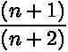
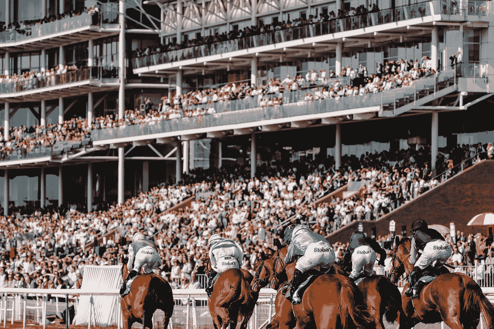

# 创造机会

> 原文：<https://towardsdatascience.com/making-up-the-odds-73fbc509ee7f?source=collection_archive---------32----------------------->

## *从贝叶斯到必发:简史*

照片由来自 [Unsplash](https://unsplash.com/photos/wu7oy6XhAoU) 的 Richard Boyle ( [hellorich](https://unsplash.com/@hellorich) )拍摄

***编者注:*** *本文仅供教育娱乐之用。如果你想用这个模型进行真正的下注，那么你要自担风险。请确保这是符合你的庄家的条款和条件。*

# 当星期六到来时

现在是星期六下午三点差一刻。你已经放弃了周末足球比赛的门票，决定不跟随你的父亲去球场，因为你晚上晚些时候有另一个约会(至少这是你告诉他的——事实是，你不能再看你的球队踢垃圾球了)。

不过开球前还有一件事要做。拿出你的手机，打开* *在此插入最喜欢的博彩公司的名字* *应用程序，查看博彩公司为你的球队在本周末赢得的赔率。*毫不留情地*，你翻阅着投注券，看着全国许多球队的比赛赔率。突然，你经历了一个好奇的时刻，想知道(不是第一次)"*为什么这些几率是这样的*"。如果能多了解一点这些比赛定价的思路和过程就好了，因为你总是试图在每个周末选出赢家。

无论如何，你为累加器选择你的三个队。15/2 时 10 分。这就是那个。

下午 5 点，结果出来了——两个队赢了，第三个队带着一个不幸的平局离开了。你的 acca 被毁了。怒火中烧，你把手机放在一边，准备晚上的约会。你的室友感觉到了失望，提醒你“三分之二不算太坏”。你试图在接下来的一天里转移自己对坏结果的注意力。现在，你根本不在乎那些该死的几率。

# 遇见你的创造者

虽然上面的情节读起来更像是一个负责任的赌博广告，而不是一个关于概率概念的帖子的开头，但我提到的两件事实际上与这个故事的其余部分有关联。第一，许多人对体育、政治和娱乐结果的赔率是如何产生的感到好奇——他们不断被告知，博彩公司总是赢，你赌他们输，后果自负。第二个是“庄家让你的球队赢的赔率是多少”这句话。一个价值数十亿英镑的行业真的不依靠员工简单地“凑数”吗？为了回答这个问题，我们需要看看一些概率历史和理论(我绝对意识到这是我开始在社交媒体上失去大多数猫视频读者的地方)。

让我们从简单的抛硬币开始。假设硬币是公平的，那么如何推导正面或反面的概率呢？一半是经典的正面一半是反面，对吗？

你当然是对的，但也许不是你想的那样。我们都知道在掷硬币中 50/50 的几率实际上是它的*理论*概率。给定一个公平的硬币，我们假设硬币有两种同样可能的落地方式，并且只有一种方式得到正面或反面。证明这一点的唯一方法是进行大量独立的掷硬币试验，从这些结果中获得正面和反面的结果，然后——根据[大数定律](https://en.wikipedia.org/wiki/Law_of_large_numbers)——我们估计正面或反面的真实概率为 50%。够简单吧？

类似的过程重复很多次后，事件的概率等于其相对频率的想法实际上被称为 [*频率主义者*](https://en.wikipedia.org/wiki/Frequentist_probability) 对概率的解释。数学家们的这种思维方式产生于 19 世纪，主要是由过去的实验和关于机会游戏的论文中的问题和悖论所推动的。它的根源甚至比 19 世纪还要深——你可以从亚里士多德那里找到一段引文，他提到

> …最有可能发生的是…

很难与数学和哲学的名人录进行辩论。然而，有一个问题，主要是当处理明确定义的随机实验时，频率主义者只讨论概率。

# 如同黑夜跟随白昼一样确定

博彩公司开始舔嘴唇了。考虑[日出问题](https://en.wikipedia.org/wiki/Sunrise_problem):“明天太阳升起的概率是多少？”现在没有人能接触到实验。这是给我们的*棋子*不是吗？

来自[un slash](https://unsplash.com/photos/AxYOB1v9TsU)的 James Peacock ( [jimmyp9751](https://unsplash.com/@jimmyp9751) )的照片

谢天谢地，两位数学家(嗯，一位数学家和一位……牧师)为这个解决方案做出了贡献。首先，[皮埃尔·西蒙-拉普拉斯](https://en.wikipedia.org/wiki/Pierre-Simon_Laplace)分两部分回答了这个问题。第一部分是我们现在所知的无差别原则，或不充分理性原则。为了便于讨论，假设你在两千年前的某一天中午醒来。在一顿美好的午后晚餐和咖啡后，你看着太阳下山——谢谢今天。它会回来吗？我们还没有看到太阳升起，也没有特别的理由相信它会升起或不会升起。所以，我们认为这两种可能性(太阳会升起吗/不会升起)是一样的——也就是说，一半的可能性是太阳会升起，另一半是太阳不会升起。

现在来看拉普拉斯回答的第二部分。如果说过去是未来的指南，那么太阳每天升起都会增强我们的信心，让我们相信它会继续升起。因此，两千年后，明天太阳升起的概率应该非常接近 1，但不完全是，因为我们不能完全确定。拉普拉斯从这个思想实验中推导出了[连续法则](https://en.wikipedia.org/wiki/Rule_of_succession)，估计太阳在升起 *n* 次后再次升起的概率为

当 *n* 为零时，这只是二分之一，随着 *n* 增加到无穷大，概率趋近于 1。比扔硬币的例子更详细一点，但仍然很简单。

或者是？

你注意到我们是如何得出太阳会再次升起的一半初始概率的吗？

这是凭空捏造的。没有进行实验。没有从整体上计算结果。 ***我们编造了*** 。它可能是三分之一，四分之三，事实上是 0 到 1 之间的任何值。由于英国长老会牧师托马斯·贝叶斯的数学著作，这种做法是可以接受的。)从十八世纪开始。他将概率描述为一种信任度，而不是一种频率。通过贝叶斯推理，当新的证据出现时，你可以更新你现有的信念，以获得你的后验信念(很像太阳升起的例子)。

事实上，贝叶斯去世时并没有发表使他出名的定理，但是他的足够多的弟子挖掘出了他的著作，这些著作在接下来的 200 年里使整个行业受益。它甚至被用来解决改变历史的实际问题——二战期间，德雷福斯上尉的辩护者用它来证明自己的清白，而艾伦·图灵用它来解码英格玛机器。Bayes 备受尊崇，以至于“Bayesianism”在数学和科学领域的成员中获得了近乎宗教般的追随者。

# 让我们在 2000 年见面吧

不管怎样，既然我们已经给“有根据的猜测”这个短语赋予了意义，我们回到博彩公司如何给事件和结果定价的问题上来。当这个行业为某个特定事件雇佣“交易者”时，他们真正的意思是雇佣在某个主题或运动上有广泛领域知识的人，他们的意见有希望比一般人更有价值。简而言之(我一点也没有贬低这个职业)，交易者是真正的专业猜测者。本周末利物浦赢伯恩茅斯的可能性有多大？八比一，他们真的很好，而另一个队不是。谁赢得了今年的追逐赛冠军？可能是短跑运动员萨克，三比一，他状态很好。谁将成为下一任美国总统？出于这样或那样的原因，唐纳德·特朗普是二对一。

约克赛马场。照片由克里斯·肯德尔([克里斯·肯德尔](https://unsplash.com/@chriskendall))来自 [Unsplash](https://unsplash.com/photos/4vetVkqmj90)

作为一个交易者，你希望你的知识能让你在为一个事件定价时比其他博彩市场更有优势。当你因为任何原因改变赔率时，你实际上是在利用*贝叶斯推断*随着更多信息的到来更新最初的假设(主要是“跟随金钱的重量”，这是每当讨论博彩时经常出现的另一个短语)。但是，如果一个交易者对自己的胜算不够自信怎么办？

如果你知道，你就知道，如果你不知道，那么..缺少一个 P45，答案是让某人*更精明*弥补赔率。2000 年 6 月，一家名为 Betfair 的博彩交易所成立，其理念是让客户的博彩更加公平，但也部分出于这个目的。任何人现在都可以请求一个尚不存在的市场(足球比赛结果、英国下任首相、年底比特币的价格)，弥补自己的赔率，并根据他们对事件将发生的信心进行相应的下注(例如，100/5/1 比 2/5/1 表示更相信某事会发生)。接下来就要看其他人是否接受赌注的另一方了，一旦有一大笔钱在数千(如果不是数百万)投机者之间转手，你就会突然对某个结果有非常好的概率估计。无论博彩公司或下注者知道与否，他们都在一夜之间开始从事贝叶斯定理的巨大概念证明。

最后一点，但必发在首次推出时实际上收到了很多负面宣传，因为传统博彩公司对他们的[选择的口号](https://www.theguardian.com/sport/2002/jan/13/horseracing.tonypaley)不是很满意，并游说禁止交易所-引用各种借口，从作弊到洗钱。如今，有三四家大型博彩交易所，许多高街博彩公司在承诺任何事情之前都在等待他们的赔率。有时候事情会变得很有趣。

# #RequestABet

每一部历史作品通常都以某种对我们所学知识的回顾和对未来的预测作为结尾。嗯，我们刚刚讨论了贝叶斯，我不知道接下来会发生什么。我们的朋友拉普拉斯可能会要求对未来十年必发的情况进行预测，在他认为最有可能的选择上下注，并定期登录直到 2030 年，看看他是否正确。那对我来说真是太好了——比起不得不自己猜测一个结果来结束一篇博文，我会更喜欢这样。

# 其他文章

 [## 运动中的随机性

### 为什么赢得超级碗的球队比英超多？

towardsdatascience.com](/randomness-in-sport-6e60c6132838)  [## 用 GgPlot2 预测足球比分

### 使用泊松帮助可视化足球正确的分数在 R

towardsdatascience.com](/forecasting-football-scores-with-ggplot2-949de7c1cb52)