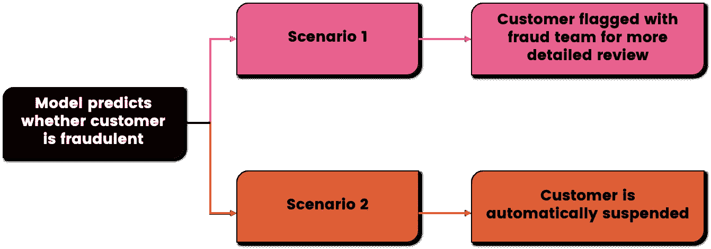
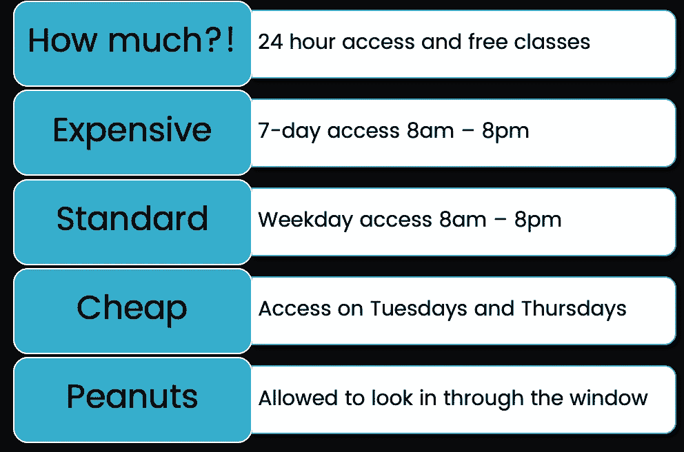
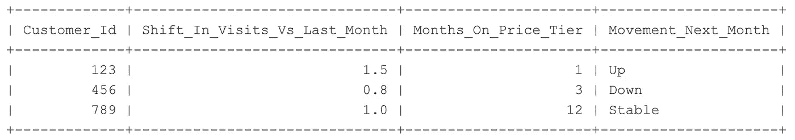
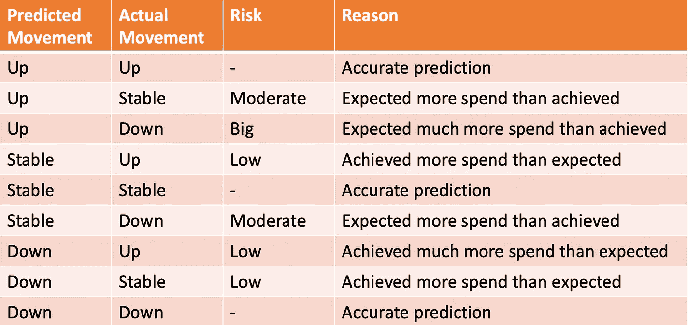

# 让你的损失函数有价值

> 原文：<https://towardsdatascience.com/making-your-loss-function-count-8659cf65feb1?source=collection_archive---------44----------------------->

## 有些错误比其他错误代价更高；你的模型学习的方式应该反映这一点

乔治·奥威尔的中篇小说《动物庄园》中有一句令人难忘的台词…

> 所有动物都是平等的，但有些动物比其他动物更平等

奥威尔可能一直指的是社会中的虚伪、权力和特权，但如果你用 ***错误*** 取代 ***动物*** ，它就开始变得与机器学习非常相关。

既然我已经假装博学多闻了，那就来点具体的吧。

# 了解你的错误

解释误报和漏报的概念是一个常见的面试问题，因为它们在实际应用分类算法时非常重要。

我有时仍然会发现自己在开会前匆忙查阅维基百科，反复检查我是否使用了像 precision 这样的术语，并回忆起正确的方法。对于这篇文章，你应该只需要记住…

*   **假阳性**是指模型预测到某个条件存在，但实际上并不存在(例如，没有火灾时火警响起)。
*   **假阴性**是指模型预测该条件不存在，但实际上却存在(如发生火灾时，烟雾报警器未能响起)。

先不说定义，让我们假设你在一家银行工作，你的老板要求你建立一个模型来识别欺诈客户。在进行任何建模之前，重要的是要问…

> 如果我的模型出错了会怎么样？

我的意思不是从统计的角度问这个问题，而是真正理解这对业务意味着什么。

您得到的答案将决定您如何评估和部署您的模型。

代表欺诈检测模型输出如何使用的两个场景。*图片作者。*

在场景 1 中，您的模型在将客户标记为欺诈时不需要如此自信，因为接下来会进行更详细的人工审查，并且您会期望欺诈团队过滤掉误报。

相反，在场景 2 中，当客户被标记时，风险更大，因为他们被自动暂停。如果有太多的误报漏网，那么你就是在让无辜的顾客暂停服务，给他们一个不愉快的体验，并产生负面影响。

确定模型应该有多严格或多宽松的最佳点是一个相当平衡的行为，因为以减少假阳性为目标必然会导致假阴性的增加，反之亦然。

# 找到正确的平衡

照片由 [Unsplash](https://unsplash.com?utm_source=medium&utm_medium=referral) 上的[尼克·费因斯](https://unsplash.com/@jannerboy62?utm_source=medium&utm_medium=referral)拍摄

考虑到假阳性率和假阴性率之间的权衡，可以更有创造性地使用模型的输出。

二元分类模型通常会对概率超过 50%的任何事物进行分类，但是如果您担心误报率过高，您可以使用**更高的阈值**，例如，仅当欺诈客户的预测概率超过 80%时才对其进行分类。

或者业务可以遵循场景 1 和 2 之间的混合方法**,其中预测概率为 80%或以上的客户被自动暂停，而任何在 50%和 80%之间的客户都与欺诈团队共享，以进行更严格的审查。**

**这种策略通常足够有效，但最终它们涉及训练一种机器学习算法，该算法假设所有类型的错误都同等重要，然后调整其输出以纠正这种假设。**

**幸运的是，它可以直接影响各种机器学习算法的学习方式，并更加重视特定的错误类型。[处理类不平衡](/boosting-techniques-in-python-predicting-hotel-cancellations-62b7a76ffa6c)的一些技术也可以达到类似的目的，即确定误报或漏报，但是本文主要通过损失函数来实现这个目标。**

# **接受损失**

****

**汤姆·普姆福德在 [Unsplash](https://unsplash.com?utm_source=medium&utm_medium=referral) 上拍摄的照片**

**当涉及到深度学习时，损失函数决定了算法在学习和迭代改进时试图最小化的内容。损失函数通常默认为均方误差(回归)和交叉熵损失(分类)，但是有大量的 [funkier 选项](https://www.tensorflow.org/api_docs/python/tf/keras/losses)可以在某些用例中更好地工作。**

**然而，不管函数本身如何，它们都有一个共同的目的，即它们为模型提供了一个反馈机制，以检查其性能如何，找到损失函数的梯度，并使用该梯度更新网络的权重，以尽快减少损失。**

**即使我们现在在谈论深度学习和更复杂、更强大的模型，他们仍然无法区分他们犯下的错误类型。**

**幸运的是，TensorFlow 允许您控制这一点。**

# **获得机器学习的适应性**

**在我们进入代码之前，让我们看一个新的场景(我保证这是最后一个)。**

**你在一家休闲中心工作，那里的客户按月付费，但他们可以在每个月底更改他们订阅的价格等级。**

****

**健身房会员，每月价格计划。*作者图片。***

**与大多数企业一样，了解客户随着时间的推移支出是增加还是减少，并预测他们未来可能会做什么是有帮助的。**

**为了提供这种能力，您需要构建一个模型，该模型可以从客户的特征中学习，并预测他们是否会提高、降低或保持相同的价格计划。**

**通过拍摄过去行为的快照，即与上个月相比，客户使用健身房的次数是多了还是少了，以及他们在同一计划上花了多长时间，可以训练一个模型来预测客户下个月将做的三个类别中的一个:**

*   **花费更多和交易**上升****
*   **保持相同的计划并保持**稳定****
*   **减少花费，降低价格**

********

****特性和目标变量。*图片作者。*****

****自然，您会希望模型在所有方面都尽可能准确。然而，该模型的输出结果可能会被财务团队用来确定有多少收入会进来，以及他们有多少能力进行再投资。****

****在这种情况下，过高估计有多少客户会进行升级更具破坏性，因为企业期望的收入将超过它实现的收入。虽然高估客户的交易量并不好，但至少它让财务团队处于一个更有利的位置，可以获得比预期更多的收入。****

********

****与模型正确与否相关的风险。*图片作者。*****

****有了这个商业背景，您可以直接操纵模型如何训练来反映财务团队所期望的谨慎。****

# ****弯曲张量流向你的意志****

********

****乔纳森·比恩在 [Unsplash](https://unsplash.com?utm_source=medium&utm_medium=referral) 上拍摄的照片****

****我们将使用 TensorFlow 和 Keras API 来演示如何实现这一点。如果你想跟随并自己执行代码，你可以遵循这里的指令。****

****阅读下面的代码，感受一下 Tensorflow 的灵活性。****

# ****不会忘记****

****希望这有助于演示您可能需要自定义损失函数的情况，以及如何实现它。****

****但更重要的是，永远不要忘记关键问题…****

> ****如果我的模型出错了会怎么样？****

****记住这一点，你就会从一个在理论上工作出色的数据科学家转变为一个在实践中工作出色的数据科学家。****

# ****当你在这里的时候****

****请随意查看我的其他文章:****

*   ****[避免内存耗尽的简单技巧](/a-simple-trick-to-avoid-running-out-of-memory-d45b0a014ceb)****
*   ****[如何找到正确的集群数量](https://kieran-95138.medium.com/how-to-find-the-right-number-of-clusters-acc1130ed231)****
*   ****[如何管理一名初级数据科学家](/how-to-manage-a-junior-data-scientist-2a5b023eda37)****
*   ****[排列测试的威力](/the-power-of-permutation-testing-c2ac66f2d166)****

# ****参考****

****[1] G .奥威尔。《动物庄园:一个童话故事》(2018)。伦敦:企鹅图书公司。****