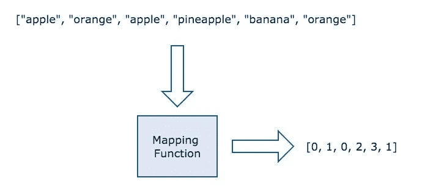
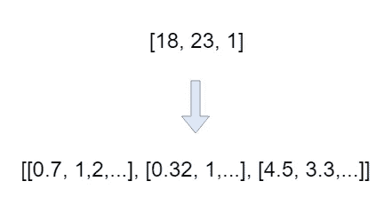
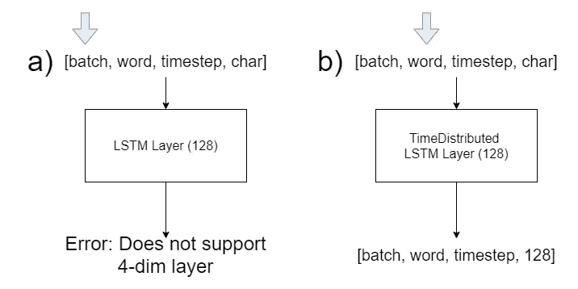
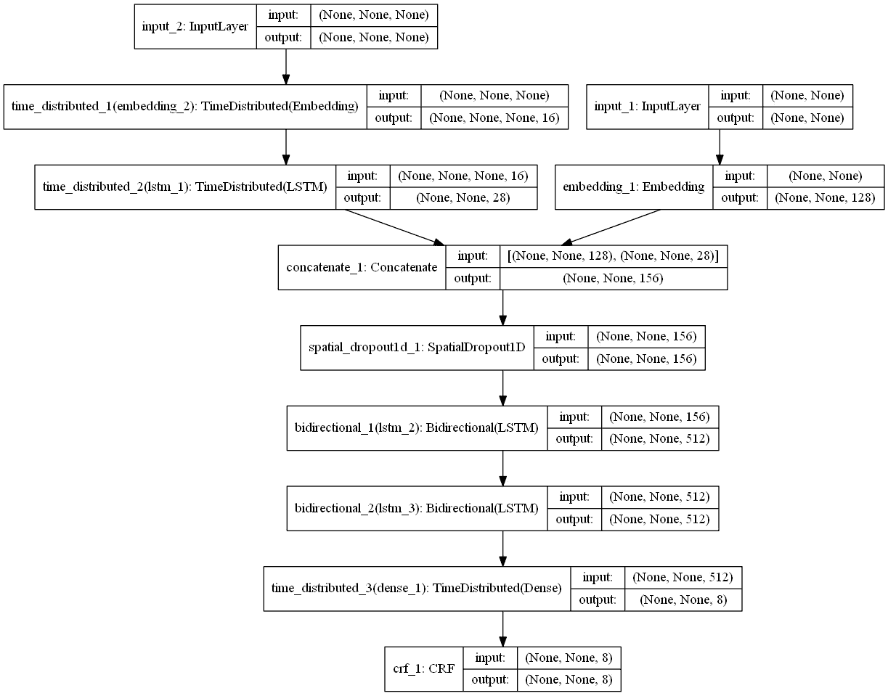
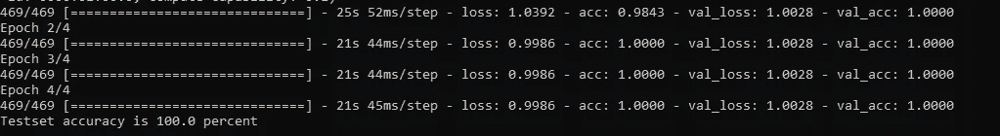

# 从用户命令中提取信息

> 原文：<https://towardsdatascience.com/making-your-own-alexa-entity-extraction-8c7f23eb65a?source=collection_archive---------29----------------------->

## [制作自己的 Alexa](https://medium.com/tag/making-your-own-alexa)

## Alexa 怎么知道你想让她弹哪首歌


在过去的几年里，虚拟助理风靡了全世界。从像 [Alexa](https://developer.amazon.com/alexa) 和 [Google Assistant](https://assistant.google.com/) 这样的虚拟家庭助手，到更专业的助手，比如美国银行的 [Erica](https://promo.bankofamerica.com/erica/) 。这些助手的迅速崛起表明，我们与机器互动的方式正在发生变化和演变。

在这个由 3 部分组成的系列文章中，我们将介绍如何使用 Amazon Alexa 使用的域无关解析器[的一个较小版本和一个命令分类模型，在 Keras 中自下而上地编写自己的简单虚拟助手或聊天机器人。](https://developer.amazon.com/blogs/alexa/post/36ca7d4c-cd98-40a9-a9c5-0cde2ab922ab/how-alexa-knows-that-peanut-butter-is-one-shopping-list-item-not-two?fbclid=IwAR0ctwBfmE7JUV7BR6Un_Fp54cMG9OdoLC2BurWk-HUxwbKYZShpqacm4lI)

阅读完本系列后，您将学会如何创建自己的虚拟助手，该助手足够简单，可以在 Raspberry Pi 或 AWS Lambda 上运行，但功能足够强大，可以用作企业解决方案的基础。

[Github 懒人链接](https://github.com/Skuldur/virtual-assistant-tutorial)

# 概观

该系列将分为三个部分:

1.  从用户命令中提取重要的值和信息
2.  意图分类
3.  语音命令、唤醒词、知识图表和应用程序

每篇文章将涵盖一个单独的主题，这是制作语音导航虚拟助理不可或缺的。这第一篇文章将教你如何从用户发送的命令中提取实体。第二部分将教你如何构建一个网络，对命令进行分类，以便它们可以被发送到正确的意图处理器，允许你的助手处理多个意图。第三部分将介绍一些不同的想法，关于如何在你的助手中加入对语音命令的支持以及其他各种改进。

# 背景

想象一下，你在一家银行工作，你的工作是为客户在账户之间转账。一天，一位顾客走进来，提出了以下要求:

> "你能从我的储蓄账户转 50 美元到马克的账户上吗"

为了能够满足这个请求，作为一名工作人员，您需要能够从请求中提取三个关键值。您需要提取:

*   他们想转账多少(50 美元)
*   从哪个账户(你的储蓄账户)
*   谁应该收到钱(马克)

由于我们从出生起就被训练从语言中提取信息，这项任务对一个人来说很容易，但对一台计算机来说却很棘手。模拟这一过程并准确提取这一信息是我们的模型将面临的挑战。为此，我们将使用[命名实体识别](https://en.wikipedia.org/wiki/Named-entity_recognition)。

## 命名实体识别

命名实体识别(NER)是信息抽取的一个子任务，它试图在非结构化文本(或半结构化文本)中定位命名实体。NER 的目标是给序列中的每一个单词加上标签，代表这个单词所属的实体的种类。


图 1:给音乐服务的命令中的命名实体的例子

图 1 展示了一个通过 NER 模型解析的句子的例子。使用 [IOB 方案](https://en.wikipedia.org/wiki/Inside%E2%80%93outside%E2%80%93beginning_(tagging))(内部-外部-开始)标记句子中的每个单词，并附加一个连接标签来标记用于连接不同命名实体的单词。这些标签然后被用来从我们的命令中提取实体。从图 1 中的标签，我们可以提取出我们希望服务播放的歌曲是“波西米亚狂想曲”，艺术家是“女王”。

既然我们知道了问题以及我们将使用什么方法来解决它，那么是时候开始编码了！

# 履行

## 数据

在我们写真正的代码之前，我们需要一些实际的数据来处理。幸运的是，我们准备了[示例数据](https://github.com/Skuldur/virtual-assistant-tutorial/tree/master/commands)，我们将在本文中使用这些数据。

```
{
 "labels": [
      "O", 
      "CC", 
      "B-song", 
      "I-song", 
      "B-artist", 
      "I-artist",          
      "B-playlist", 
      "I-playlist"
 ], 
 "training_data": [
 {
      "words": [
          "play", 
          "don't", 
          "pan", 
          "me", 
          "by", 
          "alberta", 
          "hunter"
      ], 
      "labels": [
          "O", 
          "B-song", 
          "I-song", 
          "I-song", 
          "CC", 
          "B-artist", 
          "I-artist"
      ]
 }
 ]
}
```

上面的摘录展示了我们将要使用的数据模式的一个例子。我们已经将该命令所有可能的标签编译到`labels` 中，并将所有命令标记化并标注到`training_data`中，其中`training_data['words']`是模型的输入序列，`training_data['labels’]`是预期的输出序列。

## 准备数据

正如任何涉及神经网络的项目一样，我们需要在使用它们之前准备好序列。神经网络不喜欢被输入字符串或字符。他们喜欢冷冰冰的硬数字！

所以首先，我们需要建立一个词汇表。词汇表是我们网络中所有已知单词的容器。这个词汇表将被我们的模型用来创建一个嵌入层(稍后会详细介绍)。

你可以使用一个预建的词汇和标记器，比如 [FastText](https://fasttext.cc/) 或 [SentencePiece](https://github.com/google/sentencepiece) 来为你的模型提供词汇，但是对于小型虚拟助手来说这是不必要的，只会导致模型变得臃肿，而不会有任何有意义的准确性增加。只有当您的用例需要更大的词汇表并从它们的包含中受益时，才使用它们！

例如，在我们对 FastText 的实验中，其中一个模型的大小约为 1GB。但是，对于较小的自定义词汇表，模型大小约为 15MB。两个版本在准确度、精确度和召回率上的差异几乎不存在。

也就是说，让我们创建自己的自定义词汇表吧！

```
dataset = [Dataset](https://github.com/Skuldur/virtual-assistant-tutorial/blob/master/datautils.py#L9)(schema_path, name)
labels, data = dataset.get_data()X = [x['words'] for x in data]
y = [x['labels'] for x in data]# Word vocabulary
word_vocab = [Vocabulary](https://github.com/Skuldur/virtual-assistant-tutorial/blob/master/datautils.py#L83)()
word_vocab.build_vocab([w for command in X for w in command])# Character vocabulary
char_vocab = [Vocabulary](https://github.com/Skuldur/virtual-assistant-tutorial/blob/master/datautils.py#L83)()
char_vocab.build_vocab([ch for w in word_vocab for ch in w])
```

在上面的代码中，我们加载数据，并从数据集中的命令中收集所有唯一的单词和字符。除了所有的单词之外，我们还为以前没有见过的单词和字符在词汇表中添加了`<unk>`和`<pad>`标记。`<unk>`令牌允许我们将词汇量保持在一个固定的大小，它允许模型处理它不认识的单词。`<pad>`标记允许我们屏蔽序列中的填充，这样它就不会被误认为是命令的一部分。这个标记是必要的，因为我们的命令的长度可以变化，但是模型期望它们都是相同的长度。



图 2:一个映射函数的例子

现在我们有了词汇表，我们需要创建一个映射函数来从单词映射到整数。这允许我们将数据集中的单词序列转换成整数序列。幸运的是，当单词被添加到字典中时，我们的[词汇表](https://github.com/Skuldur/virtual-assistant-tutorial/blob/master/datautils.py#L33)类的实现已经为我们完成了这项工作。

最后，我们将为标签创建一个映射函数。

```
labels2idx =  {label: idx for idx, label in enumerate(labels)}
```

如果您想知道为什么我们同时使用字符词汇表和单词词汇表，那是因为字符嵌入对于跨上下文的概括非常有用。这有助于我们的模型预测一个词的标签，当这个词不在我们的词汇表中时，就像获得`<unk>`令牌的词的情况一样。这是因为该单词的所有字符都应该出现在字符词汇表中。

现在我们的数据准备工作已经完成，我们可以开始制作模型了。

## 模型

我们将用来实现 NER 的模型被称为带有字符嵌入的双向 LSTM-CRF 模型。我们将要使用的模块可以在[这里](https://github.com/Skuldur/virtual-assistant-tutorial/blob/master/model.py)找到。在模型中，我们将使用七种不同类型的层。

**嵌入层**是由整数 id 表示的文本数据(单词/字符/句子)被转换成密集的固定大小向量的层。然后可以训练这一层，使向量代表单词背后的意思，意思是具有相似意思的单词将得到相似的向量。

**LSTM 层**是递归层，将序列作为输入，可以返回序列(return_sequences=True)或展平输出。

**双向层**是将两个方向相反的隐藏层连接到同一输出的包装层。当需要输入的上下文时，例如标记单词序列时，它们很有用。本质上，它们允许序列中的一个位置拥有序列中在它之前和之后的所有信息。

**时间分布层**是包装层，允许我们将一个层应用到输入的每个时间片。Jason Brownlee 在他关于时间分布层的文章中比我更好地解释了这个概念。

**丢弃层**是一种正则化技术，包括在训练期间的每次更新时将一部分权重设置为 0，以防止过度拟合。该分数由图层使用的超参数决定。

**密集层**或**全连接层**是全连接神经网络层，其中每个输入节点连接到每个输出节点。它们对输入进行简单的线性变换。

**条件随机场(CRF)层**学习哪个标签序列最有可能。例如，它可以了解到在序列中 O 标签不应该直接出现在 I-Song 标签之前，并且 I-Song 只能出现在 B-Song 或 I-Song 之前。

```
# Word Embeddings
word_in = **Input**(shape=(None,))
word_emb = **Embedding**(input_dim=self.n_words+1, output_dim=100)(word_in)# Character Embeddings
char_in = **Input**(shape=(None, None,))
char_emb = **TimeDistributed**(**Embedding**(input_dim=self.n_chars + 2,
           output_dim=10, mask_zero=True))(char_in)
char_enc = **TimeDistributed**(**LSTM**(units=20, return_sequences=False,
           recurrent_dropout=0.5))(char_emb)concat = **concatenate**([word_emb, char_enc])
concat = **SpatialDropout1D**(0.3)(concat)
bi_lstm = **Bidirectional**(**LSTM**(units=256, return_sequences=True,
                       recurrent_dropout=0.3))(concat)
bi_lstm = **Bidirectional**(**LSTM**(units=256, return_sequences=True,
                       recurrent_dropout=0.3))(bi_lstm)fully_conn = **Dense**(self.n_labels, activation="relu")(bi_lstm)crf = **CRF**(self.n_labels, sparse_target=False)
pred = crf(fully_conn)self.model = Model(inputs=[word_in, char_in], outputs=pred)
self.loss = crf.loss_function
self.accuracy = crf.accuracy
```

在我们的模型中，我们有两个输入:

1.  单词 id 的数组。
2.  一个字符 id 矩阵，其中每一行映射到我们的单词序列中的一个单词。

我们要做的第一件事是将两个输入输入到一个**嵌入**层，该层将每个数组中的 id 转换成密集的固定大小的向量。这个过程的一个例子可以在图 3 中看到。



图 3:嵌入层将整数 id 数组转换为固定大小向量数组的示例。

您可能会注意到， **LSTM** 层将字符嵌入向量作为输入，它被一个**时间分布式**包装器所包装。这使得 LSTM 层被应用于输入的时间切片，而不是整个输入张量。图 4 直观地解释了包装器是如何工作的。



图 4: a)显示了如果一个常规的 LSTM 层被应用到我们的字符嵌入层的输出会发生什么。b)显示当我们用时间分布来包装层时，LSTM 层被应用于秩 3 张量[word，timestep，char]而不是秩 4 张量[batch，word，timestep，char]。

因为我们有了`return_sequences=False`我们的**时间分布 LSTM** 层减少了平坦化它的输出，所以输出张量的秩从 4 到 3。现在我们可以把它和单词 embeddings 连接起来。

```
char_enc = **TimeDistributed**(**LSTM**(units=20, return_sequences=False,
           recurrent_dropout=0.5))(char_emb)
```

接下来，我们将级联的输入馈送到一个双向 LSTM 层。该层输出输入句子中每个单词的上下文嵌入。这将捕获单词在句子中的位置信息。

其次，我们将上下文嵌入提供给一个完全连接的层，该层将每个上下文单词嵌入映射到输出标签上的分布。

最后，我们将**密集**层的结果反馈给 **CRF** 层。该层从从**密集**层获得的张量中选择最可能的输出标签序列。

图 5 显示了模型的图表以及输入和输出维度。



图 5:bil STM-CRF 模型的图表。特别注意字符嵌入的输入和输出是如何变化的(左侧)。此外，如果一个尺寸的大小是 **None** ，那么这意味着模型不关心该尺寸的大小，只要它在每批中是一致的。

关于 Keras 中**双向**的实现，需要注意的一点是，组合正向传递和反向传递的默认配置是将它们连接在一起。这意味着我们为 LSTM 层选择的输出尺寸加倍了。但也有其他选项，例如让图层将结果相加或返回平均值，从而保持输出大小不变，而不是翻倍。

# 培养

既然我们已经介绍了如何准备我们需要的所有数据和模型的结构，现在是开始培训的时候了。

首先，我们将创建一个[序列](https://keras.io/utils/) 对象来为模型准备迷你批处理。通过使用序列对象，我们可以在将每批数据发送到网络之前对其进行预处理。这简化了我们的代码，因为它允许我们一次只准备一批，而不是担心整个数据集。我们的 Sequence 对象相对简单，它与 [Keras 文档](https://keras.io/utils/)给出的例子基本相同。

```
preprocessor = [Preprocessor](https://github.com/Skuldur/virtual-assistant-tutorial/blob/master/preprocessing.py)(word_vocab, labels2idx, char_vocab)
```

接下来，我们将创建一个[预处理器](https://github.com/Skuldur/virtual-assistant-tutorial/blob/master/preprocessing.py)来处理批处理的预处理。它将我们的映射函数作为参数，以便它们可以用来将我们的单词、字符和标签标记转换成整数 ID 标记。

```
model = [BiLSTMCRF](https://github.com/Skuldur/virtual-assistant-tutorial/blob/master/model.py#L11)(labels, len(word_vocab), len(char_vocab))
trainer = [Trainer](https://github.com/Skuldur/virtual-assistant-tutorial/blob/master/trainer.py#L7)(model, X, y, [0.75, 0.95])batch_size = 64
trainer.train(batch_size, preprocessor)
```

现在让我们初始化模型，并创建一个 [Trainer](https://github.com/Skuldur/virtual-assistant-tutorial/blob/master/trainer.py#L7) 对象来负责训练和评估模型。训练集和验证集将在训练过程中使用，以提高我们的 NER 模型的质量，测试集将在最后使用，以查看模型在以前没有见过的数据上的表现。训练集将包含 75%的数据，验证集将包含 20%，而我们的测试集将包含 5%。这些比率一点也不神圣，所以你可以随意使用不同的比率，看看什么最适合你。

```
train_seq = [DataSequence](https://github.com/Skuldur/virtual-assistant-tutorial/blob/master/datautils.py#L83)(self.x_train, self.y_train, batch_size, preprocessor)
val_seq = [DataSequence](https://github.com/Skuldur/virtual-assistant-tutorial/blob/master/datautils.py#L83)(self.x_val, self.y_val, batch_size, preprocessor)self.model.train(train_seq, val_seq)
```

一旦我们分割了数据并创建了训练者对象，我们就可以训练模型了。我们的 [DataSequence](https://github.com/Skuldur/virtual-assistant-tutorial/blob/master/datautils.py#L83) 对象接受一个输入、一个输出、每个批处理的大小和一个预处理函数作为参数。

现在我们可以开始训练模型了！

```
self.model.compile(
    loss=self.loss, 
    optimizer='adam', 
    metrics=[self.accuracy]
)self.model.fit_generator(
    generator=train_seq,
    epochs=10,
    verbose=1,
    shuffle=True,
    validation_data=test_seq,
)
```

为了计算模型的损失，我们将使用 CRF 损失函数。我们将使用具有默认设置的 Adam 优化器，我们要跟踪的指标是模型的准确性。为了训练模型，我们将使用 Keras 中的`[fit_generator()](https://keras.io/models/sequential/#fit_generator)`方法。这个方法允许我们使用由序列对象逐批生成的数据来训练模型。从而让我们对训练过程有更多的控制。

图 6 显示了四个时期的训练示例。正如你所看到的，我们的模型在维基数据集的第二个时期达到了 100%的准确率。这意味着我们的模型能够从每个给定的命令中提取正确的信息。



图 6:关于 [Wiki 数据集](https://github.com/Skuldur/virtual-assistant-tutorial/blob/master/commands/wiki_commands.json)的四个时期的训练会议

在我们自己的虚拟助手中，使用的方法与本文中展示的方法相同，我们对任何单一意图的最低准确率约为 99.5%。其余的有大约 100%的准确性。因此，我们可以看到，这个模型在从文本命令中检索实体方面非常有效。

# 结论

祝贺您完成了本系列的信息提取部分。读完这篇文章后，你应该明白 Alexa 和其他虚拟助手和聊天机器人是如何从你的请求中提取信息的，以及你如何创建模型来做同样的事情。如有任何问题，欢迎联系我或留言。

在下一部分中，我们将研究我们的助手如何选择哪个 NER 模型来处理传入的命令。

# 给读者的建议

*   尝试用 FastText 和 SentencePiece 替换自定义词汇表，看看是否有什么改进。它可能有助于更复杂的意图。
*   尝试使用变压器(BERT)代替双向 LSTM 网络。请注意网络质量和模型大小之间的权衡。模型对 Lambdas 或你的树莓派来说变得太大了吗？
*   在我们的模型以目前的规模开始挣扎之前，一个意图可以有多少不同的命令？
*   在 Pytorch 中实现模型。