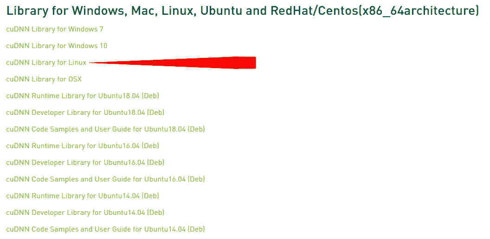
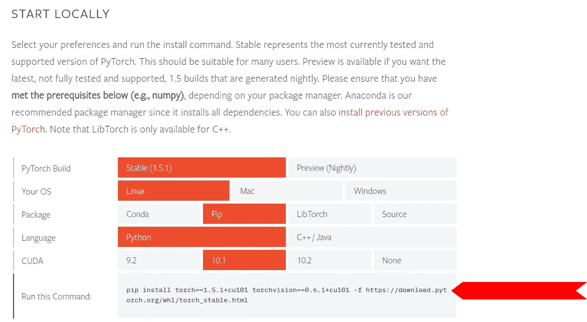

# 让你的 Ubuntu 深度学习做好准备

> 原文：<https://towardsdatascience.com/making-your-ubuntu-deep-learning-ready-a710cb337b39?source=collection_archive---------21----------------------->

## 在 Ubuntu 中安装 Nvidia 驱动程序、Cuda、cuDNN、TensorFlow、Keras & PyTorch


照片由 [freestocks](https://unsplash.com/@freestocks?utm_source=medium&utm_medium=referral) 在 [Unsplash](https://unsplash.com?utm_source=medium&utm_medium=referral) 拍摄

偶然发现很多安装深度学习库的指南，Cuda，cuDNN & nvidia-driver。但是我从来没有在只跟随一个向导的情况下一次成功。所以，我决定写这篇文章。首先，本指南是安装有 GPU 支持的深度学习库(TensorFlow，Keras，PyTorch)。CPU 支持非常简单，所以我不会谈论它。

你需要一个

> 具有 CUDA 计算能力 3.5 或更高的 NVIDIA GPU 卡。

你可以通过访问这个[链接](https://developer.nvidia.com/cuda-gpus#compute)来检查你的 GPU 是否兼容。

# 安装 Nvidia 驱动程序

运行以下命令。它添加了下载 Nvidia 驱动程序所需的存储库。会的

```
sudo add-apt-repository ppa:graphic-drivers/ppasudo apt updateubuntu-drivers devices | grep nvidia
```

它会显示与您的 GPU 卡兼容的驱动程序版本。我有一张 RTX 2060 超级 GPU 卡。它显示

```
driver : nvidia-430 — third-party free recommended
```

根据您使用的 GPU 卡，它可能还会显示多个条目。例子

```
driver : nvidia-340 — distro non-free
driver : nvidia-304 — distro non-free
driver : nvidia-384 — distro non-free recommended
```

安装合适的版本。你的驱动将决定你将要安装的 CUDA 的最低版本。你可以在这里找到表格[。](https://docs.nvidia.com/deploy/cuda-compatibility/index.html#binary-compatibility__table-toolkit-driver)

```
sudo apt install nvidia-xxx
```

用你想要的版本替换`xxx`。重新启动并检查安装

```
sudo reboot
lsmod|grep nvidia
nvidia-smi
```

# 安装 CUDA 和 cuDNN

从[这里](https://developer.nvidia.com/cuda-toolkit-archive)下载 CUDA 安装程序。我更喜欢从运行文件安装。安装并添加`PATH`和`LD_LIBRARY_PATH`变量中的路径。用您的路径替换 Cuda 的路径(在我的例子中是`/usr/local/cuda-10.1/`)。

```
./cuda_10.1.105_418.39_linux.runecho “export LD_LIBRARY_PATH=/usr/local/cuda-10.1/lib64:$LD_LIBRARY_PATH”>> ~/.bashrcecho “export PATH=/usr/local/cuda-10.1/bin:$PATH”>> ~/.bashrc
```

访问此[表](https://www.tensorflow.org/install/source#gpu)获取经过测试的构建版本。检查您需要安装的 cuDNN 版本。从[这里](https://developer.nvidia.com/rdp/cudnn-archive)下载 cuDNN。我更喜欢压缩版本。



下载后解压并复制文件到 CUDA 目录。

```
tar -xzvf cudnn-x.x-linux-x64-v8.x.x.x.tgz
sudo cp cuda/include/cudnn*.h /usr/local/cuda/include
sudo cp cuda/lib64/libcudnn* /usr/local/cuda/lib64sudo chmod a+r /usr/local/cuda/include/cudnn*.h /usr/local/cuda/lib64/libcudnn*
```

# 安装 Tensorflow、Keras、Pytorch

使用安装 TensorFlow 和 Keras

```
pip install tensorflow-gpu==2.2.0 keras
```

要安装支持 GPU 的 PyTorch，请访问此[链接](https://pytorch.org/get-started/locally/)。选择版本、操作系统、语言、软件包安装程序、CUDA 版本，然后按照下图中突出显示的部分进行安装。



这就是了。现在使用这些 python 脚本来验证您的安装。

## 张量流代码

```
from tensorflow.python.client import device_lib

def get_available_gpus():
    local_device_protos = device_lib.list_local_devices()
    return [x.physical_device_desc for x in local_device_protos if x.device_type == 'GPU'] get_available_gpus()
```

## Pytorch 代码

```
import torchdef get_available_gpus():
    return [ torch.cuda.get_device_properties(i) for i in range(torch.cuda.device_count())] get_available_gpus()
```

这就是了。

所有库都已安装。现在打开你的*创意*模式。

# 参考

 [## cuDNN 安装指南::NVIDIA 深度学习 SDK 文档

### 本 cuDNN 8.0.0 预览版安装指南提供了如何安装和检查的分步说明…

docs.nvidia.com](https://docs.nvidia.com/deeplearning/sdk/cudnn-install/index.html) 

【https://stackoverflow.com/a/38580201 