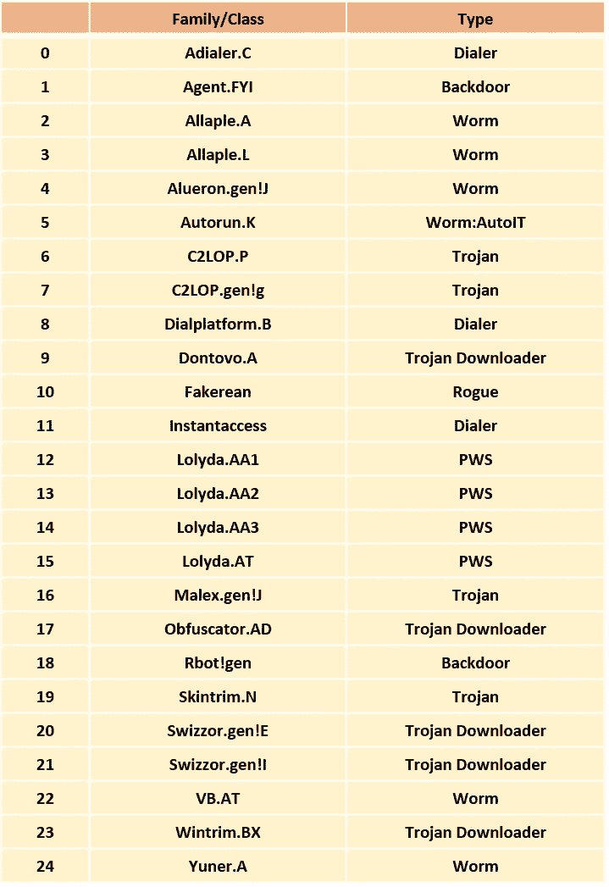
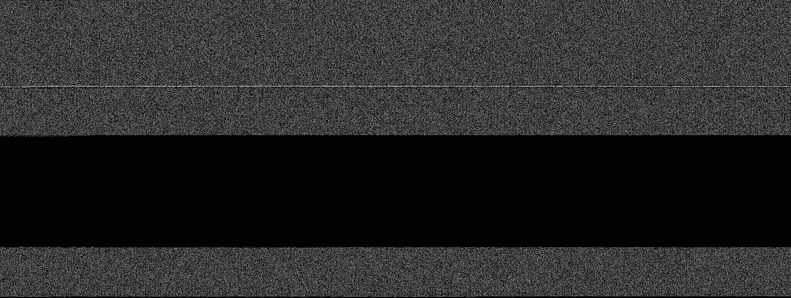
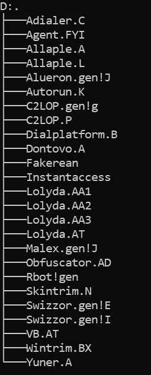
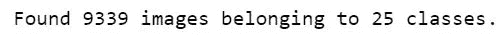
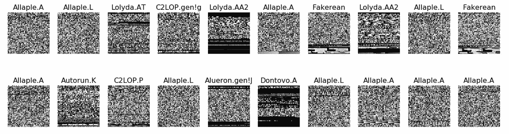
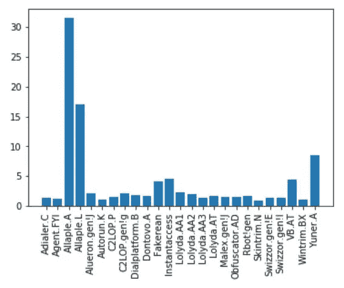
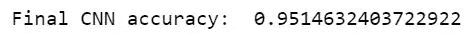
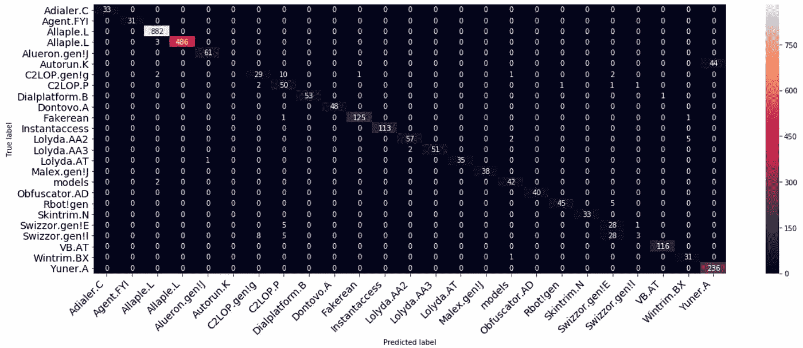

# 使用卷积神经网络的恶意软件分类—分步指南

> 原文：<https://towardsdatascience.com/malware-classification-using-convolutional-neural-networks-step-by-step-tutorial-a3e8d97122f?source=collection_archive---------8----------------------->

## 数据科学项目

## 关于恶意软件分类的有趣方法的快速简单的教程。

马库斯·斯皮斯克在 [Unsplash](https://unsplash.com?utm_source=medium&utm_medium=referral) 上的照片

> 一个**恶意软件**是一个通用术语，描述任何对系统有害的恶意代码或程序。

如今，有无数类型的恶意软件试图破坏公司的信息系统。因此，**检测**和**预防**是避免任何风险的关键。**恶意软件分类**是一个广泛使用的任务，正如你可能知道的，可以通过**机器学习**模型非常有效地完成。

在本文中，我决定将重点放在一个有趣的基于**卷积神经网络**的恶意软件分类方法上。这个想法直接来自 L. Nataraj、S. Karthikeyan、G. Jacob 和 B. S. Manjunath 的论文**恶意软件图像:可视化和自动分类**。

我的目标是给你一个快速简单的教程，教你如何实现他们的解决方案，从恶意软件的**预处理**到**推理**部分。希望您能够理解主要概念，并使用本文来构建自己的项目！

这个项目可以在我的 [**Github**](https://github.com/hugom1997/Malware_Classification) 上找到。

# 资料组

首先我们来介绍一下数据集！我们将主要使用来自前述论文的 [**恶意数据集**](https://www.dropbox.com/s/ep8qjakfwh1rzk4/malimg_dataset.zip?dl=0) 。

**恶意软件数据集**包含 **9339** 恶意软件图像，属于 **25** 家族/类。因此，我们的目标是对恶意软件进行**多类分类**。

以下是关于数据集的信息:

我们的模型将试图预测每个恶意软件属于哪个**家族**。**类型**栏仅提供信息。

# 预处理

## 从二进制到图像

由于**恶意数据集**已经包含了**恶意图像**，我将使用另一个数据集首先向您展示如何将**恶意图像**转换为**图像**。我从这个[数据集](https://www.kaggle.com/c/malware-classification/data?select=train.7z)中选取了示例文件。

对于每个文件，原始数据包含文件二进制内容的十六进制表示。目标是将这些文件转换成 **PNG** 图像，并将它们用作我们 **CNN** 的输入。

我们可以使用以下函数转换每个恶意软件:

下面是将**0 acdb r5 m3 zhbjajygtuf . bytes**二进制文件转换成 **PNG 后的结果图。**

0ACDbR5M3ZhBJajygTuf.bytes 至 PNG

由于这种方法，我们可以创建自己的 PNG 恶意软件数据集。然而，我不会处理整个数据集，现在将重点关注**恶意数据集**，其中恶意软件已经转换为图像。

而且，每个恶意软件镜像都需要放入与其**类**对应的**子文件夹**中。因此，在创建您自己的图像数据集时，不要忘记在执行下一步之前按家族将恶意软件收集到子文件夹中。

## 生成数据集

以下是我们的恶意软件类别/家族，作为包含**png**的子文件夹:

作为子文件夹的类别

`ImageDataGenerator.flow_from_directory()`从各自的数据目录(在我们的例子中是系列)生成批量归一化张量图像数据。多亏了这个功能，我们可以将我们的图像用于**训练**和**测试**。

*   **target_size** :将所有图像调整到指定尺寸。我选择了(64*64)的图片。
*   **batch_size** :是我们将要使用的批次的大小。在我们的例子中，我们只有 9339 个图像，因此设置大于这个值的批量大小不会改变任何事情。

一旦生成了我们的批次，我们可以使用`train_test_split()`功能在**序列**和**测试**之间分割数据，遵循(7*0–30*)的比例。

下面是相应的代码:

`ImageDataGenerator().flow_from_directory()`的输出:

如您所见，由于子文件夹的名称，该函数很好地识别了 **25** 类。

这是我们数据集的一个示例:

样品

我们已经可以看到文件之间的一些差异。然而，对我们来说，要准确地将恶意软件划分到不同的家庭中去太难了。

## 快速分析

根据下图，我们的数据集是相当**不平衡**的:超过 30%的图像属于第二类:**all ple。一个**和 17%的三级:**全部。L** ！我们将需要稍后处理这个问题。

不平衡数据集

> 让我们现在建立我们的 CNN 模型

# CNN 模型

## 体系结构

现在我们的数据集已经准备好了，我们可以使用 Keras 构建我们的模型。将使用以下结构:

*   **卷积层** : 30 个滤波器，(3 * 3)内核大小
*   **最大池层** : (2 * 2)池大小
*   **卷积层** : 15 个滤波器，(3 * 3)内核大小
*   **最大池层数** : (2 * 2)池大小
*   **脱落层**:脱落 25%的神经元。
*   **展平图层**
*   **密集/全连接层** : 128 个神经元，Relu 激活功能
*   **脱落层**:脱落 50%的神经元。
*   **密集/全连接层** : 50 个神经元，Softmax 激活功能
*   **密集/全连接层** : num_class 神经元，Softmax 激活函数

**输入**的形状为【64 * 64 * 3】:【宽*高*深】。在我们的例子中，每个恶意软件都是一个 **RGB** 图像。

下面是相应的代码:

## 不平衡数据

有几种方法可以处理**不平衡数据**。我选择给少数阶级较高的权重，给多数阶级较低的权重。

**sk learn . utilis . class _ weights**函数使用 **y** 的值自动调整输入数据中与类别频率成反比的权重。要使用这种方法， **y_train** 不能被一键编码。

# 结果

在对我们的模型进行训练和测试之后，我们最终达到了 95%的准确率，这还不错！

绘制**混淆矩阵**可以给我们一些提示，告诉我们在分类过程中哪里出错了。

混淆矩阵

我们可以观察到，虽然大部分恶意软件被很好的分类，**自动运行。K** 总是被误认为**允儿。答**。这大概是因为我们的 **Autorun 的样本非常少。K** 在我们的数据集中，并且两者都是 close **Worm** 类型的一部分。

而且， **Swizzor.gen！E** 就是经常被误认为 **Swizzor.gen！l** ，这可以用这样一个事实来解释，他们来自非常相近的家族和类型，因此他们的代码可能有相似之处。

最后，我相信，由于本文中提到的预处理步骤，我们可以通过创建更大的数据集来大大提高模型的性能。现在就看你的了！

# 结论

就是这样！由于这篇文章，你现在能够建立你的**恶意软件图像**数据集，并使用它来执行**多类分类**，由于**卷积神经网络**。

我希望这篇教程能以任何方式帮助你构建你的项目！现在，下一步可能是理解如何部署它😉

再说一次，我的目标只是给出一个关于其他人的[伟大作品](https://dl.acm.org/doi/10.1145/2016904.2016908)的简单教程，所以为他们欢呼吧！🍺

当然，我的 [**Github**](https://github.com/hugom1997/Malware_Classification) 上什么都有。

**祝您愉快！**

# 参考

以下是我找到灵感的地方:

 [## 恶意软件图片|第八届网络安全可视化国际研讨会会议录

### 我们提出了一种简单而有效的方法，使用图像处理技术对恶意软件进行可视化和分类…

dl.acm.org](https://dl.acm.org/doi/10.1145/2016904.2016908)  [## 基于多家族恶意软件数据集的 k-fold 交叉验证监督分类

### 随着恶意软件及其家族数量的不断增加，将恶意软件分类到特定的家族非常具有挑战性…

sarvamblog.blogspot.com](https://sarvamblog.blogspot.com/2014/08/supervised-classification-with-k-fold.html)  [## Python - DZone AI 中基于卷积神经网络的恶意软件检测

### 在本帖中，我们将学习人工网络架构以及如何使用其中一种(卷积神经…

dzone.com](https://dzone.com/articles/malware-detection-with-convolutional-neural-networ)  [## 基于 Keras 的 CNN 图像分类器图像预处理

### 在这一集里，我们将演示如何使用 Keras 设置训练一个卷积神经网络(CNN)。我们的…

deeplizard.com](https://deeplizard.com/learn/video/LhEMXbjGV_4)