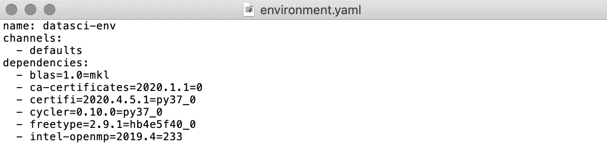
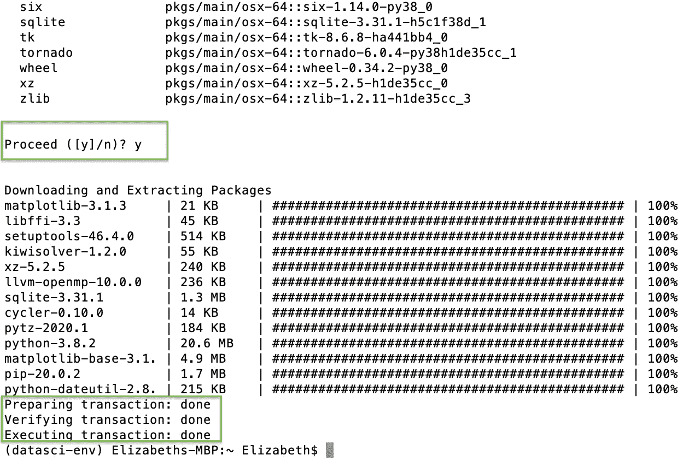

# 使用 Conda 创建可再现的数据科学和机器学习环境

> 原文：<https://towardsdatascience.com/manage-data-science-and-machine-learning-environments-using-conda-42b9b2f0689a?source=collection_archive---------19----------------------->

## *使用 Conda、JupyterLab 和 Git 开发包含环境管理的工作流指南*


[冰岛托尔斯莫尔克](https://unsplash.com/photos/EvKBHBGgaUo)

# 介绍

数据科学和机器学习项目有依赖关系，我们依赖这些依赖关系来运行我们的代码，就像 pandas 或 numpy。这些依赖关系会随着时间的推移而更新，并且有不同的版本，如果使用了错误的版本，可能会导致代码中断。如果您与其他团队成员一起工作，您还需要在不同的计算机上维护相同的本地开发环境，以便代码能够成功运行。要为项目创建可复制的环境，使用环境管理器是一个很好的实践，它可以跟踪所有的依赖项——比如 Conda。

## 康达是什么？

> Conda 是一个开源的包管理系统和环境管理系统，运行在 Windows、macOS 和 Linux 上。Conda 快速安装、运行和更新软件包及其依赖项。Conda 可以在本地计算机上轻松创建、保存、加载和切换环境。它是为 Python 程序创建的，但是它可以为任何语言打包和分发软件。
> 
> -蟒蛇文件

这篇文章将帮助您开发一个更好的工作流程来使用 Conda 管理您的环境。请随意跳过任何部分，直接跳到您需要的代码！

## **概述**

*   安装 Anaconda
*   创建和激活 Conda 环境
*   安装和卸载依赖项
*   导出 Conda 环境
*   使用 Conda 和 JupyterLab
*   停用或删除 Conda 环境
*   命令摘要
*   可再生环境的工作流程示例

# 安装 Anaconda

如果您还没有安装 Anaconda，请按照这里的说明[为您的操作系统安装它。安装之后，您应该会在应用程序中看到 Anaconda-Navigator。](https://docs.anaconda.com/anaconda/install/)


# 创建和激活 Conda 环境

当您开始一个新项目时，您可以创建一个全新的 Conda 环境，或者从一个`yaml`文件重新创建一个现有的环境。

## **创建新的 Conda 环境**

要创建新的 Conda 环境，请打开您的终端并键入以下命令:

```
conda create -n datasci-env
```

您将看到以下提示，询问您是否继续。键入`y`继续创建环境。


## 从 environment.yml 文件创建环境

如果您有一个包含项目依赖项的现有文件，您可以通过运行以下命令来重新创建环境:

```
conda env create -f environment.yaml
```

在这种情况下，`yaml`文件的第一行将设置环境的名称。用下面的`yaml`文件创建的环境名将被称为`datasci-env`。



## 使活动

创建环境后，您可以使用以下方式激活它:

```
conda activate datasci-env
```

您可以通过查看终端的左侧来区分环境是否已激活。您应该会看到它从`base`变为`datasci-env`，如下所示:


## 确认 Python 版本

我们可以使用以下命令在我们新创建的 Conda 环境中检查 python 的版本:

```
python --versionOR python3 --version
```

***注意:*** *默认情况下，macOS Catalina 将 python 作为 Python 2，因此为了在 Python 3 中运行任何东西，您必须使用* `*python3*`

在您的终端中运行这些命令时，您将看到以下内容:


这意味着我们刚刚创建的 conda 环境正在运行版本`Python 3.7.3`。如果这是您想要的 python 版本，您可以跳过下一节，继续安装依赖项。

## 使用不同版本 Python 的 Conda 环境(可选)

如果您的环境需要不同版本的 python，您需要在安装时指定版本。首先，让我们停用刚刚创建的环境:

```
conda deactivate
```

例如，如果我们想要创建一个 Python 3.5 环境，我们可以运行以下命令:

```
conda create -n datasci-env-py35 python=3.5
```

下面我确认 conda 通过激活环境和运行`python3 --version`安装了正确版本的 python。


您可以使用以下命令列出所有可用的环境:

```
conda env list
```

# **安装和卸载依赖关系**

首先，确保激活了正确的环境(它应该出现在终端左侧的括号中)。如果您正在处理多个项目，在错误的位置安装依赖项会导致问题，因此确保您在正确的环境中是很重要的。

## 安装

现在，您应该能够使用`conda install`安装您的依赖项了。让我们用一些流行的数据科学库来尝试一下:

```
conda install pandas matplotlib numpy scikit-learn
```

您将收到另一个提示，要求您继续，在键入`y`之后，您应该会看到所有的包都成功安装了。



如果您需要安装软件包的特定版本，您可以在安装时命名该版本:

```
conda install pandas=0.25.1
```

上面的这个命令也可以在你安装了库和包之后降级它们。

## 从计算机上卸载

如果要卸载软件包，可以使用以下方法:

```
conda uninstall PACKAGE_NAME
```

您可以使用`conda list`检查当前环境中的所有包和版本，它将显示以下内容:


***注意:*** *——如果* `*conda install*` *命令对你要安装的库不起作用，你可以试着谷歌一下如何安装那个特定的库。
-安装依赖项时，请小心升级您的 python 版本。上面可以看到安装把我的 python 版本升级到了 3.8.2。*

# 导出 Conda 环境

现在我们已经有了一个安装了一些依赖项的环境，我们可以为了版本控制和可再现性而导出它们。理想情况下，您会将这些文件导出到您的项目目录中，并将它们推送到 github，以获得版本历史的正确记录。您可以根据需要导出一个`txt`或`yaml`文件。

首先确保您激活了 conda 环境，并且您位于终端中正确的项目目录中。要将依赖项导出到一个`txt`文件，请运行以下命令:

```
**# with conda**
conda list --export > requirements.txt**# with pip**
pip freeze > requirements.txt
```

要将依赖项导出到一个`yaml`文件，请运行以下命令:

```
conda env export > environment.yaml**# OR if you run into issues, try --no-builds** conda env export --no-builds > environment.yaml
```

运行这些命令之后，您应该会看到一个新文件出现在您的项目目录中，其中包含所有的依赖项。您应该将该文件推送到 github，以便您的团队成员或您自己以后可以访问并重新创建准确的项目环境。

如果您正在与一个团队一起工作，如果其他人通过安装新的依赖项进行了更改，您可能希望在某个时候更新您这一端的环境。您可以使用以下命令从`yaml`文件更新现有的 conda 环境:

```
conda env update --file environment.yaml
```

# 使用 Conda 和 JupyterLab

如果您想在 JupyterLab 中使用 conda 环境，您需要为该环境创建一个特定的内核。

首先在您的环境中安装`jupyterlab`和`ipykernel`，然后创建一个新的内核:

```
conda install -c conda-forge jupyterlab ipykernelipython kernel install --user --name=datasci-env
```

**现在，您应该能够使用以下命令从终端启动 JupyterLab 了:**

```
jupyter lab
```

**一旦 JupyterLab 启动，你可以打开一个新的或现有的笔记本，点击右上角的内核，并从下拉列表中选择你的新内核。如果看不到内核，尝试重启 Jupyter。**

****

**如果您想要列出“终端”中可用的内核:**

```
jupyter kernelspec list
```

# **停用环境**

**当您使用完 conda 环境后，您可以在终端中使用以下命令停用它:**

```
conda deactivate
```

**您的终端现在应该将`(base)`显示为左侧的环境:**

****

# **删除环境**

**如果您完成了一个项目，不再需要一个环境，您可以使用以下命令删除它:**

```
conda env remove -n datasci-env
```

# **命令摘要**

```
**# create new environment**
conda create -n ENV_NAME**# create new environment with different version of python**
conda create -n ENV_NAME python=VERSION**# create environment from existing environment.yaml** conda env create -f environment.yaml**# update existing environment from environment.yaml** conda env update --file environment.yaml**# activate environment** conda activate ENV_NAME**# deactivate environment** conda deactivate**# delete/remove environment** conda env remove -n ENV_NAME**# list all environments** conda env list**# export requirements.txt with conda**
conda list --export > requirements.txt**# export requirements.txt with pip**
pip freeze > requirements.txt**# export environment.yaml** conda env export > environment.yaml**# export environment.yaml with no builds** conda env export --no-builds > environment.yaml**# install dependencies**
conda install PACKAGE_NAME
OR
conda install -c conda-forge PACKAGE_NAME**# install dependencies with a specific version** conda install PACKAGE_NAME=VERSION**# uninstall dependencies** conda uninstall PACKAGE_NAME**# list all dependencies** conda list**# create ipython kernel (for jupyter and jupyterlab)** conda install -c conda-forge jupyterlab ipykernel
ipython kernel install --user --name=KERNEL_NAME**# list all ipython kernels**
jupyter kernelspec list**# uninstall/remove existing ipython kernel**
jupyter kernelspec uninstall KERNEL_NAME
```

# **可再生环境的工作流程示例**

1.  **为项目创建新的 Github repo**
2.  **使用`git clone`在本地克隆回购**
3.  **`cd`进入项目目录**
4.  **创建新的 Conda 环境**
5.  **激活环境**
6.  **安装依赖项**
7.  **在 Jupyter 或其他 IDE 中处理项目**
8.  **(可选)如果在 Jupyter 中工作，从 env 创建内核**
9.  **将 conda env 导出到`yaml`或`txt`文件**
10.  **保存代码**
11.  **创建`.gitignore`来避免不想添加到 git 的文件**
12.  **使用`git add .`将文件添加到 git**
13.  **将环境文件和代码推送到 Github**

**要再现环境:**

1.  **在不同的计算机上克隆 repo**
2.  **从`yaml`或`txt`文件创建环境(不必使用 Conda)**
3.  **运行代码**

*****注意:*** *如果您计划部署您的项目，您可能想要维护一个单独的部署环境，该环境只包含已部署方面所需的依赖项。***

**现在，您应该能够在 conda 环境中创建、激活和安装依赖项，以创建可再现的数据科学和机器学习环境。**

**请随时在 twitter [@elizabethets](http://www.twitter.com/elizabethets) 或 [LinkedIn](https://www.linkedin.com/in/elizabethts/) 上与我联系！**

# **来源**

**[](https://docs.conda.io/projects/conda/en/latest/user-guide/getting-started.html#managing-python) [## conda-conda 4 . 8 . 3 . post 51+2 CD D7 ab 0 文档入门

### 这个 20 分钟的 conda 入门指南让你尝试 conda 的主要功能。你应该明白…

docs.conda.io](https://docs.conda.io/projects/conda/en/latest/user-guide/getting-started.html#managing-python)  [## 安装- Anaconda 文档

### 在安装 Anaconda 个人版之前，请阅读下面列出的系统要求。如果你不想要…

docs.anaconda.com](https://docs.anaconda.com/anaconda/install/)**