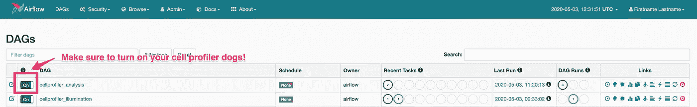

# 使用 Apache Airflow 管理高含量筛选 CellProfiler 管道

> 原文：<https://towardsdatascience.com/manage-high-content-screening-cellprofiler-pipelines-with-apache-airflow-66c6ec494686?source=collection_archive---------63----------------------->


如果你正在运行一个高内容筛选管道，你可能有很多移动的部分。作为一个非详尽的列表，您需要:

*   触发 [CellProfiler](https://cellprofiler.org/) 分析，要么来自 LIMS 系统，通过观察文件系统，要么来自其他进程。
*   跟踪 CellProfiler 分析的相关性-首先运行光照校正，然后进行分析。
*   如果您有一个大型数据集，并且希望在本世纪的某个时候对其进行分析，您需要拆分分析、运行，然后收集结果。
*   一旦你有了结果，你需要决定一个组织方法。你需要把你的数据放入数据库，并建立深度分析管道。

当您拥有一个为科学工作流而构建的系统或框架时，这些任务会更容易完成。

如果你更喜欢看，我有一个视频，我通过这个教程中的所有步骤。

# 进入阿帕奇气流

[阿帕奇气流](https://airflow.apache.org/)是:

> *Airflow 是一个由社区创建的平台，用于以编程方式创作、安排和监控工作流。*

关于 Apache Airflow 有很多很好的介绍资源，但是我在这里将非常简要地介绍一下。

Apache Airflow 为您提供了一个框架，将您的分析组织到 Dag 或有向无环图中。如果你不熟悉这个术语，它实际上只是一种说法，第三步依赖于第二步，第二步依赖于第一步，或`Step1 -> Step2 -> Step3`。

Apache Airflow 使用**Dag**，这些 Dag 是你用来进行分析的桶。您的 DAG 由操作员和传感器组成。操作符是对你正在完成的任务的一种抽象。这些通常是 Bash、Python、SSH，但也可以是更酷的东西，如 Docker、Kubernetes、AWS Batch、AWS ECS、数据库操作、文件推送器等等。还有**传感器**，它们是等待各种操作的漂亮而闪亮的方式，无论是等待文件出现、数据库中的记录出现，还是等待另一个任务完成。

开箱即用，您可以获得许多好处，包括一个漂亮的 web 界面，带有任务的可视化浏览器、调度器、可配置的并行性、日志记录、观察器和任意数量的执行器。因为所有的配置都是用代码编写的，所以非常灵活。它可以与现有系统集成，也可以独立运行。

有许多科学的工作流管理器，在我完成这篇文章的时候，将会有更多的出现。阿帕奇气流是我最喜欢的，但你应该货比三家，看看你点击什么！

# 计算后端

我之前简单地提到了这一点，但是最初吸引我到 Apache Airflow 的好处之一是它对您的计算环境是完全不可知的。您可以拥有一台笔记本电脑、一台服务器、一个 HPC 集群，或者在 AWS 或 GCP 上执行。气流本身并不在意。您需要做的就是规划出您的逻辑，确保数据可用，并使用任何合适的操作符。

# CellProfiler 分析工作流程示例

在这篇文章中，我将讨论 [BBBC021](https://data.broadinstitute.org/bbbc/BBBC021/) 数据集以及我将如何组织和批处理分析。

我决定进行一个简单的设置，即将 Apache Airflow 与 docker-compose 结合使用，并使用 docker 操作符来执行 CellProfiler 分析。规划好逻辑和工作流后，您可以针对任何计算基础架构使用任何操作员，无论是 AWS ECS 还是 HPC。我最近最喜欢的是 Kubernetes，因为它不依赖于任何平台，可以在 AWS、GCP 或室内使用。您可以使用 Kubernetes 部署您的数据可视化应用程序，如 [RShiny](https://medium.com/swlh/deploy-rshiny-with-kubernetes-using-aws-eks-and-terraform-655921d9e13c) 、 [Dash](https://plotly.com/dash/) 或 [Redash](https://redash.io/) ，如果您使用网络存储或 S3，您的所有应用程序都可以访问相同的数据！

# 项目设置

让我们设置我们的项目目录结构！

```
mkdir CellProfiler-Apache-Airflow
cd CellProfiler-Apache-Airflow
mkdir -p data/dags
mkdir -p data/BBBC021/Week1
cd data/BBBC021/Week1
wget https://data.broadinstitute.org/bbbc/BBBC021/BBBC021_v1_images_Week1_22123.zip
find $(pwd) -name "*zip" | xargs -I {} unzip {}
# Clean up the zips, we don't need them anymore
find $(pwd) -name "*zip" | xargs -I {} rm -rf {} 
cd ../
# Run $(pwd) to check where you are. You should be in /project/BBBC021
wget https://data.broadinstitute.org/bbbc/BBBC021/BBBC021_v1_image.csv
wget https://data.broadinstitute.org/bbbc/BBBC021/BBBC021_v1_compound.csv
wget https://data.broadinstitute.org/bbbc/BBBC021/BBBC021_v1_moa.csv
wget https://data.broadinstitute.org/bbbc/BBBC021/analysis.cppipe
wget https://data.broadinstitute.org/bbbc/BBBC021/illum.cppipe

# Let's create a data file ONLY for the week1 images, the first dataset
head -n 1 BBBC021_v1_image.csv > images_week1.csv
cat BBBC021_v1_image.csv | grep Week1_22123 >> images_week1.csv
```

这主要是来自 [Bitnami](https://github.com/bitnami/bitnami-docker-airflow) 的阿帕奇气流配置。Bitnami 很棒，我一直在用他们的配置和图片。我对此做了一些修改，以绑定我们的分析 Dag，还做了一个快速更改，以便我们可以使用 docker 操作符。

# Dockerfile 文件

`We're going to use a custom Cellprofiler image to run our pipelines. Create a Dockerfile`有了这个:

```
FROM cellprofiler/cellprofiler:3.1.9

RUN apt-get update -y; apt-get install -y unzip imagemagick

ENV TINI_VERSION v0.16.1
ADD https://github.com/krallin/tini/releases/download/${TINI_VERSION}/tini /usr/bin/tini
RUN chmod +x /usr/bin/tini

ENTRYPOINT [ "/usr/bin/tini", "--" ]
CMD [ "/bin/bash" ]
```

现在我们将构建新的 CellProfiler 图像！

```
docker build -t cellprofiler .
```

# 获取 Docker 撰写配置

抓取这个文件并以`docker-compose.yml`的名称保存在您的项目根目录中。

```
version: '2'

services:
  postgresql:
    image: 'bitnami/postgresql:10'
      - 'postgresql_data:/bitnami/postgresql'
    environment:
      - POSTGRESQL_DATABASE=bitnami_airflow
      - POSTGRESQL_USERNAME=bn_airflow
      - POSTGRESQL_PASSWORD=bitnami1
      - ALLOW_EMPTY_PASSWORD=yes
  redis:
    image: bitnami/redis:5.0
    volumes:
      - 'redis_data:/bitnami'
    environment:
      - ALLOW_EMPTY_PASSWORD=yes
  airflow-scheduler:
    image: bitnami/airflow-scheduler:1
    environment:
      - AIRFLOW_LOAD_EXAMPLES=no
      - AIRFLOW_DATABASE_NAME=bitnami_airflow
      - AIRFLOW_DATABASE_USERNAME=bn_airflow
      - AIRFLOW_DATABASE_PASSWORD=bitnami1
      - AIRFLOW_EXECUTOR=CeleryExecutor
    volumes:
      - /var/run/docker.sock:/var/run/docker.sock
      - ./data:/data
      - ./dags:/opt/bitnami/airflow/dags
      - airflow_scheduler_data:/bitnami
  airflow-worker:
    image: bitnami/airflow-worker:1
    environment:
      - AIRFLOW_LOAD_EXAMPLES=no
      - AIRFLOW_DATABASE_NAME=bitnami_airflow
      - AIRFLOW_DATABASE_USERNAME=bn_airflow
      - AIRFLOW_DATABASE_PASSWORD=bitnami1
      - AIRFLOW_EXECUTOR=CeleryExecutor
    volumes:
      - /var/run/docker.sock:/var/run/docker.sock
      - ./data:/data
      - ./dags:/opt/bitnami/airflow/dags
      - airflow_worker_data:/bitnami
  airflow:
    image: bitnami/airflow:1
    environment:
      - AIRFLOW_LOAD_EXAMPLES=no
      - AIRFLOW_DATABASE_NAME=bitnami_airflow
      - AIRFLOW_DATABASE_USERNAME=bn_airflow
      - AIRFLOW_DATABASE_PASSWORD=bitnami1
      - AIRFLOW_EXECUTOR=CeleryExecutor
    ports:
      - '8080:8080'
    volumes:
      - /var/run/docker.sock:/var/run/docker.sock
      - ./data:/data
      - ./dags:/opt/bitnami/airflow/dags
      - airflow_data:/bitnami
volumes:
  airflow_scheduler_data:
    driver: local
  airflow_worker_data:
    driver: local
  airflow_data:
    driver: local
  postgresql_data:
    driver: local
  redis_data:
    driver: local
```

如果您不习惯容器，这可能会有点棘手，但有一点要注意，主机上的路径不一定与 docker 容器中的路径相同，例如，我们的数据目录可能在主机系统上的任何地方，但在我们的容器上被绑定为`/data`。

把`docker-compose.yml`文件放到你的项目目录中，用`docker-compose up`调出。初始化可能需要一些时间。这是我去泡茶的时候。；-)

一旦启动，您将能够使用默认配置在`localhost:8080`访问您的 Airflow 实例。

```
AIRFLOW_USERNAME: Airflow application username. Default: user AIRFLOW_PASSWORD: Airflow application password. Default: bitnami
```

这里还不会有什么有趣的东西，因为我们还没有分析到位。

# 抓住细胞分析仪的分析工具

首先拿起照明匕首。将它放在您的`dags`文件夹中。它可以被命名为任何东西，气流引用的是`dag_id`，但我会引用它为`cellprofiler-illum-dag.py`。

```
# dags/cellprofiler-illum-dag.py
from airflow import DAG
from datetime import datetime, timedelta
import string
import random
from airflow.utils import timezone
from airflow.operators.dagrun_operator import TriggerDagRunOperator
from airflow.operators.bash_operator import BashOperator
from airflow.operators.python_operator import PythonOperator
# Depending on which version of airflow you are on you will use either operators.docker_operator or providers.docker
from airflow.operators.docker_operator import DockerOperator
# from airflow.providers.docker.operators.docker import DockerOperator
from airflow.api.common.experimental.trigger_dag import trigger_dag
from airflow.sensors.external_task_sensor import ExternalTaskSensor
from airflow.api.common.experimental import check_and_get_dag, check_and_get_dagrun
import time
import os
from pprint import pprint
from airflow.utils.state import State

this_env = os.environ.copy()

this_dir = os.path.dirname(os.path.realpath(__file__))

default_args = {
    'owner': 'airflow',
    'depends_on_past': False,
    'start_date': datetime(2019, 1, 1),
    'email': ['airflow@example.com'],
    'email_on_failure': False,
    'email_on_retry': False,
    'retries': 1,
    'retry_delay': timedelta(minutes=5),
}

dag = DAG('cellprofiler_illumination', default_args=default_args, schedule_interval=None)

EXAMPLE_TRIGGER = """
{
    "illum_pipeline" : "/data/BBBC021/illum.cppipe",
    "analysis_pipeline" : "/data/BBBC021/analysis.cppipe",
    "pipeline" : "/data/BBBC021/illum.cppipe",
    "output": "/data/BBBC021/Week1/Week1_22123",
    "input": "/data/BBBC021/Week1/Week1_22123",
    "data_file": "/data/BBBC021/images_week1.csv"
}
"""

# Volumes are from the HOST MACHINE
illum = DockerOperator(
    dag=dag,
    task_id='illum',
    retries=1,
    volumes=[
        # UPDATE THIS to your path! 
        '/path-to-project-on-HOST/data:/data'
    ],
    working_dir='/data/BBBC021',
    tty=True,
    image='cellprofiler',
    command=[
        "bash", "-c",
        """cellprofiler --run --run-headless \
            -p {{ dag_run.conf['illum_pipeline'] }}  \
            -o {{ dag_run.conf['output'] }}  \
            -i {{ dag_run.conf['input'] }}  \
            -data-file {{ dag_run.conf['data_file'] }} \
            -c -r"""
    ]
)

def get_number_of_tasks(data_file):
    """
    Parse the file to get the number of lines
    The number of lines, minus 1 for the header
    is the number of groups
    :param data_file:
    :return:
    """
    file = open(data_file, "r")
    number_of_lines = 0
    for line in file:
        number_of_lines += 1
    file.close()
    return number_of_lines - 1

def watch_task(triggers):
    """
    This is only here for demonstration purposes
    to show how you could dynamically watch the cellprofiler analysis DAG
    :param triggers:
    :return:
    """
    print('-------------------------------------------')
    print('Checking up on our dag...')
    check_dag = check_and_get_dag(dag_id='cellprofiler_analysis')
    dag_run = check_and_get_dagrun(check_dag, triggers[0].execution_date)
    state = dag_run.get_state()
    finished = State.finished()
    unfinished = State.unfinished()

    while state in unfinished:
        time.sleep(10)
        state = dag_run.get_state()

    print('-------------------------------------------')
    print('Dag run finished or dead')
    pprint(dag_run.get_state())

def trigger_analysis(ds, **kwargs):
    """
    Trigger the cellprofiler analysis DAG
    We want one DAG run per row in the datafile, or -f / -l combo
    :param ds:
    :param kwargs:
    :return:
    """
    print('-------------------------------------------')
    print("Here's the conf!")
    pprint(kwargs['dag_run'].conf)
    output = kwargs['dag_run'].conf['output']
    data_file = kwargs['dag_run'].conf['data_file']
    no_tasks = get_number_of_tasks(str(data_file))
    triggers = []
    print('-------------------------------------------')
    print('Triggering our dag...')
    for index, value in enumerate(range(1, no_tasks + 1)):
        trigger = trigger_dag(
            dag_id="cellprofiler_analysis",
            replace_microseconds=False,
            run_id="trig__{}__f_{}__l_{}".format(
                timezone.utcnow().isoformat(),
                value,
                value
            ),
            conf={
                "pipeline": kwargs['dag_run'].conf['analysis_pipeline'],
                "output": "{}/f-{}__l-{}".format(output, value, value),
                "input": kwargs['dag_run'].conf['input'],
                "data_file": data_file,
                "first": value,
                "last": value,
            }
        )
        triggers.append(trigger)

trigger_analysis_task = PythonOperator(
    dag=dag,
    task_id='trigger_analysis',
    provide_context=True,
    python_callable=trigger_analysis
)

trigger_analysis_task.set_upstream(illum)
```

而现在我们的`cellprofiler-analysis-dag.py`。

```
# dags/cellprofiler-analysis-dag.py
from airflow import DAG
from datetime import datetime, timedelta
from airflow.operators.python_operator import PythonOperator
from airflow.operators.docker_operator import DockerOperator
import os
from pprint import pprint

this_env = os.environ.copy()

this_dir = os.path.dirname(os.path.realpath(__file__))

default_args = {
    'owner': 'airflow',
    'depends_on_past': False,
    'start_date': datetime(2019, 1, 1),
    'email': ['airflow@example.com'],
    'email_on_failure': False,
    'email_on_retry': False,
    'retries': 1,
    'retry_delay': timedelta(minutes=5),
}

dag = DAG('cellprofiler_analysis', default_args=default_args, schedule_interval=None)

analysis = DockerOperator(
    dag=dag,
    task_id='analysis',
    retries=1,
    volumes=[
        # Volumes are from the HOST MACHINE
        # UPDATE THIS to your path! 
        '/path-on-HOST/data:/data'
    ],
    tty=True,
    image='cellprofiler',
    command=[
        "bash", "-c",
        """cellprofiler --run --run-headless \
            -p {{ dag_run.conf['pipeline'] }}  \
            -o {{ dag_run.conf['output'] }}  \
            -i {{ dag_run.conf['input'] }} \
            --data-file {{ dag_run.conf['data_file'] }} \
            -c -r -f {{ dag_run.conf['first'] }} -l {{ dag_run.conf['last'] }}"""
    ]
)

def gather_results(ds, **kwargs):
    """
    Once we have the Cellprofiler results let's do something with them!
    :param ds:
    :param kwargs:
    :return:
    """
    pass

gather_results_task = PythonOperator(
    dag=dag,
    task_id='gather_results_task',
    provide_context=True,
    python_callable=gather_results
)

gather_results_task.set_upstream(analysis)
```

确保您更新了`DockerOperator` `volumes`以匹配您的本地文件系统！否则你的分析是行不通的！

# 分析组织概述

我们这里有 2 个独立的 Dag，每个 CellProfiler 分析一个。

这些步骤是:

*   所有图像的过程照明管道
*   获取数据文件，看看我们有多少图像
*   为每个图像动态生成一个 CellProfiler 提交。
*   (Placeholder)对我们的结果做点什么吧！

您会注意到，我们正在动态拆分 CellProfiler 分析。这将使我们的分析更快完成，当你购买产生大量数据的花哨的机器人显微镜时，这变得越来越重要。Airflow 负责处理引擎下的任务队列，所以我们需要做的就是找出我们如何分割分析的逻辑。如果你想知道更多关于并行性在气流中是如何处理的[，这是一篇很棒的文章](https://www.astronomer.io/guides/airflow-scaling-workers/)。

好的，最后一个只是一个占位符。我可以想象，一旦你有了结果，你会想对它们做些什么，比如把它们放入数据库，根据某些标准进行一个或多个分析，或者做一些后处理，但现在这是空白的，所以你可以想知道可能性。

# 将参数传递给我们的分析

当我开始使用气流时，这一点对我来说并不明显，现在你可以听到关于它的一切了！；-)

您可以使用 conf 对象或参数向气流传递参数。根据运算符类型的不同，这可能会略有不同。如果你使用的是 Python 操作符，你可以把它作为一个字典`kwargs['dag_run'].conf`来访问，如果你使用的是`Bash`，或者在这个例子中是`Docker`，你可以把它作为一个[模板变量](https://airflow.apache.org/docs/stable/tutorial.html#templating-with-jinja) `{{ dag_run.conf['variable'] }}`来访问。

我将带您了解如何使用 Airflow web 界面来触发 DAG 并传入变量，但是您也可以使用 REST API、通过 Airflow CLI 或使用 Python 代码以编程方式来触发 DAG。无论如何触发 DAG，都要将配置变量作为 JSON 字符串传入。

# 关于 Docker 卷的一个注记

这有点奇怪，因为我们使用 docker-compose 来运行 Airflow，然后使用 docker 操作符。请记住，当您使用 Docker 操作符时，您使用主机上的路径来映射卷，而不是在 docker-compose 容器中。你的主机就是你运行`docker-compose up`的机器。

例如:

```
analysis = DockerOperator(
    ...
    volumes=[
        # Volumes are from the HOST MACHINE
        '/path-on-HOST/data:/data'
        # NOT
        # '/data:/data'
        # Even though in our docker-compose instance the volume is bound as /data
    ],
    ...
)
```

# 分析一下！

我们准备好了！现在您已经有了 Dag(您需要有 Dag)所有设置，我们可以开始分析数据了！

使用用户`user`和密码`bitnami`在`localhost:8080`登录。您应该会看到如下所示的屏幕:



默认情况下，您的 dags 将关闭。确保在进行下一步之前打开它们！

# 触发你的分析

前往你在`localhost:8080`的主页并触发`cellprofiler-illum` DAG。


系统会提示您添加一些 JSON 配置变量。

```
{ "illum_pipeline" : "/data/BBBC021/illum.cppipe", "analysis_pipeline" : "/data/BBBC021/analysis.cppipe", "pipeline" : "/data/BBBC021/illum.cppipe", "output": "/data/BBBC021/Week1/Week1_22123", "input": "/data/BBBC021/Week1/Week1_22123", "data_file": "/data/BBBC021/images_week1.csv" }
```


您将返回到主页面，并且应该看到您的 CellProfiler 光照分析正在运行！


这里有一个简短的(~1 分钟)视频，展示了如何浏览气流界面来研究您的分析。

# 包裹

就是这样！让气流运行，你将有你的照明和分析管道运行，所有分裂很好，你不是保姆跟踪作业队列，日志，和成功/失败率。您还可以使用 REST API、CLI 或代码将 Airflow 与任何其他系统集成，例如 LIMS、报告数据库或辅助分析工作流。

如果你想了解更多，请查看我的网站，或者直接联系 jillian@dabbleofdevops.com。

# 感谢

特别感谢 Broad BioImage Repository 提供的数据集，以及 Anne Carpenter 博士、Beth Cimini 和 Becki Ledford 提供的极有价值的反馈和编辑！

# 引文

[https://data.broadinstitute.org/bbbc/BBBC021/](https://data.broadinstitute.org/bbbc/BBBC021/)

“我们使用图像集 bbbc 021v 1[蔡锷等人，分子癌症治疗学，2010]，可从广泛的生物图像基准收集[Ljosa 等人，自然方法，2012]。”

*最初发表于*[*【https://www.dabbleofdevops.com】*](https://www.dabbleofdevops.com/blog/manage-high-content-screening-cellprofiler-pipelines-with-apache-airflow)*。*