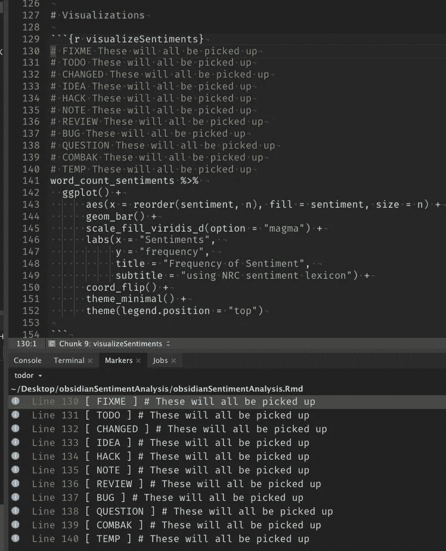
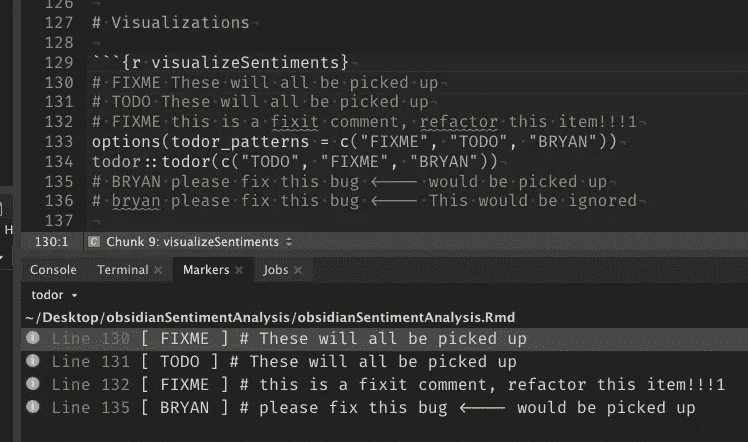
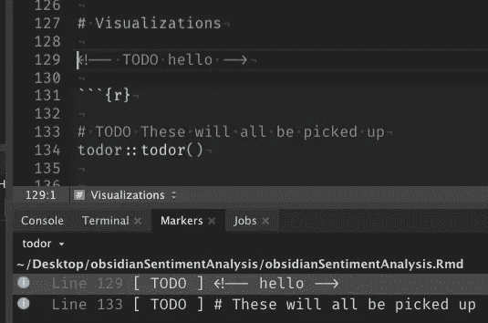
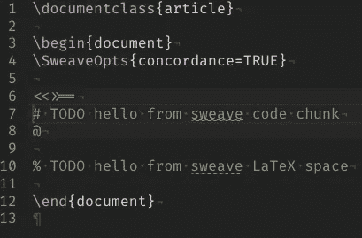
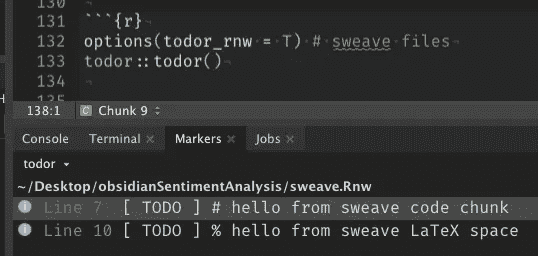
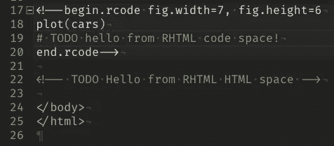
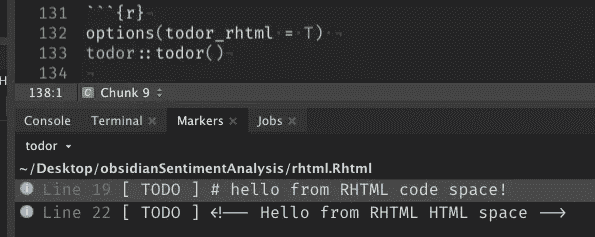
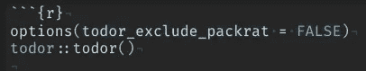
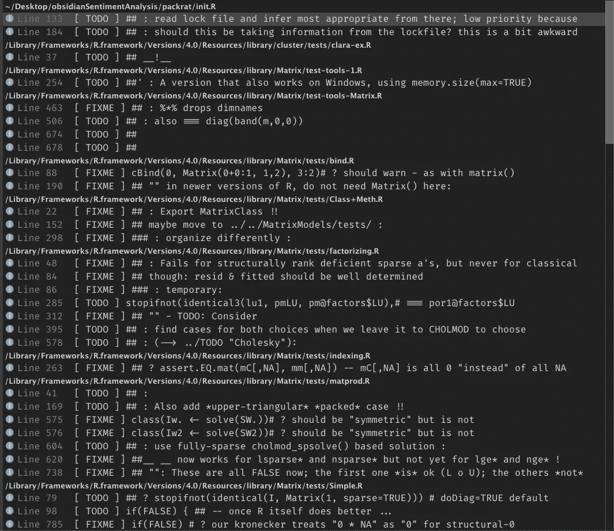

# 用 TODOr 管理你的整个 R 代码库

> 原文：<https://towardsdatascience.com/manage-your-entire-r-code-base-with-todor-76dcd7abad9?source=collection_archive---------13----------------------->

永远不要忘记修理你的`FIXME`或再次做你的`TODO`！


[图](https://unsplash.com/photos/64YrPKiguAE)由[本工程](https://unsplash.com/@thisisengineering?utm_source=unsplash&utm_medium=referral&utm_content=creditCopyText)在 [Unsplash](https://unsplash.com/?utm_source=unsplash&utm_medium=referral&utm_content=creditCopyText) 上进行

TODOr 是一个非常有用的 R 包，RStudio 插件使得管理你所有的开发者评论变得非常容易。


[照片](https://github.com/dokato/todor/blob/master/images/hexstick.png)由 TODOr 的开发者[张秀坤·克尔泽米斯基](https://twitter.com/dokatox)拍摄

# 托多能为你做什么？

## 这种情况在您身上发生的频率有多高:

> “我需要记得修复这个 bug…”

```
mean[1] # FIXME: This doesn't work#> Error in mean[1] : object of type 'closure' is not subsettable
```

然后你继续前进，继续你的工作，打算以后再回到这个问题上来。代码库可能充斥着这种类型的注释。R 包开发人员创建的这些提醒，每一个修正的意图，在庞大的代码库中经常会被遗忘或放错地方。

TODOr 减轻了技术债务的负担，解决了所有这些提醒你代码库健康的问题。

TODOr 将在整个文件、项目或包中找到所有这些提醒。甚至多种类型的文件都被支持，你会得到一个详细的提醒列表，包括什么类型的提醒，提醒的细节，文件所在的位置，文件所在的行，点击列表中的一项，你就可以找到你需要修复的代码行！

你需要做些什么来见证这种力量？只是这个:

```
todor::todor()
```

# 有哪些默认？

默认情况下，TODOr 将返回所有带有正确标记的注释(例如“TODO”、“FIXME”等)。)在整个 R 项目中(*当你有一个* `.Rproj` *文件在目录*中)而不仅仅是当前文件。

> “所有的评论？但我不在乎所有的评论，只在乎我该做的事……”

返回的并不是每个评论，TODOr 寻找以标记词开始的评论。默认值为:



作者图片

*   **固定时间**
*   **待办事宜**
*   **改变了**
*   **想法**
*   **黑掉**
*   **注**
*   **回顾**
*   **BUG**
*   **问题**
*   **COMBAK**
*   **温度**

# 超出默认范围

## 搜索范围

TODOr 不仅可以查看一个项目，还可以让它搜索单个文件:

```
todor::todor_file("my_file.Rmd")
```

或者甚至整个 R 包:

```
todor::todor_package()
```

## 标记

默认情况下，TODOr 会寻找所有前面提到的注释标记。您将得到一个返回给您的所有代码的列表，但是如果您有一个非常大的代码库呢？喜欢`ggplot2`大？

你可能只想查看一些特定类型的注释，我们可以通过向函数传递一个向量来做到这一点:

```
todor::todor(c("TODO", "FIXME"))
```

这将只显示为 **TODO** 和 **FIXME** 的注释。

这样，我们可以过滤我们的搜索，从特定的文件中筛选出我们想要返回的评论类型。

如果你不喜欢默认标记怎么办？

如果您希望您的团队拥有这一功能，但又希望用团队成员的名字来标记评论，该怎么办？

我们实际上可以定义一个自定义的 TODOr 搜索模式列表，这样我们就可以为函数定义新的关键字，以便在整个代码库中查找。为此，我们需要使用`options`函数:

```
options(todor_patterns = c("FIXME", "TODO", "BRYAN"))
```

现在，每当我把我的名字放在一个评论旁边时，它就会被 TODOr 作为一个有效的标记评论返回*。

**请务必注意，这些搜索模式区分大小写:*

```
# BRYAN please fix this bug <---- would be picked up
# bryan please fix this bug <---- This would be ignored
```



作者图片

# 托多尔能看到的不仅仅是`.R`的文件

## 在 TODOr 中，我们可以控制多种选项

还有其他几种文件类型，TODOr 可以在其中找到标记并以列表格式返回。为了搜索其他文件类型，我们可以用`options()`功能配置这些选项。



Rmarkdown 评论-作者图片

`todor_rmd` —当设置为真时，它也搜索 Rmd( *Rmarkdown* )文件(**默认为真**)。

返回的 Rmarkdown 标记注释将是使用 HTML 语法的代码块和 markdown 空格注释:



sweave 文档—按作者分类的图像

`todor_rnw` —设置为 TRUE 时，它还会搜索 Rnw( *Sweave* )文件(**默认为 FALSE** )。



Sweave 评论—作者图片

Sweave 是 LaTeX 与可执行 R 代码块的组合，返回的注释是代码块和 LaTeX 注释:



RHTML 文件—作者图片

`todor_rhtml` —当设置为真时，它也搜索 RHTML 文件(**默认为假**)。



就像 RMarkdown 文档一样，只要使用了正确的标记，HTML 样式和 R 样式的注释都会被选中。



Packrat 选项设置为 FALSE 按作者分类的图像



无尽的开发者评论——作者图片

`todor_exlude_packrat`—设置为 FALSE 时，“packrat”目录下的所有文件都被 ***排除*** ( **默认为 TRUE** )。

如果您曾经使用 packrat 来获取您的包或项目依赖关系的快照，那么您可能不希望为所有那些依赖包获取所有开发人员的注释。

我运行过一次，你肯定想把它改成`FALSE`，因为默认是`TRUE`，你可能会得到这样一个列表。

如果你真的想忽略 R 文件呢？该选项仅忽略 R 脚本文件，不忽略 RMarkdown。

`todor_exclude_r` —为真时，忽略 R 文件(**默认为假**)

## 总体而言，您可以将以下选项()用于 TODOr:

TODOr options() —按作者编码

# 概括起来

我希望这篇文章对你有所帮助，并决定在你的工作流程中使用 TODOr。我在公共部门政府的工作中使用了这个软件包，发现它对我自己的评论非常有帮助，以后可以很容易地跟进。

如果你更喜欢这个包评论的视频格式，并想获得我在 R 包评论中使用的所有文件，你可以在这里得到它们:

TODOr R 软件包评论—作者视频

对于我所有的 R 包评审，如果您需要我在评审中使用的任何代码/文档，我还将所有代码和样本文档保存在一个 repo 中:

[](https://github.com/tallguyjenks/RPackageReviews/tree/master/examples/todor) [## tallguyjenks/RPackageReviews

### 此时您不能执行该操作。您已使用另一个标签页或窗口登录。您已在另一个选项卡中注销，或者…

github.com](https://github.com/tallguyjenks/RPackageReviews/tree/master/examples/todor) 

如果你喜欢 R 包评论，你可以看看我以前对拼凑包的评论:

[](https://medium.com/analytics-vidhya/the-patchwork-package-in-r-9468e4a7cd29) [## R 中的拼凑包

### Patchwork 是 R 编程语言的一个包，它通过一个简单的…

medium.com](https://medium.com/analytics-vidhya/the-patchwork-package-in-r-9468e4a7cd29) 

## 来源

[1] D. Krzemiński， [TODOr — RStudio 插件，用于查找 TODO、FIXME、CHANGED 等。代码中的注释。](https://github.com/dokato/todor) (2017)，GitHub.com