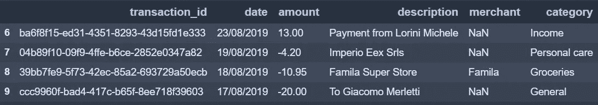
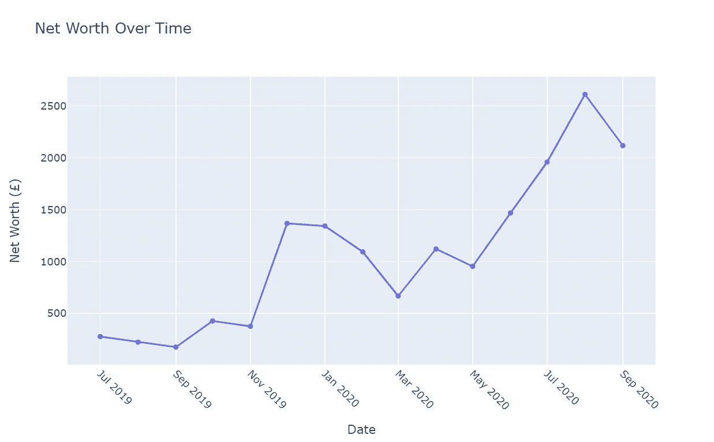
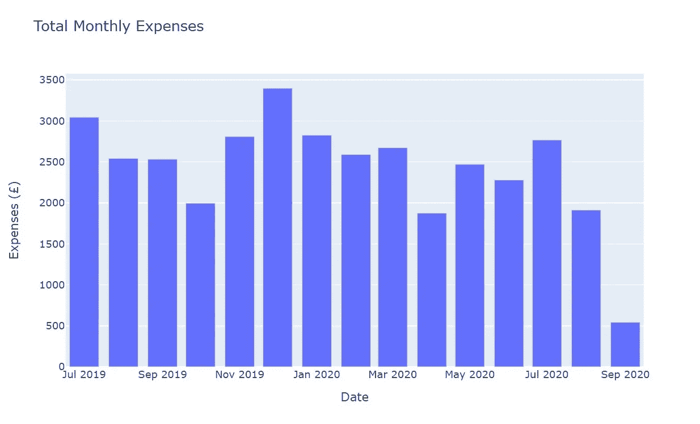
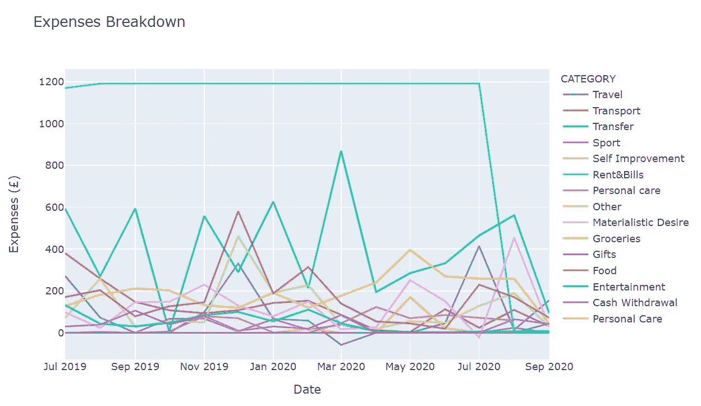
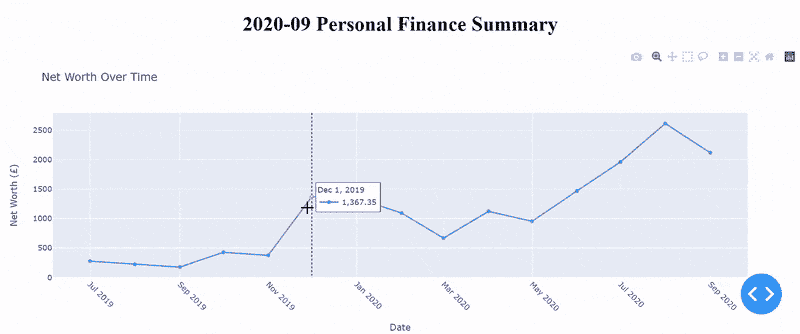

# 使用 Python 管理您的资金

> 原文：<https://towardsdatascience.com/manage-your-money-with-python-707579202203?source=collection_archive---------4----------------------->

## 一步一步引导你控制自己的财务

来自 [Pexels](https://www.pexels.com/photo/4386431) 的 [Karolina Grabowska](https://www.pexels.com/@karolina-grabowska) 摄影

曾经有一段时间，我们习惯于在笔记本、电子表格或应用程序上写下我们所做的所有交易，以了解我们如何花钱。嗯，这种方法可能相当耗时，需要努力，而且需要一致性。

**这篇文章旨在为你提供一个巩固的理财习惯，有效地控制你的支出**。如果你是一个初学 Python 的程序员，我希望这篇文章也能启发你一个实际的用例，你可以根据自己的需要进行个性化。

如果你喜欢视频格式，一定要在我的 YouTube 频道上查看这篇文章的内容

# 问题陈述

我们中的一些人使用移动应用程序来检查我们如何花钱。就我个人而言，为了跟踪我的支出，我使用 Yolt T7，这是一个应用程序，由于开放银行，它允许你把你所有的银行账户放在一个地方。

你可能已经意识到的是，Yolt 和数字银行的应用程序，如 [Revolut](https://revolut.com/) 或 [Monzo](https://monzo.com/) 在如何定制你的财务报告方面仍然有局限性。例如，Yolt 目前不允许你编辑你的支出类别，所以你不能将*午餐*、*外出就餐*和*外卖*归入一个单独的*食物*类别。此外，该应用程序可能会将你的健身房会员信息放在*食品杂货*下，或将你的机票购买信息放在*个人护理*下。这肯定不会帮助你跟上你的支出。

那么，如何才能让我们的资金管理更上一层楼呢？

# 解决办法

解决这个问题的一个方法是使用 Python 来处理我们的交易数据，并创建个性化的财务月报，以最能引起你共鸣的方式对费用进行分类。我们需要做的是收集每月的数据，并选择我们的费用类别(仅在第一次运行代码时)。

你可以在这个[链接](https://github.com/Lorenzorosa94/Personal-Finance-Summary)找到整个脚本。您可以访问它，以便更好地跟进或根据需要编辑代码。

> 在开始之前，重要的是要注意预算的好处不在于创建整洁的图表或仪表盘。这些方法可以让你发现你最糟糕的消费领域，并帮助你更好地控制它们。 ***真实值不在图表中。真正的价值在于图表如何改变你的行为。***

让我们通过以下 5 个步骤来看看如何更好地管理我们的钱。

# 步骤 1:导入 Python 库

首先，我们需要导入将要使用的 Python 库。库是允许您执行不同操作的函数和方法的集合。

# 第二步:获取数据

然后我们需要得到所有的交易数据。这可以通过将您的交易数据从您的网上银行下载到一个 csv 文件中来完成(大多数银行允许您从他们的应用程序中完成这一操作)。

如果你有多个银行账户，或者你无法从网上银行下载交易数据，我建议你使用 [Yolt](https://www.yolt.com/) 。使用此应用程序，您可以在一个地方获得您的所有帐户，并轻松下载包含您所有交易的 csv 文件(在应用程序中，只需进入更多选项卡，隐私设置，然后点击下载您的信息)。

因为我想让你们所有人都可以访问这篇文章，不管你有什么银行账户和应用程序，我们要使用的 csv 文件只有 6 列(id、日期、金额、描述、商家和类别)，看起来像下面的截图。在本练习中，我只使用了两个不同的银行账户，但是您可以根据需要添加任意数量的账户。让我们将交易数据转换成熊猫数据框架。

本练习中使用的数据帧的子集

在数据框架的这个子集中，我们已经可以看到有交易被错误地分类(例如，来自朋友的付款被标记为收入……)。我们将在接下来的步骤中解决这个问题。

# 步骤 3:操作数据并定制您的事务类别

按照此步骤，您可以编辑您的数据并个性化您想要的交易管理方式。

## 步骤 3.1:删除包含特定字符串的行

使用这一简单的行，您可以删除某一列中包含特定字符串的所有行(然后您可以重复该命令任意次来删除其他行)。在下面的例子中，我删除了将钱从一个银行账户转移到另一个银行账户的所有交易，我的应用程序将其标记为 *Internal* 。

## 步骤 3.2:定义所有交易的类别

现在是时候定义所有事务应该归入的类别了。在我的案例中，我选择使用 14 个类别:

*   收入
*   娱乐
*   食物
*   租金和账单
*   旅行
*   运输
*   运动
*   转移
*   物欲
*   现金提取
*   礼物
*   食品
*   个人护理
*   其他的

## 步骤 3.3:将交易分配到正确的类别

在您定义了您想要用来管理您的资金的所有交易类别后，我们可以开始识别在数据框架中被错误标记的交易，并将它们分配到正确的类别。这是以最符合你需求的方式形成你的最终报告的关键。

一种方法是再次定位包含特定字符串的行**，并将它们分配到某个类别(例如，包含*优步*、 *Zipcar* 或 *Bird* 的所有行都应该归入 *Transport* category *)。***

此外，使用下面的命令，您还可以将从开始的事务**从一个特定的字符串重新分配到一个特定的类别。例如，我将把描述以“*到“*开头的所有交易移动到*转移*类别。**

## 步骤 3.4:更改类别的名称

要用我们在上一步中定义的类别来改变现有的类别，我们可以使用下面的代码行。如上所述，一个例子是将所有与吃/喝相关的交易分配到一个*食品*类别。

# 第四步:设计你的月度报告

完成第 3 步后，我们现在应该有一个清晰的数据框架，其中包含按对我们更有意义的类别聚合的事务。我们现在准备设计我们的月度报告，它将由三张不同的图表组成。

## 步骤 4.1:一段时间内的净收入图表

我们要制作的第一张图表将显示我们的净收入(收入减去支出)如何随时间变化。

让我们添加一个列来获取交易的年份和月份(因为我们想要创建一个月报表)。然后，为了创建第一个图表，我们只需要按照我们刚刚创建的 *year_month* 列对数据帧进行分组，并添加一个包含金额累计总和的列。

通过使用 Plotly Go 库，我们可以创建一个线形图，Y 轴表示净收入，X 轴表示日期。

## 步骤 4.2:每月总费用图表

在第二个图表中，我们想要显示我们所有费用的总和每月是如何变化的。这将有助于我们了解每月支出是否超出预算，并与前几个月进行比较。

同样，我们将按照 *year_month* 列对数据框架进行分组，只是在删除了所有标记为 *Income 的交易之后。*

然后，通过使用 Plotly Express 库，我们可以创建一个条形图，Y 轴表示费用，X 轴表示日期。

## 第 4.3 步:费用分解图

我们要创建的最后一个图表将让我们清楚地了解我们是如何花钱的，按照我们在步骤 3.2 中定义的类别划分我们的支出。

为了做到这一点，我们将只旋转数据框架，以获得特定月份和类别的费用总和。

根据结果，我们将再次创建一个简单的折线图，Y 轴表示费用，X 轴表示日期，如下所示。

负支出与退款有关

# 步骤 5:构建最终的仪表板

现在，我们已经创建了 3 个不同的图表，显示我们的净收入、每月支出及其明细，我们只需要将它们合并到一个 Dash 应用程序中，该应用程序将在您的本地笔记本电脑上运行。

在 Dash 应用程序中，您可以通过悬停鼠标来查看每个数据点的详细信息，并过滤掉您想要在图表中显示的类别。

就这样，您现在拥有了您的最终仪表板！！

# 结论

我希望这篇文章能像帮助我一样帮助你，既能让你控制自己的钱，又能揭露你一些最糟糕的消费习惯。

> *在你积累了一些条目后，开始观察这些模式，看看它们告诉了你什么，你可以对你的支出做出明智的改变。希望这将向你展示* ***综合理财习惯如何对你的金钱使用产生巨大影响*** *。*

这篇文章可以作为一个起点，让您向自己的报告中添加更多图表，并使仪表板更具交互性。例如，一个显示每一类详细信息的图表可以让你更加注意你的开销。改进代码的另一个想法是自动收集交易信息，这可以通过使用网络抓取直接从您的在线银行页面获取数据来实现。

请务必联系我，告诉我你所有的建议和意见。

感谢阅读！

如果你喜欢这个内容，一定要看看我的 **YouTube 频道**下面的了解更多！

 [## 那又怎样

### 再见👋我是 Lore，是一名住在伦敦的意大利人，是一名数据分析师@FAANG。我从人们那里获得了巨大的价值…

www.youtube.com](https://www.youtube.com/@loresowhat)