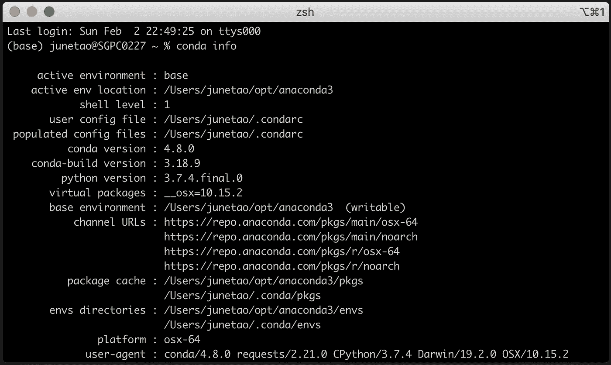
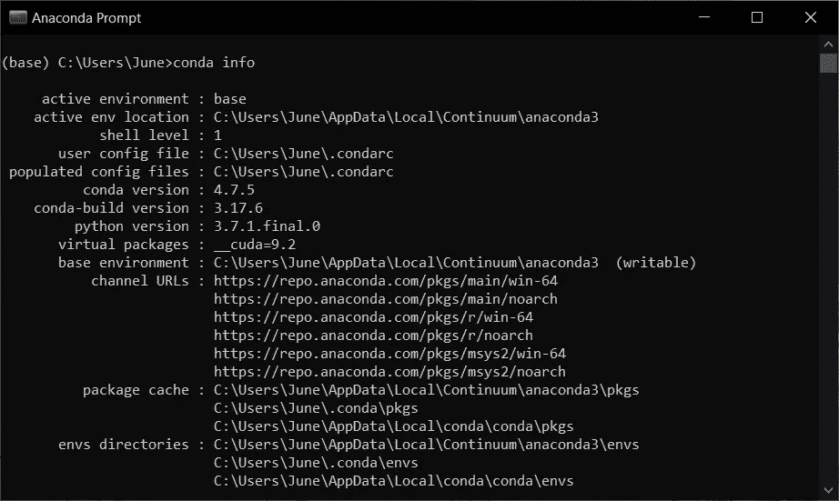
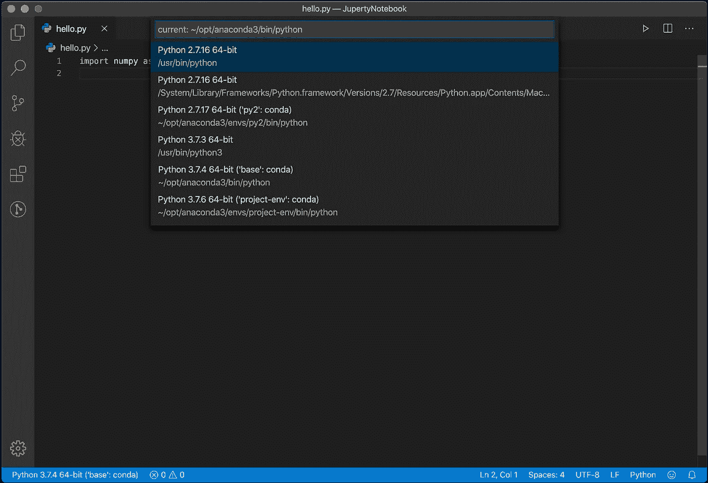

# 使用 Conda 管理您的 Python 虚拟环境

> 原文：<https://towardsdatascience.com/manage-your-python-virtual-environment-with-conda-a0d2934d5195?source=collection_archive---------2----------------------->

## 轻松在 Python 2 和 Python 3 环境之间切换


丹尼斯·帕夫洛维奇在 [Unsplash](https://unsplash.com/s/photos/python-programming?utm_source=unsplash&utm_medium=referral&utm_content=creditCopyText) 的照片

虽然 Python 2 正式弃用(Python 3，你的时代就是现在！)，我相信在将这些项目完全移植到 Python 3 之前，我们中的一些人仍然必须维护现有的 Python 2 项目。

在本文中，我将向您展示如何使用 [Conda](https://docs.conda.io/en/latest/) 来管理您的 Python 虚拟环境。Conda 是一个包和环境管理系统，它允许我们在本地机器上轻松地创建和切换环境。

# 使用 Conda 环境

我将使用 macOS 中的 iTerm 终端。如果您从未将 Conda 环境路径添加到您的 Windows 环境变量中，windows 用户将不得不使用`Anaconda Prompt`。

## **1。显示康达环境信息**

```
% conda info
```

显示当前 Conda 安装的信息。



macOS 上的 iTerm 终端显示 conda 信息



窗口上显示 conda 信息的 Anaconda 提示符

## 2.列出所有现有环境

```
(base) username % conda env list# conda environments:
#
base                  *  /Users/username/opt/anaconda3
py2                      /Users/username/opt/anaconda3/envs/py2
```

我们可以使用`conda env list`列出所有现有的 Python 环境。`*`将指向当前的活动环境。`base`始终是您打开终端时的默认活动环境。`py2`是我的 Python 2 项目的另一个虚拟环境。

## 3.创造新环境

```
(base) username % conda create --name project-env python=3.7
```

假设您想要为您的新项目创建一个虚拟环境，我们可以使用`conda create`来创建一个名为`project-env`的新环境。我们还可以在创建环境时指定 Python 版本。

创建新环境后，您可以运行`conda env list`来检查您的新环境。

```
(base) username % conda env list# conda environments:
#
base                  *  /Users/username/opt/anaconda3
project-env              /Users/username/opt/anaconda3/envs/project-env
py2                      /Users/username/opt/anaconda3/envs/py2
```

康达创造的环境总是位于`/Users/.../anaconda3/envs/`。您可以使用以下命令更改默认位置，但不鼓励这样做。Conda 不能再通过你的环境名找到你的环境，你必须指定环境的完整路径才能每次激活它。

```
(base) username % conda create --prefix /path/project-env
```

## 4.激活你的新环境

如您所见，您已经成功地创建了新 Python 环境。现在我们必须激活并使用它。

```
(base) username % conda activate project-env(project-env) username %
```

`(project-env)`表示当前的活动环境。

您可以使用`conda list`来显示这个环境中的所有包。

```
(project-env) username ~ % conda list# packages in environment at /Users/username/opt/anaconda3/envs/project-env:
#
# Name                    Version                   Build  Channel
ca-certificates           2020.1.1                      0
pip                       20.0.2                   py37_1
python                    3.7.6                h359304d_2
readline                  7.0                  h1de35cc_5
setuptools                45.1.0                   py37_0
...
...
```

`conda list`还支持修订历史。在环境中管理您的包是一个非常有用的特性。

```
(project-env) username ~ % conda list --revision2020-02-03 00:01:32  (rev 0)       # new environment
    +ca-certificates-2020.1.1
    +pip-20.0.2
    +python-3.7.6
    +readline-7.0
    +setuptools-45.1.0
...2020-02-03 00:24:55  (rev 1)       # installed numpy
    +blas-1.0
    +intel-openmp-2019.4
    +libgfortran-3.0.1
    +mkl-2019.4
    +mkl-service-2.3.0
    +mkl_fft-1.0.15
    +mkl_random-1.1.0
    +numpy-1.18.1
    +numpy-base-1.18.1
    +six-1.14.02020-02-03 22:14:24  (rev 2)      # installed configparser
    +configparser-3.5.0
```

想象一下，仅仅因为你更新/安装了一个新的包，你就不小心搞砸了你的依赖关系。修订历史允许您将环境回滚到以前的版本。

```
(project-env) username ~ % conda install --revision 1## Package Plan ##environment location: /Users/username/opt/anaconda3/envs/project-envadded / updated specs:
    - configparser
    - numpy
    - python=3.7The following packages will be REMOVED:configparser-3.5.0-py37_0
```

`configparser`已被成功移除。可以用`conda list — revision`再检查一遍。

```
(project-env) username ~ % conda list --revision2020-02-03 00:01:32  (rev 0)       # new environment
    +ca-certificates-2020.1.1
    +pip-20.0.2
    +python-3.7.6
    +readline-7.0
    +setuptools-45.1.0
...2020-02-03 00:24:55  (rev 1)       # installed numpy
    +blas-1.0
    +intel-openmp-2019.4
    +libgfortran-3.0.1
    +mkl-2019.4
    +mkl-service-2.3.0
    +mkl_fft-1.0.15
    +mkl_random-1.1.0
    +numpy-1.18.1
    +numpy-base-1.18.1
    +six-1.14.02020-02-03 22:14:24  (rev 2)     # installed configparser
    +configparser-3.5.02020-02-03 22:17:02  (rev 3)     # reverted to rev 1
    -configparser-3.5.0
```

## 4.停用/更改您的活动环境

您可以随时使用`conda activate`或`conda deactivate`在您的环境之间切换。您可以使用`conda activate`直接激活您想要使用的环境。

```
(project-env) username ~ % conda activate base
(base) username ~ %
```

`conda deactivate`将停用您当前的活动环境，并更改为默认环境，即`base`环境。

```
(project-env) username ~ % conda deactivate
(base) username ~ %
```

## 5.移除您的环境

当您使用完该环境并希望删除它时。可以使用`conda env remove`移除环境。

```
(base) username ~ % conda env list# conda environments:
#
base                  *  /Users/username/opt/anaconda3
project-env              /Users/username/opt/anaconda3/envs/project-env
py2                      /Users/username/opt/anaconda3/envs/py2
```

与 create 一样，您必须使用`--name`指定您希望删除的环境的名称。

```
(base) username ~ % conda env remove --name project-envRemove all packages in environment /Users/junetao/opt/anaconda3/envs/project-env:
```

`project-env`已从您的环境中成功删除。

```
(base) username ~ % conda env list
# conda environments:
#
base                  *  /Users/junetao/opt/anaconda3
py2                      /Users/junetao/opt/anaconda3/envs/py2
```

## 6.奖金！在 VS 代码中改变你的环境。

如果你和我一样是 Visual Studio 代码爱好者，你可以在没有任何命令行的情况下更改你创建的 Python 环境。

*   点击 VS 代码左下角的`Python 3.7.4`。
*   选择首选环境。
*   搞定了。



在 VS 代码中更改 Python 环境

现在你已经学会了如何用 Conda 管理你的 Python 环境。如果我犯了任何错误或打字错误，请给我留言。干杯！

**如果你喜欢读这篇文章，你可能也会喜欢这些:**

[](/how-to-send-email-with-attachments-by-using-python-41a9d1a3860b) [## 如何使用 Python 发送带附件的电子邮件

### 作为一名数据分析师，我经常会收到这样的请求:“你能每周给我发一份报告吗？”或者…

towardsdatascience.com](/how-to-send-email-with-attachments-by-using-python-41a9d1a3860b) [](/best-spyder-alternative-vs-code-de0d9a01c8b5) [## 最佳 Spyder 替代方案— VS 代码

### 如果你是 Spyder 或 R Studio 的粉丝，你一定会喜欢 Visual Studio 代码。

towardsdatascience.com](/best-spyder-alternative-vs-code-de0d9a01c8b5) 

**你可以在 Medium 上找到我其他作品的链接，关注我** [**这里**](https://medium.com/@chingjunetao) **。感谢阅读！**