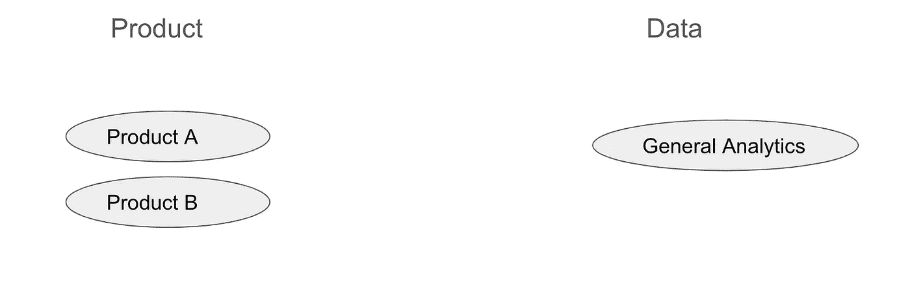
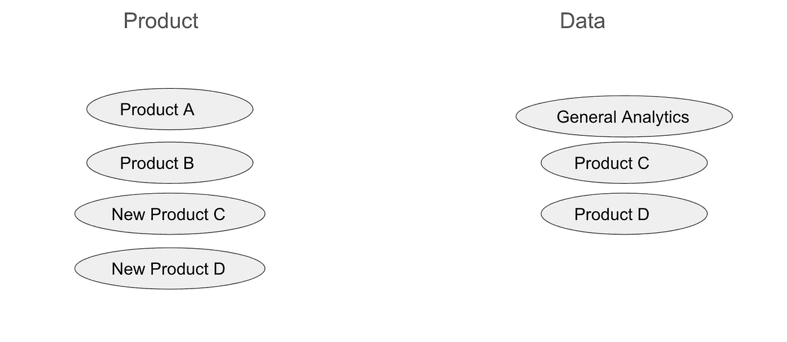
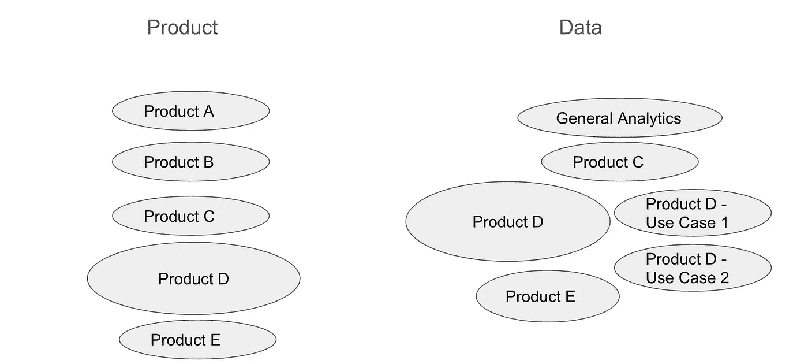
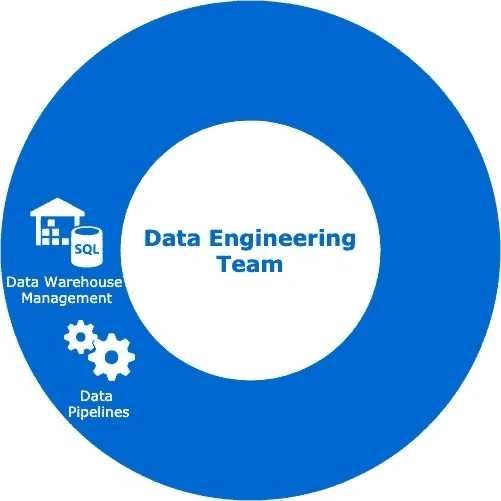
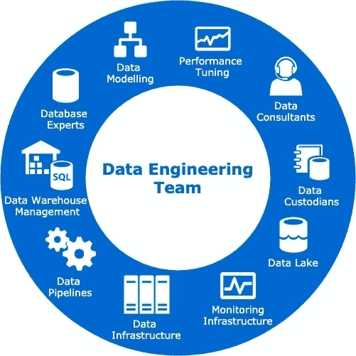

# 作为数据工程师管理数据—第 2 部分:了解数据变更

> 原文：<https://towardsdatascience.com/managing-data-as-a-data-engineer-part-2-understanding-data-changes-b3d23f1fef16?source=collection_archive---------33----------------------->

## 了解在快速发展的公司中，数据的变化如何使数据处理变得富有挑战性

在上一篇文章中，我们讨论了用户如何看待数据以及他们在使用数据时面临的挑战。如果你错过了，你可以在[第一部分](https://link.medium.com/GGKEaDmYiab)找到它。

作为数据工程师，我们处理各种数据资产，从数据存储系统、数据管道到数据查询。如果数据是静态的，理解和管理数据就容易了。我们会想出一个解决方案，这个方案会永远有效。但事实往往并非如此。处理数据具有挑战性，因为数据总是在变化和增长。因此，我们理解和管理数据的解决方案和方式也需要改变。今天，我们来看看在一个成长中的公司，数据是如何变化的。

# 公司增长

公司增长是数据变化的直接原因之一。当公司很小的时候，公司可能只有几个产品。每个产品都会生成一些用户应用程序数据，这些数据存储在生产数据库中。出于分析目的，这些数据通过管道传输到数据仓库。因为数据的用例很小，数据仓库中的数据可能会被分组到更一般的组中，比如`general_analytics`。这个数据模型会工作一段时间，因为它服务于公司产品和用户的目的。

随着公司的发展，可能会增加新产品和新功能，这也会导致生产数据库中产生新的数据集。这些数据也将通过管道传输到数据仓库。但是很快，我们发现太多的数据被归到了`general_analytics`下，这使得理解和搜索数据变得更加困难。因此，我们开始将数据分成更多特定于产品的组。

随着公司的进一步发展，数据也变得更加多样化。一些产品变得越来越大，导致存储的数据集越来越大。随着分析团队的成长，他们还会发现更多的数据用例，有时还会通过组合原始数据集来衍生新的数据集。这些数据洞察进一步推动了公司内部的产品增长，改进了产品，也允许更多的跨产品协同作用。

这种循环继续下去，并进一步增加数据。随着公司的发展，产品的数量也在增长，开发产品的团队也在增长，这继续创造了更加丰富和多样化的数据集。

# 用户增长

另一个直接影响数据增长的原因是用户群的增长。随着产品用户群的增长，生成的数据量也在增长。这是有意义的，因为应用程序上的每个用户活动都会生成一些数据反馈给产品后端系统。随着越来越多的用户使用该产品，将会产生更多的应用程序数据并反馈给系统。因此，用户群的增长几乎与产品生成的数据量的增长率成线性关系。

# 数据增长

即使用户群和产品保持不变，数据本身也会随着时间的推移而增长。这是因为我们保留了应用程序生成的数据，即使是在一段时间之后。历史数据通常用于分析，以了解一段时间内的趋势和用户行为。此外，为了跟踪和审计的目的，通常有必要在应用程序中保留用户过去活动的跟踪记录。很少每天清除数据或“刷新”数据库。因此，随着公司的发展，数据量会随着时间的推移而增长。

# 产品变化

当产品中引入变更时，有时也会导致存储的数据发生变化。有时，它是添加的一个附加字段，就像检查用户是否活跃的标志。有时，它是一个被引入的新状态，比如除了先前的`SUCCESS`和`FAILURE`状态之外的一个`PENDING`状态。有时这些变化更加内在，比如贷款利息的计算方式。比如使用一个新的公式，或者在不同的条件下计算数字。这种变化很难跟踪，并且必须在团队之间进行沟通，以便用户理解和正确使用。

有时意外的产品变化会破坏下游的数据应用程序。不一致的数据类型(例如，从字符串类型更改为整数)或不同的时间戳格式是一些常见的数据错误。这种类型的数据更改可能会在应用程序中引入错误。数据类型的变化最好在团队间进行讨论和标准化，以便数据在应用程序间顺畅流动。

# 团队成长

随着数据的增长，数据工程团队及其职能也随之增长。当公司的数据集很小时，通常只需要一两个数据工程师。这些数据工程师的工作主要围绕构建 ETL 脚本和管理数据仓库。

小型数据工程团队的角色

随着数据变得越来越大，数据基础设施也在增长，数据工程师开始扮演不同的角色来满足数据用户的需求。例如，我们承担了数据保管人和分析工程师的角色，以更有效地支持数据用户。我们引入了工程实践，如 git 和将查询存储为代码，以支持版本控制。我们还帮助建立数据文档，以帮助用户轻松地找到和理解数据。由于我们使用许多数据存储系统，我们还担任不同团队的数据顾问，以帮助优化查询和高数据工作负载。

我们过去只使用一台服务器运行 ETL 脚本，一台服务器用于调度。现在，随着我们维护数百条数据管道并管理数万亿字节的数据，我们也转向了更具可扩展性的数据系统。我们的一套数据基础设施现在由诸如 Airflow with Celery Worker cluster、Spark cluster、一个更大的红移数据仓库以及各种类型的数据工具和存储系统(如 S3、dbt 等)组成。

现代数据工程团队的角色

由于我们现在有了一套更多样化的数据工具，我们每个人都开始专业化，以便更有效地工作。一些数据工程师专注于为分析用户提供转换后的数据，一些人管理数据基础设施和数据管道，而其他人则研究更好、更有效的数据工具。我们不再构建单一的端到端数据管道，而是改变了我们的工作方式，并创建了可重复使用的模块，可以帮助更好地构建数据管道的每个部分。

# 结论

在本文中，我们研究了导致数据变化的一些因素，如公司增长、用户群增长、数据增长和产品变化。随着数据的增长，数据工程团队也在不断发展，以满足不断变化的数据需求。现在我们已经了解了数据是如何变化的，接下来让我们看看如何在第 3 部分中管理数据。敬请期待！

阅读[第 1 部分:理解用户](/managing-data-as-a-data-engineer-part-1-understanding-users-61bc88461d92)