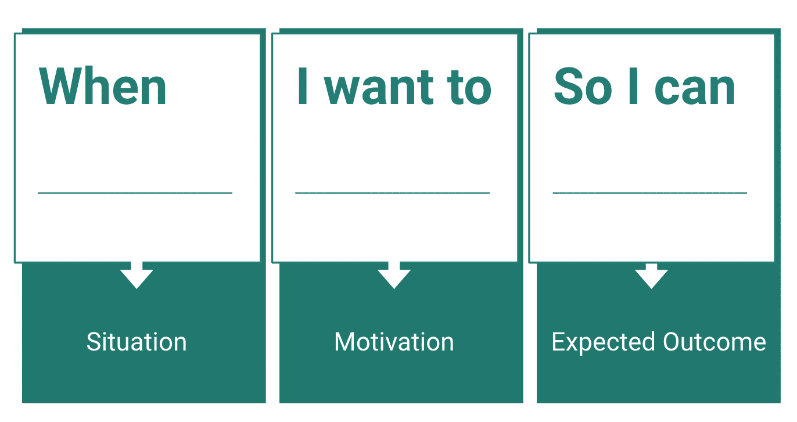

# 将数据科学作为产品进行管理

> 原文：<https://towardsdatascience.com/managing-data-science-as-products-671077e625b3?source=collection_archive---------35----------------------->

## 数据科学团队如何应用产品管理实践来解决他们最大的挑战

根据沃顿商学院发表的一篇文章,数据科学工作的数量在过去几年经历了“巨大的增长——15 倍，20 倍”。然而，这并不意味着数据科学家轻松。随着麻省理工学院斯隆管理学院和波士顿咨询集团【2019 年 10 月的[报告引用“到目前为止，十分之七的公司报告人工智能的影响很小或没有影响”，数据科学团队面临着克服这些障碍和展示影响的巨大压力。](https://sloanreview.mit.edu/projects/winning-with-ai/)

在 [2017 年 Kaggle 数据科学和机器学习状况调查](https://www.kaggle.com/kaggle/kaggle-survey-2017)中，16，000 名受访者指出了数据科学家在工作中的 7 个最大障碍:

1.  脏数据(49.4%)
2.  组织中缺乏数据科学人才(41.6%)
3.  公司政治/缺乏对数据科学团队的管理/财务支持(37.2%)
4.  缺乏需要回答的明确问题或可用数据的明确方向(30.4%)
5.  数据不可用/难以获取(30.2%)
6.  业务决策者不使用数据科学结果(24.3%)
7.  向他人解释数据科学(22.0%)

除了脏数据，数据科学团队面临的所有障碍都与组织和利益相关者管理问题有关。

再多的 Python 或 R 代码也无法解决这样的挑战。相反，数据科学团队需要立即采用产品管理实践来有效地吸引利益相关者，并向组织展示他们的价值。以下是数据科学团队可以付诸实践的一些简单步骤

# 理解“要做的工作”

作者图片

数据科学或软件开发的每一个过程或方法都需要对涉众需求的理解。随着当今业务领域日新月异的变化，数据科学团队必须超越需求，成为业务的思想伙伴。

通过聘请哈佛商学院教授 Clayton Christensen 的“要做的工作”[框架](https://hbr.org/2016/09/know-your-customers-jobs-to-be-done)，数据科学团队可以更好地了解整个业务应用。这首先要从利益相关者那里了解他们的情况，是什么激发了他们的需求，最终，他们想要完成什么，以及他们想要的(和可测量的)结果是什么。这种理解可以通过发现对话和潜在的利用其他用户研究方法来实现。

例如，B2B 销售或营销团队可能会要求数据科学团队创建一个线索评分模型，以根据公司捕获的公司地理、人口统计和行为数据来确定主要线索。对于许多数据科学团队来说，这将是一个理想的请求，因为有一个清晰的业务用例，并且这是一个可以执行的项目，具有可衡量的结果(线索数量、线索转化、提升等)。)但是，在对利益相关方进行访谈后，数据科学团队可能会了解到该企业今年确实希望扩大利润。

虽然销售线索评分模型可以通过更好的渠道转换获得更高的利润，但公司可能还可以利用其他策略，如优化定价。通过确认业务目标，数据科学团队可以成为真正的合作伙伴，为他们的组织提供有价值的见解，并建议更高价值的替代解决方案，同时要求更低的成本，并实现预期目标。

通过让产品经理从战略角度了解客户挑战，数据科学团队可以更有效地应对 Kaggle 调查受访者强调的组织参与挑战，例如克服缺乏组织支持、采纳和理解的问题。

# 敏捷数据产品开发

照片由邦内瓦尔·塞巴斯蒂安 | [Unsplash](https://unsplash.com/photos/GACjwmEEoeQ) 拍摄

一旦数据科学团队更好地理解了他们的利益相关者的需求，他们就可以开始应用敏捷方法来管理作为*数据产品的数据科学。*定义数据产品与其说是关于构建最佳机器学习模型，不如说是关于定义模型将如何被使用。通过利用“要做的工作”框架并成为业务的思想伙伴，数据科学团队可以开始为需要构建的数据产品制定强有力的愿景。

数据产品可以具体化为网站的算法特性、交互式仪表板或其他分析驱动的解决方案。例如，电子商务网站上的数据产品可以包括产品详情页面上的产品推荐轮播、结账页面上的促销横幅、个性化报价推荐等。每个数据产品的背后都可能是模型或分析的不同迭代，数据科学团队将随着时间的推移不断改进这些模型或分析。

一旦建立了需要构建什么的愿景，下一个问题是如何保持与业务或产品团队的接触，并确保在进入开发时不断展示价值？这就是敏捷开发的关键所在。

敏捷开发关注迭代开发，适应变化的需求和解决方案，并遵循敏捷宣言的原则。关于[敏捷方法](https://zenkit.com/en/blog/agile-methodology-an-overview/#:~:text=Agile%20methodology%20is%20a%20type,functional%20teams%20and%20their%20customers.)有大量的可用资源，本文不会涉及。然而，当它应用于数据产品时，数据科学团队必须重视以下 4 个关键因素才能保持敏捷:

## 1.过程和工具之上的个人和交互

当涉及到数据科学时,《敏捷宣言》的许多价值观都非常适用。业务、数据科学、技术等之间的互动和交流。作为个体最终比任何标准化的工具或过程更重要。通过理解业务涉众的“要做的工作”,并成为其他内部团队的深思熟虑的合作伙伴，对成功开发数据产品极其重要。

除了业务利益相关方之外，数据科学家还必须与数据工程师、产品经理、开发人员、MLOps 和其他利益相关方接触和交流，以与他们的同行建立关系，并了解实现他们的目标需要什么。通过在整个组织中发展关系，数据科学家将对运营和部署他们的模型所需的所有任务有更全面的了解。

## 2.穷尽模型开发的模型迭代

一旦数据科学家理解了需求，他们的任务通常是开发尽可能好的模型。对于用于预测的传统机器学习模型，这通常意味着设计一套广泛而多样的模型特征，收集、清理和聚合数据，然后训练和验证模型，以期获得高度预测的模型。

然而，这个过程是非常耗时的，有时业务涉众直到几个月后才看到模型性能的任何结果。在模型需要由技术团队实时部署的情况下，实时计算这些特性的成本可能会非常高。

相反，数据科学团队可以采用迭代设计方法。实际上，这意味着首先与业务和技术团队合作，决定要利用的模型特性的子集。特别是在没有开发模型的情况下，发布一个最小可行的数据产品比试图提高 R 几个点更重要。

当没有足够的数据来正确训练模型时，可以应用这种迭代思想。不要因为缺乏数据而受阻。相反，用可用的数据做一个简单的分析，并开始用这些见解影响利益相关者的想法。之后，更容易在此基础上进行构建，并传达有时机器学习模型需要更多数据才能真正实现其价值。

## 3.利益相关方在数据所有权方面的合作

正如本文第一部分所强调的，数据科学团队的最大障碍可以在很大程度上通过更好的利益相关者协作来克服。如前所述，解决方案包括:

*   作为企业的思想伙伴，
*   与业务和技术合作伙伴共同设计模型，以及
*   发布并使用最小可行的数据产品，以便整个跨职能团队可以开始从使用度量和用户反馈中学习

数据科学团队必须帮助克服的另一个挑战是数据所有权何时成为办公室政治。有时，不同的团队会将他们控制“他们的数据”的能力视为他们的力量来源。不幸的是，当多个业务、数据科学、分析和技术团队共享这种类型的心态时，会导致数据囤积。这造成了数据孤岛，并限制了数据科学团队开发优秀模型的能力。最终结果是数据科学或人工智能项目没有创造任何价值。克服这种情况的唯一方法是确保所有的利益相关者从第一天起就保持一致并进行合作，并且高级发起人共同支持正在开发的数据产品的成功。

能够跨越通道并协调利益相关者的需求有时也意味着，当利益相关者可能缺乏某些技能时，数据科学家需要进入角色。有时，这意味着对业务利益相关者进行数据科学基础培训，创建可视化来展示来自模型的洞察力，构建其他工程团队可以使用的预测模型端点的原型，等等。

总之，协作意味着打破障碍，做任何必要的事情来解除项目障碍，同情并与所有利益相关者合作来交付成功的产品。

## 4.响应变化而不是遵循计划

商业和竞争环境的变化速度越来越快。如果你的公司在利用数据和机器学习作为竞争手段方面已经落后，那么数据科学团队能够应对变化而不是遵循计划就更加重要了。

让我们回到之前的例子，数据科学团队建议实施定价优化算法来帮助企业实现更高的利润。

假设数据科学团队完成了一个模型的开发，他们离与工程团队一起部署它还有两周时间。然而，根据最近的市场变化，高管团队将改变战略，进入一个更广阔的市场，以更低的价格提供更实惠的产品。

知道他们开发的模型会增加定价，这个数据科学团队应该继续发布吗？不要！不幸的是，一些公司可能会继续前进，因为在他们看来，“船已经启航了。”然而，真正成为业务合作伙伴的数据科学团队将会公开他们的发现，并且能够要求更多的时间来评估如何做出最佳响应。

如果通过早期的构思和咨询过程发现定价优化不再可行，数据科学团队应该已经有了可以部署的其他数据产品组合。通过遵循迭代设计和最小可行的数据产品发布思想，他们将会损失更少的时间，并且能够利用相同的过程来快速发布不同的数据产品。

# 今天开始应用产品管理实践的 3 种方法

照片由布拉登·科拉姆 | [Unsplash](https://unsplash.com/photos/9HI8UJMSdZA) 拍摄

改变过程和文化从来都不是简单或快速的。但是，数据科学团队可以立即采取三种产品管理实践:

1.  **捕捉用户故事** —产品经理经常以用户故事的形式捕捉产品需求，一般遵循“作为一个【用户】，我希望能够【做一些事情】，这样我才能【受益】”的格式这种形式相当符合“要做的工作”框架，该框架将客户的愿望描述为“当[情况/背景]我想要[激励]，所以我可以[预期结果]。”无论数据科学团队采用何种格式或方法来捕捉利益相关者的需求，重要的是要非常明确地关注利益相关者可以获得的利益。
2.  **创建一个待办事项清单**——不管你最终使用哪种敏捷方法，Scrum，Kanban 等等。您应该开始创建用户故事的积压。除了捕获笔记的实际性质，一个维护良好的 backlog 将开始浮现出利益相关者想要实现的重复出现的主题。一旦在要求的产品类型或期望的类似结果上出现某些模式，数据科学团队就可以开始开发考虑到多种用例的数据产品，以及首先解决大量或更高价值需求的优先路线图
3.  **迭代发布** —如前所述，数据科学家可能希望收集尽可能多的数据，设计最广泛、最具代表性的模型特征集，并开发具有最高预测能力的模型。然而，如果在开发模型的过程中业务发生了变化，这一切都是徒劳的。相反，与所有利益相关者合作，定义一个最小可行的数据产品，该产品将尽快上市，以便公司可以从实际使用指标和用户反馈中学习。在进行正式的客户发布之前，数据科学领导者应该为他们的团队提供机会，向业务和内部利益相关方展示模型或分析结果，以保持可见性并收集反馈。

Richard Sheng 是百威英博(Anheuser-Busch InBev)旗下 Z-Tech 的数据科学和分析全球总监，为全球小型企业带来数据驱动的技术解决方案。Richard 拥有 12 年以上为初创公司和财富 500 强公司开发数据产品的经验。