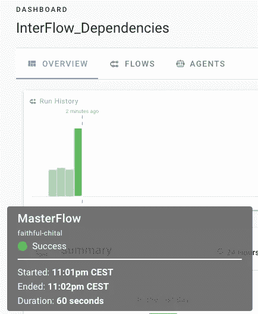

# 管理 Apache Airflow & Prefect 中数据管道之间的依赖关系

> 原文：<https://towardsdatascience.com/managing-dependencies-between-data-pipelines-in-apache-airflow-prefect-f4eba65886df?source=collection_archive---------15----------------------->

## 管理工作流之间依赖关系的简单方法

凯利·西克玛在 [Unsplash](https://unsplash.com?utm_source=medium&utm_medium=referral) 上的照片

如果你曾经为相互依赖的业务流程构建过数据管道，你可能会注意到，将公司的所有业务逻辑整合到一个单一的工作流程中并不能很好地工作，而且很快会变成一场维护的噩梦。许多工作流调度系统允许我们管理单个数据管道内的依赖关系，但它们不支持我们管理工作流之间的**依赖关系。**

解决这个问题的一个自然方法是将一个大管道分成许多小管道，并以某种父子关系协调它们之间的依赖关系。然而，有许多可能的方法来解决这个问题，我想分享一个对我很有效的简单方法。我希望它可以帮助您管理数据管道之间的依赖关系。

# 气流组织如何试图解决这个问题

在 GoDataDriven 的两位数据工程师编写的关于 Apache Airflow [1]的书[中，有一章是关于管理依赖关系的**。他们是这样总结这个问题的:**](https://www.manning.com/books/data-pipelines-with-apache-airflow)

> “Airflow 管理单个 DAG 内任务**之间的依赖关系，但是**它不提供 DAG 间依赖关系的机制**。”**

## 子标签

组织相互依赖的数据管道的一般问题是众所周知的，人们试图解决它的一种方法是使用**子标记**抽象。将工作流组织成子标签最初看起来是个好主意，但是很快**导致了许多问题**:

*   一个子 Dag 被解释为父数据管道中的图中的一个节点，即使该子 DAG 可能由许多任务组成
*   这意味着子 DAG 中的每个任务一次按顺序运行一个，这可能会导致调度过程中的死锁。

下面是[另一个引用](https://www.astronomer.io/guides/subdags/) [2]很好地总结了关于子标签有用性的讨论:

> 天文学家强烈建议远离子袋。

## 外部任务传感器

另一个想法是在父 DAG 中使用一个[传感器](https://airflow.apache.org/docs/stable/_api/airflow/sensors/external_task_sensor/index.html),它定期探测子 DAG 的执行状态。这似乎是一个比子包更好的主意。然而，**它只在父 DAG 和子 DAG 之间的时间表对齐的情况下才起作用**，这是一个非常强的假设，在我的情况下**几乎从未为真**。想象一下，当您手动*触发这个父 DAG 时会发生什么？它将永远运行，直到超时，因为子 DAG 不按相同的计划运行。*

## TriggerDagRunOperator

另一种方式是从父 DAG 触发子 DAG。我更喜欢这个想法，因为:

*   不存在产生死锁的风险
*   它还会在管道被意外触发时运行，例如。通过手动触发器。

不过，当我在 Airflow 中尝试时，我发现当前的[*TriggerDagRunOperator*](https://airflow.apache.org/docs/stable/_modules/airflow/operators/dagrun_operator.html)实现是以一种*一劳永逸*的方式工作的。这意味着父 DAG 不会等到触发的子 DAG 完成后才开始下一个任务！如果我们希望管理数据管道之间的依赖关系，这不是我们想要的。

为了说明这一点，让我们看看下面的管道:

作者图片

如果我们将`TriggerDagRunOperator`用于父 DAG 中的*业务逻辑层*,它将触发子 DAG 的 DagRun，但随后它将立即启动*数据集市*任务，然后等待子 DAG 中的所有`bus_logic_ETL_x`任务完成。

## 我用气流解决的方法

我的解决方案是:

*   在每个子 DAG 的末尾添加一个虚拟任务`finish`
*   实施`WaitForCompletion`传感器，该传感器在气流元数据数据库中检查子 DAG 的最后 DagRun 的状态。我们将子 DAG 的最后一个 DagRun 标识如下:它必须以`"trig__"`开头，因为每个由外部 DAG 触发的 DagRun 都是这样命名的。然后，我们按照执行日期降序排列这些 DagRun，并使用`LIMIT 1`获得最后一个→这正是我们想要寻找的 Dag run。
*   在这个传感器中，我们探测这个 DagRun 中的`finish`任务的状态。如果是`success`，则传感器完成任务，并可以继续执行父管道中的*数据集市*任务。但是只要**不是*成功*** ，这就意味着要么任务仍在运行，要么它失败了。在这两种情况下，这意味着我们不能继续进行*数据集市*任务。

这是传感器的实现:

这是我在父 DAG 中使用该传感器的方式:

# 提督是如何处理这个问题的

Prefect 包括许多开箱即用的有用抽象。其中之一是`FlowRunTask`，它包含一个参数`wait=True`，该参数将与我的`WaitForCompletion`在气流中具有相同的效果，而无需我实现任何执行定期数据库查找的传感器。这将:

*   触发子流程
*   等待子流程完成，然后再继续下一个任务。

## 主流(*即父流*)

父流的整个实现就这么简单:

如果我们通过运行`flow.visualize`来可视化这个流，我们可以看到子流甚至以不同的方式被可视化，以便容易地区分普通任务和由`FlowRunTask` ( *或其他类型的任务(如 ex)触发的流。映射的任务*)。

## 子流程

我还创建了一些非常基本的子流，这样我们就可以运行一个完整的示例，并在 UI 中看到输出。在下面的脚本中，您可以看到三个子流程，每个子流程有三个任务:

*   `staging_area`流量
*   `business_logic_layer`流量
*   `data_mart`流量

现在让我们通过注册父流(`MasterFlow`)和三个子流来运行完整的示例，并确认流之间的依赖关系如预期的那样工作。

完美的云用户界面:由父流(主流)按照我们指定的顺序触发的子流——图片由作者提供

完美云用户界面:父流(主流)按预期最后完成，因为它等待子流的完成—图片由作者提供

只有在*暂存区*和*业务逻辑层*流程都完成后，我们才能确认依赖关系得到了尊重，并且*数据集市*才开始运行。

如果出现故障，我们可以很容易地导航到相应的子流来检查日志:

Prefect Cloud UI:检查来自子流的日志——按作者排序的图片

# 如何调度相互依赖的数据管道？

为了正确地构建和调度这些父子依赖关系，我们可以使用“主”数据管道(*也可以称之为“父数据管道”或“协调数据管道”*)，如上例所示，而**只调度那些父管道**。因为子流是直接从父流触发的，所以不需要对它们进行调度。

让我们用一个**具体的例子**来展示一下。让我们假设，目前，这些子流具有以下执行运行时:

*   **暂存区** : 2.5 小时
*   **业务逻辑** : 1.5 小时
*   **数据集市** : 2 小时。

这意味着如果我们安排`MasterFlow`在晚上 2 点运行，它将在凌晨 2 点运行 *staging_area* 开始，然后 *business_logic* 将在凌晨 4:30 开始， *data_mart* 将在早上 6 点开始，整个 ETL 将在早上 8 点完成。

要实现这一点，我们只需在第 6 行和第 9 行向`MasterFlow`添加一个调度，如下所示:

**注:**此时间表适用于 UTC。要使用时区特定的计划，请使用:

# 这种主流方法的好处是什么？

假设您想要修改*业务逻辑层*并向其添加一个任务:通过使用这种方法，您可以在不影响*临时区域*和*数据集市*工作流的情况下进行修改。你不需要重新安排任何事情，你也不会陷入任何僵局。

## 从用户的角度来看，哪种实现更容易？

总的来说，我发现完美的实现更容易，因为我不必编写任何定制的传感器逻辑来正确反映数据管道之间的依赖关系，并且它开箱即用。在这些抽象的设计中，它显示了很多远见。

提督社区也在讨论 Github 第[期](https://github.com/PrefectHQ/prefect/issues/1745)【3】中的子流程——如果你有兴趣的话，请继续关注。

# 结论

在本文中，我们研究了**如何管理数据管道**之间的依赖性。我们展示了历史上气流是如何解决这个问题的。

然后，我提出了一个解决这个问题的简单方法，它基于一个原则:**创建一个主数据管道来调度和触发子工作流**，同时确保当被触发时，**主数据管道等待**直到子工作流完成，然后再触发下一个工作流。

**“触发+等待”范式**似乎比根据时间表调整相互依赖的管道更安全，并且让我们以简单的方式管理工作流之间的依赖关系。

感谢您的阅读！如果这篇文章有帮助，请随时关注我的下一篇文章。

**参考文献:**

[1]“带有阿帕奇气流的数据管道”——*巴斯·p·哈伦斯拉克和朱利安·鲁特格尔·德·鲁特*

[2]天文学家博客:[https://www.astronomer.io/guides/subdags/](https://www.astronomer.io/guides/subdags/)

[3]关于子流的提督社区:[https://github.com/PrefectHQ/prefect/issues/1745](https://github.com/PrefectHQ/prefect/issues/1745)