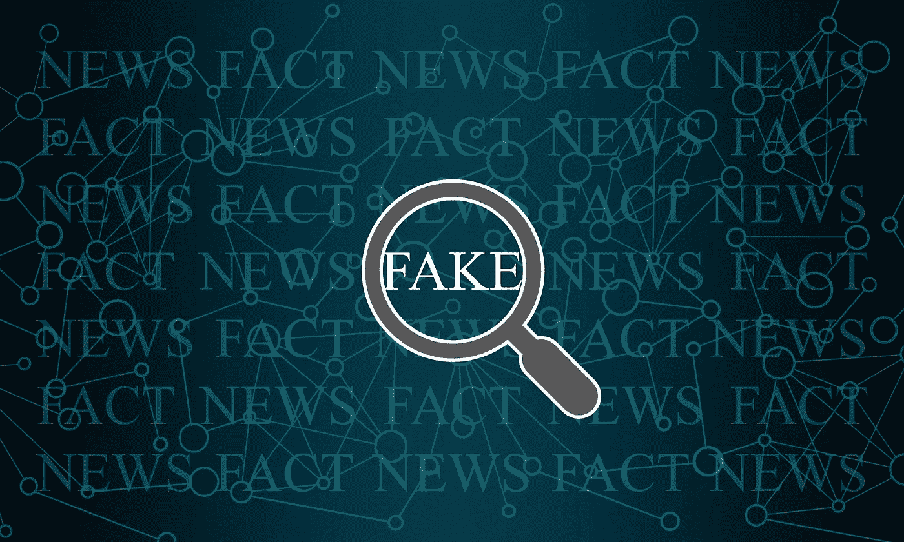
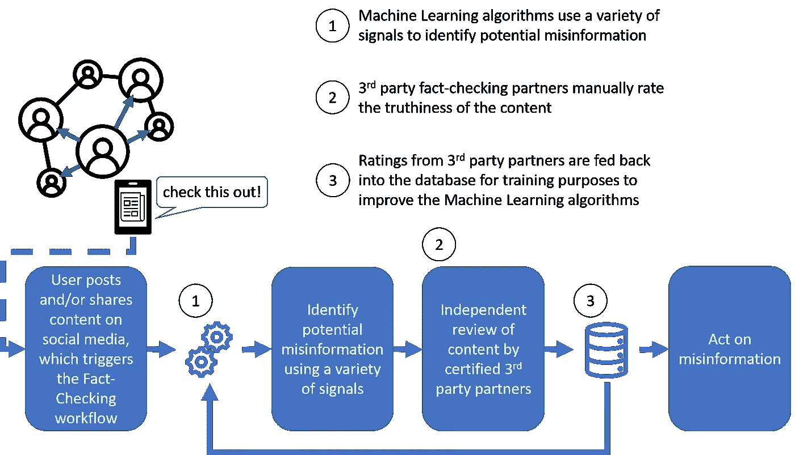
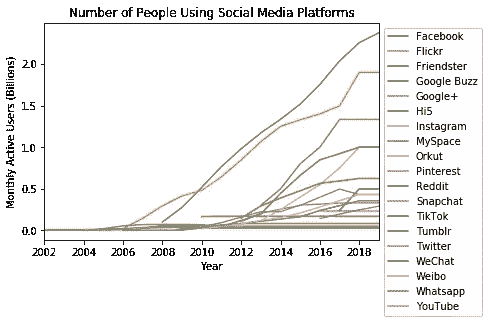
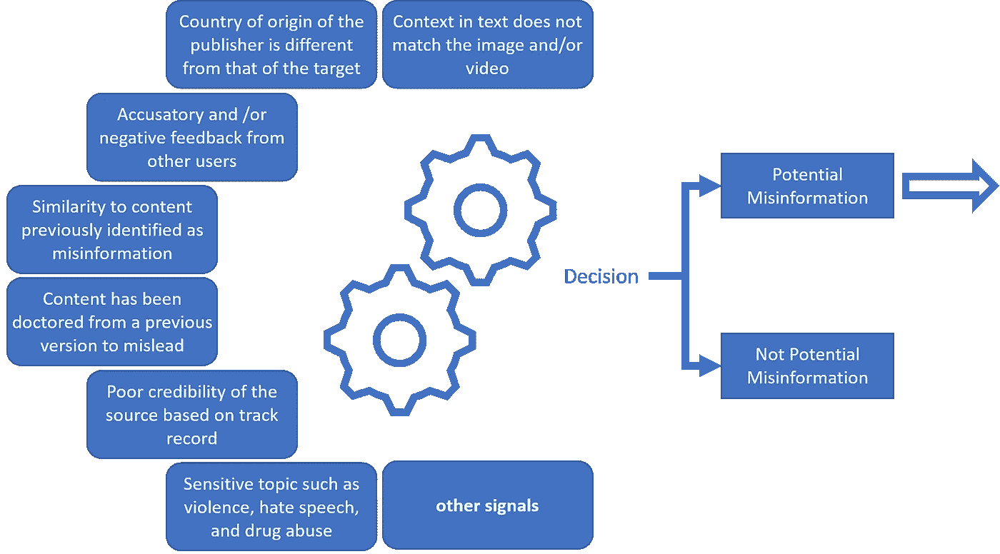

# 管理信息流行病学——使用数据科学减缓错误信息的传播

> 原文：<https://towardsdatascience.com/managing-infodemics-slowing-the-spread-of-misinformation-b8b74e3e2618?source=collection_archive---------61----------------------->

## 社交媒体公司如何使用机器学习来打击假新闻

[数码师](https://pixabay.com/users/thedigitalartist-202249/)在 [pixabay](https://pixabay.com/illustrations/network-internet-communication-3357642/) 拍摄的照片

随着越来越多的人依赖社交媒体来了解时事，托管公司有道德责任来抵御虚假信息。虚假信息是一种旨在操纵和误导的错误信息，会造成动荡和恐慌。其他类型的错误信息，如谣言和恶作剧，如果不加制止，也有可能给粗心的读者带来精神和身体上的伤害。阻止错误信息传播的关键是对他们采取迅速的行动，因为他们有快速传播的趋势。事实上，研究表明谎言传播的速度比真相快得多([来源](https://science.sciencemag.org/content/359/6380/1146.full))。社交媒体公司已经制定了协议来限制不准确内容的传播，但这些协议只有在内容经过第三方事实核查合作伙伴审查后才能生效。因此，重点在于快速评估准确性。我们已经看到科技公司在这方面的非凡创造力。即使用机器学习算法来补充事实检查程序，以识别不准确的内容。然而，这还不是一个完整的解决方案。在本文中，我们将研究这一过程，并探索它可能如何演变。

## 如何识别错误信息

事实核查程序工作流程

评估内容准确性的过程始于对潜在错误的内部筛选。这涉及利用自动化和机器学习模型来拾取各种信号。如果内容被确定为潜在的错误信息，它将被发送给事实核查合作伙伴进行进一步审查。在手动研究和/或咨询主要来源后，分配内容评级。结果评级通知社交媒体公司是否需要采取行动。此外，评级还有助于训练机器学习模型，以便在未来更好地捕捉错误信息。以下是机器学习对这一过程的贡献:

*   预测模型大大减少了第三方事实核查合作伙伴需要执行的审查数量
*   发现重复或近似重复的内容，为事实核查合作伙伴腾出了审查新的错误信息实例的空间

这是一个相当稳健的过程，但并非没有挑战。这一过程面临的主要挑战如下:

*   活跃用户的庞大和不断增长的数量使该平台成为协调宣传攻击的目标，为事实核查计划带来紧迫性和繁重的工作量
*   用作预测分类模型训练的语料库的经过验证的欺骗性内容的缺乏是机器学习方法的一个障碍。由于需要不同的处理方法，从而稀释了可获得的数据，人们希望有更窄的“真实”类别，这进一步加剧了这种情况
*   在真实内容背后隐藏误导性内容的“坏演员”很难被发现。例如，迷因可以使用叠加在照片或视频上的文本来形成欺骗性的内容
*   讽刺可能会被人误解，对计算机来说更难

随着社交媒体成为人们获取新闻的主要媒体，月活跃用户持续增长

## 仔细看看筛选过程

自动化和机器学习寻找信号来筛选内容

## 发展中

科技公司正在努力改善这一过程，方法是大幅扩展他们的数据库，这将帮助他们建立人工智能，以打击“深度假货”和“武器化模因”等复杂的攻击。算法和模型的有效性在很大程度上取决于是否有多样化的数据集来进行训练。幸运的是，随着技术社区在数据共享方面的广泛合作，模型在理解内容方面变得越来越好。尽管如此，这项工作仍在进行中。

## 推荐

应该研究一些考虑因素，以便立即做出改进。我正在探索的一个建议是为第三方事实检查者对内容进行优先排序和专门化。我们可以执行 A/B 测试来比较周转率和总体病毒率，以衡量这些措施的影响。

*   在具有传播倾向的危险内容成为病毒之前，对其进行优先级排序
*   内容专业化将内容提交给专业领域内的第三方事实审查员，以减少审查所需的时间

## 摘要

在最近的健康危机之前，流行病是一种困扰我们很久的疾病。如果没有适当的管理，它会给我们的社会带来巨大的危害。谢天谢地，有技术工具可以帮助我们降低这些风险。我们回顾了事实检查的进展，特别是机器学习如何在这个用例中应用。