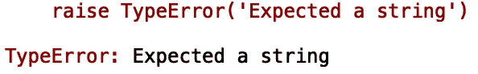
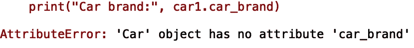
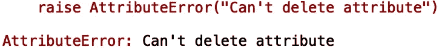

# 在 Python 中管理实例属性

> 原文：<https://towardsdatascience.com/managing-instance-attributes-in-python-b272fe23fd50?source=collection_archive---------42----------------------->

## 在 Python 中创建托管属性


[来源](https://www.pexels.com/photo/black-board-board-game-checkerboard-459275/)

通常，在 python 类的实现中，如果我们能够轻松地添加额外的处理来获取和/或设置实例属性，将会非常有用。例如，在获取/设置实例属性的过程中，能够执行类型检查或其他形式的验证会很有用。在本帖中，我们将讨论如何在 python 中管理实例属性。

我们开始吧！

假设我们有一个名为“Cars”的类，其属性为“car_brand”:

```
class Car:
    def __init__(self, car_brand):
       self.car_brand = car_brand
```

让我们将汽车类实例初始化为“Tesla”:

```
car1 = Car('Tesla')
print("Car brand:", car1.car_brand)
```


虽然这样做很好，但是如果我们用一个错误的‘car _ brand’输入值初始化一个实例，就没有数据验证或类型检查。例如，如果我们用数字 500 的汽车品牌值初始化一个汽车实例:

```
car2 = Car(500)
print("Car brand:", car2.car_brand)
```


我们应该有一种方法来验证这个实例属性的类型。我们可以通过将“car_brand”属性定义为“property”来自定义对属性的访问:

```
class Car:
    ...
    @property
    def car_brand(self):
        return self._car_brand
```

将' car_brand '定义为' property '允许我们将 setter 和 deleter 函数附加到' car_brand '属性。让我们向‘car _ brand’属性添加一个 setter 方法，如果用非字符串值初始化实例，该方法将引发一个错误:

```
class Car:
    ...
    #setter function
    [@car_brand](http://twitter.com/car_brand).setter
    def car_brand(self, value):
        if not isinstance(value, str):
            raise TypeError('Expected a string')
        self._car_brand = value
```

让我们再次定义我们的实例，用我们的整数输入 500:

```
car2 = Car(500)
print("Car brand:", car2.car_brand)
```



另一个要考虑的实例管理操作是删除实例属性。如果我们看看我们的初始实例:

```
car1 = Car('Tesla')
print("Car brand:", car1.car_brand)
```

我们可以很容易地删除属性值:

```
car1 = Car('Tesla')
print("Car brand:", car1.car_brand)
del car1.car_brand
print("Car brand:", car1.car_brand)
```



我们可以添加一个 deleter 函数，在尝试删除时引发错误:

```
class Car:
    ...
    #deleter function
    [@car_brand](http://twitter.com/car_brand).deleter
    def car_brand(self):
        raise AttributeError("Can't delete attribute")
```

让我们再次尝试设置和删除属性值:

```
car1 = Car('Tesla')
print("Car brand:", car1.car_brand)
del car1.car_brand
```



我就讲到这里，但是您可以自己随意摆弄代码。

# 结论

总之，在这篇文章中，我们讨论了如何在 python 类中管理实例属性。我们展示了通过将类属性定义为“属性”,我们可以附加 setter 和 deleter 函数来帮助我们管理属性的访问。我希望你觉得这篇文章有用/有趣。这篇文章的代码可以在 [GitHub](https://github.com/spierre91/medium_code/blob/master/classes_in_python/manage_instance_attributes.py) 上找到。感谢您的阅读！