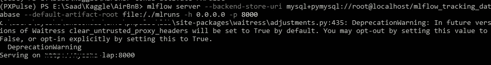
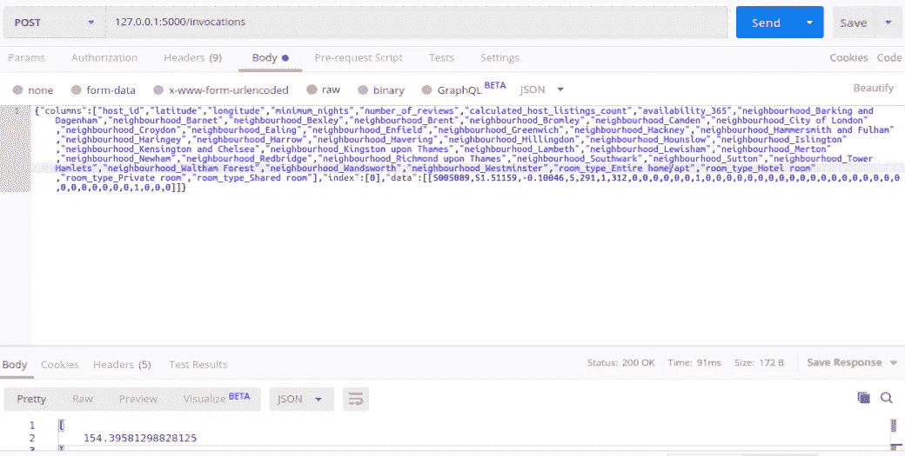

# 用 Mlflow 管理机器学习开发周期

> 原文：<https://towardsdatascience.com/managing-machine-learning-development-cycle-with-mlflow-part-1-2-7a3f5871c708?source=collection_archive---------22----------------------->

## 使用 mlflow 跟踪、比较、评估和服务您的机器学习模型。


照片由[马文·朗斯多夫](https://unsplash.com/@marvin_ronsdorf?utm_source=medium&utm_medium=referral)在 [Unsplash](https://unsplash.com?utm_source=medium&utm_medium=referral) 上拍摄

管理机器学习开发生命周期是一项复杂的任务。可复制性是很难的，通常从开发最好的模型并将其转移到生产的过渡会变得混乱和延迟。

原因是每个新模型都需要修改生产代码，因为现在您的服务器需要指向新模型并快速迭代，同时还要维护审计跟踪，这是一项具有挑战性的任务。这就是 mlflow 的用武之地。从跟踪模型参数、度量和工件，到将您的代码作为项目在其他系统上运行，以及为模型服务，Mlflow 都做了。

注意:按照[文档](https://www.mlflow.org/docs/latest/quickstart.html)安装 mlflow

## 物流跟踪

让我们从跟踪模块开始，设置我们的跟踪服务器。要设置我们的跟踪服务器，我们首先需要创建一个数据库。只需打开 mysql 命令提示符并执行以下查询

```
-> CREATE DATABASE mlflow_tracking_database;
```

现在，您有了数据库来跟踪您的机器学习模型结果、参数和模型。数据库将存储度量、参数和其他元相关信息。对于运行期间产生的文件或工件，我们将使用基于文件的存储，并在下面的命令中指定路径，以便在跟踪服务器中找到这些运行。

```
mlflow server --backend-store-uri   mysql+pymysql://root@localhost/mlflow_tracking_database --default-artifact-root file:/./mlruns -h 0.0.0.0 -p 5000
```

`--backend-sotre-uri`指定我们需要跟踪 mlflow 运行的数据库的 uri，而`--default-artifact-root`指定存储模型文件和其他工件的路径。



mlflow 跟踪服务器命令的屏幕截图

您的跟踪服务器现在应该已经启动并运行了。要验证其设置是否正确，只需进入`http://localhost:8000`，您将看到 mlflow 界面。

现在让我们训练几个模型，并使用我们刚刚创建的服务器记录它们。

密码

我们可以多次运行这个脚本，也可以运行另一个脚本，我们的所有运行都将被记录到我们刚刚设置的跟踪服务器中。在多次迭代和尝试不同的技术之后，我们可以比较我们在跟踪服务器上跟踪的运行。这个跟踪服务器的优点是，同一个网络中的多个团队可以以集中的方式跟踪他们的跑步，每个人都可以更有效和高效地协作。

## ml 流程模型

在 mlflow UI 中比较运行后，我们需要做的就是识别最佳模型的运行 id，并使用 mlflow 模型功能提供它。这将建立一个 web 服务器，允许您发送 POST 请求以从您的模型中获得预测。

`$ mlflow models serve -m file:/home/saad/downloads/<run-id>/XGB_Model`

`-m` flag 指定了模型 uri。你也可以根据自己的需要传递其他的标志。例如`--no-conda`将允许你在相同的环境中运行你的模型，而不是创建一个新的。你可以在这里了解更多关于服务 mlflow 模型

> 注意:`mlflow models serve`仅在 Linux 上可用，在 windows 上尚不支持。

现在，为了测试我们的 mlflow 模型服务器，我们需要做的就是发送一个 POST 请求。我将使用邮递员来做这件事。



正如所料，我从 mlflow 模型服务器得到了一个指定价格的响应。我希望这篇文章能让你快速了解 mlflow 以及如何在生产中使用它。

我个人认为 mlflow 使得机器学习模型的开发周期变得更加容易。它非常直观，而且有一个不断发展的社区在你遇到困难时帮助你。Mlflow 仍然有很多东西可以提供，我鼓励你进一步探索它。

参考资料:

[1][https://www.mlflow.org/docs/latest/tracking.html](https://www.mlflow.org/docs/latest/tracking.html)

[https://www.mlflow.org/docs/latest/models.html](https://www.mlflow.org/docs/latest/models.html)