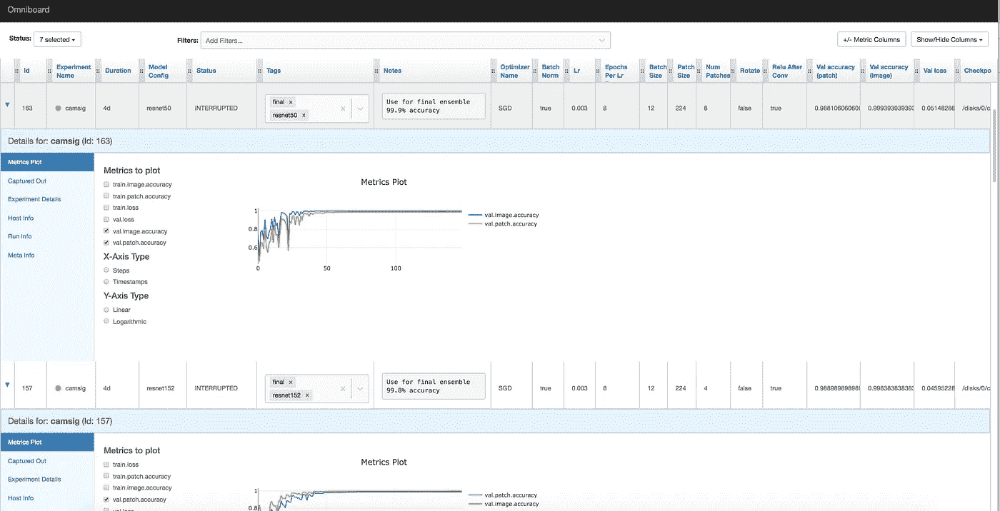
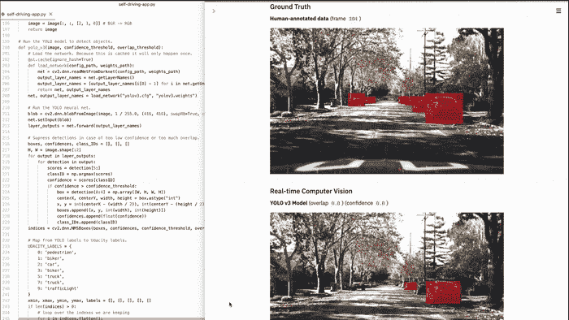

# 管理机器学习项目

> 原文：<https://towardsdatascience.com/managing-machine-learning-projects-226a37fc4bfa?source=collection_archive---------28----------------------->

## 工具决策之旅


由 [Unsplash](https://unsplash.com?utm_source=medium&utm_medium=referral) 上 [Mukuko 工作室](https://unsplash.com/@mukukostudio?utm_source=medium&utm_medium=referral)拍摄的照片

当我开始全职在 **slashwhy** (以前是 SALT AND PEPPER Software)做机器学习研究员时，我来自一个用 C#和 Python 开发 Unity 的背景。在几个月的过程中，我们的团队发展到总共 5 人，我们很快就不得不面对一些关于我们工作和组织自己的方式的非常重要的问题。作为一个快速的背景，我们几乎总是与来自工业领域的广泛不同客户合作深度学习项目，从大型机器数据到光学识别和质量保证。因此，我们的工作总是涉及到与客户的密切互动:理解数据、挑战以及应该通过使用机器学习实现的预期价值。

我们必须问自己的问题如下:

*   我们如何编写代码和构建项目？
*   我们如何管理我们的 ML 实验？
*   我们如何向客户传达我们的工作？
*   我们如何保证代码和结果的质量？

虽然这些问题中的一些乍一看似乎微不足道，但它们的答案并不直截了当。回到我们开始的时候，我们只有有限的计算资源和有限的预算——这种情况对于以前在小型年轻团队中工作过的人来说可能很熟悉。因此，在试图找到问题的答案时，我们试图避免昂贵的开箱即用的解决方案，而是专注于免费可用的开源解决方案。我们来依次看看前面提到的问题以及我们的解决方案和经验。

# 我们如何编写代码和构建项目？

> 去还是不去？

我们团队中五分之三的人有更传统的软件开发背景。因此，使用 git 作为版本控制，并为项目提供清晰的编码指南和风格指南，这也是我们希望应用到 ML 工作中的一个概念。

Gitlab 已经被我们公司的几乎所有人使用，所以版本控制不是问题。另一方面，代码和项目结构。
在讨论如何合理构建我们的工作流程时，很快就引出了 Jupyter 笔记本的问题——以及如何在日常工作中处理它们。看看笔记本电脑和**谷歌协作**变得多么受欢迎，现在你可能会问“我为什么不用 Jupyter 笔记本做任何事情呢？”。根据我们的经验，Jupyter 笔记本非常适合探索性工作，例如初始数据探索，甚至是模仿快速原型。它们易于使用，并能很好地跟踪你对数据做了什么。但是，一旦你的项目增长，Docker 部署、代码重用和测试等事情进入阶段，它们很快就会变得一团糟。它们也不能很好地进行版本控制，因为你的算法的逻辑与表示语法纠缠在一起——使得评论一片混乱(特别是如果有人在提交前忘记清除输出)。

因此，我们决定以*模板*的形式为所有即将到来的项目创建一个结构基础。在其第一个版本中，它基本上是一个 bash 脚本，创建了一个文件和文件夹结构，如下所示:

```
src/
├── train.py
├── inference.py
├── data_processing/
│   └── data_loader.py
├── utils/
│   └── ...
├── models/
│   └── model.py
└── visualization/
    └── explore.ipynb.gitignore
README.md
requirements.txt
run.py
```

对我们来说，让不同的项目尽可能相似是很重要的。毕竟，我们做客户工作——新项目稳步发展，最初不清楚它们是否能通过概念验证阶段。我们希望能够查看我们的一个团队成员正在进行的项目，并立即了解正在发生的事情，而不必先通读他们的所有代码。此外，拥有结构清晰的项目使得与客户的沟通更加容易。

此外，我们决定使用一个名为 *run.py* 的脚本作为我们所有项目的中心接口:它必须在所有存储库中相同，并管理诸如 GPU 使用和对指定数据运行训练或模型推理之类的事情。

虽然我们决定不使用 Jupyter 笔记本作为我们的常规编码程序，但我们仍然保留了一个探索性的笔记本作为我们模板的一部分，用于最初的数据探索。

以这种方式设置我们的项目已经很有帮助了，但是仍然没有解决一些基本问题:

*   我们需要设法管理我们的训练
*   我们需要记录我们在一个项目中所做的事情——正确地！
*   我们调整超参数的方法在这一点上是相当直观的，并且不是非常结构化
*   我们无法以自动化的方式检查更复杂的数据操作

# 我们如何管理我们的 ML 实验？

在这一点上，我们在项目中有了一个清晰的代码结构，甚至有了一个风格指南，我们就使用什么样的编码指南达成了一致。我们仍然缺少的是有系统地组织我们实际核心工作的方法——ML 实验。

当时，我们依靠 **Tensorboard** 进行结果跟踪和可视化。这基本上没问题，但是没有中心位置来存储和比较我们的结果。此外，由于我们使用不同的机器来运行训练，这很快导致了一堆 **Tensorboard** 记录文件到处都是。简而言之，我们在寻找更好的解决方案。

对于我们和我们的大多数客户来说，数据安全和隐私是非常重要的话题。对于许多客户来说，将基于云的服务与他们的数据结合使用是绝对不可能的。通过物理硬盘发送数据并不罕见，因为人们往往非常小心，尤其是对于实际的客户数据。无论我们对此问题的解决方案是什么样的，它都必须是本地的，而不是第三方云服务。

幸运的是，大约在那个时候，一个新的开源项目诞生了，它将极大地改变我们的工作流程。Sacred 是一个致力于管理 ML 实验的框架，通过记录并保存到数据库中。



包罗万象。来源:github.com/[vivekratnuel/omni board](https://raw.githubusercontent.com/vivekratnavel/omniboard/master/docs/assets/screenshots/metric-graphs.png)

我们很快决定尝试一下，将我们的一个 ML 工作站变成了一个 MongoDB 服务器。拥有一个包含许多不同脚本的分散的项目结构在这里被证明是一个好处，因为神圣很好地集成到这个结构中。在很短的时间内，我们在神圣的支持下开始了我们的第一个项目。现在我们有了一个带有非常结构化和有组织的跟踪系统的中央服务器——我们决定使用 **Omniboard** 作为数据库查看器。

当时唯一的问题是，神圣仍然缺少一些对我们来说很关键的功能:

## 超参数配置文件

当使用 sacred 时，通常有一个超参数字典作为主训练脚本的一部分，用于覆盖函数调用中的参数。虽然我们真的很喜欢这个想法，但它不太适合我们为代码的每个部分分别编写脚本的结构，所以我们在新的项目模板中添加了一个 **config.py** 脚本。这个配置脚本包含一个默认配置，可以通过函数调用来访问，还包含一个配置覆盖函数，可以从同一个超参数的多个值中创建一个置换配置列表。例如，如果想研究不同学习率值对训练性能的影响，只需在配置中输入多个不同值的列表，就可以创建并返回多个配置字典的列表，这些字典又可以用于网格训练。

## 实验队列和网格训练

当我们开始使用神圣的，它非常侧重于运行单一的实验。已经有可能仅仅将一次运行排队而不是立即开始，但是这意味着为每次这样的运行输入不同的配置。有了 config.py 脚本，我们就可以扩展 run.py 来使用不同配置的列表，并在数据库中自动创建一个队列。每次训练运行都有专用 GPU 访问的多线程训练循环使我们有可能创建一个大型网格训练，并让它自动运行，而不再需要任何人工监督。

最后但并非最不重要的是，我们决定编写一些自定义回调来扩展神圣的日志功能。此时，我们的项目结构看起来是这样的:

```
docker/
├── Dockerfile
├── .dockerignore
└── main.pysrc/
├── train.py
├── inference.py
├── config.py
├── data_processing/
│   └── data_loader.py
├── utils/
│   └── ...
├── models/
│   └── model.py
└── visualization/
    └── explore.ipynb.gitignore
README.md
requirements.txt
run.py
```

正如您所看到的，docker 部署文件夹也潜入其中。将所有代码整齐地分离在单独的脚本中，可以很容易地将其重用到 Docker 部署等任务中——事实上，也可以重用到任何部署中。

# 我们如何保证代码和结果的质量？

有了神圣的地方，我们现在有了一个清晰的项目结构，代码风格指南，和一个实验管理系统。然而我们仍然缺少的是一些非常基本的东西——持续的测试。

每当我阅读关于 ML 的文章时，通常是由具有 Python 背景的人撰写的，我注意到尽管有大量关于数据处理或神经网络微调的信息，但代码质量很少成为问题。如果你在一个纯科学的环境中工作，并且大部分只是为你自己编码，这是没问题的。对我们来说，编写代码并希望通过手工测试得到最好的结果是远远不够的。

因此，我们向我们的新项目模板添加了另一个部分——测试。我们决定使用经典的 Python 包 **unittest** 来测试你的代码。然后，我们开始编写测试。

为了让我们的生活更容易，我们使用 **GitLab 持续集成(CI)** 在每次提交后自动运行我们的测试。

测试 ML 项目通常比其他类型的软件开发更复杂，但是它仍然有很大的帮助！我们发现在我们的项目管道中最重要的测试是数据加载和(预处理)部分。在这里，只需将少量数据添加到存储库中，就可以自动确保无论对数据管道做了什么更改，您的中间结果仍然保持所需的范围、形状和类型。


对清晰、优美的代码进行自动测试和林挺检查

然而，如果你着眼于一个模型的训练，连续测试就成了一个挑战。大多数情况下，这是一个非常耗时的过程，人们不希望每次提交都运行这个过程。在非常敏感的浮点机制中，这也是一个高度随机的过程，我们不得不编写许多浮点精度有误差的断言。最后，我们根据一个通用的计算机科学范例将我们的测试工作划分为集成测试和单元测试。我们运行更复杂和耗时的测试，只需要为合并请求构建复杂的模型，并运行更快的单元测试，在每次提交时检查我们的数据操作。

由于我们也需要一点计算能力，我们将 GitLab runner 从公司范围的管道中分离出来，让它在我们专用的机器学习服务器上运行。

# 我们如何向客户传达我们的工作？


由[路](https://unsplash.com?utm_source=medium&utm_medium=referral)上[车头](https://unsplash.com/@headwayio?utm_source=medium&utm_medium=referral)拍摄

为了与我们的客户分享中间结果，我们基本上有两个策略:1-快速建立一些解释我们当前状态的图像和幻灯片，或者 2-直接使用 Jupyter 笔记本。这并不是最佳的，因为我们希望将会议的焦点放在结果上，并有一种更灵活的方式与数据交互(而不是修改代码和重新运行单元格)。将工作算法从笔记本结构转移到构成我们剩余代码结构的纯 Python 脚本也相当麻烦。所以我们寻找不同的工具。

谢天谢地，我们找到了 Streamlit，并立即对它的功能深信不疑。Streamlit 允许用最少的额外代码生成一个小的 web 应用程序。这有利于我们，原因如下:

*   所有人需要做的就是编写纯 Python 文件→这巧妙地集成到我们的项目模板结构中
*   演示与代码分离，这样我们就可以在客户会议上专注于数据和图表
*   创建的 HTML 页面易于呈现，并允许像按钮、选择和过滤器这样的交互式元素，使我们能够超越静态的电源点
*   从开发的角度来看，它比笔记本更容易使用，并且可以更快地将代码转移到训练程序中



资料来源:ithub.com/streamlit/streamlit

在开发周期中，由于 Streamlit 管理热代码替换的方式，它可能会变得有点慢(基本上没有)，但到目前为止，我们还没有找到更好的工具来处理我们项目的这一方面。

我们最终和当前的《不扩散条约》结构现在看起来是这样的:

```
docker/
├── Dockerfile
├── .dockerignore
└── main.pysrc/
├── train.py
├── inference.py
├── config.py
├── data_processing/
│   └── data_loader.py
├── utils/
│   └── ...
├── models/
│   └── model.py
└── visualization/
    └── explore.pytests/
├── data/
│   └── [project relevant data goes here for testing]
├── unit/
│   └── test_data_loader.py
└── integration/
    └── test_model.py.gitignore
gitlab-ci.yml
README.md
requirements.txt
run.py
```

# 这一切是如何组合在一起的？

我们工作的领域正以令人难以置信的速度发展。在一个常规的软件项目中，跟踪所有移动的部分已经够难的了，但是我们发现一个机器学习项目现在还没有标准化。我们处理 ML 项目的方法使我们处于两种流行方法之间:使用计算成本较低的算法验证第一次实验的更科学的数据方面，以及具有丰富的硬件和软件资源生态系统的完全支持云的数据管道。

我们接受的框架目前最适合我们的需求，尽管这在未来的几个月和几年中(很可能)会改变，但我们对目前的选择感到满意。它们使我们的工作保持独立，并允许对每个项目采取非常个性化的方法，同时还确保灵活的数据处理和易于重用成熟的算法和例程。我们从小事做起，但我们总是努力改进我们的日常工作，使其更有效率，并改善我们与客户的沟通。也许这篇文章帮助你回答了一些关于建立端到端机器学习项目的问题，我们希望这是对我们技术栈的一个有趣的见解。