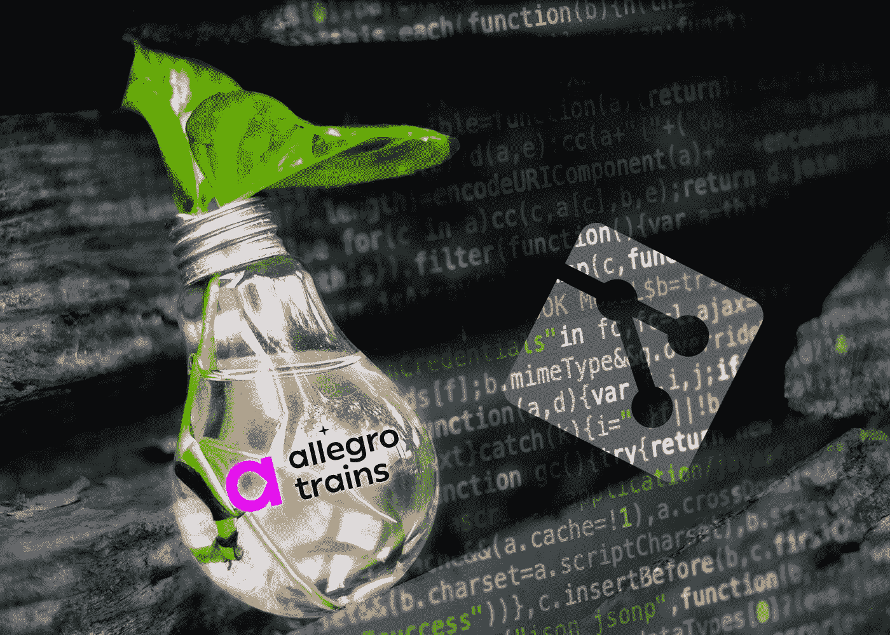
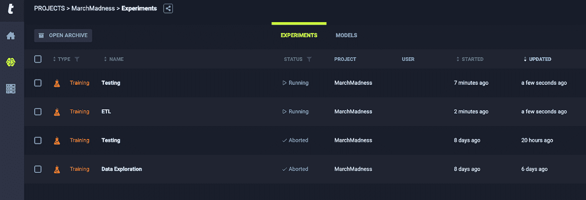
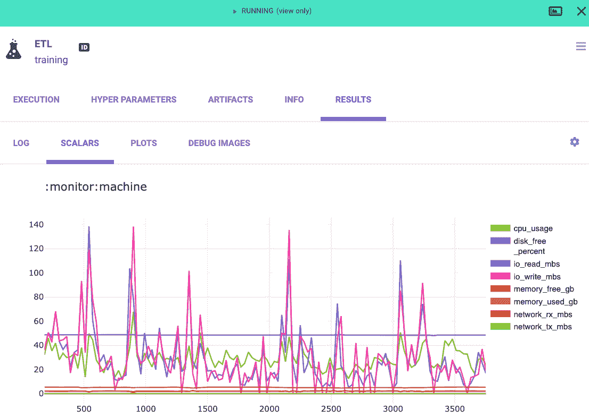

# 管理机器学习项目——Allegro Trains vs GitHub

> 原文：<https://towardsdatascience.com/managing-ml-projects-allegro-trains-vs-github-95c2377dd86c?source=collection_archive---------49----------------------->

## Allegro Trains 是一个项目管理中心，旨在与 ML 工作流无缝集成。

Allegro Trains，ML 项目管理的人工智能基础设施。

人工智能由于计算能力的急剧增长而复活，这使得它的忠实爱好者、不经意的观众和专家等可以用仅仅二十年前还是纯粹幻想的想法进行实验。计算能力和海量数据爆炸的最大受益者(谢谢你，互联网！)正是深度学习，机器学习(ML)的子领域，任务是提取下划线特征、模式和识别猫图像。严肃地说，这项技术引领的进步在新闻媒体的宠儿中无处不在，如特斯拉的自动驾驶仪、谷歌的 AlphaGo 和[脑机接口](https://www.unite.ai/brain-implants-and-ai-model-used-to-translate-thought-into-text/)技术。虽然它们值得每一点的宣传，但它隐藏了最终产品下难以置信的困难和复杂的任务。任何敢于尝试深度学习项目的人都知道这并不容易！它需要出色的项目管理技能，几个令人沮丧的深夜和工作部件的非线性装配。如果你最后没有白头发，你会被认为是幸运的。

# **当前 ML 工作流程问题……**

如果你不是幸运的一员，你将不得不花大量的时间在泥里粘上你的意大利面条代码，把你不可靠的分支推到 [GitHub](https://github.com/) ，乞求拉请求，并合并到你可怜的起源大师那里。这个工作流程似乎是业内最被接受的规范。然而，你对你到达目的地的步骤有很好的了解吗？比方说，你被要求展示你是如何得出你提出的辉煌结论的，拉出一个流程图或一个网页来简洁地展示你每天对未知的冒险不是很好吗？如果这看起来很吸引人，让我向您介绍一个专门为 ML 项目设计的自动化项目管理系统的优秀抽象。无论你运行的是 Linux、macOS 还是 Windows，在你的电脑上设置它几乎不费吹灰之力。这个产品背后的公司([快板 AI](https://bit.ly/2zIfLHJ) )叫它[快板火车](https://bit.ly/3hzIv6C)，欢迎入伙！进来的时候请在门口出示你的开源平台会员证。

正如我前面提到的，从大型数据集提取有意义的见解的能力是 ML 中的一项关键技能。随着这种必要性而来的是对大量有用的统计和绘图库、框架和算法的无数实验的需求。这个领域的广泛共识是利用一个版本控制管理系统，比如 GitHub，这样你的实验就能在失控之前被及时跟踪。然而，社区版 GitHub 有一些限制。其中一些是:

*   它并不跟踪你的实验的每一次迭代的资源分配。
*   无论是 Jupyter Notebook/Lab 还是 PyCharm，它都不会与您选择的 IDE 集成。
*   它限制了你的代码/图形在网络上显示的数量。

GitHub 基于博弈论的引擎非常有说服力，但对其不断增长的语法的询问使其成为堆栈溢出的宠儿。

两行代码跟踪你的 ML 项目。

# 培训现成的解决方案

另一方面，Trains 与您的 IDE 集成，只需在您的单元格顶部添加两行代码 (TLC)，如上所示。再熟悉不过的 Python 内置函数 ***import*** 访问 ***trains*** 模块，可以从 [pip](https://pypi.org/project/trains/) 安装。***Task****类附带了许多有用的函数，例如 ***init*** 其中跟踪您的实验，在本例中为 ***ETL*** 。与 GitHub 类似，Trains 给了你灵魂所渴望的版本控制，但没有冲突、提交问题或搜索正确语法等令人担忧的方面。你可以想象，如果你用不同的名字开始一个新的笔记本，并在 TLC 中键入一个新的项目和任务，Trains 会自动单独跟踪这些项目。如果您决定中止您的一个任务，并在 2 小时后重新启动它(或者在我的情况下，8 天，标题如下)，Trains 将分别保存这两个版本，给您一个版本控制系统的动态。让我告诉你我的意思。*

**

*第一次看到你宝贵的两行代码的成果。*

*正如您在上面的*中所看到的，* ***MarchMadness*** 项目是在三个独立的笔记本实例中创建的，其中有 3 个实验或任务: ***测试*** 、 ***ETL*** 和 ***数据探索*** 。你可能注意到了 ***测试*** 有两个版本。这些是你的分支，你只需点击一下，就可以并排比较，更好地了解你的进展(类似于 *git diff* )。Trains 实际上比 GitHub 走得更远，它跟踪任务的各个版本的处理负载分布，如 CPU/GPU 使用情况、网络和 I/O 速度(*见下面的*)，因此您可以识别 ML 代码的瓶颈，并进行更快的迭代，而无需优化每一行代码。在迁移到 AWS 和 Azure 等云计算服务之前，您也可以将这些信息作为指南。如果你想为你的实验的每一次迭代留下一个消息(类似于 *git commit)，那么* Trains 也能帮你回到那里*。**

**

*ML 项目的资源管理。*

# *培训附加功能*

*你可能会想‘这里有什么问题？’我同意你对世界的愤世嫉俗的看法，但我还没说完。Trains 为 ML 从业者和开发者提供了更多的茶点，而 TLC 甚至不在社区版 GitHub 的范围之内。其中的一些例子包括:*

*   *保存您的 ML 模型的快照，这些快照可以在云存储系统上共享。*
*   *显示在您的实验中使用的 python 包及其特定版本的摘要，这可以在调试时节省您大量的时间。*
*   *通过 web 用户界面提供控制，远程停止或监控正在本地机器上运行的实验。*

*最后但同样重要的是，训练版本代码本身的转换。要编写脚本的 ipynb 文件。py 文件，这样它就可以跟踪代码的实际改进，而不是您正在执行的代码。当您进行远程协作或在不同的机器上协作时，这一点非常重要，这样您的代码就可以使用脚本文件以及代码中使用的包的正确版本(类似于需求文本)来重新生成。*

# *摘要*

*相对于您已经习惯的正常 GitHub 工作流程，让您体验一下 Trains 在商店中为您提供的服务是一件愉快的事情。作为开放平台会员的一部分，对于 Trains 还有很多我没有在这里探索的，等待未来的探索和发现。我鼓励你继续合作，通过使用 Trains 自动化你的项目，把你的 ML 项目带到下一个层次。我还鼓励您与开发人员和数据专业人员分享您的进展。从我个人与团队的互动中，我知道 [Allegro AI](https://bit.ly/2zIfLHJ) 非常感谢您的持续参与和富有洞察力的反馈和建议。我鼓励你在[这个频道](https://bit.ly/2UZFJhv)上打开问题，你一定会得到快速响应。至于我，我有数据科学项目要离线监控，我希望在我下一次乘坐火车时赶上你，火车将专注于机器学习和深度学习探索新冠肺炎患者的胸部  X 射线和 [CT](https://www.kaggle.com/bachrr/covid-chest-xray) 图像。直到我们再次见面，一路顺风！*