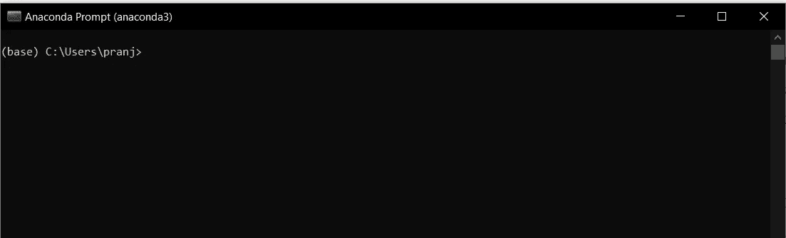
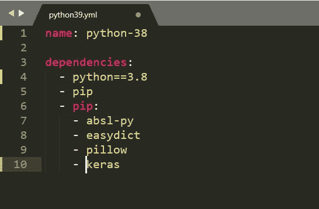
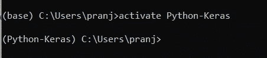
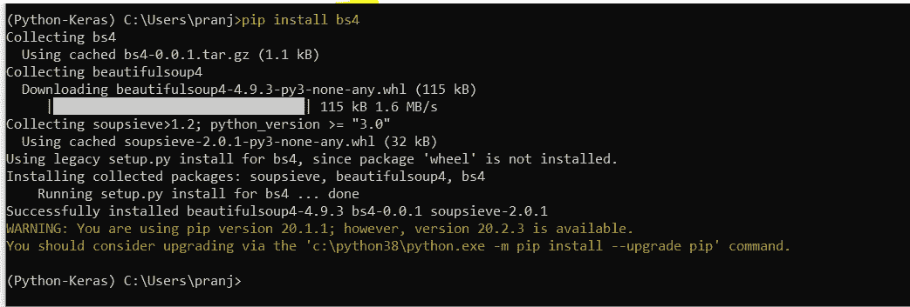
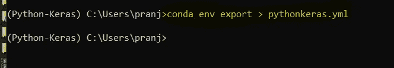
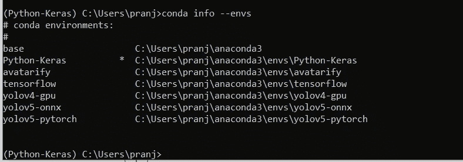
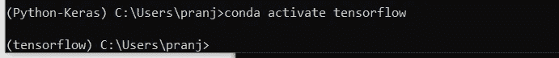
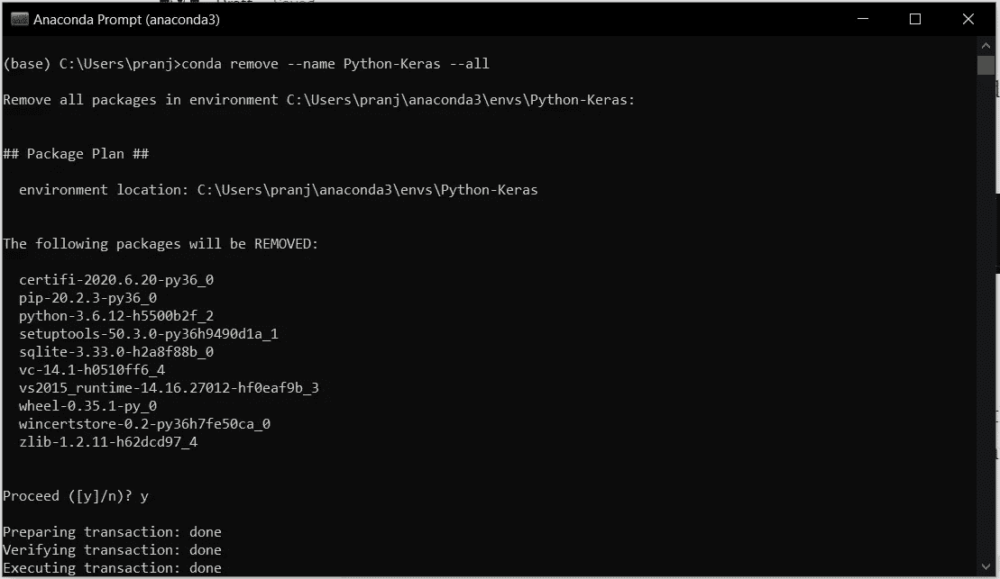

# 为人工智能和机器学习管理 Anaconda 中的多个环境

> 原文：<https://towardsdatascience.com/managing-multiple-environments-in-anaconda-machine-learning-9f75174b76bf?source=collection_archive---------28----------------------->

## 管理多个 Anaconda 环境


照片由 [Soragrit Wangsa](https://unsplash.com/@invictar1997?utm_source=medium&utm_medium=referral) 在 [Unsplash](https://unsplash.com?utm_source=medium&utm_medium=referral) 上拍摄

当我们适当地组织它们时，事情看起来很好。在从事数据科学项目时，我们需要在从事不同项目时管理许多技术堆栈。Anaconda 为我们提供了这种功能。Anaconda 提出了 Jupyter 笔记本，我们通常更喜欢使用 Jupyter 笔记本来完成我们的数据科学任务。任务可以是训练模型、准备数据、特征工程、绘制图表、验证模型或测试我们训练的模型。当我们在不同的机器学习和深度学习模型上工作时，那么对于特定的模型，我们需要一套库来使用。如果我们将所有的库安装在一个环境中，我们可能会遇到很多问题。

这些问题是由于所使用的库的版本或任何其他兼容性问题造成的。最值得注意的是，当我们将模型迁移到不同的环境，比如云和不同的机器上时，就很难知道我们使用了什么库来完成我们的任务。这里需要创建一个不同的 Anaconda 环境。

当我们有一个不同的 Anaconda 环境时，正确地管理它们以便在类似的项目出现时加以利用是至关重要的。在本文中，我将介绍管理 Anaconda 环境的一些要点。在这里，我假设您的机器上安装了 Anaconda。

# 创建您的第一个 Anaconda 环境

安装 Anaconda 后，您可以在搜索窗口中找到 Anaconda 提示符。点击它，您将看到 Anaconda 提示符。



图片来自作者

在这里，我们将创建一个名为“Python-Keras”的新环境环境的名称应该基于您的项目，以便我们以后可以使用它。

```
conda create -n Python-keras python=3.6
```

运行该命令后，您将看到下面的屏幕，在这里开始创建环境。


图片来自作者

我们的环境被创建，但是它没有安装任何库。我们可以在激活环境后安装它们。我们将在本文后面讨论。

但是，有另一种方法可以让您在创建环境的同时安装库。为此，我们需要创建 YAML 文件，而 YAML 文件包含环境和所用库的名称。



图片来自作者

现在，我们可以使用下面的命令来创建使用 YAML 文件的环境。

```
conda env create -f python39.yml
```

在这里，将使用定义库创建一个环境。

# 激活您的环境

创建您的环境后，如果我们想将该环境用于 Jupyter 笔记本，我们需要激活它。使用下面的命令启动该环境。



图片来自作者

我们也可以在激活环境后安装其他库。我们可以使用 PIP 来安装，也可以使用“Conda”来安装库。



图片来自作者

# 共享您创建的环境

激活您的环境后，我们可以共享我们的环境，以便在不同的位置或机器上使用同一个项目。使用下面的命令生成 YAML 文件。然后我们可以和其他人分享 YAML 的档案。



图片来自作者

它将在相同的命令提示符位置生成一个 YAML 文件。在这种情况下，它将保存在“C:\Users\pranj”中。

# 获取环境列表

完成你的任务后，为了进行不同的项目，我们切换到不同的环境。首先，我们需要检查可用的环境。同样，使用下面的命令。



图片来自作者

我创造了许多环境；我们可以使用 activate 命令切换到不同的环境。



图片来自作者

# 删除您的环境

当你认为你不需要任何特定的环境时，我们可以将它们从硬盘中释放出来，而不是保留它们。为此，Anaconda 提供了一个命令。

```
conda remove --name Python-Keras --all
```

要运行上面的命令，您需要通过再次打开 Anaconda 提示符来退出激活的环境。



图片来自作者

# 结论

如果您在数据科学领域工作，我们已经完成了一些重要的基本步骤。训练和建立数据科学模型并不耗时，但如何恰当地管理项目非常重要。如果你弄糟了这些小点，你将删除一切，并通过安装 python 从头开始。因为如果模型中有一些问题，我们可以通过检查代码来修复它，但是如果错误在技术堆栈中，就变得更难修复了。

希望你喜欢这篇文章，会在其他地方看到你。在那之前，继续享受数据科学吧。