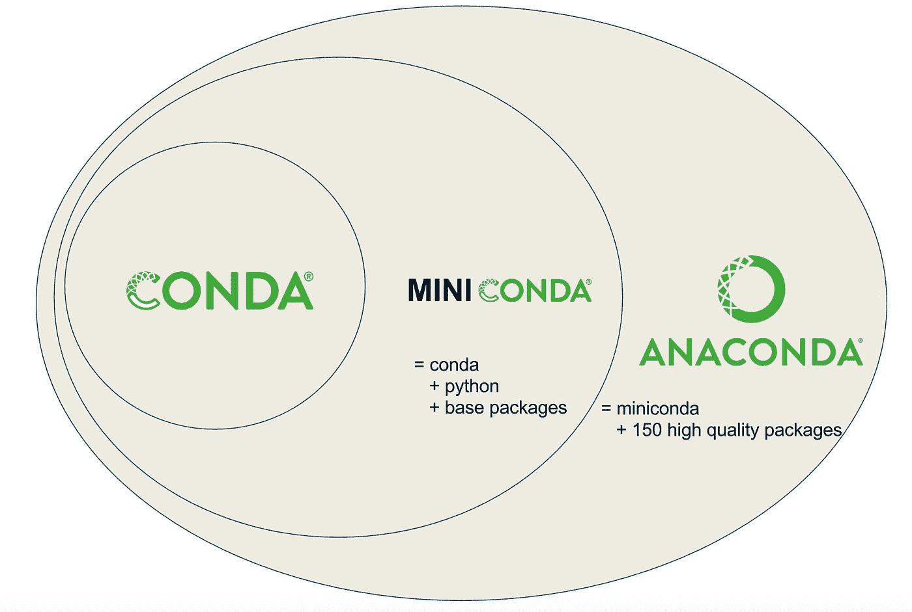

# Conda 入门

> 原文：<https://towardsdatascience.com/managing-project-specific-environments-with-conda-b8b50aa8be0e?source=collection_archive---------9----------------------->

## 只是最基本的。康达是什么？为什么要用康达？康达怎么安装？

# 康达是什么？

[Conda](https://docs.conda.io/en/latest/) 是一个运行在 Windows、Mac OS 和 Linux 上的开源包和环境管理系统。

*   Conda 可以快速安装、运行和更新软件包和相关的依赖项。
*   Conda 可以在您的本地计算机上创建、保存、加载和切换项目特定的软件环境。
*   虽然 Conda 是为 Python 程序创建的，但 Conda 可以为任何语言如 R、Ruby、Lua、Scala、Java、JavaScript、C、C++、FORTRAN 打包和分发软件。

康达作为一个*软件包管理器*帮助你找到并安装软件包。如果你需要一个需要不同版本 Python 的包，你不需要切换到不同的环境管理器，因为 Conda 也是一个*环境管理器*。只需几个命令，您就可以建立一个完全独立的环境来运行不同版本的 Python，同时在您的正常环境中继续运行您常用的 Python 版本。

**康达 vs 迷你康达 vs 蟒蛇**

用户经常混淆 Conda、 [Miniconda](https://docs.conda.io/en/latest/miniconda.html) 和 [Anaconda](https://www.anaconda.com/products/individual) 之间的区别。 [Planemo 文档](https://planemo.readthedocs.io/en/latest/index.html)有一个极好的图表，很好地展示了 Conda 环境和包管理工具与 Miniconda 和 Anaconda Python 发行版之间的区别(注意，Anaconda Python 发行版现在有超过 150 个额外的包！).



资料来源:计划办公室文件

我建议安装 Miniconda，它结合了 conda 和 Python 3(以及少量核心系统包),而不是完整的 Anaconda 发行版。只安装 Miniconda 会鼓励你为每个项目创建单独的环境(并且只安装那些你实际需要的包！)这将增强您的研究和工作流程的可移植性和可重复性。

此外，如果你*真的*想要一个完整的 Anaconda 发行版的特定版本，你总是可以创建一个新的`conda`环境并使用下面的命令安装它
。

```
conda create --name anaconda-2020-02 anaconda=2020.02
```

# 为什么要用康达？

在众多不同的软件包和环境管理系统中，Conda 是少数几个明确针对数据科学家的系统之一。

*   Conda 提供预构建的包或二进制文件(这通常避免了从源代码编译包的需要)。 [TensorFlow](https://www.tensorflow.org/) 是数据科学家广泛使用的工具的一个例子，它很难安装源代码(特别是在 GPU 支持下)，但可以使用 Conda 一步安装。
*   Conda 是跨平台的，支持 Windows、MacOS、GNU/Linux，支持多种硬件平台，比如 x86 和 Power 8、9。在后续的博文中，我将展示如何让您的 Conda 环境在这些不同的平台上重现。
*   如果一个库或工具还没有使用`conda`打包安装，Conda 允许在 Conda 环境中使用其他包管理工具(比如`pip`)。

使用 Conda，您可以快速安装常用的数据科学库和工具，如 [R](https://www.r-project.org/) 、 [NumPy](https://numpy.org/) 、 [SciPy](https://www.scipy.org/) 、 [Scikit-learn](https://scikit-learn.org/stable/index.html) 、 [Dask](https://dask.org/) 、 [TensorFlow](https://www.tensorflow.org/) 、 [PyTorch](https://pytorch.org/) 、 [Fast.ai](https://www.fast.ai/) 、 [NVIDIA RAPIDS](https://rapids.ai/) ，以及更多使用优化的硬件专用库构建的库

# **如何安装 Miniconda？**

从下载适用于您的操作系统的 64 位 Python 3 版本的【Miniconda 安装程序，并按照说明进行操作。我将在下面介绍在 Linux 系统上安装的步骤，因为在 Linux 系统上安装稍微复杂一些。

下载 Miniconda 的 64 位 Python 3 安装脚本。

```
wget --quiet https://repo.anaconda.com/miniconda/Miniconda3-latest-Linux-x86_64.sh
```

运行 Miniconda 安装脚本。

```
bash Miniconda3-latest-Linux-x86_64.sh
```

该脚本将显示几个提示，允许您定制 Miniconda 安装。我通常建议您接受默认设置。但是，当出现以下提示时…

```
Do you wish the installer to initialize Miniconda3
by running conda init?
```

…我建议您键入`yes`(而不是默认的`no`)，以避免以后不得不为 Bash 手动初始化 Conda。如果你不小心接受了默认，不用担心。当脚本完成时，您只需要输入以下命令。

```
conda init bash
source ~/.bashrc
```

安装脚本完成后，您可以删除它。

```
rm Miniconda3-latest-Linux-x86_64.sh
```

**为 Conda** 
初始化您的 shell 安装 Miniconda 后，接下来您需要将您的首选 shell 配置为“Conda 感知”。运行安装脚本时，可能会提示您为 shell 初始化 Conda。如果是这样，那么您可以安全地跳过这一步。

```
conda init bash
source ~/.bashrc
(base) $ # prompt indicates that the base environment is active!
```

**更新 Conda**

最好将 Conda 安装更新到最新的
版本。以下命令会将 Conda 更新到最新版本。

```
conda update --name base conda --yes
```

**卸载 Miniconda**

每当安装新软件时，了解如何*卸载*该软件总是一个好主意(以防你有第二个想法！).卸载 Miniconda 相当简单。

取消 shell 初始化，从`~/.bashrc`中删除 Conda 相关内容。

```
conda init --reverse bash
```

删除整个`~/miniconda3`目录。

```
rm -rf ~/miniconda3
```

删除整个`~/.conda`目录。

```
rm -rf ~/.conda
```

如果存在，删除 Conda 配置文件。

```
if [ -f ~/.condarc ] && rm ~/.condarc
```

# 接下来去哪里？

现在，您已经安装了 Conda 环境和包管理工具，可以开始学习使用 Conda 管理数据科学项目环境的“最佳实践”了。在我的下一篇文章中，我将介绍我认为可靠的、最小的“最佳实践”集，当您开始下一个数据科学项目时，您可以采用这些最佳实践来充分利用 Conda。